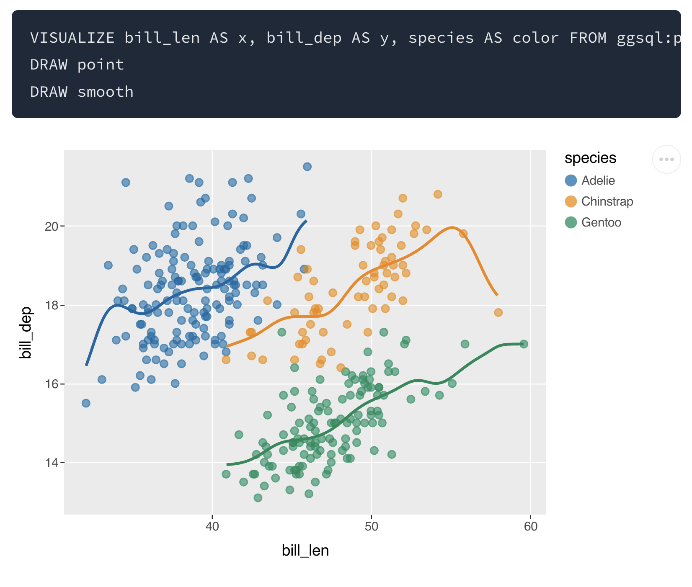
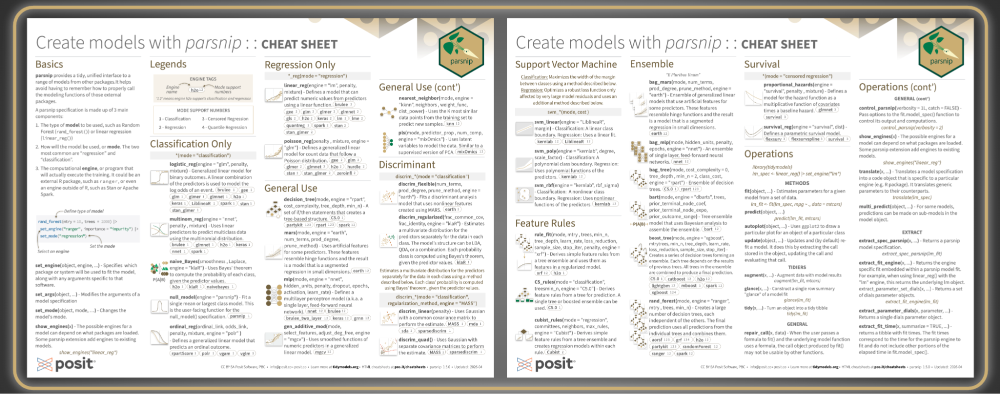

> Welcome to our newsletter, posit::glimpse()!
>
> If you're currently reading this on our blog, consider subscribing to Product Updates - Open Source on our <a href="https://posit.co/about/subscription-management" target="_blank" rel="noopener">subscription page</a> to receive this newsletter directly in your inbox.

posit::glimpse() is our roundup of the most important open-source news for Posit’s community\! We've moved to monthly editions, and we still have so much to share.

## Registration for posit::conf(2026) is now open\!

Check out the [keynote speakers](https://posit.co/blog/posit-conf-2026-keynotes), [workshops](https://posit.co/blog/workshops-at-positconf2026), and [agenda](https://conf.posit.co/2026/sessions/) for our upcoming conference, happening in Houston and online. It’s sure to be incredible\! [Register here](https://conf.posit.co/2026/registration/).

## Key product updates and new releases

### ggsql alpha release

The alpha release of [ggsql](https://ggsql.org/) brings the grammar of graphics to SQL, enabling powerful data visualization directly within SQL queries using declarative clauses. Built by the ggplot2 team with 18 years of experience, ggsql executes visualization computations as optimized SQL queries on backends, works without R or Python runtimes, and is designed for integration with Quarto, Jupyter, Positron, and AI agents.

* Learn more in the [ggsql alpha release](https://opensource.posit.co/blog/2026-04-20_ggsql_alpha_release/) blog post.
* We love seeing folks in the community be early adopters\! Harry Snart shares how he [explored ggsql with Oracle Database](https://medium.com/@harrysnart/exploring-ggsql-with-oracle-database-61f59b3e36da), and Ansgar Wolsing [tried it out for the \#30DayChartChallenge](https://bsky.app/profile/ansgarw.bsky.social/post/3mk6noshl222q).

### RAG with raghilda

LLMs are great at reasoning and generating text, but their knowledge is frozen at training time. Retrieval-augmented generation (RAG) solves this by giving the model access to relevant information at query time, without needing to retrain it.

The new [raghilda](https://posit-dev.github.io/raghilda/) package simplifies building RAG systems in Python. It supports multiple storage backends (DuckDB, ChromaDB, OpenAI Vector Stores) with a consistent API, enabling teams to start locally and scale to hosted solutions without code rewrites.

* Read more in the [RAG with raghilda](https://opensource.posit.co/blog/2026-04-14_rag-with-raghilda/) blog post.

### Quarto 1.9 and Quarto 2

The Quarto team has announced plans for Quarto 2, a complete rewrite in Rust with a major focus on collaborative editing\! Key features include a collaborative editor for web and command-line, a visual editor that works seamlessly alongside source editing without disrupting code, and enhanced error detection across projects. The public release is expected in at least 6 months.

* Learn more in the [What’s next: Quarto 2 announcement](https://opensource.posit.co/blog/2026-04-06_whats-next-quarto-2/).

Meanwhile, be sure to take a look at all the exciting updates from v1.9, including:

* [Chrome Headless Shell in Quarto](https://opensource.posit.co/blog/2026-04-14_chrome-headless-shell/)
* [Typst Books, Article Layout, and typst-gather](https://opensource.posit.co/blog/2026-03-31_typst-books-and-more/)
* [PDF Accessibility and Standards](https://quarto.org/docs/blog/posts/2026-03-05-pdf-accessibility-and-standards/)

All v1.9 updates can be found in the [roundup blog post](https://quarto.org/docs/blog/posts/2026-03-24-1.9-release/).

### What’s new in Positron

Our new data science IDE, [Positron](https://positron.posit.co/), has been significantly updated with numerous improvements, including [Positron Server for Academic Use](https://opensource.posit.co/blog/2026-04-07_april-newsletter/#positron-server-for-academic-use-via-jupyterhub) via JupyterHub, [AI enhancements](https://opensource.posit.co/blog/2026-04-07_april-newsletter/#ai-next-steps-in-the-native-jupyter-notebook-editor), [telemetry updates](https://opensource.posit.co/blog/2026-04-07_april-newsletter/#telemetry-update-anonymous-session-identifiers) and [R improvements](https://opensource.posit.co/blog/2026-04-07_april-newsletter/#rstudio-addins-support) (like Addins\!).

* Read more in the [April 2026 Newsletter](https://opensource.posit.co/blog/2026-04-07_april-newsletter/).
* For continuous updates on Positron, follow the new [Positron LinkedIn page](https://www.linkedin.com/showcase/positron-ide/posts/?feedView=all) and subscribe to the [Positron newsletter](https://posit.co/positron-updates-signup/).

### Shiny for Python 1.6

[Shiny for Python](https://shiny.posit.co/py/) 1.6 is now available. The release introduces toolbar components designed for tight spaces such as card headers, input labels, and AI chat interfaces.

The second major addition is built-in OpenTelemetry support, enabling zero-configuration observability by automatically tracing session lifecycles, reactive updates, and individual reactive expressions. Set `SHINY_OTEL_COLLECT=reactivity` and send traces to any OTLP-compatible backend like Pydantic Logfire, Jaeger, or Grafana Cloud.

* Read more in the [Shiny for Python 1.6 brings toolbars and OpenTelemetry](https://opensource.posit.co/blog/2026-04-02_shiny-python-1.6/) blog post.

### Pointblank 0.24.0

[Pointblank](https://posit-dev.github.io/pointblank/user-guide/integrations/otel-integration.html) is a package for data validation. With the release of Pointblank 0.24.0, there is now OpenTelemetry integration for bridging data validation and production observability. After running checks on a table, you can push pass/fail metrics, per-validation-step trace spans, and structured threshold-breach logs to your OTel-compatible backend (Grafana, Datadog, New Relic, etc.). For those that run pipelines in Airflow, Prefect, or Dagster, validation spans slot into existing distributed traces automatically.

* Read the [full OTel integration guide](https://posit-dev.github.io/pointblank/user-guide/integrations/otel-integration.html) for setup instructions and examples.

### Tidymodels

The [tidymodels](https://www.tidymodels.org/) team is on a roll\! There are new updates available for dial, parsnip, yardstick, tune, and tidymodels, as well as two new cheatsheets.

* Read the [New tidymodels Releases for April 2026](https://opensource.posit.co/blog/2026-04-27_tidymodels-april-2026/) blog post and [tidymodels Cheatsheet](https://opensource.posit.co/blog/2026-04-29_tidymodels-cheatsheets/) blog posts.

The group has also been developing a set of skill files for machine learning with tidymodels as well as developer focused skills. You can find the current versions at [skills.tidymodels.org](https://skills.tidymodels.org/). Give them a try; the group would love some feedback.

### mori

[mori](https://shikokuchuo.net/mori/) is a new R package for shared memory across processes. ​​Parallel R no longer has to mean duplicating your dataset in every worker's RAM. mori places it in OS-level shared memory once, and every worker maps the same physical pages via R's ALTREP framework. Works with any parallel backend that uses R serialization, including mirai, parallel, and callr.

* Learn more in the [mori 0.1.0](https://opensource.posit.co/blog/2026-04-23_mori-0-1-0/) blog post.
* Tyler Morgan-Wall has already implemented a fork to the targets package to incorporate mori\! [Read the discussion here](https://bsky.app/profile/tylermw.com/post/3mkddpqka4k2t). It’s fantastic to see the community adopt and improve the ecosystem with open source.

### tabpfn 0.1.0

The new [tabpfn](https://tabpfn.tidymodels.org/) v0.1.0 package provides an R interface to TabPFN, a pretrained deep learning model for tabular data that delivers strong predictive performance without requiring model training. The package integrates with tidymodels syntax and future updates will add parsnip model types and additional interpretability tools.

* Learn more in the [tabpfn 0.1.0](https://opensource.posit.co/blog/2026-03-31_tabpfn-0-1-0/) blog post.

### nanoparquet 0.5.1

[nanoparquet](https://nanoparquet.r-lib.org/) is a small, self-sufficient R package for reading and writing Parquet files. Version 0.5.1 introduces list columns, bit64::integer64 and blob::blob support, writing Parquet to the standard output.

* Read more in the [nanoparquet 0.5.1](https://opensource.posit.co/blog/2026-04-30_nanoparquet-0-5-1/) blog post.

### torch Ecosystem Updates

The team has expanded [torch](https://torch.mlverse.org/) ecosystem support to include cudatoolkit packages, torchvision datasets, and advanced model architectures and transformations for computer vision.

* Read more in the [torch Ecosystem Updates](https://opensource.posit.co/blog/2026-04-30_torch-ecosystem-updates-2026/) blog post.

### roxygen2 8.0.0

[roxygen2](https://roxygen2.r-lib.org/) uses specially formatted comments in your R code to generate `.Rd` files. This version offers new support for S7, a raft of improvements to R6 documentation, a more natural way to configure roxygen2 in your DESCRIPTION, the changes to rendered `.Rd` files you’re most likely to see, and some other minor improvements, and a bunch of new vignettes.

* Learn more in the [roxygen2 8.0.0](https://opensource.posit.co/blog/2026-05-01_roxygen2-8-0-0/) blog post.

### Great Docs

Last month, we introduced [Great Docs](https://posit-dev.github.io/great-docs/) for beautiful documentation for Python packages. Author Rich Iannone shares more details in the [Great Docs introductory blog post](https://opensource.posit.co/blog/2026-04-15_great-docs-introduction/).

## Learning and community

### Posit website relaunch

The [Posit website](https://posit.co/) has a new look\! Check out the refreshed pages, in particular the wonderful demo gallery with examples of workflows using Posit tools.

### Showcases from the community

There are so many community examples to share, here is just a small `sample()`:



[Dianyi Yang](https://rubuky.com/), DPhil candidate in Politics at the University of Oxford (DPIR), shares practical guide to structuring reproducible academic research projects using Git, renv, Quarto, and GitHub, from data cleaning to manuscript preparation.

[Read the blog post here](https://opensource.posit.co/blog/2026-04-13_reproducible-research-renv-quarto-github/)\!

---





---

[Sophia Zilber](https://www.linkedin.com/posts/sophiazilber_i-built-a-public-facing-dashboard-for-the-share-7450912100962586624-S3MN/?rcm=ACoAAB0DXA0BRYdwbGNKW2-OfIAa3MsVywURURg) shared a public-facing dashboard for the [Cure Mito Foundation](https://www.curemito.org/) Leigh syndrome patient registry using Shiny for R.

[See the dashboard here](https://curemito.shinyapps.io/lsregistry/).





[Tom Geens](https://www.linkedin.com/in/tomgeens/) and his team used Quarto to generate HTML and LaTeX reports on occupational accidents in Belgium.

[See the report here](https://info.liantis.be/hubfs/onderzoek/arbeidsongevallen/index.html).

---





---

Gen Re uses Posit Connect to automate their underwriting workflow, ingesting broker submissions every minute and routing them through AI services that extract key information and generate an early risk assessment. What used to take 30 minutes per submission now takes just 5, saving the team roughly 600 hours of cumulative processing time each day.

[Check out their story](https://posit.co/about/customer-stories/gen-re).



## What’s next?

You can join us every Tuesday at the [Data Science Lab](https://pos.it/dslab) and every Thursday at the [Data Science Hangout](https://pos.it/dsh)\!

* On May 12, Nicola Rennie will live code a TidyTuesday visualization from end-to-end and share the secrets of her craft\!
* On May 21, our DSH will be a Data Career Panel with Gabriela de Queiroz, Dan Boisvert, and Makarand Malu. Bring your career questions about the field of data, hiring, asking for promotions, and more\!

I’m a real person, and I would love to hear any feedback on the newsletter\! Find me on [LinkedIn](https://www.linkedin.com/in/ivelasq/) and [Bluesky](https://bsky.app/profile/ivelasq3.bsky.social), or email me at isabella \[dot\] velasquez \[at\] posit.co.
