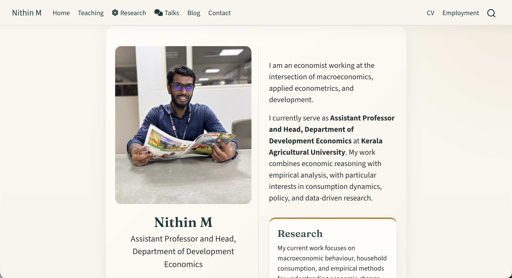
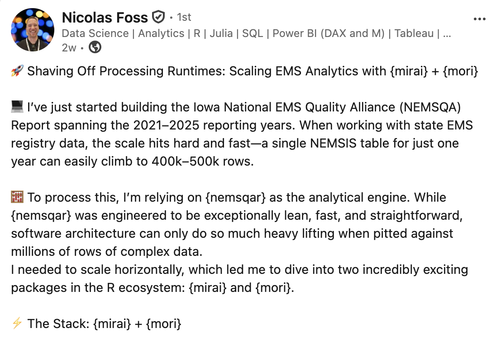

> Welcome to our newsletter, posit::glimpse()!
>
> If you're currently reading this on our blog, consider subscribing to Product Updates - Open Source on our <a href="https://posit.co/about/subscription-management" target="_blank" rel="noopener">subscription page</a> to receive this newsletter directly in your inbox.

posit::glimpse() is our roundup of the most important open-source news for Posit’s community\! Check out the amazing updates we have in store.

## New home for Posit Open Source

For over 15 years, Posit has been building wonderful open source software. To make it easier than ever for you to navigate our tools, documentation, and content, we’ve brought everything together into one central hub.

Head over to [opensource.posit.co](http://opensource.posit.co), take a look around, and let us know what you think\! And if you’re on LinkedIn, give our new [Posit Open Source LinkedIn showcase page](https://www.linkedin.com/showcase/posit-open-source/) a follow.

## Key product updates and new releases

### Bringing OpenTelemetry to R in production

Posit has now instrumented eight widely-used R packages (Shiny, plumber2, mirai, httr2, ellmer, knitr, testthat, and DBI) with OpenTelemetry support. This change brings production-grade observability to R applications, enabling traces, logs, and metrics with only environment variable configuration (no code changes required).

* Learn more in the [Bringing OpenTelemetry to R in production](https://opensource.posit.co/blog/2026-05-07_opentelemetry/) blog post.

### mirai 2.7.0 and mori 0.2.0

mirai 2.7.0 and mori 0.2.0 are now on CRAN, extending R’s async capabilities for production use. mirai adds bounded queues and `try_mirai()` for memory-safe async, while mori 0.2.0 graduates from experimental status, providing cross-platform shared memory for R processes without data duplication.

* Read more in the [A memory model for production async R: mirai 2.7.0 and mori 0.2.0](https://opensource.posit.co/blog/2026-05-12_production-async-r/) blog post.

### Quarto 2 design and features

Quarto 2 introduces a custom Markdown parser designed to provide actionable syntax errors, preserve source locations throughout the processing pipeline, and maintain syntax stability across the project’s lifetime. The Quarto team wrote a fascinating article on their thought process behind this implementation.

* Check out the [Quarto 2: Parsing and source maps](https://opensource.posit.co/blog/2026-05-07_quarto-2-parsing/) post here.

### New Plotnine skill

A new plotnine skill is now available for AI coding agents, enabling them to generate consistent and runnable plotnine code. The skill follows the Agent Skills standard and works across any compatible agent including Claude Code and Codex.

* Learn more in the [A Plotnine Skill for AI Coding Agents](https://opensource.posit.co/blog/2026-05-05_plotnine-skill-announcement/) blog post.

### Ten great things we added to Great Docs

Great Docs v0.10.0 marks the tenth release of the Python documentation tool. Learn about its transformation from a simple documentation generator into a comprehensive documentation platform via ten key features added since launch, including LLM integration, cross-reference validation, flexible theming, and enhanced API reference generation.

* Read the [Ten great things we added to Great Docs](https://opensource.posit.co/blog/2026-05-13_great-docs-ten-things/) blog post.

### What’s new in Shiny

bslib 0.11.0 and py-shiny 1.6.0 introduce toolbar components: compact UI elements for fitting buttons, selects, and other controls into card headers/footers, input labels, and text input submit areas. These space-efficient components are particularly valuable for dashboards and AI chat interfaces where screen real estate is at a premium.

* Get a walkthrough of toolbars in R and Python in the [Introducing Toolbars](https://opensource.posit.co/blog/2026-05-26_introducing-toolbars/) blog post\!

### What’s new in Positron

Positron’s May release includes a lot of highly requested features:

* Inline output for Quarto
* Packages pane
* Positron Notebook Editor now in beta

For more, check out the [Positron May Release Highlights](https://opensource.posit.co/blog/2026-05-11_positron-2026-05-release/) post and [subscribe to Positron emails](https://posit.co/positron-updates-signup).

## Community

### May Event Roundup

We were at so many events this month, we can barely keep track\! Here’s a quick wrap-up of where the team spent May:

* Charlotte, François, and Sara talked Quarto, larger than memory data, and AI at R/Medicine 2026
* Nick showcased Positron at R Exchange
* Wes joined industry leaders to discuss the future of artificial intelligence at AI Council
* Emil, Isabella, Jeroen, and Michael reconnected with the Python community at PyCon US

And we’re just getting started\! [See where we’ll be next](https://opensource.posit.co/events/), and come say hi.

## Learning and discussion

### In Defense of YAML

Love YAML? Hate YAML? Rich Iannone and Tomasz Kalinowski dive into the nuances of this finicky configuration format, comparing it to TOML and exploring how the YAML 1.2 specification enables a fast, fully compliant, and simple user experience. Their discussion highlights how the new [py-yaml12](https://posit-dev.github.io/py-yaml12/) package delivers a modern, spec-compliant YAML experience for today’s developers.

* Read [In Defense of YAML](https://opensource.posit.co/blog/2026-05-21_in-defense-of-yaml/) blog post.

### Agentic Engineering and the Lost Art of Verification

“I almost don’t read code now,” says Wes McKinney (creator of Pandas). He talks about the new workflows that allow him to review a million lines of AI-generated code in Show Us Your Agent Skills, a new live session by Vanishing Gradients.

* Listen to the [podcast](https://hugobowne.substack.com/p/agentic-engineering-and-the-lost) and read the [The Agentic Software Factory](https://hugobowne.substack.com/p/the-agentic-software-factory) blog post.

### Comparing Posit Assistant and Positron Assistant

Wondering what the difference is between Posit Assistant and Positron Assistant? Sara and Simon dive deep into this topic in their YouTube video:



Sara and Simon have more to share in the AI newsletter\! Check out the recent posts that include [Posit Assistant’s data cleaning mode](https://opensource.posit.co/blog/2026-05-08_ai-newsletter/) and [Gemma 4 as a budget-focused model](https://opensource.posit.co/blog/2026-05-22_ai-newsletter/).

### Great Docs on Talk Python

Rich and Michael recently joined Michael Kennedy on the Talk Python podcast, where they discussed Great Docs:



### PyCascades 2026 videos are up\!

Rodrigo Silva Ferreira gave a great talk on “To Notebook or Not to Notebook: Multilingual Workflows for Data Analysis”:



### Showcases from the community



[Nithin M](https://www.linkedin.com/posts/nithinmkp_nithin-m-activity-7459067164256395264-5QC5?utm_source=share&utm_medium=member_desktop&rcm=ACoAAB0DXA0BRYdwbGNKW2-OfIAa3MsVywURURg) created a new website in Quarto! It has beautiful layouts, listings, and aesthetics.

[See it here](https://nithinmkp.github.io/).

---





---

[Nicolas Foss](https://www.linkedin.com/posts/nicolas-foss_rstats-datascience-publichealth-share-7461287476876283904-NVTP/?rcm=ACoAABUe3WEBw4M0V14n5v6VMG53LQM8ulIAraY) shared his {mirai} + {mori} stack for massive public health tables, resulting in a "massive 25% to 50% reduction in runtimes across our heaviest processing steps".





---

When your database spans 35 billion vehicle records, manual data workflows stop being an inconvenience and start being a real ceiling on what your team can do. We're proud to spotlight the CARFAX team, who used Posit Team to reclaim 12,000 hours and set a new bar for scalable data work across their organization.

[Read their story here](https://posit.co/about/customer-stories/carfax).



## What’s next

Do you love shorts (not the type you wear, but the vertical video kind)? We’re publishing shorts over at [YouTube](https://www.youtube.com/channel/UC3xfbCMLCw1Hh4dWop3XtHg/), [Instagram](https://www.instagram.com/posit.pbc/), [TikTok](https://www.tiktok.com/@posit_pbc), and our new [Posit Open Source LinkedIn showcase page](https://www.linkedin.com/showcase/posit-open-source). I'd love to hear what short you'd like to see next!

We continue to have an excellent line up on the [Data Science Hangout](https://pos.it/dsh) and [Data Science Lab](https://pos.it/dslab).

* On June 9, we’re doing a Community Showcase with Kylie Ainslie and Daniel Chen\! Let’s learn about how others are using open-source tools in really cool ways.
* Jamie Shive, Director of Data Science at the National Hockey League, is the featured leader of the Hangout on June 11 (which could coincide with the Stanley Cup finals!). Let’s talk about everything about hockey and beyond.

I’m a real person, and I would love to know how to make the Glimpse newsletter better! Find me on [LinkedIn](https://www.linkedin.com/in/ivelasq/) and [Bluesky](https://bsky.app/profile/ivelasq3.bsky.social), or email me at isabella \[dot\] velasquez \[at\] posit.co.
