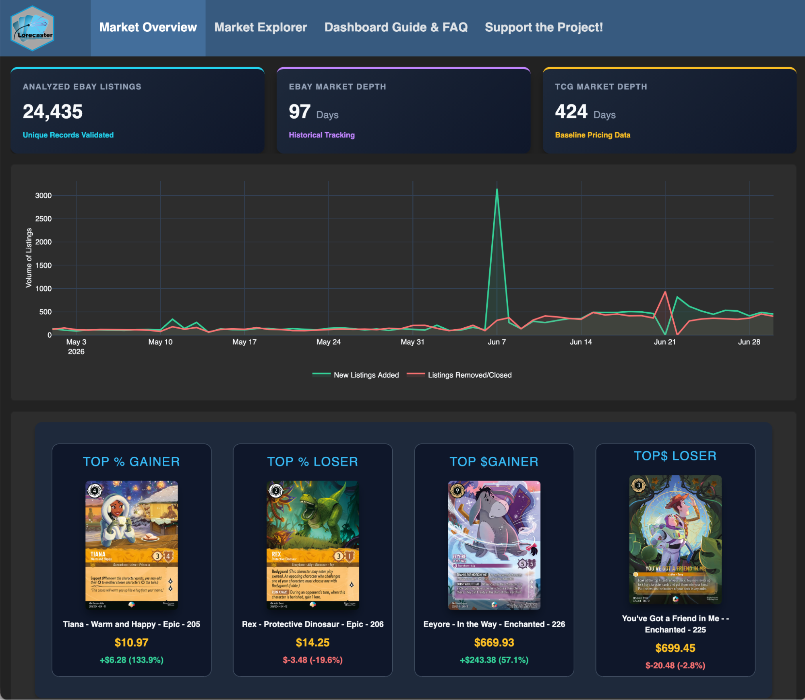
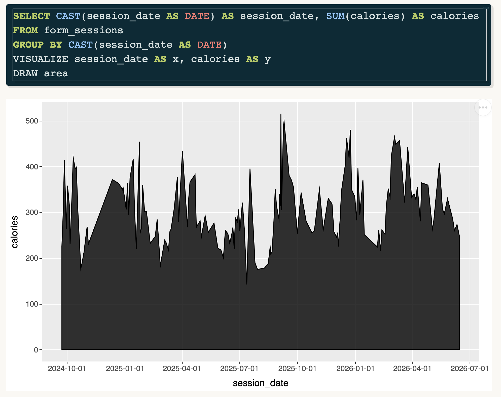

> Welcome to our newsletter, posit::glimpse()!
>
> If you're currently reading this on our blog, consider subscribing to Product Updates - Open Source on our <a href="https://posit.co/about/subscription-management" target="_blank" rel="noopener">subscription page</a> to receive this newsletter directly in your inbox.

Welcome to the latest edition of the posit::glimpse() newsletter, the monthly roundup of open-source news for the Posit community. I have many updates for you from across Posit. As my wonderful colleague Kristin Bott stated, “*dang* this is a productive bunch of humans”.

The table of contents on the right can help you navigate through all the updates. As you scroll, it will open up to show you subcategories →

## Announcements

### posit::conf(2026) is happening soon\!

Our annual conference, [posit::conf(2026)](https://conf.posit.co/2026/), is happening September 14-16, and we would love to see you there, whether in Houston or online\! Check out the [speaker lineup](https://posit.co/blog/posit-conf-2026-agenda-breakdown), [workshop offerings](https://posit.co/blog/workshops-at-positconf2026), and [register for posit::conf here](https://conf.posit.co/2026/registration/).

Tidy Dev Day is happening on September 17, a unique opportunity to collaboratively tackle open-source issues and work directly alongside the very developers who build and maintain the tools you use every day. As [Meghan Harris stated about last year’s event](https://thetidytrekker.com/post/vibe-conf-ing/posit_conf_2025), “Tidy Dev Day (TDD) gave me the PERFECT opportunity to explore this further in a low-stress, supportive environment.” [Learn more about Tidy Dev Day here](https://opensource.posit.co/blog/2026-06-25_tidy-dev-day-2026/).

### We’ve joined the Jupyter Foundation

We are proud to announce that we are deepening our commitment to the [Jupyter](https://jupyter.org/) ecosystem by becoming an official [Jupyter Foundation](https://jupyterfoundation.org/) Member\!

* Learn more in the [We’ve Joined the Jupyter Foundation announcement](https://opensource.posit.co/blog/2026-06-25_posit-joins-jupyter-foundation/) blog post.

### Announcing an expanded Posit Academy

We've launched a new part of [Posit Academy](http://academy.posit.co/): a free, open library of product courses, hands-on labs, and live workshops available to anyone.

* Learn more in the [Announcing an expanded Posit Academy](https://posit.co/blog/announcing-expanded-posit-academy) blog post.

### Introducing the Posit Impact Awards

Have a story to share? We just launched the Posit Impact Awards to recognize individuals and teams who used Posit to create measurable, meaningful change. Six winners will be selected, one per category, and each will receive a conference-only pass to posit::conf(2026) in Houston, TX, September 14-16, 2026\.

* [Submit your nomination before July 20th.](https://docs.google.com/forms/d/e/1FAIpQLSfQrWnEQ_wlc5lhyn5BLgU0mvfWDXb1XSXhq9PoSERdWSZS3g/viewform)

## Key product updates and new releases

### Data visualization and reporting

#### ggsql 0.4.1

[ggsql](https://ggsql.org/) 0.4.1 introduces spatial plotting capabilities with database-backed geometry processing, supporting WKB format data, 21 map projections for cartographic accuracy, and a built-in Natural Earth world dataset for creating choropleth maps and geographic visualizations with backends like DuckDB spatial, PostGIS, and SpatiaLite.

* Learn more in the [ggsql 0.4.1: Spatial plotting and in-layer aggregation](https://opensource.posit.co/blog/2026-06-23_ggsql_0_4_1/) blog post.

#### Ask more of your dashboard with querychat and ggsql

[querychat](https://posit-dev.github.io/querychat/) now supports ggsql-powered visualizations, enabling natural language data exploration in dashboards through SQL-only execution (no arbitrary code), with three pre-built tools for visualizing, querying, and filtering data reactively. The package works in both Python and R, integrates with [Shiny](https://shiny.posit.co/) dashboards, and supports Snowflake Semantic Models for business logic definitions.

* Learn more in the [Ask more of your dashboard with querychat and ggsql](https://opensource.posit.co/blog/2026-06-17_querychat-ggsql/) blog post.

#### Great Tables 0.22.0

[Great Tables](https://posit-dev.github.io/great-tables/) v0.22.0 significantly expands Python table presentation capabilities with footnote support, group-wise and grand summary row calculations, column merging utilities for uncertainty and ranges, text transformation methods, value substitution helpers, duration and parts-per formatters, image export functionality via gtsave(), enhanced LaTeX rendering, and makes Pandas an optional dependency for Polars-only workflows. (impressive update\!)

* Learn more in the [Great Tables v0.22.0](https://opensource.posit.co/blog/2026-06-25_great-tables-0-22-0/) blog post.

### Data access

#### dbplyr 2.6.0

[dbplyr](https://dbplyr.tidyverse.org/) 2.6.0 introduces ADBC support via adbi for faster Arrow-based data transfer, JDBC support, new SQL dialect separation, and query composition functions.

* Learn more in the [dbplyr 2.6.0](https://opensource.posit.co/blog/2026-06-17_dbplyr-2-6-0/) blog post.

#### webR 0.6.0

[webR](https://docs.r-wasm.org/webr/latest/) 0.6.0 upgrades to R 4.6.0 and adds async/await support for JavaScript Promises, curl and httr2 compatibility through WebSocket traffic proxying, modern Fortran fixes for expanded package support, and updated system libraries including OpenSSL 3.5.1 and Emscripten 5.0.7. The release powers interactive R experiences in Quarto Live and Shinylive.

* Learn more in the [webR 0.6.0](https://opensource.posit.co/blog/2026-06-18_webr-0-6-0/) blog post.

### Developer tools and AI

#### debrief 0.1.0

The [debrief](https://r-lib.github.io/debrief/) package converts profvis profiling output into text-based summaries designed for AI agents, enabling AI-assisted performance optimization by providing structured reports on hotspots, call trees, and memory allocations that AI systems can read and act upon.

* Learn more in the [debrief 0.1.0](https://opensource.posit.co/blog/2026-06-22_debrief-0-1-0/) blog post.

#### pkgsite 0.1.0

[pkgsite](https://edgararuiz.github.io/pkgsite/) 0.1.0 converts R package .Rd documentation files into [Quarto](https://quarto.org/) .qmd files, enabling custom documentation sites with Quarto’s freeze feature for local example rendering, unified R/Python documentation when combined with Quartodoc, and flexible template customization. The package is available on CRAN and provides an alternative to pkgdown.

* Learn more in the [pkgsite 0.1.0](https://opensource.posit.co/blog/2026-06-18_pkgsite-0-1-0/) blog post.

#### watcher 0.2.0

[Watcher](https://watcher.r-lib.org/) is a lightweight R package that watches files and directories for changes and reacts in the background. It’s quietly been the engine behind Shiny's auto-reload for the past year. With the CRAN release of 0.2.0, we're excited to introduce it as a general-purpose filesystem watcher for R developers.

* Learn more in the [watcher 0.2.0](https://opensource.posit.co/blog/2026-06-29_watcher-0-2-0/) blog post.

### Development environment

#### Air 0.10.0

[Air](https://posit-dev.github.io/air/) 0.10.0 introduces configurable assignment style enforcement allowing teams to standardize on arrow (`<-`), equal (`=`), or preserve existing styles, along with enhanced IDE integrations for Positron and RStudio, multiple installation methods via PyPI and conda-forge, pre-commit hook support, stdin integration for editors, and shell completions.

* Learn more in the [Air 0.10.0](https://opensource.posit.co/blog/2026-06-26_air-0-10-0/) blog post.

#### What’s new in Positron

[Positron](https://positron.posit.co/)’s June release includes a lot of highly requested features:

* Inline output for Quarto (one of Positron’s most-requested features ever\!)
* Posit Assistant, the successor to Positron Assistant
* Packages pane improvements
* A more customizable interface

For more, check out the [Positron June Release Highlights](https://opensource.posit.co/blog/2026-06-08_positron-2026-06-release/) post and [subscribe to Positron emails](https://posit.co/positron-updates-signup).

Did you know that many of the most upvoted RStudio feature requests are already implemented in Positron? Learn about ten of them in the [RStudio’s Top Feature Requests … In Positron blog post](https://opensource.posit.co/blog/2026-06-10_rstudios-top-features-in-positron/)\!

### Machine learning and modeling

#### brulee 1.0.0

[brulee](https://brulee.tidymodels.org/) 1.0.0 significantly expands tabular deep learning capabilities in R with five new model architectures, GPU support including Apple Silicon, 32-bit precision for improved performance, and enhanced numerical stability, all integrated with the tidymodels ecosystem.

* Learn more in the [brulee 1.0.0](https://opensource.posit.co/blog/2026-06-24_brulee-1-0-0/) blog post.

#### CatBoost support in tidymodels

CatBoost gradient boosting support is now available in [tidymodels](https://www.tidymodels.org/) through the boost\_tree() interface, providing access to CatBoost’s strong categorical feature handling with full tidymodels integration including hyperparameter tuning, cross-validation, efficient submodel optimization, and orbital package support for SQL generation and in-database predictions.

* Learn more in the [CatBoost support in tidymodels](https://opensource.posit.co/blog/2026-06-25_catboost-tidymodels/) blog post.

#### tidyclust 0.3.0

[tidyclust](https://tidyclust.tidymodels.org/index.html) 0.3.0 introduces three new clustering model families and achieves full integration with tidymodels by replacing tidyclust-specific functions with native tune package support.

* Learn more in the [tidyclust 0.3.0](https://opensource.posit.co/blog/2026-06-15_tidyclust-0-3-0/) blog post.

## Event roundup

We were all over the world this month, discussing how to adopt new data tools, get better at old ones, and just loving being part of the community. If you want to learn more about where we were, or see where we’ll be next, check out our [event page](https://opensource.posit.co/events/).

Watch the recordings from some of these events:


- resources/videos/2026-06-15_neal-richardson-mcp-or-not-mcp-pydata-london-26
- resources/videos/2026-06-26_agents-for-correct-transparent-and-reproducible-data-analysis-simon-couch-sara-altman/


## Showcases from the community



Brilliant Earth turned their Marketing Mix Model into a [Streamlit](https://streamlit.io/) app deployed on [Posit Connect](https://posit.co/products/enterprise/connect) via the [Snowflake Native App](https://docs.posit.co/partnerships/snowflake/), so their marketing team can dig into channel performance and run scenario planning on their own. One of the campaigns in the mix: their recent Ring Pop collaboration.

* [Check out the spotlight.](https://posit.co/about/customer-stories/brilliant-earth)

---





---

[Leo Ohyama](https://www.linkedin.com/in/leo-ohyama-phd-52358387/) recently shared a fantastic Lorcana Market Data Analysis & Forecasting dashboard that showcases the power of Python, R, Positron, and Quarto working together.

Leo included detailed documentation in the GitHub repository, a great resource for anyone interested in market forecasting or multi-tool workflows. Thanks for sharing your work with the community, Leo\!

* [Lorcana dashboard](https://lorecaster.ink/)
* [Lorcana GitHub repo](https://github.com/leoohyama/lorcana)





We were recently joined by [Thomas Lin Pedersen](https://opensource.posit.co/people/thomas-lin-pedersen/) on the [Data Science Lab](https://pos.it/dslab), where he introduced the new [ggsql](https://ggsql.org/) package.

(Almost) immediately after the DS Lab, [Dylan Poulsen](https://www.linkedin.com/in/drspoulsen/) wrote a blog post on exploring two years of swim data with ggsql\! Dylan, we’re convinced you write blogs at the speed of ggsql.

* [Exploring the New ggsql Package with Two Years of Swim Data](https://dylanpoulsen.com/posts/2026-06-16-ggsql-swimming.html) blog post

---



We usually find these projects on social media. If you’re on LinkedIn, be sure to follow and tag [Posit Open Source](https://www.linkedin.com/showcase/posit-open-source/) for us to share the amazing things you’re working on\!

## What’s next

We’re taking a short break in July before returning with more community hangouts\!

* On July 21, Gina Reynolds will join the Data Science Lab (a fun, chill time with live code) to show we can extend ggplot2 by creating our own custom extensions. Register here: [https://pos.it/dslab](https://pos.it/dslab)

In the meantime, check out some past Data Science Lab episodes:


- resources/videos/2026-05-29_async-parallel-r-with-mirai-charlie-gao-data-science-lab
- resources/videos/2026-06-23_data-dictionaries-parquet-claude-hadley-wickham-data-science-lab
- resources/videos/2026-02-19_using-r-package-structure-for-data-science-projects-kylie-ainslie-data-science-lab


I’m a real person, and I would love to know how to make the Glimpse newsletter better\! Find me on [LinkedIn](https://www.linkedin.com/in/ivelasq/) and [Bluesky](https://bsky.app/profile/ivelasq3.bsky.social), or email me at isabella \[dot\] velasquez \[at\] posit.co.
