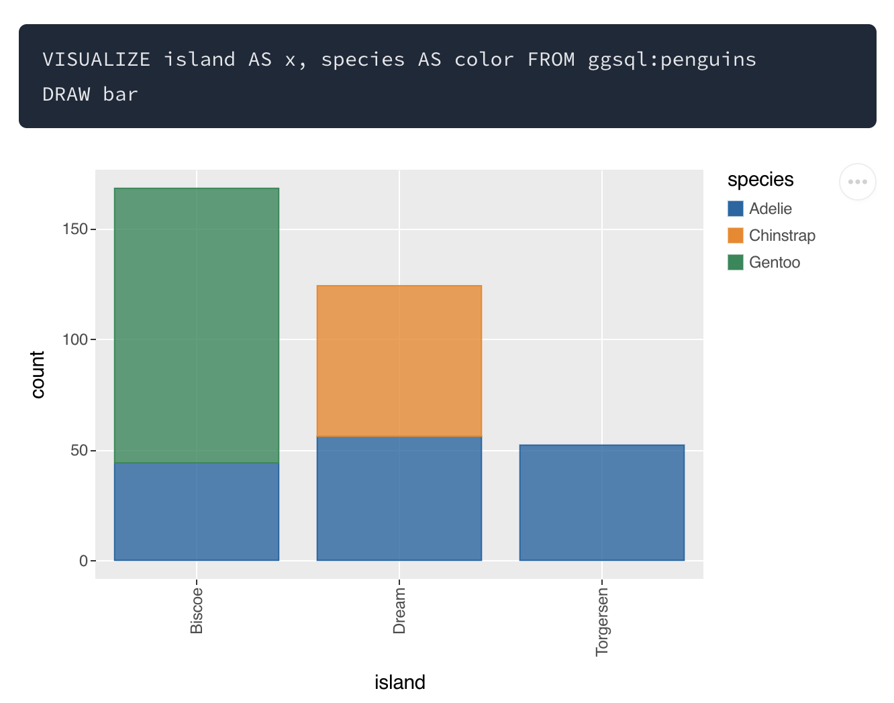

> *The AI newsletter has moved! From this edition forward, we'll be publishing here, on the Open Source website. You can read past editions on the main [Posit blog](https://posit.co/blog).*

## External news  

### AI and cybersecurity
Anthropic recently announced **[Project Glasswing](https://www.anthropic.com/glasswing), an effort to bolster critical software against the threat of AI systems that are increasingly capable of finding and exploiting security vulnerabilities.** Through the project, a number of organizations that maintain critical software will be allotted credits to Claude Mythos, Anthropic's yet-to-be-publicly-released model that reportedly found high-severity security issues in ["every major operating system and web browser"](https://red.anthropic.com/2026/mythos-preview/). The goal is to give these organizations a head start in finding and patching these vulnerabilities before bad actors have access to the same technology.

### A step change for local coding agents  
One of the most common questions we receive when releasing LLM-enabled software is "Can I use this with a local model?" Up until this point, we've largely discouraged using our products with LLMs small enough that you could run them on a laptop. [Local models are not there (yet)](https://posit.co/blog/local-models-are-not-there-yet) showed that, at the time, models small enough to run on a laptop failed a simple refactoring task every time, while the frontier, cloud-hosted models were largely successful. 

**However, the last couple weeks have brought two important releases for the local model space—[Gemma 4](https://blog.google/innovation-and-ai/technology/developers-tools/gemma-4/) and [Qwen 3.6](https://qwen.ai/blog?id=qwen3.6-35b-a3b). Both of these new models [successfully completed the refactoring task in 9 of 10 attempts](https://simonpcouch.com/blog/2026-04-16-local-agents-2/).**

## Posit news  
Posit recently announced **[ggsql](https://opensource.posit.co/blog/2026-04-20_ggsql_alpha_release/), an implementation of the grammar of graphics for SQL.** One of the motivations for ggsql is safer AI agent tooling for visualization. With ggsql, rather than giving a visualization agent a full R or Python runtime (where the agent could execute arbitrary code, write files, or make network calls), you can provide it with a SQL runtime instead. SQL limits the agent to database operations, and you can restrict even those by connecting read-only, reducing the risk that the agent will do something undesirable. 

## Terms

A **dense model** is one where every parameter is used to process every token. For example, if a model has 14 billion parameters, in a dense model, all 14 billion are involved in generating each token. 

Dense models are in contrast to sparse models, a subset of which use an architecture called **Mixture of Experts (MoE)**. In MoE models, only a fraction of the model's parameters are involved at any given time. The model contains many parallel sub-networks called "experts," and a small router decides which ones to activate for each token. This means a model only needs to pay the computational cost of the small active subset per token. 

This is the architecture of the most recent local models, and partially explains the jump in ability we saw. Gemma 4 26B-A4B, for example, has 26 billion total parameters but only activates 4 billion per token (the "A" is for "active parameters"). The models we tested from the previous generation were dense, requiring you to choose between a model small enough to run on a laptop or one that was good enough to be useful. The MoE architecture helps break that tradeoff.

## Learn more

* **Anthropic released [Opus 4.7](https://www.anthropic.com/news/claude-opus-4-7)**, an incremental improvement over Opus 4.6. **OpenAI released [GPT-5.4-Cyber](https://openai.com/index/scaling-trusted-access-for-cyber-defense/)**, a fine-tune of GPT 5.4 for cyberdefense.  
* A [new paper](https://arxiv.org/abs/2603.21687) shows that **vision language models excel at many image benchmarks even when the actual images aren't provided**, because the answers are implicit in the questions.  
* Posit's Jeremy Allen has been keeping a [log of the ways AI is transforming work](https://www.thetreeline.pub/p/ais-transformation-of-work). 
