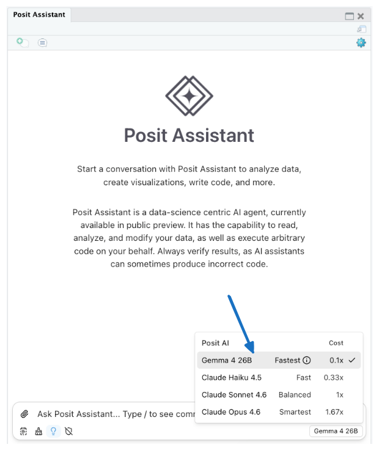

## External news

Through 2023 and 2024, the dominant narrative on AI token pricing was that the cost to use AI was [dramatically](https://epoch.ai/data-insights/llm-inference-price-trends) [decreasing](https://hai.stanford.edu/news/ai-index-2025-state-of-ai-in-10-charts) and [would continue to do so](https://blog.samaltman.com/three-observations). However, in the last year, that trend is reversing course.

* On Tuesday, Google released [Gemini 3.5 Flash](https://blog.google/innovation-and-ai/models-and-research/gemini-models/gemini-3-5/), and priced it at three times the previous Flash model, Gemini 3 Flash. 
* [GPT-5.5](https://openai.com/index/introducing-gpt-5-5/), released last month, is twice as expensive as GPT-5.4. 
* [Opus 4.7](https://www.anthropic.com/news/claude-opus-4-7), also released last month, has the same price per token as Opus 4.6, but uses an updated tokenizer that [results in ~45% more tokens for the same text](https://simonwillison.net/2026/apr/20/claude-token-counts/).

Combined with changes to subscription pricing ([Copilot](https://help.openai.com/en/articles/20001106-codex-rate-card#codex-rate-card-token-based-pricing), [Codex](https://help.openai.com/en/articles/20001106-codex-rate-card#codex-rate-card-token-based-pricing), [Claude](https://www.pcworld.com/article/3100787/anthropic-confirms-its-been-adjusting-claude-usage-limits.html)), this suggests that AI prices are on the rise. Over the last few years, the major model providers have subsidized tokens to acquire users, and it seems like that period is ending. 

 are higher for recent models compared to their direct predecessors.")

You can read more about this trend, and also how it shaped the thinking behind pricing Posit AI, in this blog post: [Posit AI is priced for the long run](https://posit.co/blog/posit-ai-priced-long-run).

## Posit news

### Gemma 4 in Posit Assistant

**Gemma 4 is [now available in Posit Assistant](https://posit.co/blog/gemma-4-new-budget-focused-model-posit-ai/) via the Posit AI provider.** Gemma 4 is a relatively small open-weights model released by Google Gemini, and one example of [recent improvements](https://simonpcouch.com/blog/2026-04-16-local-agents-2/) in local models small enough to run on a laptop.

The primary motivation for including a model like Gemma 4 in Posit AI is cost. We wanted to include a budget model that is still capable and reliable enough to power Posit Assistant across a wide range of tasks. 

We recommend using the more capable models with longer-running tasks (e.g., implementing a feature that touches code across many files in a package), but Gemma is still capable of assisting with basic data analysis. You can read more about model choice in the [announcement blog post](https://posit.co/blog/gemma-4-new-budget-focused-model-posit-ai/).  

### Tidy design principles

**Hadley Wickham restarted his [Tidy design principles substack](https://tidydesign.substack.com/p/returning-to-life) this week**, starting with a thoughtful reflection on the tension between LLMs' helpful and harmful effects. 

The following is an excerpt of that post, but we encourage you to read the entire thing. 

> In future posts, I’ll get more technical, but I wanted to begin by acknowledging your likely deeply conflicted feelings about AI.
>
> **Programming accessibility.** There are tons of people who could benefit from a programming language like R, but can’t justify the investment in learning it. AI has dramatically lowered that barrier and you can now get many of the benefits of reproducible programming with R much faster than you could before. Similarly, effective usage of git is now within reach to a much broader audience.
>
> **Translation.** While machine translations are still far from perfect, their quality has improved radically in the last few years. This means that much more of the programming ecosystem is now available to the majority of the world who are not fluent English speakers.
>
> **Voice input.** Voice input is a super exciting technology because it means that you no longer need to be a fluent touch typist in order to quickly get your thoughts into a computer. (Not to mention making a lot more technology available if you can’t read or write.) That’s a meaningful expansion of who gets to participate in technology.
>
> **Wide and shallow expertise.** I love Tukey’s quote that statisticians get to play in everyone’s backyard. And it’s now easier than ever thanks to AI. AI will not make you an expert but can give you shallow expertise in basically anything you’re curious about. I think that’s pretty cool.
>
> Finally, I have found AI to be a tremendous accelerator in my own work. It’s allowed me to fix 100s of issue in core infrastructure packages like roxygen2 and testthat. This is not AI slop; this is carefully vetted code that I can now write ~2-5x faster than I could before.
>
> But you can’t use AI without also considering the harms, of which there are many.
>
> **Environmental impact.** At the individual level, I believe that if you want to reduce your environmental footprint, there are higher-leverage changes that you can make. But at the societal level, the picture is more concerning: the rush to create new data centers is increasing need for electricity and water, and leading companies to rollback their climate commitments.
>
> **Copyright theft.** LLMs are trained on vast quantities of copyrighted material, taken at an unprecedented and industrial scale, without permission or compensation.
>
> **Concentration of wealth.** The AI craze is pushing more and more money into the hands of fewer and fewer people. I find the concentration of wealth and power into the hands of a very small number of people to be genuinely disturbing and I think is something that we should all be concerned about.
>
> **Intellectual laziness.** AI supports a kind of shallow engagement where you never have to strain your brain on any task. The path of least resistance is to disengage and just let the model handle it. You no longer have to experience any mental discomfort, and thus you never really learn.
>
> **Equity and access.** I’ve built my career around open source software, and one of the things I love about it is that it’s available to everyone, everywhere in the world, regardless of their means. That’s not possible with AI. The best tools cost real money, usually charged in US dollars, and that makes them out of reach for a lot of people in a lot of places.

