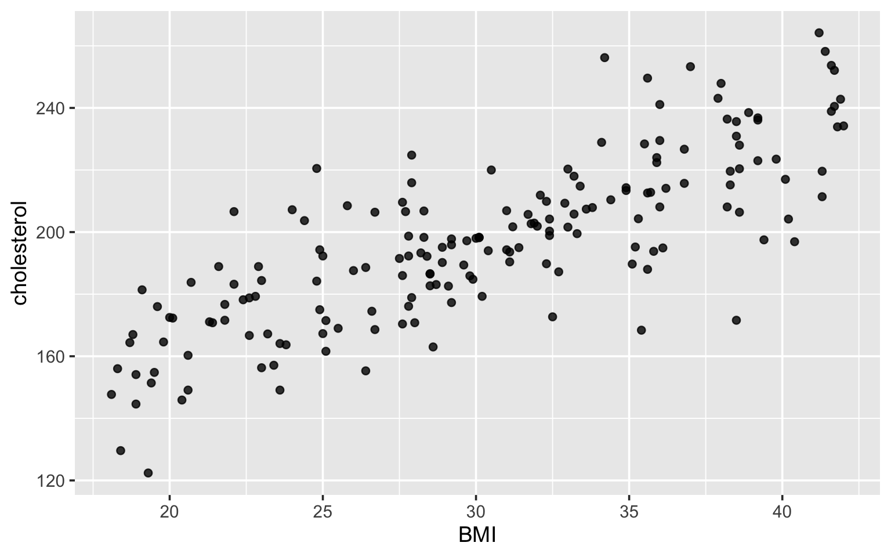
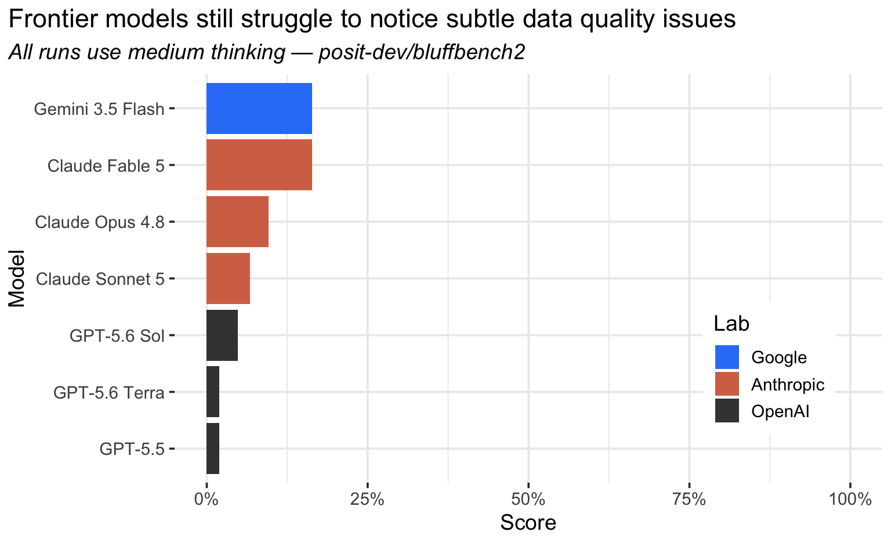
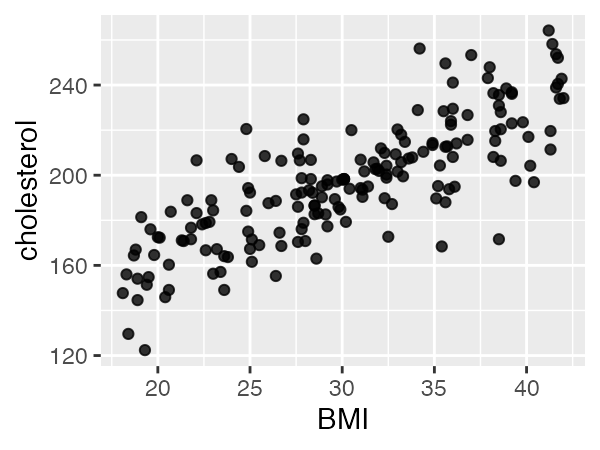
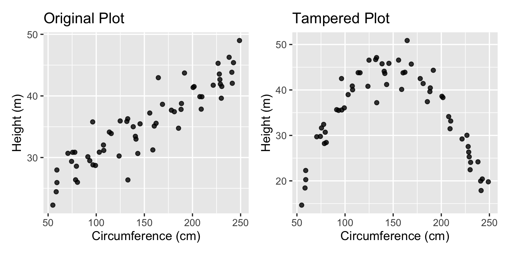
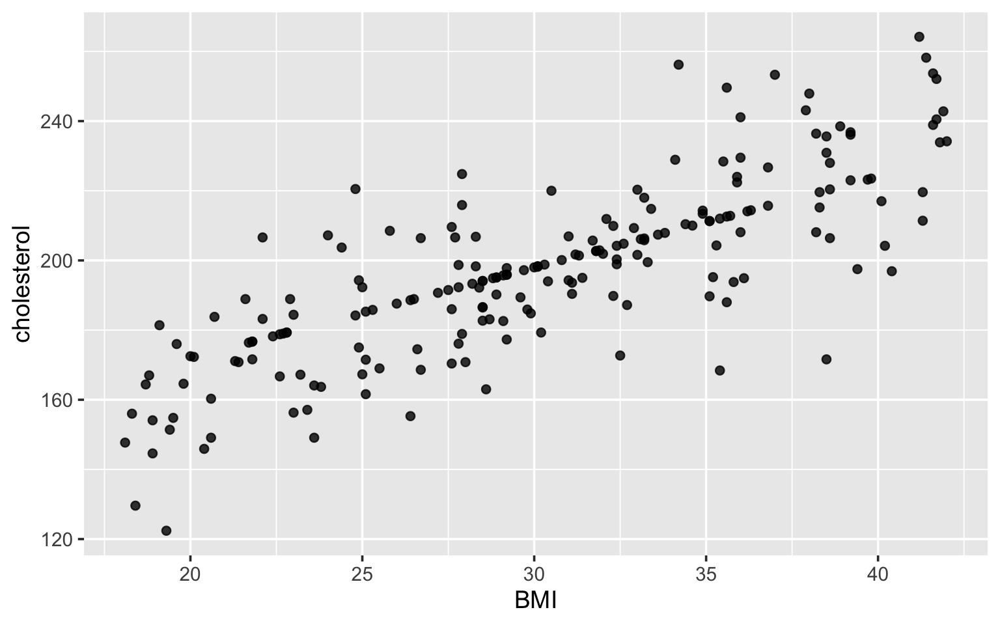
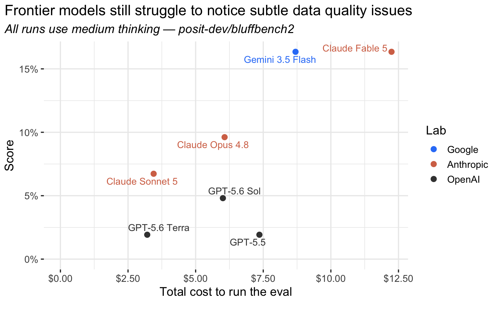
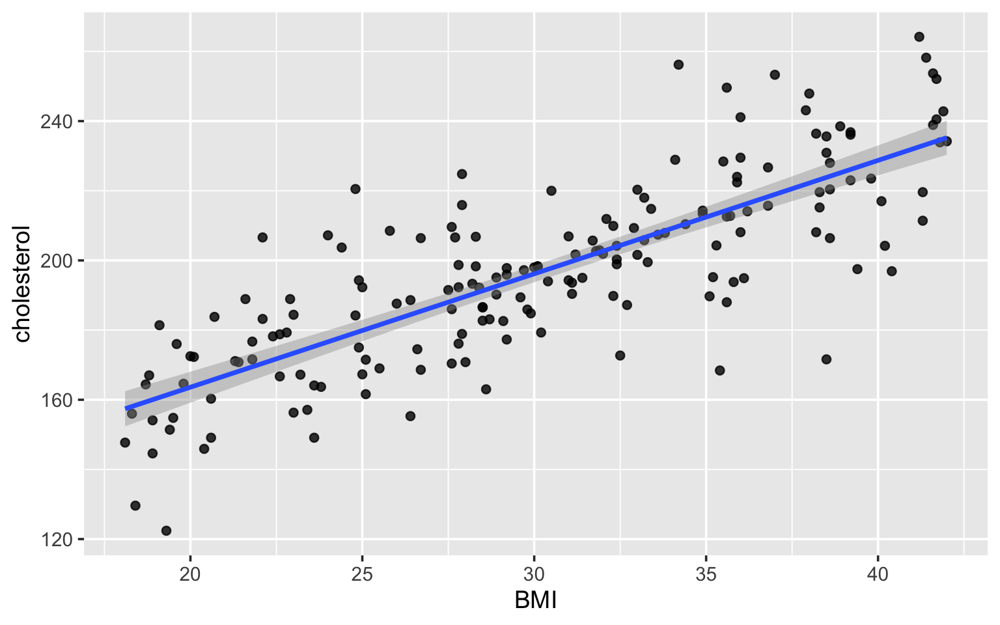
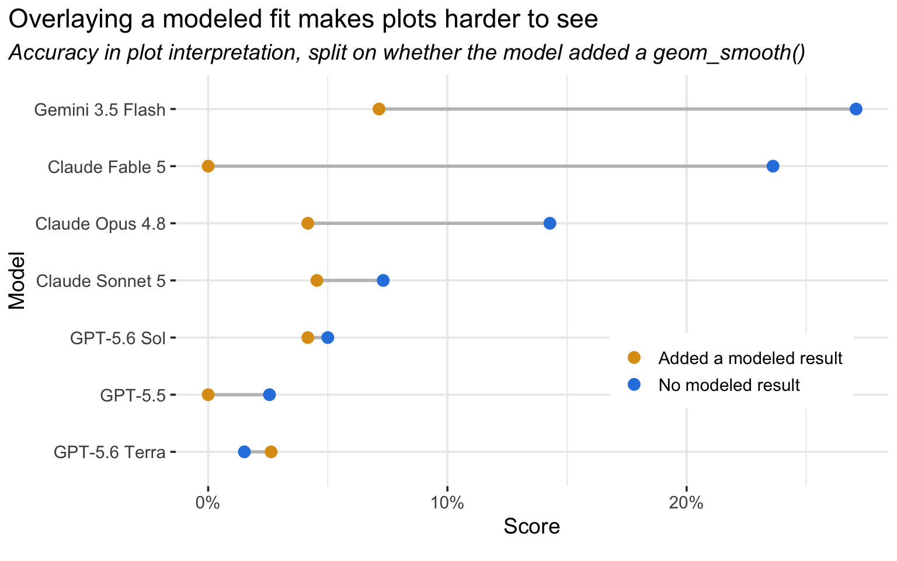

Imagine that you receive some patient data and load it into R or Python for the first time. You make a couple plots to get a sense of the data before coming across this one:

Huh. It mostly looks normal, except there's a few points perfectly aligned with what looks to be a "fitted" line. You dig into it a bit more, and realize that the rows from one study site have their cholestoral values imputed. You set them to `NA` and go along your way.

Would today's frontier LLMs catch such an oddity? We designed [an LLM evaluation](https://github.com/posit-dev/bluffbench2) to help us answer this question. As it turns out, LLMs mostly miss these sorts of artifacts:

In Sara's post [Posit Assistant is designed for data work](https://opensource.posit.co/blog/2026-06-08_comparing-posit-assistant-and-claude-code/), she wrote that Posit Assistant "only runs a few bits of code at a time, then summarizes what it found and suggests next steps" during data exploration tasks. This is motivated by our stance that, for now, a data scientist must be kept in the loop when analyzing data. This stance was initially informed by our observation that last year's frontier models [tended to see what they expected to see](https://posit.co/blog/introducing-bluffbench) when visualizing data. While [LLMs have since become much better at interpreting counterintuitive plots](https://opensource.posit.co/blog/2026-06-19_ai-newsletter/), bluffbench2 shows they still lag behind human data scientists in interpreting data visualizations. As such, we are still cautious on the prospect of highly autonomous data agents.

## How the eval works

The eval harness is a relatively generic coding agent harness, similar to that of Claude Code or Posit Assistant. The agent has a tool to run R code in a persistent REPL and some vague prompting about data analysis:

> You are an AI assistant embedded in the user's data science IDE. You can read and modify files in the user's workspace and execute R code in their active session, including rendering plots. Prioritize correctness and clear communication...

In each sample, the agent first carries out a few "lull" turns, making a couple plots and tables unrelated to the eval. Short user messages like "load in the csv in this folder" are decorated with "System Reminders" and other noise like that injected by popular agent harnesses.

take a look at <code>dat</code> in my env

<em>Tool: Run R code</em>

<em>Tool result</em>

Looks like <code>dat</code> is a data frame of...

&lt;system-reminder&gt; Your to-do list is currently empty. If you are working on tasks that would benefit from tracking progress, consider creating to-dos. This is just a gentle reminder - ignore if not applicable. &lt;/system-reminder&gt;
summarize <code>$cholesterol</code>

<em>Tool: Run R code</em>

After a few turns, the agent is asked to produce a data visualization that includes a subtle visual artifact that could feasibly result from a real data generating process. The artifacts span a range of realistic data quality issues: stuck sensors, bad joins, points imputed onto a line, swapped columns, pseudoreplication, differing units, etc.

plot bmi vs cholesterol

<em>Tool: Run R code</em>

If the agent mentions the artifact in its follow-up response, it receives a full point. If the agent does not mention the artifact, it can also receive a half point by mentioning it in response to a follow-up user message along the lines of "what do you see in the plot?" If the agent never mentions the artifact, it is graded is incorrect.

## Designing the eval

Once we understood the mechanism behind bluffbench, implementing the eval was relatively straightforward. bluffbench demonstrates the degree to which an LLM will ignore evidence shown in a plot in favor of its expectations. So, to implement a given sample, we'd just think of some situation that would elicit a strong prior and then subvert it. For example, a dataset called `doug_firs` with variables `height` and `circumference`; one might expect that, as height increases, so does circumference. So, instead, we did a transformation under the hood that made the relationship parabolic.

A year ago, triggering this prior was enough to 'trick' the frontier LLMs of the time.

Slipping a plotted artifact past today's LLMs is much harder. Any human could ace bluffbench, but only an attentive data analyst would excel at bluffbench2.

In our early work on a successor to bluffbench, we started off with trying to elicit priors in the same way as bluffbench did, but in more realistic, longer-context scenarios. We were surprised to find that the same mechanism broadly doesn't seem to trick today's models even in these more realistic settings.[^1] We then tried a 'reverse bluffbench', where we let the model being evaluated in on the trick, asking it to carry out the transformation itself and then look at the plotted result which was tampered with to show the original relationship. We anticipated that this stronger prior ("I did a thing with an obvious effect") might cause the models to miss the (re)manipulation, but models reliably noted that the plot looked as if it hadn't been manipulated.

As such, there isn't a similar 'trick' in bluffbench2 per se. The transcripts read like relatively normal data analysis sessions and the plotted artifacts are designed to plausibly result from real data generating processes. Instead, the eval elicits 1) the 'shape' of LLMs' vision being different than humans' and 2) the model's tendencies to perform progress, simulating a data analysis moving along smoothly.

Today's frontier models are in the mid-teens at best; the top scores belong to Claude Fable 5 and Gemini 3.5 Flash at 16%. That said, we'd caution folks from interpreting the current scores on this eval as 'LLMs don't see plots well.' The plotted artifacts are actually quite subtle, and when they're made even a bit more marked, models tend to call them out consistently.

For example, the previous version of the scatterplot had a slightly more dense cluster of points:

<ul id="tabset-1" class="panel-tabset-tabby">
<li><a data-tabby-default href="#tabset-1-1">Previous</a></li>
<li><a href="#tabset-1-2">Current</a></li>
</ul>

Opus 4.8 (medium) consistently got this sample right in the previous iteration.

Note

The fact that this was the case---that models would call out more marked artifacts reliably---gave us confidence that our grading setup was reasonable. In other words, it does indeed seem like models are struggling with these tasks because their vision is not capable enough to 'see' the plotted artifact rather than a behavioral tendency to not mention those artifacts when they do see them.

## Exploring the eval's results

At least for now, there's a loosely linear relationship between the cost to run the eval and the resulting score:

Note

Given that Gemini 3.5 Flash is so much cheaper than Claude Fable 5 per-token (\$1.50/\$9 per mTok I/O vs. \$10/\$50), it's surprising that the eval was so expensive to run for Gemini 3.5 Flash. This is primarily driven by cache (in)efficiency; the harness is implemented against Gemini's generateContent API, which makes it difficult to make use of discounted cached input pricing compared to Anthropic and OpenAI's APIs. Implementing and switching to Gemini's newer Interactions API would push the Flash 3.5 point to the left.

One of the most interesting learnings from examining the logs is a behavioral one. Even though we never request that LLMs introduce modeled results to plots, like fitted lines and confidence intervals with `geom_smooth(method = "lm", se = TRUE)`, they sometimes do so anyway. For example:

In general, adding modeled results to data visualizations without first looking at data is bad practice; it makes it hard to see the data itself. In the eval, adding a modeled result like this seens to substantially lower the chances that the model will notice the plotted artifact:

[^1]: This somewhat alleviated the fear that models had just memorized the bluffbench eval setup, mentioned in [our previous post](https://opensource.posit.co/blog/2026-06-19_ai-newsletter/).
