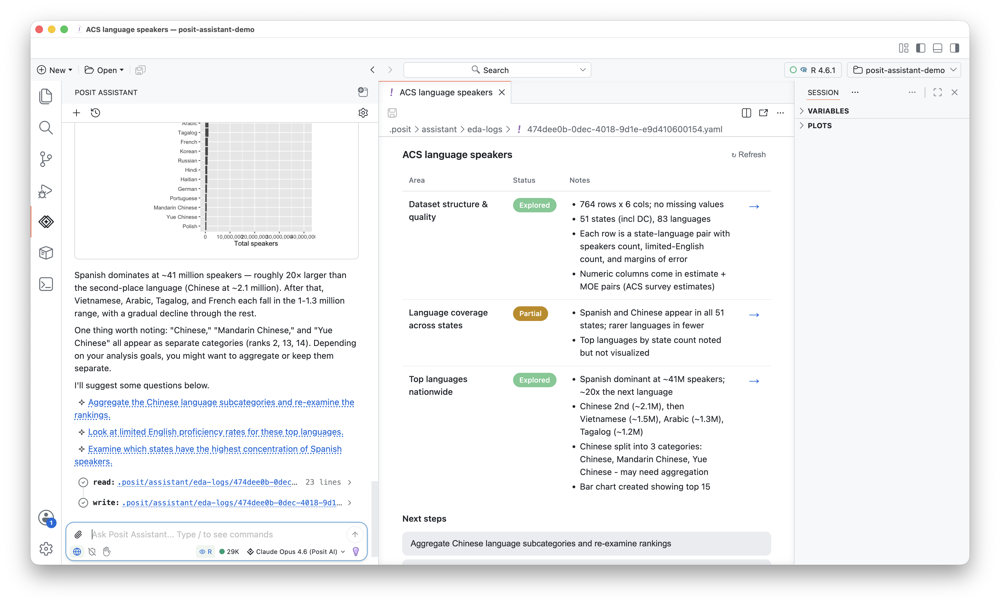

## EDA log for Posit Assistant 

The latest version of Posit Assistant in Positron includes an EDA log feature to help you keep track of exploratory analysis done with the agent.

The log summarizes findings for different areas of exploration and keeps track of next steps. To use the log, run the `/eda-log` slash command after you've started the EDA process. 

<wistia-player media-id="bu9ch5gqvx" aspect="1.6551724137931034"></wistia-player>

### Why we made this

Exploratory data analysis, the open-ended orientation to your data that often comes before anything else, can be a branching, nonlinear process. There are many questions you can ask of your data, and, until coding agents, you were limited by how fast you could write code and make sense of the output. Because of this, it is often hard to keep track of what you've looked into, where the code lives, and what you want to explore next.

Coding agents like Posit Assistant change the dynamics of EDA. They can carry out EDA far faster than you can on your own, pushing the exploration deeper and more quickly. This means they can cover a lot of ground, but it introduces a new problem: the point of EDA is typically for you, the human, to understand your data, but coding agents can produce output faster than you can absorb it. If the agent completes an analysis but you haven't understood the insights in the data, the exploration process hasn't really happened. 

Posit Assistant already has various features that tackle this problem, including an exploratory mode of interaction where it runs shorter turns and stops more frequently to involve the user. 

The EDA log is another lightweight tool for the same goal. It keeps a running summary of what you and Posit Assistant have explored, helping your understanding keep pace with the agent's and giving you a clearer picture of what's already been done.

### Details

* When you run `/eda-log`, Posit Assistant will create a log for the exploration done in the conversation so far. The log then opens in the editor area in Positron. 
* The underlying logs are stored as YAML files in `.posit/assistant/eda-logs/`, next to where plans are stored.
* Posit Assistant is instructed to loosely keep the log up to date as the conversation progresses, but you can also manually trigger an update at any time with the "Refresh" button. 
* Clicking the arrow next to an area scrolls you back to the spot in the conversation where that insight originated, so you can revisit the code and context that produced it.
* Suggested next steps appear as clickable text. Clicking one sends it to Posit Assistant as your next message.
* The creation of an EDA log is always user-triggered. Posit Assistant will never create one on its own.

## External news

