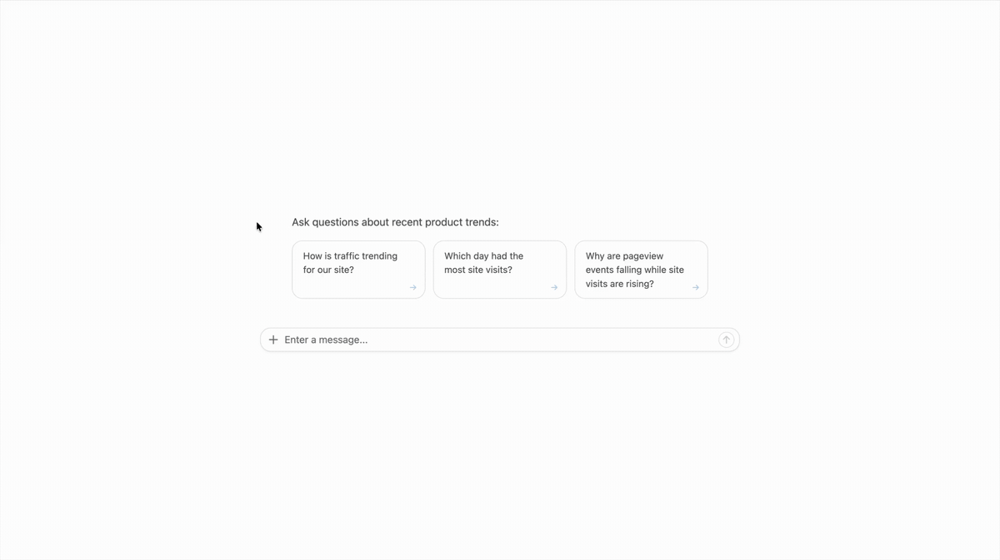
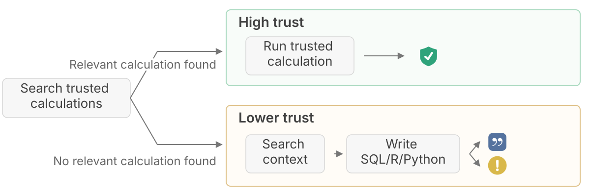
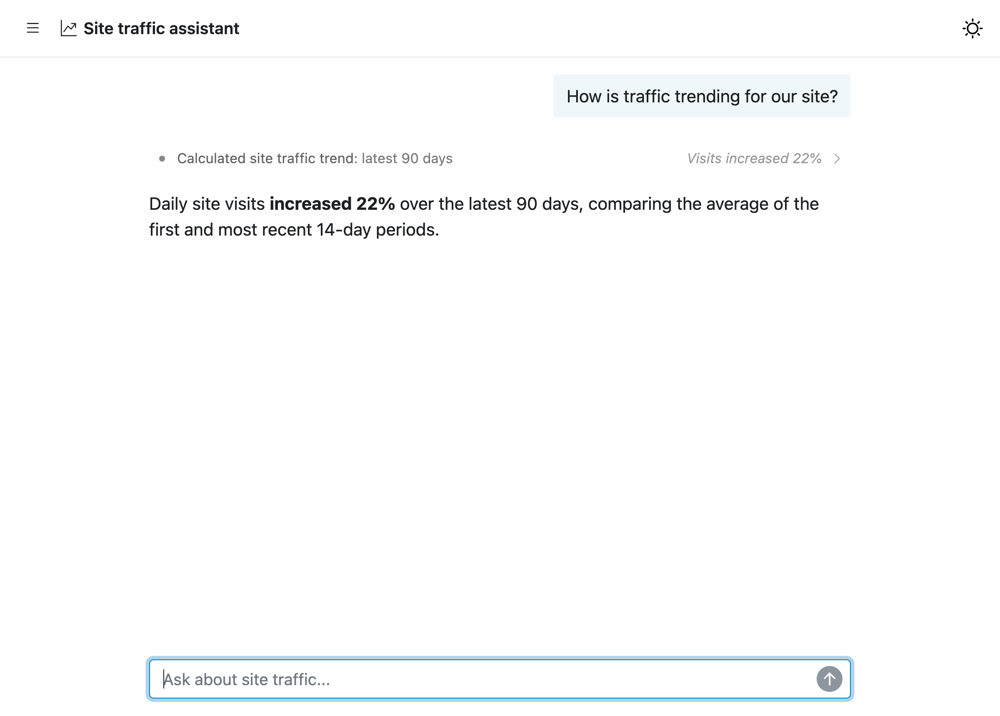
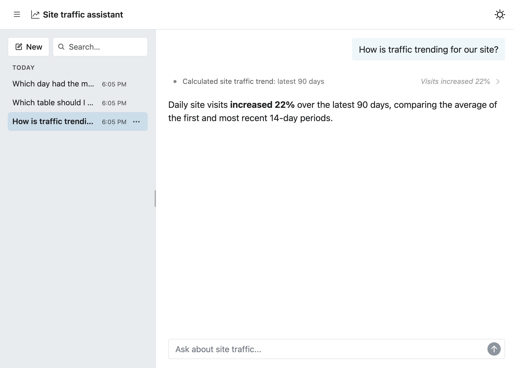
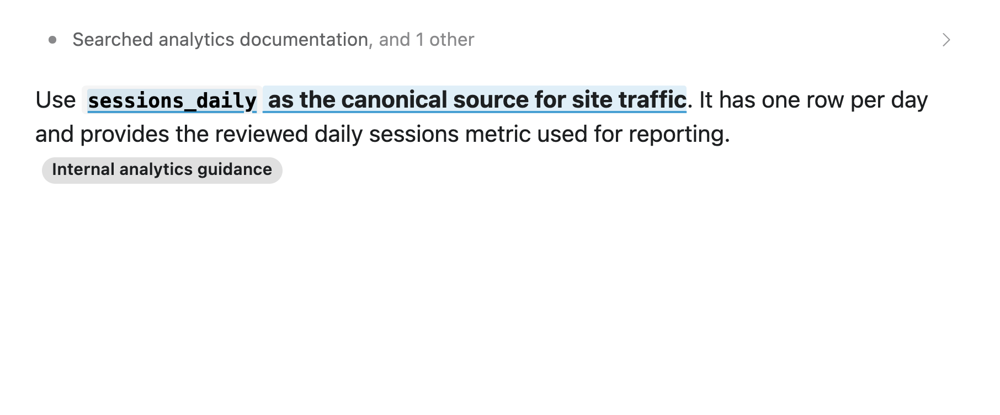

<div class="callout callout-tip" role="note" aria-label="Tip">
<div class="callout-header">
<span class="callout-title"><strong>Subscribe to the AI Newsletter!</strong></span>
</div>
<div class="callout-body">

The AI newsletter is published as an RSS feed. Follow it in your favorite reader:

<a href="/tags/ai-newsletter/index.xml" target="_blank" rel="noopener noreferrer" class="btn-shortcode inline-flex mb-5 mr-5 items-center px-4 py-3 text-sm leading-5 gap-2 rounded-lg bg-blue-400 !text-white font-semibold align-middle hover:bg-blue-500 transition no-underline">Subscribe via RSS</a>

**Want the newsletter as an email?** Paste the feed URL, <https://opensource.posit.co/tags/ai-newsletter/index.xml>, into a free RSS-to-email service such as [Blogtrottr](https://blogtrottr.com/), [Feedrabbit](https://feedrabbit.com/), or [Follow.it](https://follow.it/), and each new issue will arrive in your inbox.

</div>
</div>

Last week, three packages in Posit's open-source AI stack shipped significant releases. We introduced commons 0.1.0, while ellmer and shinychat both received substantial updates.

In this newsletter, we'll take a quick tour of what's new.

## Introducing commons

**commons, a new framework for building trustworthy self-service data analysis agents in R and Python, is now on CRAN.** Read the full announcement [here](../../blog/2026-09-15_commons-0-1-0/).

The Python package is currently in a pre-release beta stage, with more features arriving over the next few weeks.

If you're a data analyst, data scientist, statistical programmer, or other data practitioner, you likely have extensive domain knowledge and a collection of *trusted code* that you already use in analyses, apps, reports, and packages. The core idea behind commons is that we can leverage this trusted code to improve an agent's correctness.

A commons agent first searches for a trusted calculation. If it finds one that can answer the user's question, it can run that vetted code and the answer is deterministically marked as verified.



If it doesn't find a trusted calculation, the agent searches trusted context before writing custom R, Python, or SQL. The answer is either given a citation or marked as "untrusted," depending on if the agent provides a verified citation that supports its approach.

The model doesn't decide how trustworthy its answer is. commons assigns each label deterministically based on the analysis path taken by the agent.



commons also ships with an agent skill to help you create a commons agent and functions for analyzing user's conversations with your agent.

## shinychat v0.5.0 (R) and v0.7.1 (Python)

**shinychat v0.5.0 for R and v0.7.1 for Python bring together more of what you need to build a complete chat application.**

Several of these shinychat updates also made commons possible.

Read the [full blog post](../../blog/2026-09-15_shinychat-r-0.5.0-python-0.7.1/). There are many more updates worth checking out.

### `page_chat()`

Use `page_chat()` instead of the bslib `page_*()` functions when you want chat to be the center of your application. `page_chat()` creates a full-window, chatbot-oriented layout with support for navigation pages, conversation history, an [artifact drawer](https://opensource.posit.co/blog/2026-09-15_shinychat-r-0.5.0-python-0.7.1/#artifact-drawer), and more.



### Conversation history

Conversation history is enabled by default when you use `chat_server()` in R or `Chat(client=...)` in Python, allowing users to start a new conversation, switch between saved conversations, search them, rename them, and delete them.



### Readable tool calls and citations

This shinychat release also includes several improvements for understanding how a model arrived at its response.

One such improvement is readable tool calls. By default, related tool calls are grouped into compact, single-line "activity rows", keeping them from overwhelming the conversation. You can still inspect the individual tool calls by expanding a row.

shinychat also displays citations returned by providers' built-in web-search and web-fetch tools.



## ellmer 0.5.0

**[ellmer 0.5.0](../../blog/2026-09-14_ellmer-0-5-0/) is now on CRAN.** ellmer makes it easy to work with LLMs from R.

Read the full announcement [here](../../blog/2026-09-14_ellmer-0-5-0/). Many of the features made available in this release are also available in recent releases of [Chatlas](https://github.com/posit-dev/chatlas/releases), ellmer's sibling package in Python.

### Citations

When a model uses a supported built-in web tool, ellmer now provides and shows the provider-supplied citations. This works with `claude_tool_web_search()`, `claude_tool_web_fetch()`, `google_tool_web_search()`, and `openai_tool_web_search()`, helping you identify the sources behind the model's answer.

``` r
chat <- chat_openai()
chat$register_tool(openai_tool_web_search())
chat$chat(
  "What is the most recent version of ellmer on CRAN? Look it up."
)
#> The most recent CRAN release of **ellmer** is **version 0.5.0**, published
#> **September 4, 2026**.
#> ([cran.r-project.org](https://cran.r-project.org/package%3Dellmer))[1]
#>
#> Sources
#> [1] CRAN: Package ellmer: https://cran.r-project.org/package%3Dellmer
```

### Tokens and costs

Managing tokens and costs is an important part of working with LLMs.

Ever want to know how many tokens an input will take before sending it? For supported providers, you can now use `chat$token_count()` to estimate input token use. Instead of actually sending the request to the model, it sends the request to the provider's token-counting API.

``` r
chat <- chat_openai(model = "gpt-5.6-luna")
prompt <- content_pdf_file("example-document.pdf")
chat$token_count(prompt)

#> [1] 252
```

This estimates only the tokens used by the input and does not predict the number of output tokens, so it won't represent the total round-trip count.

Companies frequently release new models and change their prices. Use the new function `models_update_prices()` to download and cache the latest pricing data from the ellmer GitHub repo. Cost estimates reported by `token_usage()`, `Chat$get_cost()`, `Chat$get_tokens()`, and printed `Chat` objects use this data.

### Send files to the model

It's often useful to send files as part of a chat. You can now send CSV, Markdown, code, and other text-based files to a model with `content_document_file()` and `content_document_url()`. For large files or files reused across multiple turns, if you're using `chat_openai()`, `chat_anthropic()`, or `chat_google_gemini()`, use `chat$file_upload()` instead. It uploads the file once and returns a reference for `$chat()`. This avoids repeatedly sending the file and reduces token usage and cost.

## Solid improvements for custom agents

Taken together, these releases make it easier to build more complete custom agents. ellmer manages model intereactions in R, shinychat provides the user-facing chat interface, and commons add a framework for data analysis agents that builds upon these two.
