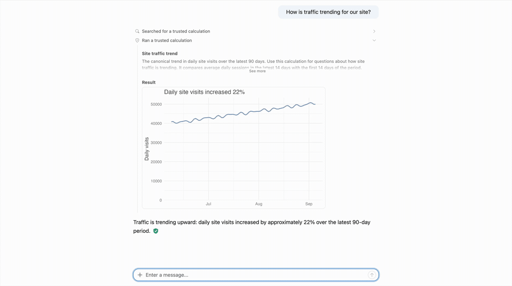

```{r}
#| echo: false
library(ellmer)
```

::: {.callout-tip}
## **Subscribe to the AI Newsletter!**

The AI newsletter is published as an RSS feed. Follow it in your favorite reader:

<a href="/tags/ai-newsletter/index.xml" target="_blank" rel="noopener noreferrer" class="btn-shortcode inline-flex mb-5 mr-5 items-center px-4 py-3 text-sm leading-5 gap-2 rounded-lg bg-blue-400 !text-white font-semibold align-middle hover:bg-blue-500 transition no-underline">Subscribe via RSS</a>

**Want the newsletter as an email?** Paste the feed URL, <https://opensource.posit.co/tags/ai-newsletter/index.xml>, into a free RSS-to-email service such as [Blogtrottr](https://blogtrottr.com/), [Feedrabbit](https://feedrabbit.com/), or [Follow.it](https://follow.it/), and each new issue will arrive in your inbox.
:::

Last week, three packages in Posit's open-source AI stack shipped significant releases. We introduced commons 0.1.0, while ellmer and shinychat both received substantial updates.

In this newsletter, we'll take a quick tour of what's new.

## Introducing commons

**commons, a new framework for building trustworthy self-service data analysis agents in R and Python, is now on CRAN.**

If you're a data analyst, data scientist, statistical programmer, or other data practitioner, you likely have extensive domain knowledge and a collection of _trusted code_ that you already use in analyses, apps, reports, and packages. The core idea behind commons is that we can leverage this trusted code to improve an agent’s correctness.

commons leverages _trusted code_ to increase the likelihood of correct answers, while still allowing them to write custom analyses when needed. 

A commons agent first searches for a trusted calculation. When it finds one that can answer the user's question, it runs that vetted code and marks the answer as verified.

{fig-alt="A commons agent answers how site traffic is trending by finding and running a trusted calculation. The resulting chart and answer are marked as verified."}

If it doesn't find a trusted calculation, the agent searches trusted context before writing custom R, Python, or SQL. The answer is either given a citation or marked as "untrusted," depending on if the agent provides a verified citation that supports its approach. 

{fig-alt="A commons agent investigates page views by searching trusted context, writing and running a custom analysis, and citing the documentation that supports its answer."}

The model doesn't decide how trustworthy its answer is. commons assigns each label deterministically based on the analysis path taken by the agent.

{.column-page fig-alt="Flow diagram showing how commons routes questions. It first searches trusted calculations. If it finds one, it runs the calculation and returns a verified answer. Otherwise, it searches trusted context, writes custom code, and returns either a cited or lower-trust answer."}

commons also ships an agent skill to help you create a commons agent and functions for analyzing user's conversations with your agent. 

Read the [full announcement](/blog/2026-09-15_commons-0-1-0/).  

## Complete chat applications with shinychat

**shinychat v0.5.0 for R and v0.7.1 for Python bring together more of what you need to build a complete chat application.** 

Several of these shinychat updates also made commons possible. 

Read the [full blog post](/blog/2026-09-15_shinychat-r-0.5.0-python-0.7.1/). There are many more updates worth checking out. 

### `page_chat()`

Use `page_chat()` instead of the bslib `page_*()` functions when you want the chat to be the center of your application. `page_chat()` creates a layout built for a chat bot, with a full-window chat, a navbar, conversation history, [artifact drawer](https://opensource.posit.co/blog/2026-09-15_shinychat-r-0.5.0-python-0.7.1/#artifact-drawer), and more.

### Conversation history

You can now enable conversation history for shinychat apps, allowing users to start a new conversation, witch between saved conversations, search them, rename them, and delete them.

Editing an earlier message creates a new conversation branch. The original question and its later messages remain intact, while the edited question starts an alternative path that users can compare with the first response. On Posit Connect, conversation history uses persistent storage and is automatically scoped to each authenticated user.

### Readable tool calls and citations

This shinychat release also includes several improvements for understanding how a model arrived at its response. 

One such improvemnt is readable tool calls. Related tool calls are now grouped together and shown with compact, single-line descriptions, instead of cards, making it easier to get the gist of what the model did and keeping tool calls from overwhelming the conversation view. You can click on the single-line description to view the actual individual tool calls. 

shinychat also displays citations returned by providers' built-in web search and fetch tools. When an ellmer or chatlas client is connected through `chat_server()` or `Chat(client=...)`, those citations are attached directly to the parts of the response they support. 


## ellmer 0.5.0

**[ellmer 0.5.0](/blog/2026-09-14_ellmer-0-5-0/) is now on CRAN.** ellmer makes it easy to work with LLMs from R.

Read the [full announcement](/blog/2026-09-14_ellmer-0-5-0/).

### Citations 

When a model answers with one of ellmer's built-in web tools for Anthropic, OpenAI, and Google providers (e.g., `claude_tool_web_search())`, it now provides a citation, helping you understand where the information came from.

```{r}
chat <- chat_openai()
chat$register_tool(openai_tool_web_search())
chat$chat(
  "What is the most recent version of ellmer on CRAN? Look it up."
)
```

### Tokens and costs

Managing tokens and costs is an important part of working with LLMs.

Ever want to know how many tokens an input will take before sending it? You can now use `chat$token_count()` to predict token use. Instead of actually sending the request to the model, it sends the request to the relevant provider's token-counting API.

```{r}
chat <- chat_openai(model = "gpt-5.6-luna")
prompt <- content_pdf_file("content/blog/ai-newsletter-10/example-document.pdf")
chat$token_count(prompt)
```

This only counts the tokens used by the _input,_ and does not predict the number of output tokens, so won't represent the total rountrip count.

ellmer also includes functions that tell you the costs of a conversation. Companies frequently release new models, so you can now run `models_update_prices()` to downloads the latest model pricing data and caches it. This pricing info is used by `token_usage()`, `Chat$get_cost()`, `Chat$get_tokens()`, and in the printed output of a `Chat` object. 

### Send files to the model

It's often useful to send files as part of a chat. You can now send CSV, Markdown, code, and other text-based files to a model with `content_document_file()` and `content_document_url()`. For longer conversation, use `chat$file_upload()` instead, which uploads the file to the provider once and provides a reference you can then pass to `$chat()`, cutting down on tokens and cost. 


## Solid improvements for custom agents

Taken together, these releases make it easier to build more complete custom agents. ellmer manages model intereactions in R, shinychat provides the user-facing chat interface, and commons add a framework for data analysis agents that builds upon these two. 
