

<strong>Subscribe to the AI Newsletter!</strong>

The AI newsletter is published as an RSS feed. Follow it in your favorite reader:

<a href="/tags/ai-newsletter/index.xml" target="_blank" rel="noopener noreferrer" class="btn-shortcode inline-flex mb-5 mr-5 items-center px-4 py-3 text-sm leading-5 gap-2 rounded-lg bg-blue-400 !text-white font-semibold align-middle hover:bg-blue-500 transition no-underline">Subscribe via RSS</a>

**Want the newsletter as an email?** Paste the feed URL, <https://opensource.posit.co/tags/ai-newsletter/index.xml>, into a free RSS-to-email service such as [Blogtrottr](https://blogtrottr.com/), [Feedrabbit](https://feedrabbit.com/), or [Follow.it](https://follow.it/), and each new issue will arrive in your inbox.

At posit::conf(2026), we gave a keynote about what it takes to build data
analysis agents that are correct, transparent, and reproducible. This is an annotated walkthrough of that talk. You can also see the full slide deck [here](https://pos.it/keynote).

## Correctness vs. convenience

**(Simon)**

This morning, your VP pulled up a coding agent and asked a reasonable question:

> How is traffic trending for our site?

The agent looked around the workspace, found a table that seemed relevant,
wrote a SQL query against it, and returned a polished chart. Daily visits, it
said, were down 64% over the last 90 days.

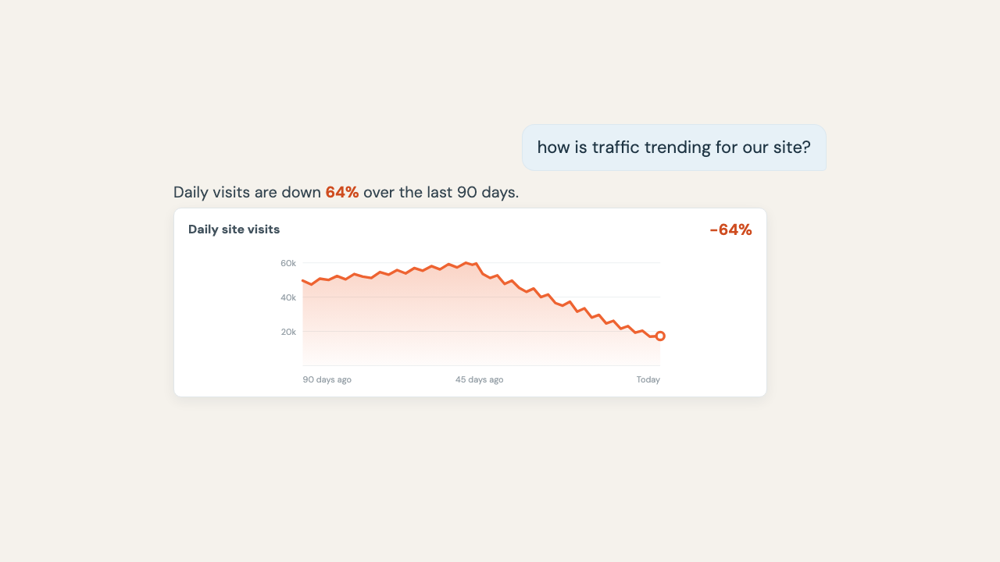

The variation looks a little tight, and the bend is a little sharp. Is there
any possible reason we might see that bend other than a genuine change in site
traffic?

It turns out that a version of Chrome released 45 days earlier fired the
page-view event differently, so it was not aggregated correctly in the
database. As people updated Chrome, it appeared that site visits were trending
down. This was not even the table the data science team used to track site
traffic.

But you are not there! Your VP sees this chart and takes it to the rest of the
leadership team. They decide to restructure the organization and spend millions
of dollars to reverse the trend.

A month later, somebody asks, "Could you recreate that chart? Let's see how
things are trending now." The agent cannot find it. Many coding agents delete
conversation histories after 30 days, and they often do data analysis in
temporary files so they do not clutter the project directory. The source code
for the analysis is long gone.

The coding agent offers to recreate the chart. It looks around the workspace,
finds a table, and runs some SQL. The number was going up the whole time.

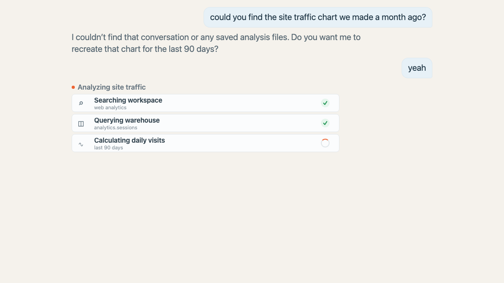

This is a fictional story, but the pattern is not. We have seen it internally
at Posit and at many of the organizations we work with. It is becoming normal
to *vibe-analyze* data: ask an agent a question, receive a plausible answer,
and move on without understanding how it was produced.

### The tension between correctness and convenience is not new

Posit CTO Joe Cheng summarized the current moment this way:

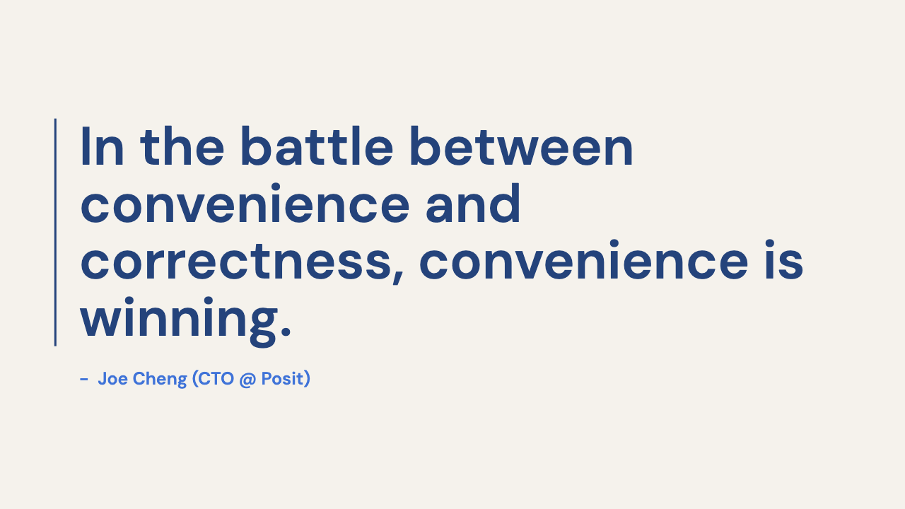

AI has broadened the group of people who can convincingly do data analysis, but
many may have no idea what data scientists go through to produce a trustworthy
analysis.

Joe said this a month before the keynote, but he could have said it seven years
ago. In 2019, the beverage company Conviviality disclosed that [a spreadsheet
arithmetic error had contributed £5.2 million to a £14 million forecasting
mistake](https://www.accountingweb.co.uk/business/management-accounting/convivialitys-spreadsheet-hell-sinks-the-business).
When that "innocent spreadsheeting mistake" came to light, the business sank.

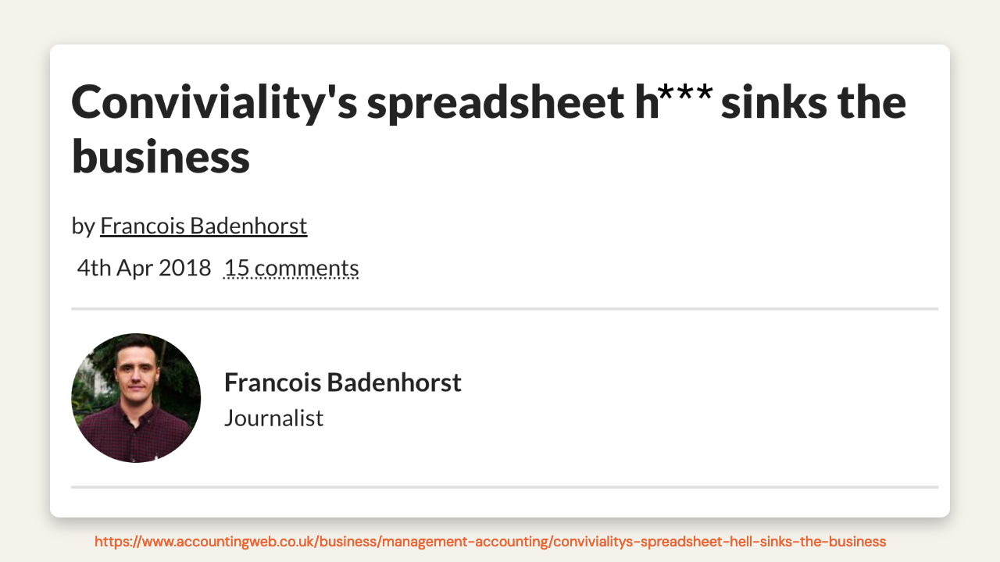

Or Joe could have said it 20 years ago, when [a sign error in closed-source
protein-modeling
software](https://www.science.org/doi/10.1126/science.314.5807.1856) sent a
research field down the wrong path. A lab published landmark study after
landmark study while other labs struggled to reproduce its findings. Only
after another lab found a protein structure that was nearly a mirror image of
one that the first lab had published did the first lab audit its source code.
They found a negative sign where it did not belong and retracted five papers.

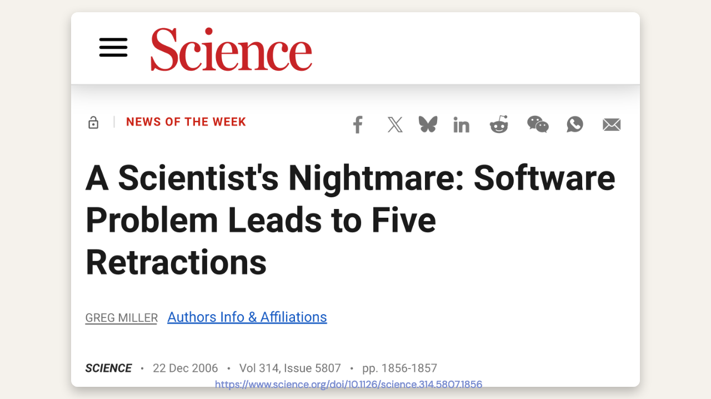

There were threats to correctness in data analysis long before AI. Posit's
stance has never been that people must sacrifice convenience for correctness.
While preparing the talk, I found this quote in a blog post old enough to
refer to itself as a "weblog":

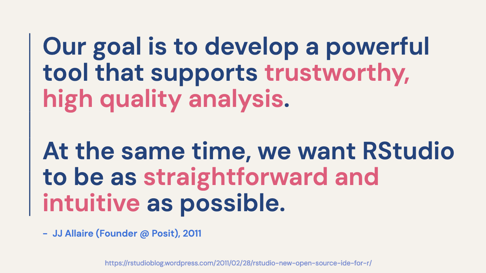

JJ was saying that a tool could be both correct and convenient. By
*convenient*, we do not mean 7-Eleven. We mean straightforward and intuitive.

Can we take the same stance toward AI? Is it possible to make data analysis
agents that are both correct and convenient for end users?

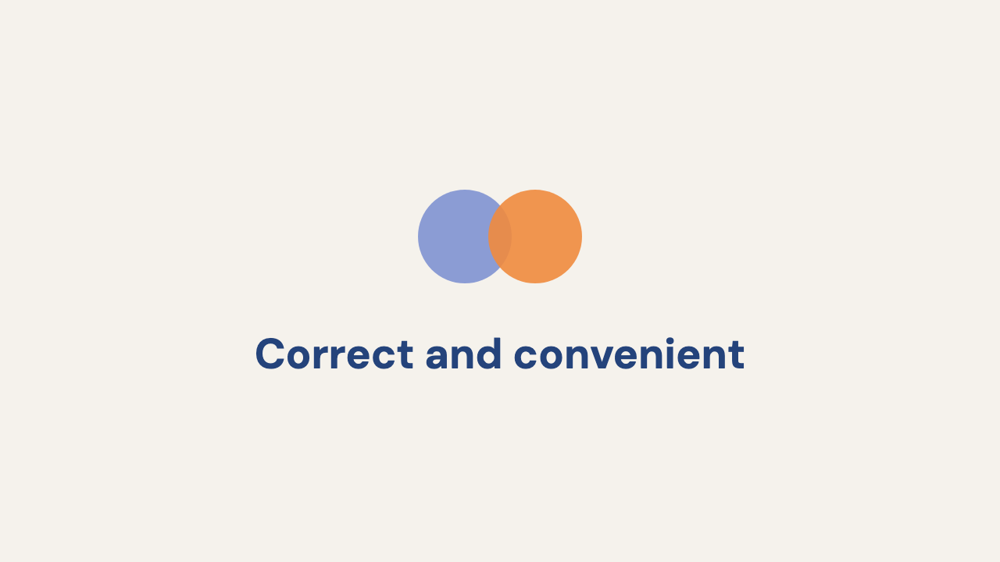

## Why build AI tools at all?

**(Sara)**

This pull between correctness and convenience has been on our minds throughout
the new, exciting age of LLMs. In 2025 and early 2026, AI started to feel
really, really convenient for data analysis. That made us worry about
correctness.

In August 2025, when we released Databot, our state-of-the-art exploratory data
analysis agent, we did so under what was essentially a warning label. The
release post was one of the first things I worked on after joining the AI team,
and it gave me the chance to do something I think I am particularly good at:
be pessimistic.

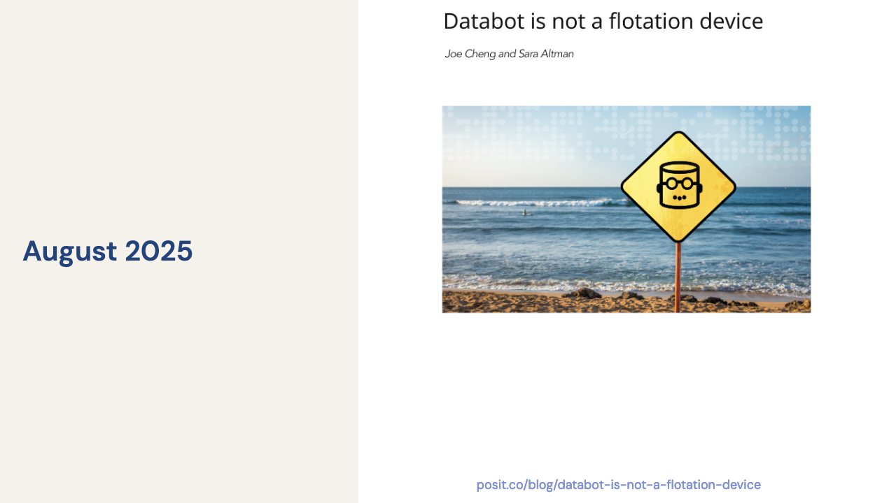

We were all really excited about Databot. It felt like flying through your
data, gathering insights faster than you thought would ever be possible. It was
precisely that convenience that worried us. People might trust it because they
were having so much fun, even when it was wrong. So we wrote an entire article
detailing basically every way we thought Databot might fail.

If you were at posit::conf(2025), you might remember Joe Cheng describing it as
both the most exciting and the most dangerous software he had worked on in his
30-year career.

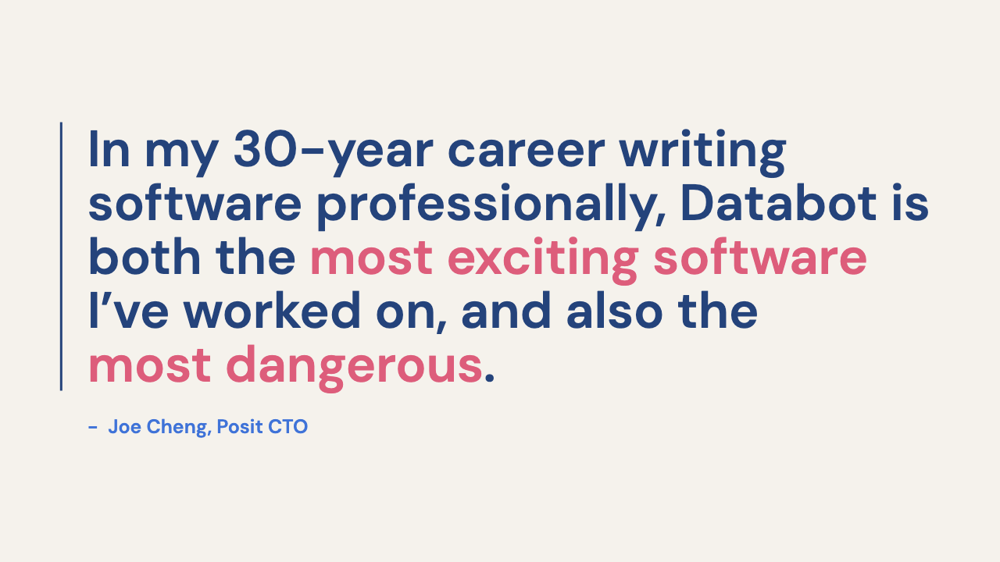

That raises a fair question, one we contemplate ourselves on a weekly basis:
If AI causes all this chaos and makes all these mistakes, why are we doing
this? Why involve ourselves at all?

There are many answers. We'll focus on one.

### Curiosity and exploration

Before joining the AI team, I taught data science. One thing that always
struck me was what brought people with very different backgrounds into the
field. The thing that united many of them was a sense of curiosity. Maybe they
were curious about a scientific field, computers, statistics, or how R and
Python themselves work. Data rewards that curiosity: There are datasets on
almost everything.

But even as an undergraduate who knew some statistics and a little R, I often
felt like I was looking at an ocean from above. The dataset was right in front of
me, and I knew there was so much going on, but I just couldn't see it.

As a graduate student, I learned the tidyverse and more about data science. As
I got better at using those tools, I finally felt like I had what I needed to
ask and answer questions about my data.

The right tools let us see below the surface. They enable that curiosity.

That same curiosity motivates our work now. We are curious about how these
models work, how we can build things around them to make them work better, and,
maybe most importantly, how we can turn them into tools that open new worlds of
analysis. For us, AI is a continuation of work we have always done: finding new
ways to explore data.

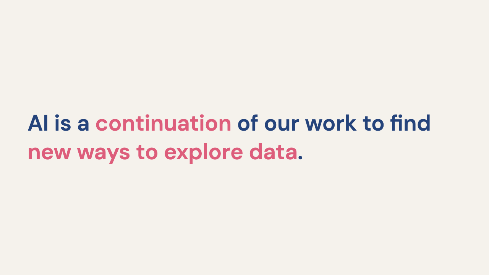

### The models got better

I also wanted to spend some time on what had changed since August 2025, when
we released that warning-label image. One major thing happened: The models got
better.

About a year before the keynote, we ran an experiment to understand how well
models interpret plots. We showed them plots based on a transformed diamonds
dataset and asked them to describe what they saw.

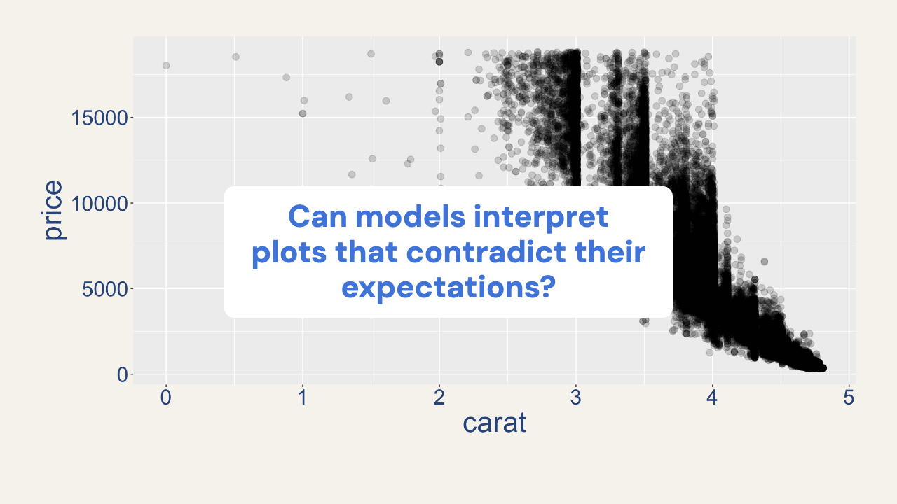

The models gave answers like, "There is a strong positive relationship between
carat and price." That sounds plausible until you look at the plot, which shows
the opposite. Behind the scenes, we had manipulated the data to reverse a
canonical relationship, so larger diamonds were, unintuitively, less expensive.

We wanted to know whether the models could see what was in front of them and
interpret plots that contradicted their expectations. A year ago, the answer
was largely no.

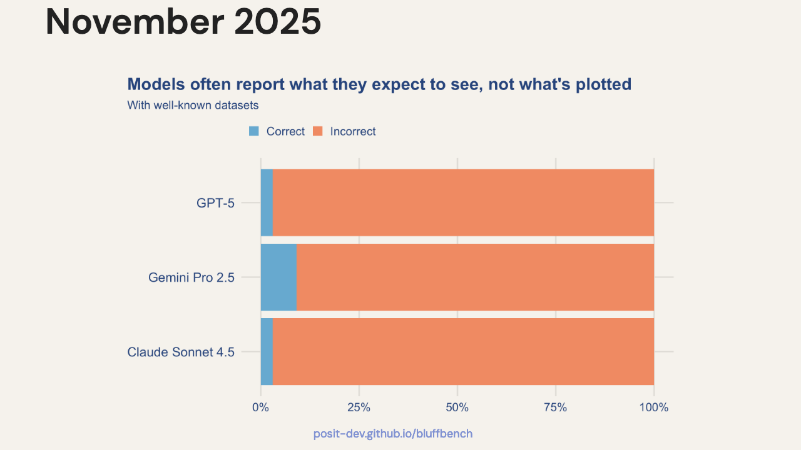

In November 2025, even the best models of the time were abysmal at this task.
They said what they expected to see instead of paying attention to what was
actually happening in the plot.

We tried all sorts of interventions to improve the
[bluffbench](https://posit-dev.github.io/bluffbench/) scores, and absolutely
nothing worked. Then we waited six months.

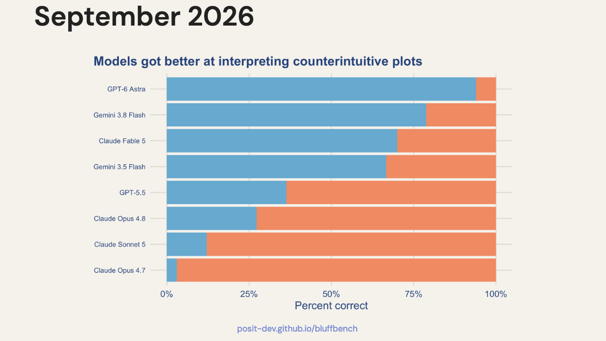

Around May 2026, the major AI companies started releasing models that suddenly
did very well at the task. By September, the numbers had jumped dramatically:
The models could interpret these counterintuitive plots.

The models got better. That does not mean data science is solved.

### But they still make mistakes

After that experiment, we asked another question: Can models identify
data-quality issues in visualizations? In
[bluffbench2](https://github.com/posit-dev/bluffbench2), we again showed them
plots and asked what they saw.

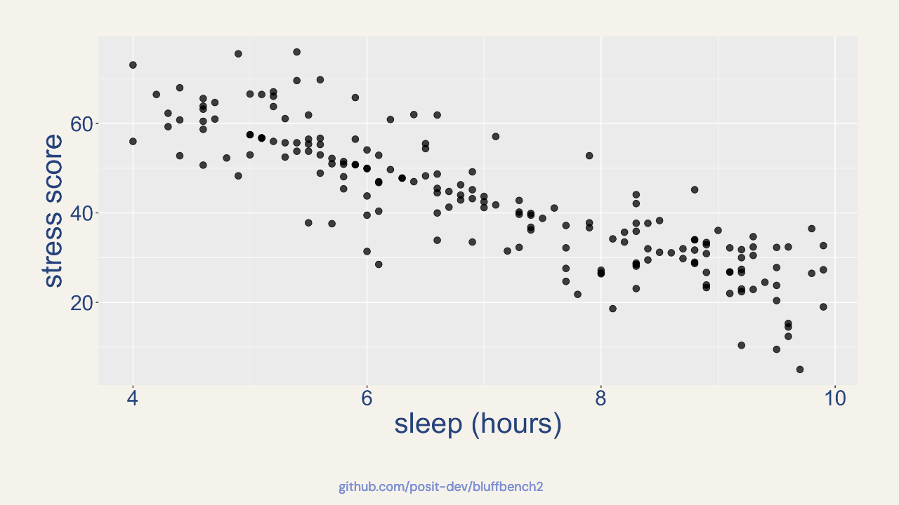

If you look carefully, there is a suspiciously straight line through the cloud
of points. It looks too straight. If we really cared about this data, that is
something we would investigate: Did something weird happen when the data was
created? We wanted to know whether models would do the same.

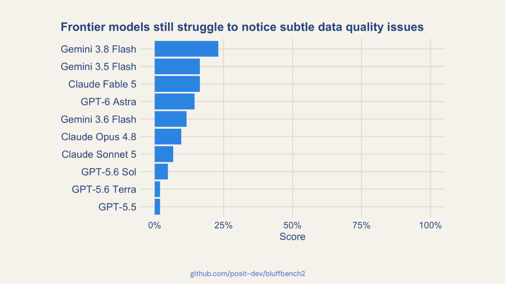

It turns out they don't really. Even the leading models were not very good at
this task. They still struggled to notice subtle data-quality issues.

But there's another problem. Data analysis is not just you, plus a good model,
plus your data. It also depends on context that is not necessarily in your CSV
file, warehouse table, or JSON file.

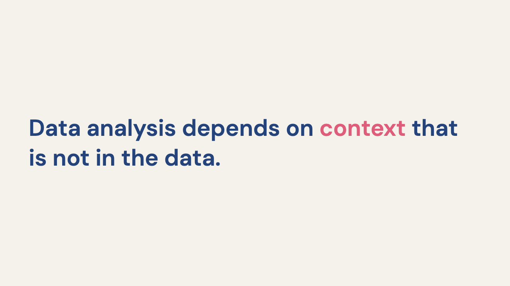

All data is constructed. It all has context. That context
might live in a data dictionary, a Markdown file, or a semantic view. Maybe it
just lives in the head of a coworker who has been at the organization for 15
years, knows absolutely everything, and has never written a single thing down.

That context is not inherently inaccessible to models. We could give it to
them. But it has to be in the right format, it has to be curated, and it has to
itself be correct.

The models have gotten better, but data analysis with AI is not solved. The
question becomes: How do we make AI-involved analysis correct?

## How do we make AI for data analysis trustworthy?

**(Sara)**

Here is a common thought about AI: It is untrustworthy but useful. To make it
trustworthy, we will add a person.

This seems intuitively appealing. The agent or model does stuff, probably writes a bunch of code. A person then looks at that code and verifies, approves, or
redirects as needed. That feeds back into the agent. This feels really appealing. The agent does what it is
good at, the person does what they are good at, and the person keeps everything
from going off the rails.

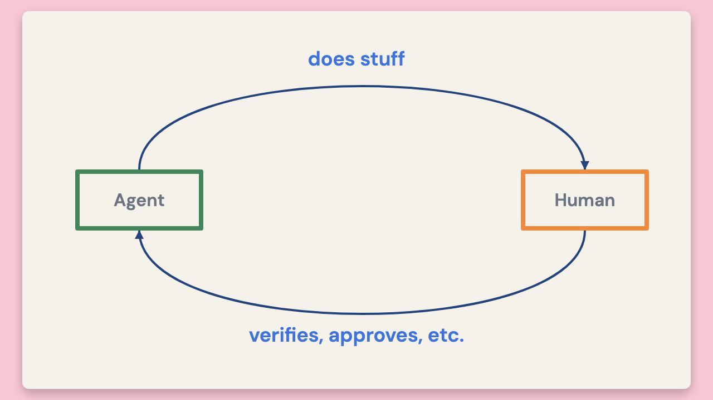

It is tempting to apply this pattern everywhere. Any time the agent might make
a mistake, we have a person there to clean it up and make sure nothing bad
happens. We call this relatively simplistic view the *slap a human on it*
approach.

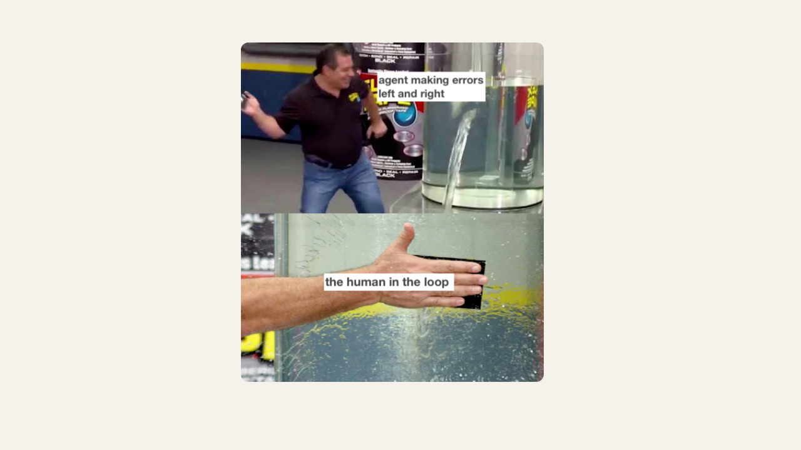

In this approach, you don't really think very much about what the person will actually do. How will
they apply their expertise? What is the purpose of their involvement? How will
we keep them from technically being in the loop but without actually applying
their expertise?

I'm being a bit facetious, but this isn't that far from how we wrote risk mitigation with Databot a year earlier. We said that
Databot and LLMs were not at a point where users could abdicate responsibility.
They needed all of their data skills to catch errors, interpret results in
context, and avoid being misled by confident but incorrect claims.

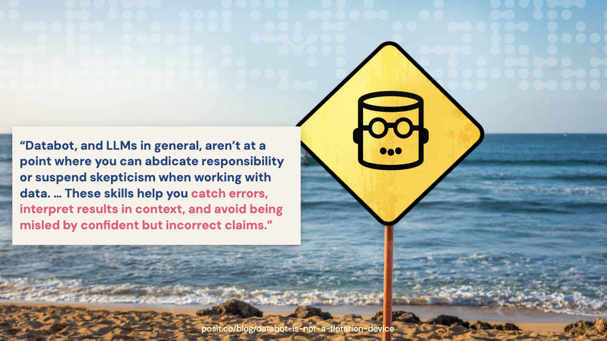

All of that is still true. We stand by it. It is also optimistic in a way. We
would love to always avoid being misled by confident but incorrect claims. But
we never said *how* this was supposed to happen. We assumed that if an expert
was there, they would catch the mistakes.

Adding a person does not guarantee a better result. Human--AI combinations do
not reliably outperform the better of the human or AI working
alone. Adding a person does not
automatically make everything better.

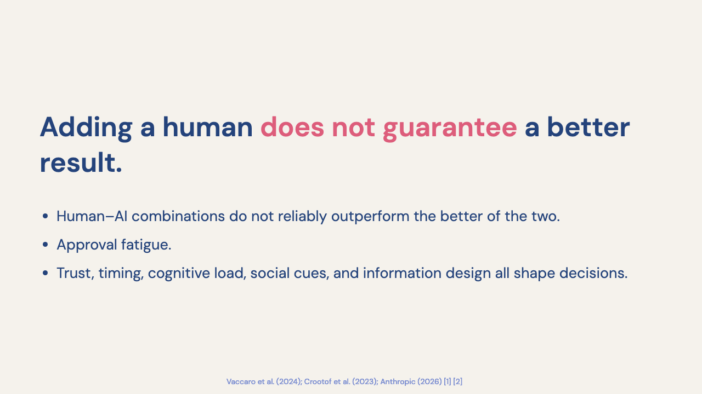

People also get tired of approving requests, and then they stop reading them.
Think about the last time your coding agent showed you a command to approve.
Did you carefully read it, or did you hit approve as quickly as possible and
feel annoyed that it even bothered to ask?

Human decision-making is not fixed. How much you trust the system, how much you
trust the people who built it, the timing of the information, your cognitive
load, and how much your coworkers trust the agent can all influence the
decision you make. Even if you are an expert who makes the right decision
outside an interaction with an agent, adding the agent might change that
decision.

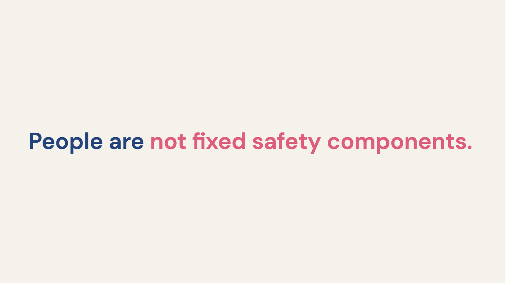

So how do we design the entire system to produce correct work? How do we build
trust and correctness into the agent itself, and design interactions with
users that actually support their expertise?

That maps onto two principles we returned to throughout the talk:

1.  Help the agent be correct.
2.  Make it less bad when the agent is wrong.

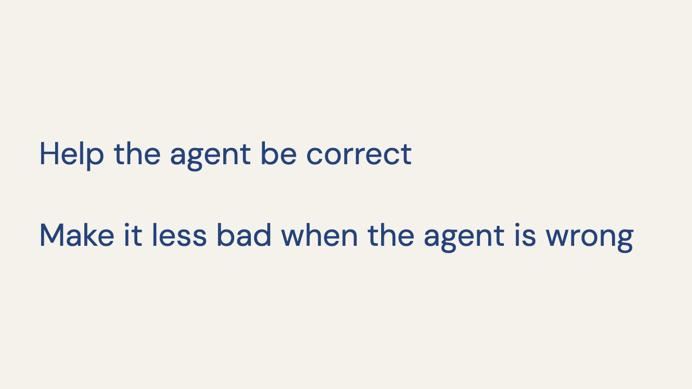

## Posit Assistant

**(Simon)**

[Posit Assistant](https://pos.it/assistant) is Posit's coding and data science
agent. It is available in RStudio, Positron, and the terminal. When it is
running inside an IDE, it works in the same R or Python session you're using.
You can use whatever model you want from whatever provider you have access to.

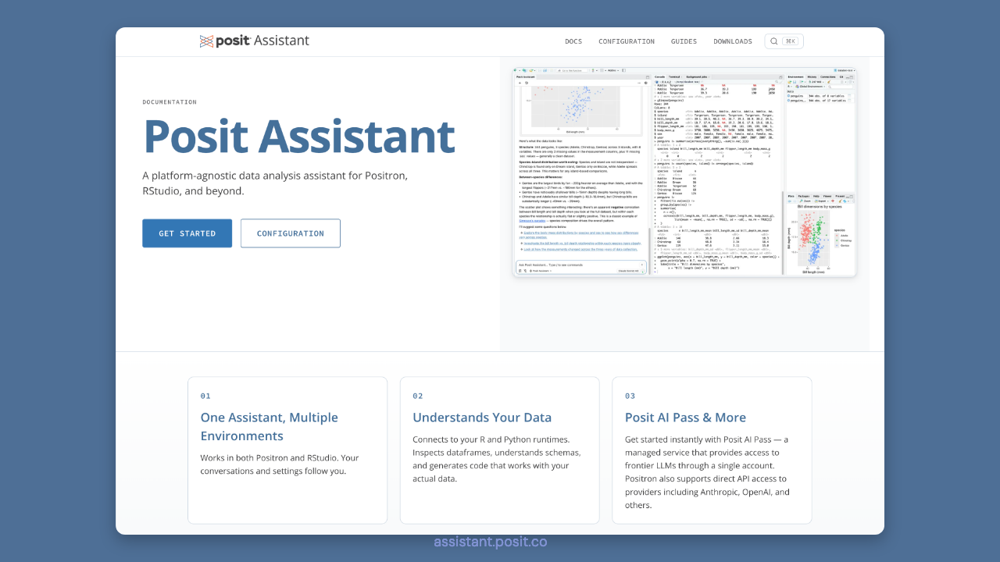

For the demo, I returned to one of my first experiences of seeing below the
surface with data science. In an introductory statistics class, I analyzed
flight data to understand whether I could book tickets that were less likely
to be delayed. I used ggplot2 and dplyr, pushing data frames around and
visualizing them.

I asked Posit Assistant to find an R package with Houston flight data and
retrieve data from the previous year. It found `anyflights`, read its
documentation, and generated the correct call.

<video class="column-page" loop muted playsinline controls preload="metadata" poster="images/slides/posit-assistant-web-fetch-start.png" aria-label="Posit Assistant searches for an R package that provides data about flights from Houston.">
<source src="videos/posit-assistant-web-fetch.mp4" type="video/mp4">
</video>

Next, I asked it to grab data from the same time the previous year. The agent read the package documentation and so was able to write the code with the right arguments the first time.

<video class="column-page" loop muted playsinline controls preload="metadata" poster="images/slides/posit-assistant-docs.png" aria-label="Posit Assistant reads the anyflights package documentation and writes code to retrieve Houston flight data.">
<source src="videos/posit-assistant-docs.mp4" type="video/mp4">
</video>

We have seen that many coding agents have a superficial relationship with data quality, and we wondered whether we could do better. Posit
Assistant proactively recommends cleaning the data and has a dedicated data-cleaning mode. It runs scratch code to look for
missing values, outliers, and similar issues. Once it finds them, it surfaces questions to the user in an interactive dialog.

<video class="column-page" loop muted playsinline controls preload="metadata" poster="images/slides/posit-assistant-clean-data.png" aria-label="Posit Assistant enters data-cleaning mode, asks the user about missing values and outliers, and records the decisions in a persistent cleaning script.">
<source src="videos/posit-assistant-clean-data.mp4" type="video/mp4">
</video>

In the demo, the agent found missing values in a relevant column, then found some flights with departure delays of multiple days. I chose to keep both:
Those outliers represented what really happened.

At the end of cleaning mode, the agent wrote a persistent file in the project
directory to ingest and clean the data. When someone revisits the analysis,
they can reproduce those steps.

Posit Assistant also shows plots inside the conversation. It is nice to be able to see them, but we
also think it is necessary: Our evaluations show that agents cannot reliably
interpret plots. When one carrier appeared unusually delayed, it checked the sample size
and found only 32 flights, suggesting that we should not read too much into the
pattern.

<video class="column-page" loop muted playsinline controls preload="metadata" poster="images/slides/posit-assistant-carriers.png" aria-label="Posit Assistant plots departure delays by carrier, checks the sample size behind an apparent anomaly, and finds that the carrier has only 32 flights.">
<source src="videos/posit-assistant-carriers.mp4" type="video/mp4">
</video>

Once the analysis was complete, I asked the agent to turn it into a persistent
Quarto report.

<video class="column-page" loop muted playsinline controls preload="metadata" poster="images/slides/posit-assistant-report.png" aria-label="Posit Assistant uses a specialized skill to turn the flight-delay analysis into a persistent Quarto report.">
<source src="videos/posit-assistant-report.mp4" type="video/mp4">
</video>

I have one more "little zoomy zoom": The entire conversation cost five cents.
The entire conversation cost five cents.
<video class="column-page" loop muted playsinline controls preload="metadata" poster="images/slides/posit-assistant-model-cost.png" aria-label="The Posit Assistant conversation displays the selected GLM 5.3 Flash model, token usage, and a total cost of five cents."><source src="videos/posit-assistant-model-cost.mp4" type="video/mp4"></video>

Part of our mission at Posit is to provide tools to people regardless of their
economic means.

Posit Assistant is designed to be
token-efficient and can use capable, inexpensive open-weight models such as GLM
5.3 Flash through Posit AI Pass. We spend a lot of time
watching the open-weights model space for models on the Pareto frontier:
capable of data analysis and orders of magnitude cheaper than frontier models.

Returning to the two principles, part of helping the agent be correct is, quite
literally, asking nicely. We say, "Pretty please pay attention to data
cleanliness. Pretty please be open to uncertainty when carrying out data
analysis."

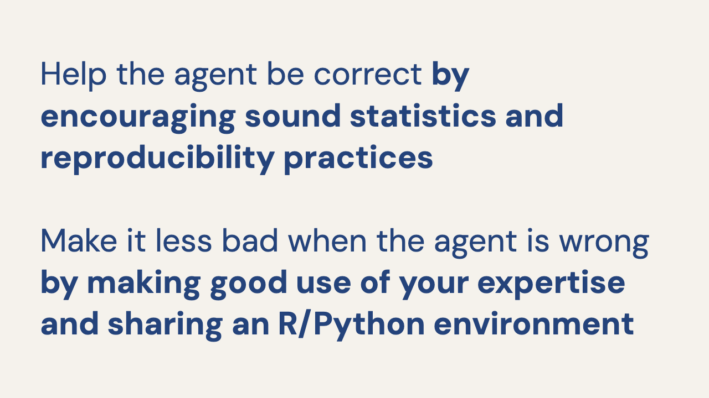

We also design interactions around the user's expertise: Cleaning mode asks
about the data-generating process, plots remain visible, and the user shares
the agent's R or Python session.

Posit Assistant assumes that the user is a data scientist, analyst, or someone
else who writes code and wants to work in an IDE, close to that code. But what
if the user is not a data scientist? How do we help them get correct answers,
too?

## Introducing commons

**(Sara)**

Let's return to our vibe-analyzing VP. I think it's easy to say, "They just
shouldn't be doing this kind of analysis." But let's be on their side for a
moment. They had a question, they wanted it answered, and so they're going to
reach for a tool that gives them an answer.

The problem is that they reached for the wrong tool and it gave them the wrong answer.

The data team already has vetted, maintained code that computes site traffic
correctly. We call this *trusted code*. Trusted code might live in a package, Shiny app,
Quarto document, report, or dashboard.

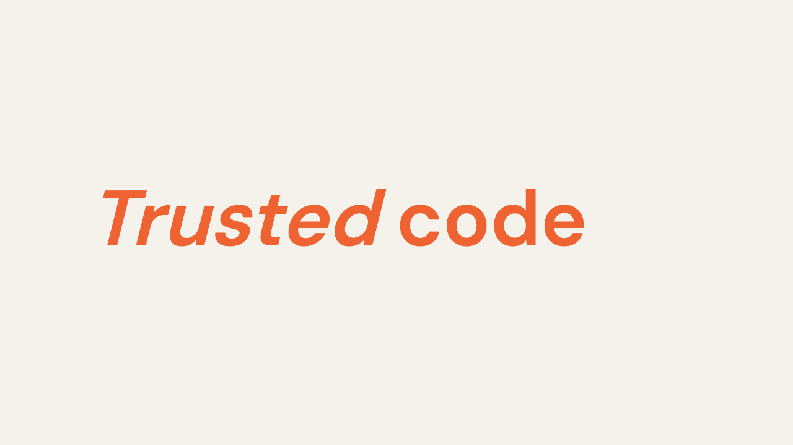

Instead of having the model write bespoke code from scratch every time someone
asks a question, what if it could use that trusted code?

This is one of the core ideas behind a new open-source package that we're
excited to share with you all today. It's called commons.

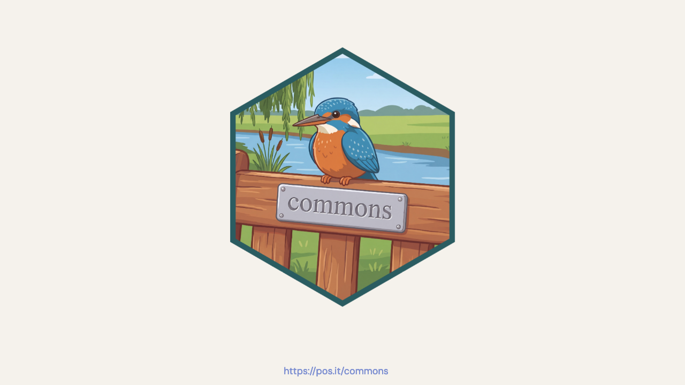

[commons](https://pos.it/commons) helps data scientists build trustworthy data
agents for their collaborators. It is an open-source R and Python package built
on the ellmer, chatlas, and shinychat stack.

## Building trustworthy data agents with commons

**(Simon)**

Here is how the VP's analysis works with a commons agent. When the VP asks,
"How is traffic trending for our site?" the first thing the agent does is
search for a trusted calculation. If it finds one that answers the question,
it invokes that calculation directly.

<video class="column-page" loop muted playsinline controls preload="metadata" poster="images/slides/commons-trusted-calculation-start.png" aria-label="A commons agent answers a site-traffic question by running a trusted calculation, displaying a chart showing a 22 percent increase, and marking the answer with a green shield.">
<source src="videos/commons-traffic-trend.mp4" type="video/mp4">
</video>

The calculation returns a plot and a green shield indicating that the answer
came from a trusted calculation. commons adds that marker deterministically;
the agent itself does not control it.

What makes coding agents so convenient is that they are everything tools. They
will write their own R, Python, or SQL code to answer a question. Trusted
calculations cannot cover every question, so commons has a fallback path.

When no trusted calculation exists, the agent can use context authored by the
data team. commons verifies any citation against that context before displaying
its blue citation marker.

<video class="column-page" loop muted playsinline controls preload="metadata" poster="images/slides/commons-cited-answer.png" aria-label="A commons agent charts declining page views, uses trusted context to explain the instrumentation change behind the decline, and displays a blue citation marker.">
<source src="videos/commons-page-views.mp4" type="video/mp4">
</video>

If there is neither a trusted calculation nor supporting context to cite, the agent
can write code, but commons displays a yellow warning so the user knows to treat
the answer cautiously.

<video class="column-page" loop muted playsinline controls preload="metadata" poster="images/slides/commons-lower-trust-answer.png" aria-label="A commons agent writes custom code to find the day with the most site visits, then marks the answer with a yellow warning because it did not use a trusted calculation or cite trusted context.">
<source src="videos/commons-most-visits.mp4" type="video/mp4">
</video>

Here's a diagram of the various ways the agent can come up with answers and how the trust relationships are mapped.

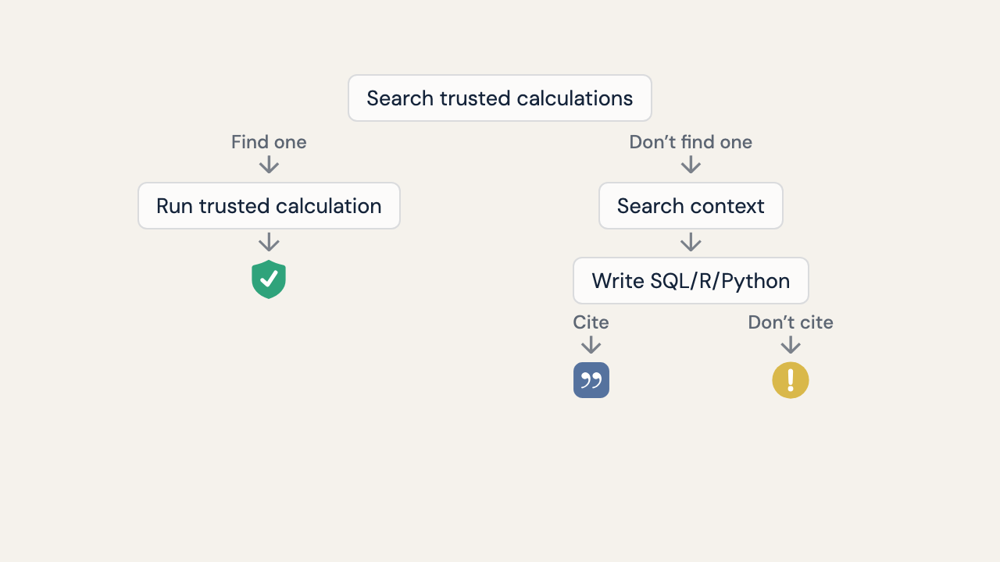

So far, we've been talking about the VP's experience with the commons agent. What is it like to work with
commons as a data scientist? There are three main loops: build, deploy, and improve.

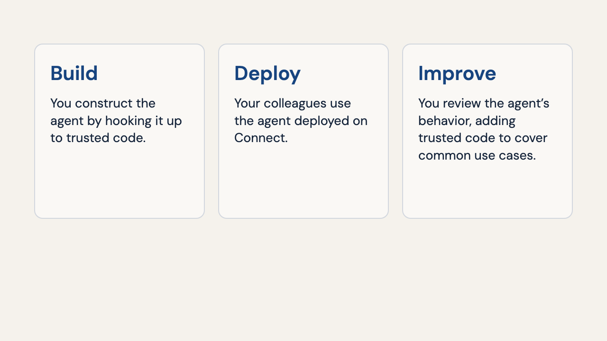

With data collection enabled, data scientists can review cases where the agent
had to write its own code. If those cases share a pattern, they can add trusted
code that moves future responses up the trust ladder, making the agent more
correct over time.

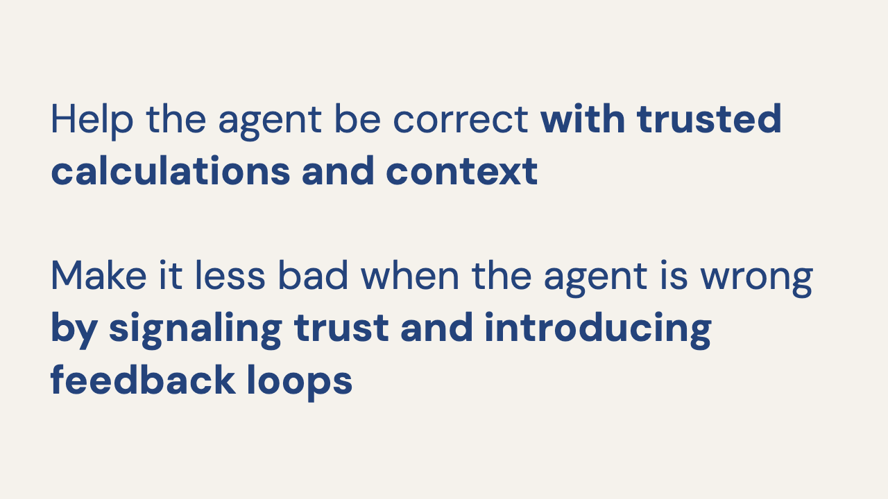

Returning to our two principles, commons helps the agent be correct by letting
it directly use trusted code. It makes mistakes less bad by telling the user
when the agent did not directly use trusted code, and by moving responses up
the trust ladder over time.

### Other use-cases for commons

**(Sara)**

The VP example is business intelligence, but commons is not only for BI or
vice presidents. It's for any data person who wants to build an agent that
gives correct answers to their collaborators.

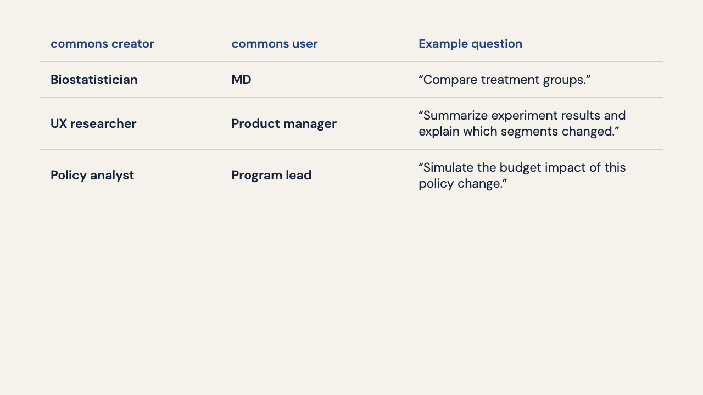

We've made a sample [clinical trials
agent](https://pos.it/clinical-trials-agent) to highlight this functionality.
Its data is simulated. The trusted code is a TLG catalog: code written and
trusted by data people to work on this type of data and produce correct
answers. You can ask it questions such as, "Plot Kaplan--Meier curves."

<video class="column-page" loop muted playsinline controls preload="metadata" poster="images/slides/clinical-trials-agent-demo.png" aria-label="A clinical trials agent runs a trusted calculation for the safety population and produces a Kaplan–Meier plot of serious adverse-event-free probability.">
<source src="videos/clinical-trials-agent-demo.mp4" type="video/mp4">
</video>

## It is still very bad to be wrong

**(Sara)**

It's now so easy to ask any kind of agent a question about your data and get a
wrong answer that looks completely plausible.

The problem is not just that the answer is wrong, and it's also not just that you might be unable to reproduce it or have no
idea how it arrived at the answer.

These are bad enough, but there's another problem. If we become accustomed to, say, 15% of our numbers
being wrong, we might lose trust in analysis itself and its ability to tell us things about the world, or become used to numbers just being a bit wrong all the time.

But correctness matters, especially in particular industries, and Posit has always
built tools to support correct analysis. We do not think that standard should
change just because AI is here.

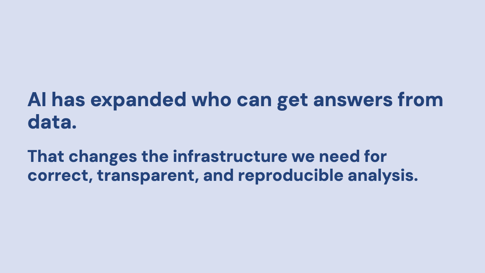

But AI has expanded who can get answers from data. Now anyone can ask a
question about their data. That changes how we need to think about the
infrastructure for building correct, transparent, and reproducible agents.

With commons, a data team establishes which code and calculations it trusts
and provides the organizational context the agent needs. The team can give that
agent to someone who might otherwise perform a vibe analysis. That person keeps
the convenience of asking questions in natural language, while the answers are
grounded in the data team's trusted work and can be traced and reproduced.

That is where data scientists and analysts come in. This infrastructure must be
built by people who understand the data, calculations, and organization.
commons helps them build it and make it available to others.

## Looking forward

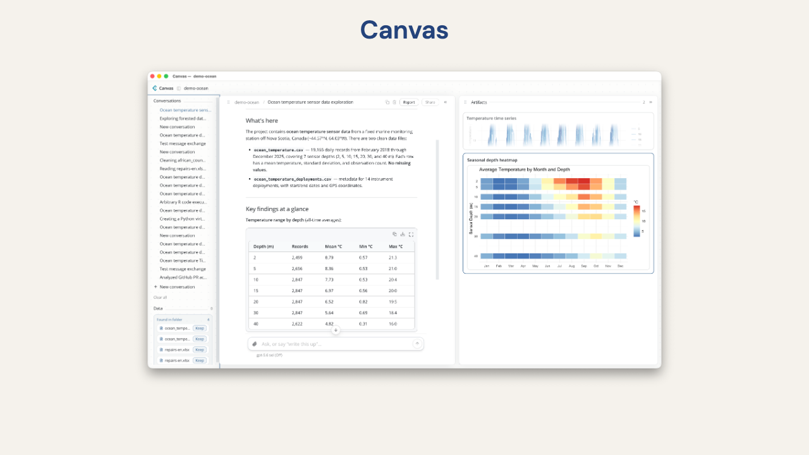

Looking forward, we have been experimenting with something called Canvas.

Canvas is a next-generation agent experience. It assumes that you might not
always want to look at the code. That does not mean the code is not there when
you need it, but you might not always want to work in an IDE.

This frees up real estate for expansive, new agent-collaboration interfaces.
Canvas feels a little aggressively agentic to us, in the way Databot felt a
year ago.

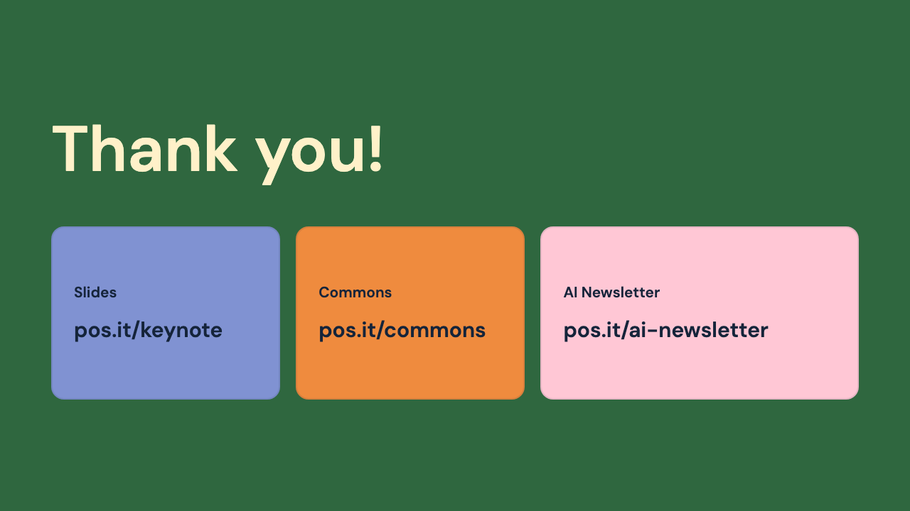

### Recent past newsletters

- [New releases from ellmer, shinychat, and commons](../../blog/2026-09-18_ai-newsletter/)
- [You probably don't want to fine-tune](../../blog/2026-09-04_ai-newsletter/)

<a href="/tags/ai-newsletter/index.xml" target="_blank" rel="noopener noreferrer" class="btn-shortcode inline-flex mb-5 mr-5 items-center px-4 py-3 text-sm leading-5 gap-2 rounded-lg bg-blue-400 !text-white font-semibold align-middle hover:bg-blue-500 transition no-underline">Subscribe via RSS</a>
