::: {.callout-tip}
## **Subscribe to the AI Newsletter!**

The AI newsletter is published as an RSS feed. Follow it in your favorite reader:

<a href="/tags/ai-newsletter/index.xml" target="_blank" rel="noopener noreferrer" class="btn-shortcode inline-flex mb-5 mr-5 items-center px-4 py-3 text-sm leading-5 gap-2 rounded-lg bg-blue-400 !text-white font-semibold align-middle hover:bg-blue-500 transition no-underline">Subscribe via RSS</a>

**Want the newsletter as an email?** Paste the feed URL, <https://opensource.posit.co/tags/ai-newsletter/index.xml>, into a free RSS-to-email service such as [Blogtrottr](https://blogtrottr.com/), [Feedrabbit](https://feedrabbit.com/), or [Follow.it](https://follow.it/), and each new issue will arrive in your inbox.
:::

At posit::conf(2026), we gave a keynote about what it takes to build data
analysis agents that are correct, transparent, and reproducible. This newsletter
is an annotated walkthrough of the talk. You can also [click through the full
slide deck](https://pos.it/keynote).

## Convenient answers are not always correct

Your VP has just opened up a coding agent and asks a reasonable question:

> How is traffic trending for our site?

The agent searches the workspace, queries a warehouse table, and returns a
polished chart. Daily visits, it says, are down 64% over the last 90 days.

{.column-page fig-alt="A chat interface shows the question “how is traffic trending for our site?” The agent answers that daily visits are down 64 percent and displays a sharply declining line chart."}

There are many questions a data person might ask before acting on that result.
How are visits defined? What event creates a row in the table? Did the
instrumentation change? Is this even the table the data team normally uses?

In our hypothetical, a page-view event stopped firing in newer versions of
Chrome. As more visitors updated their browsers, the table recorded fewer
visits. It was not the usual table the data team used to measure traffic,
anyway. But the VP did not know any of that. The answer looked convincing, so it
went to leadership and informed an expensive decision.

A month later, leadership asks to see the chart again. The original conversation
has expired and the analysis lived in a temporary directory that no longer
exists. The agent recreates the analysis, chooses a different table, and now
reports that traffic has been rising all along.

{.column-page fig-alt="A chat interface cannot find the earlier conversation or its files. After recreating the analysis with a different warehouse table, it reports that daily visits increased 22 percent and shows an upward-trending chart."}

This is a fictional story, but the pattern is not. It is becoming normal to
_vibe-analyze_ data: ask an agent a question, receive a plausible answer, and
move on without understanding how the answer was produced.

## The tension between correctness and convenience is not new

A couple weeks ago, Posit CTO Joe Cheng summarized the current moment this way:

{.column-page fig-alt="A cream-colored slide displays the quotation “In the battle between convenience and correctness, convenience is winning,” attributed to Joe Cheng, Posit CTO."}

Joe said this a few weeks ago, but he could have said it 7 years ago. In 2019, the
beverage company Conviviality disclosed that [a spreadsheet arithmetic error
had contributed £5.2 million to a £14 million forecasting
mistake](https://www.accountingweb.co.uk/business/management-accounting/convivialitys-spreadsheet-hell-sinks-the-business). Or he could have said it 20 years ago, when [a sign error in closed-source protein-modeling
software](https://www.science.org/doi/10.1126/science.314.5807.1856) sent
a research field down the wrong path, leading to five paper
retractions.

::: {.column-page layout-ncol=2}
{fig-alt="A news article about Conviviality reporting a spreadsheet arithmetic error that contributed 5.2 million pounds to a 14 million pound forecasting error."}

{fig-alt="A Science article titled 'Error prompts retractions' describing a sign error in protein-modeling software."}
:::

Data analysis has always faced threats to correctness. Posit's stance has never been that people must sacrifice convenience for correctness. When preparing for this talk, I found this quote in a blog post from [JJ Allaire announcing
RStudio](https://rstudioblog.wordpress.com/2011/02/28/rstudio-new-open-source-ide-for-r/):

{.column-page fig-alt="A cream-colored slide quotes JJ Allaire: “Our goal is to develop a powerful tool that supports trustworthy, high quality analysis. At the same time, we want RStudio to be as straightforward and intuitive as possible.”"}

Can we take the same stance toward AI? Can a data analysis agent be both correct
and convenient?

{.column-page fig-alt="Two overlapping circles, one blue and one orange, form a Venn diagram above the words 'Correct and convenient.'"}

## Why build AI tools at all?

In 2025, AI became very, very convenient. For us—and probably for many of
you—that made it the year we had to think seriously about correctness.

When we released Databot, our state-of-the-art exploratory data analysis agent,
we did so under what was essentially a warning label. The release post was one
of the first things Sara worked on after joining the AI team, and it gave her
the chance to do something she does particularly well: be a pessimist.

::: {.column-page layout-ncol=2}
{fig-alt="A split slide dated August 2025 shows an illustration of the Databot mascot wearing a bright orange flotation device."}

{fig-alt="A quotation from Joe Cheng says that Databot is both the most exciting software and the most dangerous software he has worked on in his 30-year career."}
:::

We were excited about Databot. Working with it could feel like flying through
data. We were also worried that people would trust its answers when it was
wrong, so we wrote an entire article explaining how it might fail. At the
previous posit::conf, Joe Cheng described it as both the most exciting and the
most dangerous software he had worked on in his 30-year career.

That raises a fair question: if AI is an agent of chaos that we are so worried
about, why involve ourselves at all?

There are many answers. We focused on one: exploration.

Before joining the AI team, Sara worked in data science education. Curiosity is
what brings many people to data science. It might be curiosity about a
scientific field, computers, statistics, or the tools themselves. But without
the right tools, data can be impenetrable.

{.column-page fig-alt="An aerial photograph shows pale blue ocean water meeting a sandy shoreline, with a small dark shape visible below the surface."}

As an undergraduate with some statistics and R knowledge, Sara felt like she
was looking at an ocean from above. She knew there was an incredible amount
beneath the surface, but she could not see it. Learning the tidyverse and data
science gave her a way to investigate. The tools enabled the curiosity.

{.column-page fig-alt="A split slide pairs the words 'The right tools let us see below the surface' with a photograph of rays swimming underwater."}

That same curiosity motivates our work now: curiosity about how LLMs work, how
to build around them to make them useful, and how to turn them into tools that
open new worlds of analysis. For us, AI is a continuation of our work to find
new ways to explore data.

{.column-page fig-alt="A cream-colored slide reads, 'AI is a continuation of our work to find new ways to explore data,' with 'continuation' and 'new ways to explore data' highlighted."}

## The models got better

We also wanted to spend some time on what had changed since the previous year:
the models got better.

Around a year ago, we ran an experiment to understand how well models interpret
plots. We showed them plots like this transformed diamonds dataset and asked
them to describe what they saw.

The model said there was a strong positive relationship between carat and
price. That sounds reasonable until you look at the plot: the relationship is
negative. We wanted to know whether models could correctly interpret plots that
contradicted their expectations.

{.column-page fig-alt="A scatterplot shows diamond price decreasing as carat increases. An overlaid model response incorrectly says there is a strong positive relationship, followed by the question of whether models can interpret plots that contradict their expectations."}

{.column-page fig-alt="A horizontal stacked bar chart titled “Models often report what they expect to see, not what’s plotted.” GPT-5, Gemini Pro 2.5, and Claude Sonnet 4.5 are mostly marked incorrect."}

We tried a range of interventions to improve the
[bluffbench](https://posit-dev.github.io/bluffbench/) scores, but none moved
them much. Then we waited six months.

{.column-page fig-alt="A horizontal stacked bar chart titled “Models got better at interpreting counterintuitive plots.” Recent thinking models have much larger correct segments than models evaluated in 2025."}

The newer results were much better. But that does not mean data science is
solved. Correct analysis still takes more than a good model and a dataset.

After that first experiment, we asked another question: can models spot
data-quality issues in visualizations? In
[bluffbench2](https://github.com/posit-dev/bluffbench2), we showed them plots
like the one below.

{.column-page fig-alt="A scatterplot of sleep hours against stress score has an overall negative trend. Within the cloud, a suspicious subset of points falls exactly along a straight line."}

One thing that caught our attention was the set of points through the middle of
the cloud that fell exactly on a straight line. That is something a data
scientist might want to investigate in the underlying data. We wanted to see
whether models would pick up on that kind of subtle visual artifact.

{.column-page fig-alt="A horizontal bar chart titled “Frontier models still struggle to notice subtle data quality issues.” Every evaluated model scores below 50 percent."}

Even frontier models did not do very well. The models had improved, but they had
not solved data science; they still failed at this task and others likely to
appear in data-science workflows.

There was also a second problem: data analysis depends on context that is not
in the data. All data is constructed, and it is often meaningless without its
context. That context might live in documentation, a data dictionary, a
semantic view, or in the mind of a coworker who has been at the organization
for 20 years and knows everything but has never written it down.

{.column-page fig-alt="A cream-colored slide reads, 'Data analysis depends on context that is not in the data,' with the word 'context' highlighted."}

That information is not necessarily impenetrable to an LLM, but it is not
contained in a bare dataset. Models are going to make mistakes. If we are going
to use AI for data analysis, the question becomes: how do we make AI-involved
analysis correct?

## “Slap a human on it” is not a correctness strategy

Here is a common thought about AI: it is untrustworthy but useful. To make it
trustworthy, we need people to verify the output from, or supervise, agents.
It is an intuitively appealing division of labor. The agent does what it is
good at, and the human provides the judgment that keeps it from going off the
rails.

{.column-page fig-alt="A diagram presents a common division of labor in which an AI system produces work and a human verifies or supervises it."}

{.column-page fig-alt="A cream-colored slide shows a roll of black repair tape, used as a metaphor for attaching a human reviewer to an AI system without designing the interaction."}

This sounds nice. It is tempting to use this pattern everywhere and call it a
day: the human is there to prevent mistakes, and all will be well. We call this
the _slap a human on it_ approach. We have not thought through what the human
will do or how they will do it, but we are glad they are there and hope for the
best.

This is not far from what we wrote about Databot a year earlier. We said that
users needed to remain skeptical and apply their expertise. All of that is
still true. We would love for users to catch errors, interpret results in
context, and avoid being misled by confident but incorrect claims.

{.column-page fig-alt="A quotation over a beach image says that people cannot abdicate responsibility or suspend skepticism when working with LLMs and that their expertise helps them catch errors and avoid confident but incorrect claims."}

But notice where that puts responsibility for correctness: on the user. Be
there. Remain vigilant. Apply your expertise. We did not say _how_.

Simply adding a person does not guarantee a better outcome. [Human–AI
combinations do not reliably outperform the better of the human or AI working
alone](https://doi.org/10.1038/s41562-024-02024-1). This does not mean every
human–AI team is worse. It means that adding a human does not automatically
produce a better system.

{.column-page fig-alt="A slide reads, 'Adding a human does not guarantee a better result,' followed by points about human-AI performance, approval fatigue, trust, timing, cognitive load, social cues, and information design."}

People get tired of approving things. Think about your own coding agent: when
it asks you to approve a command, how often do you read it carefully, and how
often do you just click accept? Trust, timing, cognitive load, social cues, the
interface, and the amount of information all affect how someone decides whether
code or an action is correct or safe.

People are not fixed safety components. We cannot simply slot them in whenever
we are worried that an agent system might be wrong. That does not mean they
should not be there. It means we need to go further and ask how to design the
interaction—and the entire system—so human expertise can actually support
correctness.

That maps onto two principles we returned to throughout the rest of the talk:

1. Help the agent be correct.
2. Make it less bad when the agent is wrong.

::: {.column-page layout-ncol=2}
{fig-alt="A cream-colored slide reads, 'People are not fixed safety components,' with the final phrase highlighted."}

{fig-alt="A cream-colored slide reads, 'Help the agent be correct' and 'Make it less bad when the agent is wrong.'"}
:::

## Posit Assistant: collaborate in the same environment

[Posit Assistant](https://pos.it/assistant) is Posit’s coding and data science
agent. It is available in RStudio, Positron, and the terminal. Inside an IDE,
it works in the active R or Python session, and you can use a model from the
provider of your choice.

{.column-page fig-alt="A blue slide displays the Posit Assistant wordmark and orange circular logo."}

For the demo, Simon returned to one of his first experiences of seeing below the
surface with data science. He had been asked to use R to understand what affects
flight delays. He loaded some data, then used dplyr and ggplot2 to see whether
he could make decisions that would give his flight a better chance of leaving
on time.

In Positron, with Posit Assistant on the left and a live R session, he began by
asking about R packages that could retrieve flight data. The agent could do the
usual coding-agent work.

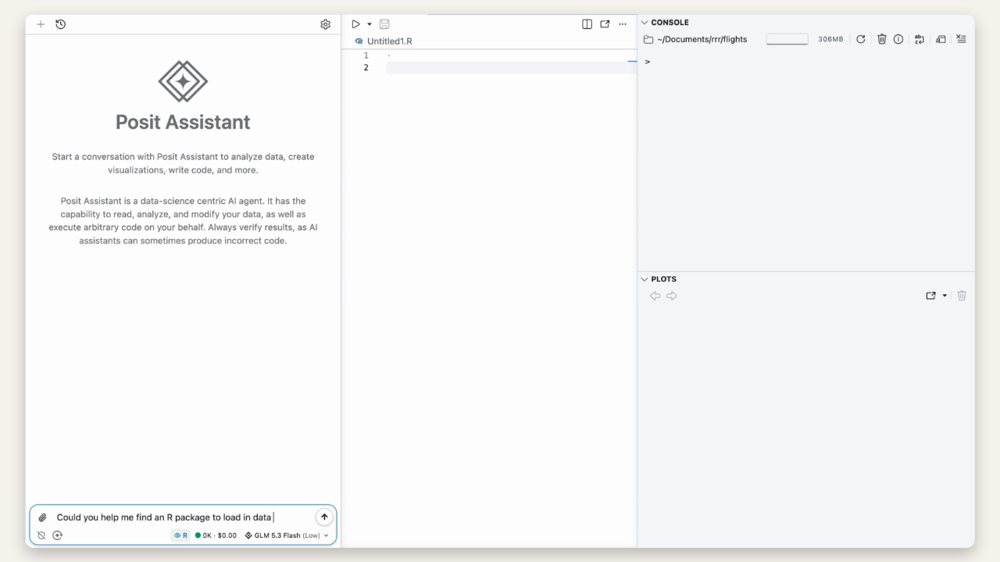{.column-page fig-alt="A Positron window shows Posit Assistant alongside a live R session at the beginning of a flight-delay analysis."}

It could also read documentation, just as the user could. One detail we called
out was that the agent preferred to keep the downloaded data in the file system
rather than in a temporary location.

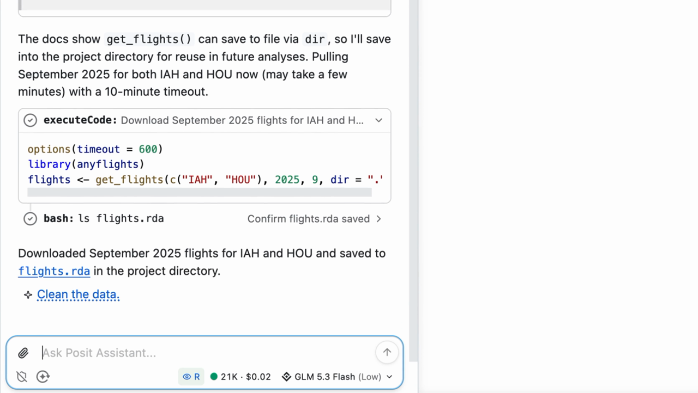{.column-page fig-alt="A Posit Assistant demo shows the agent reading documentation and working with flight data in the project."}

We built a cleaning mode because most coding agents seemed to have a
superficial relationship with data quality. In this mode, the agent pays
attention to missing data, outliers, and other issues. It asks the user about
decisions that affect interpretation and persists the result as a cleaning
script.

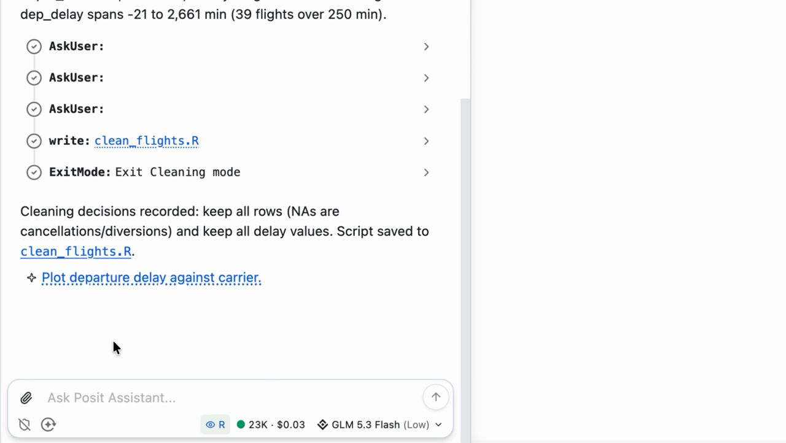{.column-page fig-alt="A Posit Assistant conversation shows several questions to the user, writes clean_flights.R, exits cleaning mode, and explains which cleaning decisions were recorded."}

The user could see the plots, too. When one carrier appeared to have much worse
delays, the agent showed restraint in interpreting the anomaly. It checked the
sample size first and found only 32 flights, making noise a plausible
explanation.

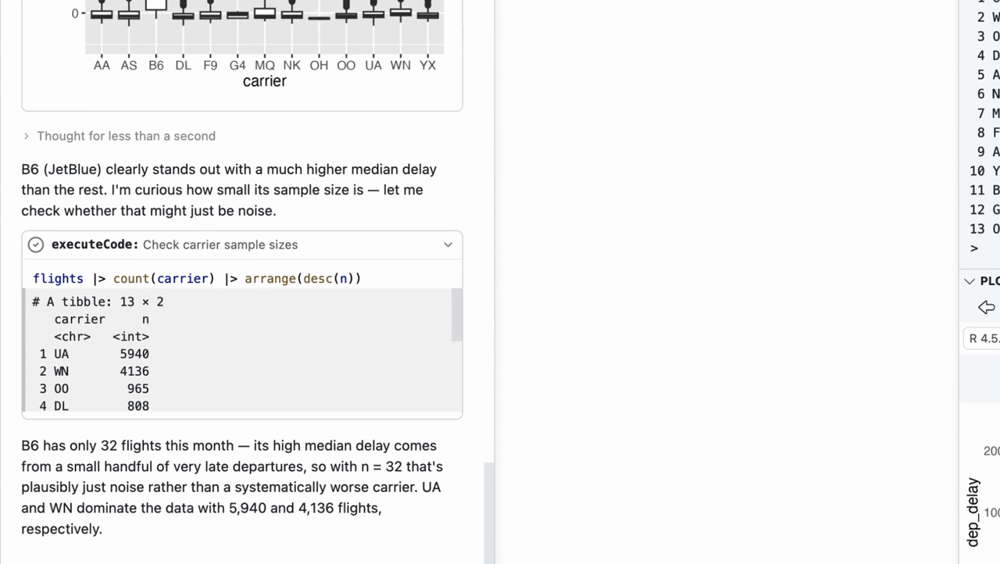{.column-page fig-alt="A Posit Assistant analysis shows a carrier-delay plot, notes that one carrier appears unusual, checks carrier sample sizes with R code, and concludes that the pattern may be noise because the carrier has only 32 flights."}

Posit Assistant also has specialized slash commands and can write Quarto
reports, so the analysis can leave the conversation and become a persistent,
reproducible artifact.

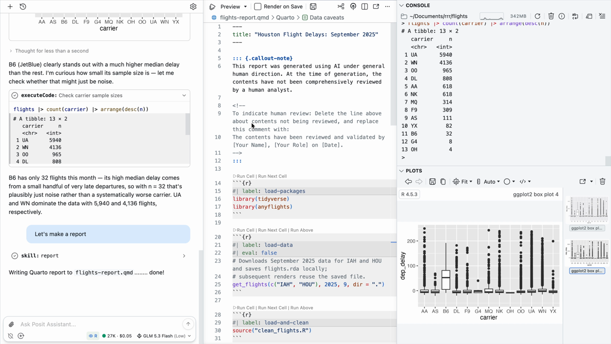{.column-page fig-alt="A Posit Assistant demo shows the agent creating a Quarto report from the flight-delay analysis."}

At the end of the demo, the entire conversation had cost five cents. AI
inference is expensive, so totally free usage is not possible. But part of our
mission is to provide strong tools regardless of economic means. Posit
Assistant is token efficient, and we have worked to serve inexpensive,
capable open-weight models with strong privacy guarantees through Posit AI
Pass. In this demo, GLM 5.3 Flash cost less than one-thirtieth as much per token
as Claude Opus 5 and was served under Zero Data Retention.

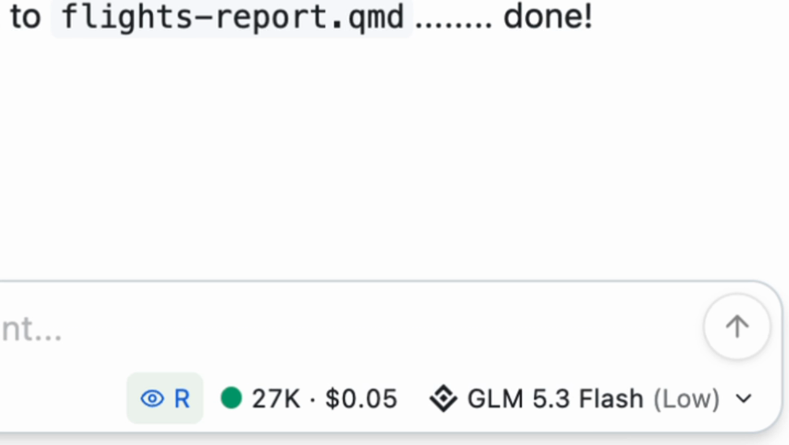{.column-page fig-alt="The bottom of the Posit Assistant conversation shows the selected GLM 5.3 Flash model, token usage, and the total cost of the demo."}

Returning to the two principles, some of helping the agent be correct is, quite
literally, asking nicely. Posit Assistant's instructions tell it to approach
analysis with openness to uncertainty, work in persistent files, and take data
cleanliness seriously.

Other elements create a richer collaboration between the agent and the user.
Cleaning mode involves the user in decisions that affect interpretation. We
show plots because bluffbench demonstrates that models cannot always be trusted
to interpret them. The user and agent share the same computational environment
so that, when something goes wrong, they can quickly get on the same page.

{.column-page fig-alt="A slide says to help the agent be correct by encouraging sound statistics and reproducibility practices, and make errors less bad by using the user's expertise and sharing an R or Python environment."}

Posit Assistant assumes that the user is a data scientist who wants to work in
an IDE. But what if the user is not a data scientist? How do we help them get
correct answers, too?

## commons: connect natural-language questions to trusted work

Return to our vibe-analyzing VP. They were curious, too. They had a question and
reached for the tool that was accessible to them. Unfortunately, the answer was
wrong.

The data scientists had code they regularly used to analyze site traffic. They
vetted and maintained it, and relied on it to give them the right answers. We
call this _trusted code_. Teams may already have trusted code in Shiny apps, R
and Python packages, and Quarto documents.

Instead of having the model write code from scratch each time it answers a
question, what if it could discover and use that trusted code?

::: {.column-page layout-ncol=2}
{fig-alt="A cream-colored slide displays the words 'Trusted code,' with 'Trusted' highlighted in orange."}

{fig-alt="A blue slide displays the orange commons bird logo and a link to pos.it/commons."}
:::

[commons](https://pos.it/commons) helps data scientists build trustworthy data
agents for their collaborators. It is an open-source R and Python package built
on ellmer or chatlas and shinychat, and it works with models from different
providers.

Here is how the VP's analysis works with a commons agent. The first thing the
agent does is search for a trusted calculation. In this case, it finds and runs
the data scientist's site-traffic calculation. The answer is marked as verified
to show that it used vetted code.

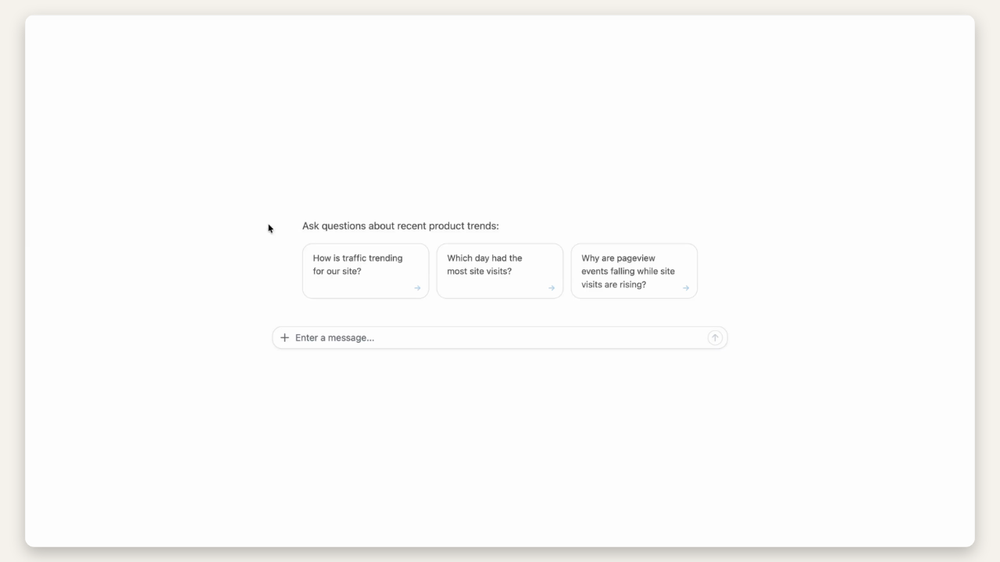{.column-page fig-alt="A chat application answers a site-traffic question and shows that it is searching for a trusted calculation maintained by the data team."}

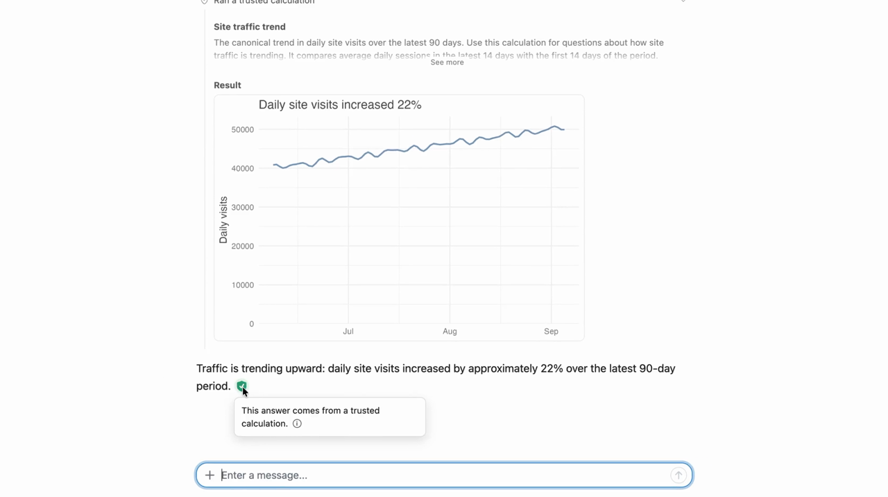{.column-page fig-alt="A commons conversation runs a trusted calculation, charts a 22 percent increase in daily site visits, and displays a green marker explaining that the answer comes from a trusted calculation."}

Trusted calculations are unlikely to cover every question. In those cases, the
agent can write custom R, Python, or SQL. It first searches additional context:
data dictionaries, Markdown files, and existing context layers from platforms
such as Databricks and Snowflake. It then writes the code needed to answer the
question.

When the agent presents its answer, it can cite that context. The citation is
checked deterministically against trusted context that appeared in the
conversation. If it matches, the citation marker is shown.

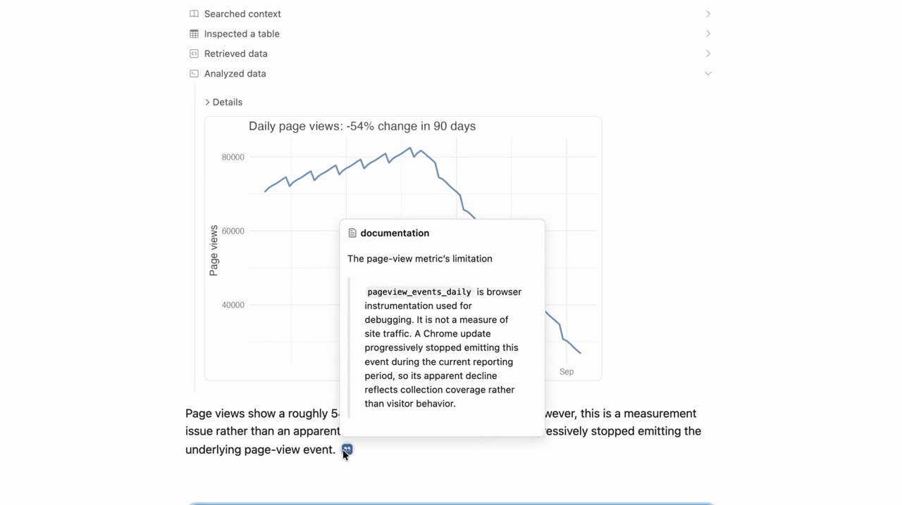{.column-page fig-alt="A commons answer charts declining page views and explains that a Chrome update stopped emitting the event. An open citation popover shows the trusted documentation supporting that explanation."}

There is one more path: the model cannot find trusted context that justifies
its approach. In that case, commons shows a yellow marker telling the user that
the answer should be considered less trusted.

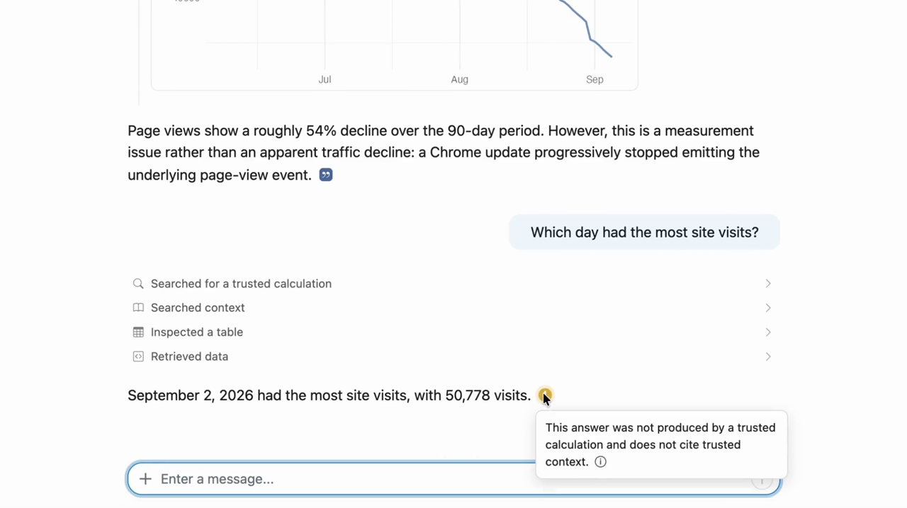{.column-page fig-alt="A commons answer identifies the date with the most visits and displays a yellow marker. Its popover explains that the answer was not produced by a trusted calculation and does not cite trusted context."}

This is how we chose to balance convenience and correctness. The tool needs to
feel convenient enough that someone will actually use it—basically, it should
feel like a normal chat. When the likely correctness is similar to an ordinary
coding agent, commons signals that the user should be more skeptical.

{.column-page fig-alt="A flow diagram shows commons first searching trusted calculations. A found calculation leads to a verified marker. Otherwise the agent searches context and writes SQL, R, or Python, leading to either a citation marker or a lower-trust warning."}

commons records which tools produced an answer. Trust is based on that
execution path, not on the model's confidence in its own answer. The citation
itself is checked against trusted context. A custom answer is not promoted
merely because the model claims that it used a trusted source.

So far, that describes the VP's experience. From a data scientist's
perspective, working with commons involves three loops:

1. **Build:** Point the commons agent to trusted code in Shiny apps, R and
   Python packages, Quarto documents, or semantic layers in Snowflake and
   Databricks. You do not define the system prompt or tool definitions; commons
   ships with its own harness.
2. **Deploy:** Deploy the app to Posit Connect like any other Shiny app. The
   agent runs R and Python code in a sandbox so it can be safely deployed.
3. **Improve:** Review the agent's behavior and update its trusted layers. With
   the Connect release available at the time of the keynote, teams that opted
   in with their administrator could store conversation histories through a
   native OpenTelemetry integration. Those histories reveal common questions
   for which the agent improvises, pointing back to trusted code that should be
   added during the next build cycle.

{.column-page fig-alt="Three cards describe the commons lifecycle: build by connecting the agent to trusted code, deploy it for colleagues on Connect, and improve it by reviewing behavior and covering common use cases."}

{.column-page fig-alt="A slide says to help the agent be correct with trusted calculations and context, and make errors less bad by signaling trust and introducing feedback loops."}

Returning to our two principles, commons helps the agent be correct with
trusted calculations and context. It makes mistakes less bad by signaling trust
and introducing feedback loops.

The VP example is business intelligence, but commons is not only for BI. It is
for data scientists and analysts who work with people who want trustworthy
answers from data, including cases where correctness matters deeply or the
underlying calculation is complex.

{.column-page fig-alt="A table pairs a biostatistician with a physician comparing treatment groups, a UX researcher with a product manager summarizing experiment results, and a policy analyst with a program lead simulating a policy's budget impact."}

The talk included a [clinical trials
agent](https://pos.it/clinical-trials-agent) as one example of this pattern in a
domain where correctness matters and the analysis may be complex.

::: {.column-page layout-ncol=2}
{fig-alt="A blue section slide reads 'Clinical trials agent' beside an orange medical-style logo."}

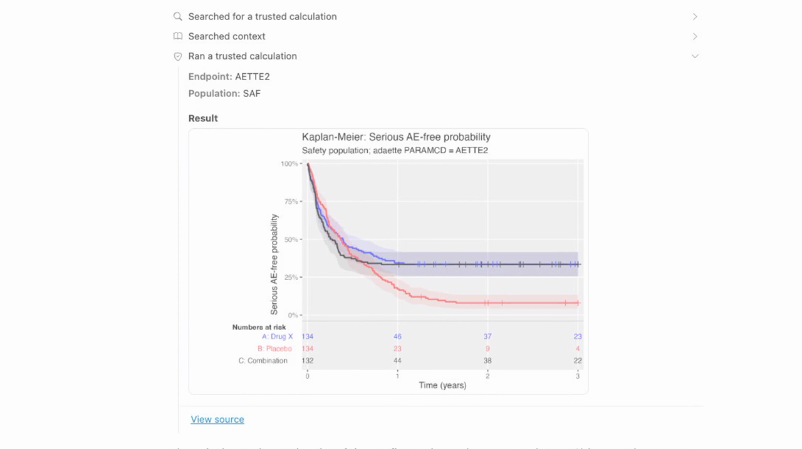{fig-alt="A clinical trials agent runs a trusted calculation for the safety population and produces a Kaplan–Meier plot of serious adverse-event-free probability."}
:::

## It is still very bad to be wrong

{.column-page fig-alt="A blue slide reads “It’s (still) very bad to be wrong” in large cream-colored text."}

“It’s (still) very bad to be wrong” was actually a prototype title about three
versions of the talk ago.

It is now incredibly easy to ask an agent a question about data and get a wrong
answer that looks completely plausible. The problem is not only that the answer
is wrong. We may also be unable to tell how it was calculated or reproduce it.

If those answers are fast and convenient enough, we may begin to tolerate that
loss of correctness and trust as the price of using AI. We do not think the
standard should change simply because the interface has changed.

Posit has always built tools to support correct analysis. Correct answers—and
answers whose methodology we can see and reproduce—are still important.

{.column-page fig-alt="A blue slide reads, 'AI has expanded who can get answers from data. That changes the infrastructure we need for correct, transparent, and reproducible analysis.'"}

This is the part we find motivating. AI has expanded who can ask questions
about data and get answers directly. That changes the infrastructure needed
around those answers.

With commons, a data team establishes which code and calculations it trusts and
provides the organizational context the agent needs. The team can then give
that agent to someone who might otherwise perform a vibe analysis. That person
keeps the convenience of asking questions in natural language, but the answers
are grounded in the data team's trusted work and can be traced and reproduced.

That is where data scientists and analysts come in. This infrastructure has to
be built by people who understand the data, calculations, and organization.
commons is the package that helps them build it and make it available to
others.

## Looking forward

In 2025, Databot felt like we were pushing the frontier. We have since been
experimenting with Canvas, a next-generation agent experience.

Canvas assumes that the user will not usually look at the code. That frees
space—and design possibilities—for more expansive ways of collaborating with an
agent. It feels aggressive in the way Databot felt to us a year earlier.

{.column-page fig-alt="A Canvas application displays a polished data-analysis workspace with an agent conversation, visual results, and interactive controls arranged across a large visual canvas."}

## Recent past newsletters

- [New releases from ellmer, shinychat, and commons](/blog/2026-09-18_ai-newsletter/)
- [You probably don't want to fine-tune](/blog/2026-09-04_ai-newsletter/)

<a href="/tags/ai-newsletter/index.xml" target="_blank" rel="noopener noreferrer" class="btn-shortcode inline-flex mb-5 mr-5 items-center px-4 py-3 text-sm leading-5 gap-2 rounded-lg bg-blue-400 !text-white font-semibold align-middle hover:bg-blue-500 transition no-underline">Subscribe via RSS</a>
