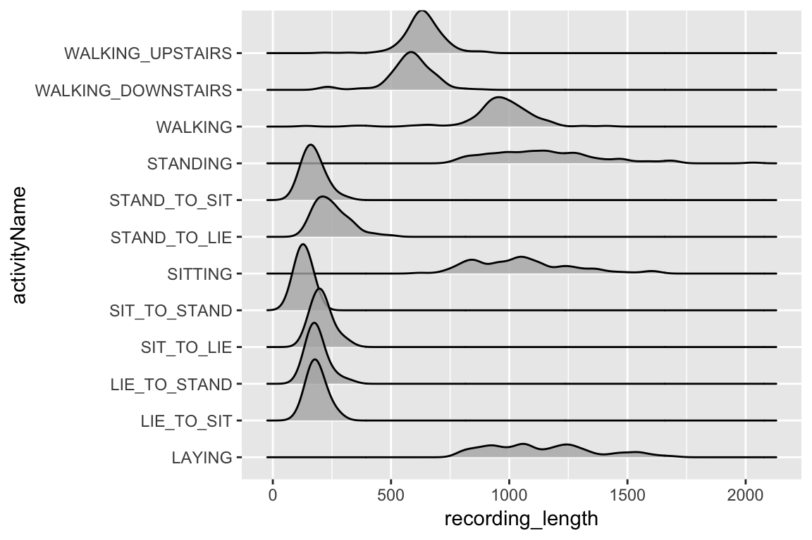
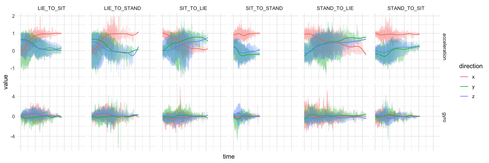
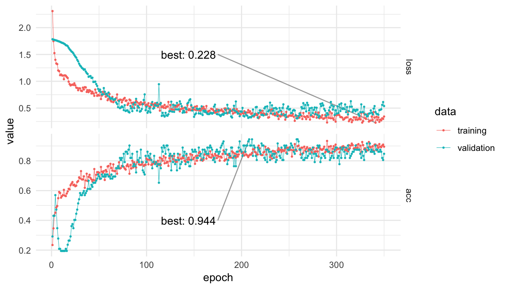
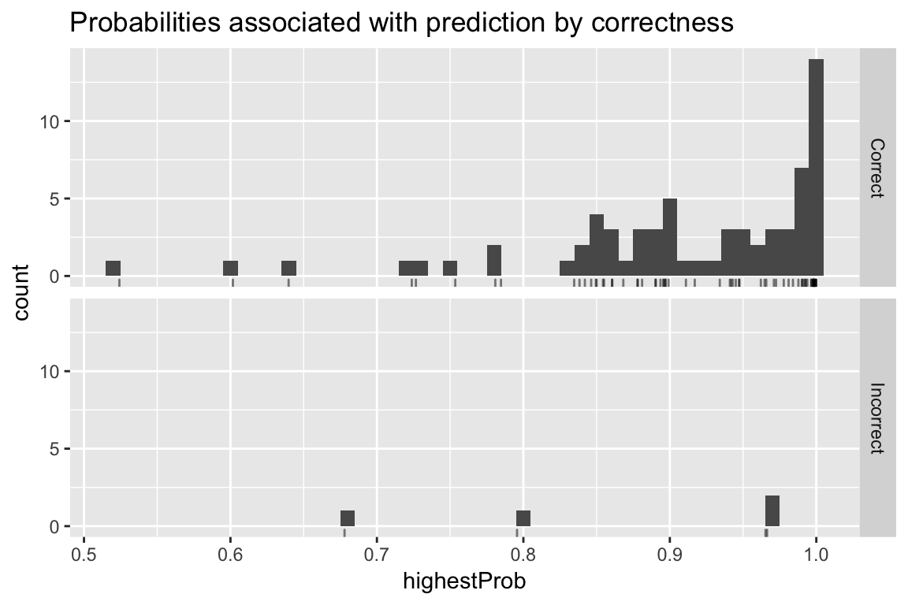
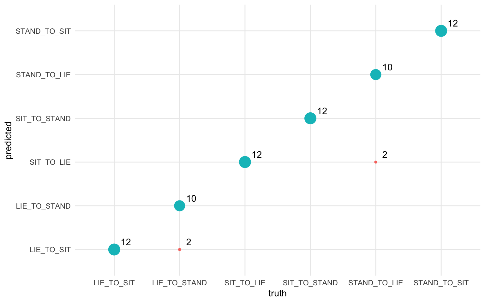

## Introduction

In this post we'll describe how to use smartphone accelerometer and gyroscope data to predict the physical activities of the individuals carrying the phones. The data used in this post comes from the [Smartphone-Based Recognition of Human Activities and Postural Transitions Data Set](http://archive.ics.uci.edu/ml/datasets/Smartphone-Based+Recognition+of+Human+Activities+and+Postural+Transitions) distributed by the University of California, Irvine. Thirty individuals were tasked with performing various basic activities with an attached smartphone recording movement using an accelerometer and gyroscope.

Before we begin, let's load the various libraries that we'll use in the analysis:

```r
library(keras)     # Neural Networks
library(tidyverse) # Data cleaning / Visualization
library(knitr)     # Table printing
library(rmarkdown) # Misc. output utilities 
library(ggridges)  # Visualization
```

## Activities dataset

The data used in this post come from the [@dataSource] distributed by the University of California, Irvine.

Throughout this post, `data/` is the directory created by downloading and unzipping this dataset.

When downloaded from the link above, the data contains two different 'parts.' One that has been pre-processed using various feature extraction techniques such as fast-fourier transform, and another `RawData` section that simply supplies the raw X,Y,Z directions of an accelerometer and gyroscope. None of the standard noise filtering or feature extraction used in accelerometer data has been applied. This is the data set we will use.

The motivation for working with the raw data in this post is to aid the transition of the code/concepts to time series data in less well-characterized domains. While a more accurate model could be made by utilizing the filtered/cleaned data provided, the filtering and transformation can vary greatly from task to task; requiring lots of manual effort and domain knowledge. One of the beautiful things about deep learning is the feature extraction is learned from the data, not outside knowledge.

### Activity labels

The data has integer encodings for the activities which, while not important to the model itself, are helpful for use to see. Let's load them first.

```r

activityLabels <- read.table("data/activity_labels.txt", 
                             col.names = c("number", "label")) 

activityLabels %>% kable(align = c("c", "l"))
```

```
   number  label
  -------- --------------------
     1     WALKING
     2     WALKING_UPSTAIRS
     3     WALKING_DOWNSTAIRS
     4     SITTING
     5     STANDING
     6     LAYING
     7     STAND_TO_SIT
     8     SIT_TO_STAND
     9     SIT_TO_LIE
     10    LIE_TO_SIT
     11    STAND_TO_LIE
     12    LIE_TO_STAND
```

Next, we load in the labels key for the `RawData`. This file is a list of all of the observations, or individual activity recordings, contained in the data set. The key for the columns is taken from the data `README.txt`.

```
    Column 1: experiment number ID, 
    Column 2: user number ID, 
    Column 3: activity number ID 
    Column 4: Label start point 
    Column 5: Label end point 
```

The start and end points are in number of signal log samples (recorded at 50hz).

Let's take a look at the first 50 rows:

```r

labels <- read.table(
  "data/RawData/labels.txt",
  col.names = c("experiment", "userId", "activity", "startPos", "endPos")
)

labels %>% 
  head(50) %>% 
  paged_table()
```

### File names

Next, let's look at the actual files of the user data provided to us in `RawData/`

```r

dataFiles <- list.files("data/RawData")
dataFiles %>% head()
```

```
    [1] "acc_exp01_user01.txt" "acc_exp02_user01.txt"
    [3] "acc_exp03_user02.txt" "acc_exp04_user02.txt"
    [5] "acc_exp05_user03.txt" "acc_exp06_user03.txt"
```

There is a three-part file naming scheme. The first part is the type of data the file contains: either `acc` for accelerometer or `gyro` for gyroscope. Next is the experiment number, and last is the user Id for the recording. Let's load these into a dataframe for ease of use later.

```r

fileInfo <- data_frame(
  filePath = dataFiles
) %>%
  filter(filePath != "labels.txt") %>% 
  separate(filePath, sep = '_', 
           into = c("type", "experiment", "userId"), 
           remove = FALSE) %>% 
  mutate(
    experiment = str_remove(experiment, "exp"),
    userId = str_remove_all(userId, "user|\\.txt")
  ) %>% 
  spread(type, filePath)

fileInfo %>% head() %>% kable()
```

```
  experiment   userId   acc                    gyro
  ------------ -------- ---------------------- -----------------------
  01           01       acc_exp01_user01.txt   gyro_exp01_user01.txt
  02           01       acc_exp02_user01.txt   gyro_exp02_user01.txt
  03           02       acc_exp03_user02.txt   gyro_exp03_user02.txt
  04           02       acc_exp04_user02.txt   gyro_exp04_user02.txt
  05           03       acc_exp05_user03.txt   gyro_exp05_user03.txt
  06           03       acc_exp06_user03.txt   gyro_exp06_user03.txt
```

### Reading and gathering data

Before we can do anything with the data provided we need to get it into a model-friendly format. This means we want to have a list of observations, their class (or activity label), and the data corresponding to the recording.

To obtain this we will scan through each of the recording files present in `dataFiles`, look up what observations are contained in the recording, extract those recordings and return everything to an easy to model with dataframe.

```r

# Read contents of single file to a dataframe with accelerometer and gyro data.
readInData <- function(experiment, userId){
  genFilePath = function(type) {
    paste0("data/RawData/", type, "_exp",experiment, "_user", userId, ".txt")
  }  
  
  bind_cols(
    read.table(genFilePath("acc"), col.names = c("a_x", "a_y", "a_z")),
    read.table(genFilePath("gyro"), col.names = c("g_x", "g_y", "g_z"))
  )
}

# Function to read a given file and get the observations contained along
# with their classes.

loadFileData <- function(curExperiment, curUserId) {
  
  # load sensor data from file into dataframe
  allData <- readInData(curExperiment, curUserId)

  extractObservation <- function(startPos, endPos){
    allData[startPos:endPos,]
  }
  
  # get observation locations in this file from labels dataframe
  dataLabels <- labels %>% 
    filter(userId == as.integer(curUserId), 
           experiment == as.integer(curExperiment))
  

  # extract observations as dataframes and save as a column in dataframe.
  dataLabels %>% 
    mutate(
      data = map2(startPos, endPos, extractObservation)
    ) %>% 
    select(-startPos, -endPos)
}

# scan through all experiment and userId combos and gather data into a dataframe. 
allObservations <- map2_df(fileInfo$experiment, fileInfo$userId, loadFileData) %>% 
  right_join(activityLabels, by = c("activity" = "number")) %>% 
  rename(activityName = label)

# cache work. 
write_rds(allObservations, "allObservations.rds")
allObservations %>% dim()
```

```
    [1] 1214    5
```

## Exploring the data

Now that we have all the data loaded along with the `experiment`, `userId`, and `activity` labels, we can explore the data set.

### Length of recordings

Let's first look at the length of the recordings by activity.

```r

allObservations %>% 
  mutate(recording_length = map_int(data,nrow)) %>% 
  ggplot(aes(x = recording_length, y = activityName)) +
  geom_density_ridges(alpha = 0.8)
```

{width="576"}

The fact there is such a difference in length of recording between the different activity types requires us to be a bit careful with how we proceed. If we train the model on every class at once we are going to have to pad all the observations to the length of the longest, which would leave a large majority of the observations with a huge proportion of their data being just padding-zeros. Because of this, we will fit our model to just the largest 'group' of observations length activities, these include `STAND_TO_SIT`, `STAND_TO_LIE`, `SIT_TO_STAND`, `SIT_TO_LIE`, `LIE_TO_STAND`, and `LIE_TO_SIT`.

It is notable that the activities that we have selected here are all 'transitions.' So in a way we are creating a change-point detection algorithm.

An interesting future direction would be attempting to use another architecture such as an RNN that can handle variable length inputs and training it on all the data. However, you would run the risk of the model learning simply that if the observation is long it is most likely one of the four longest classes which would not generalize to a scenario where you were running this model on a real-time-stream of data.

### Filtering activities

Based on our work from above, let's subset the data to just be of the activities of interest.

```r

desiredActivities <- c(
  "STAND_TO_SIT", "SIT_TO_STAND", "SIT_TO_LIE", 
  "LIE_TO_SIT", "STAND_TO_LIE", "LIE_TO_STAND"  
)

filteredObservations <- allObservations %>% 
  filter(activityName %in% desiredActivities) %>% 
  mutate(observationId = 1:n())

filteredObservations %>% paged_table()
```

So after our aggressive pruning of the data we will have a respectable amount of data left upon which our model can learn.

### Training/testing split

Before we go any further into exploring the data for our model, in an attempt to be as fair as possible with our performance measures, we need to split the data into a train and test set. Since each user performed all activities just once (with the exception of one who only did 10 of the 12 activities) by splitting on `userId` we will ensure that our model sees new people exclusively when we test it.

```r

# get all users
userIds <- allObservations$userId %>% unique()

# randomly choose 24 (80% of 30 individuals) for training
set.seed(42) # seed for reproducibility
trainIds <- sample(userIds, size = 24)

# set the rest of the users to the testing set
testIds <- setdiff(userIds,trainIds)

# filter data. 
trainData <- filteredObservations %>% 
  filter(userId %in% trainIds)

testData <- filteredObservations %>% 
  filter(userId %in% testIds)
```

### Visualizing activities

Now that we have trimmed our data by removing activities and splitting off a test set, we can actually visualize the data for each class to see if there's any immediately discernible shape that our model may be able to pick up on.

First let's unpack our data from its dataframe of one-row-per-observation to a tidy version of all the observations.

```r

unpackedObs <- 1:nrow(trainData) %>% 
  map_df(function(rowNum){
    dataRow <- trainData[rowNum, ]
    dataRow$data[[1]] %>% 
      mutate(
        activityName = dataRow$activityName, 
        observationId = dataRow$observationId,
        time = 1:n() )
  }) %>% 
  gather(reading, value, -time, -activityName, -observationId) %>% 
  separate(reading, into = c("type", "direction"), sep = "_") %>% 
  mutate(type = ifelse(type == "a", "acceleration", "gyro"))
```

Now we have an unpacked set of our observations, let's visualize them!

```r

unpackedObs %>% 
  ggplot(aes(x = time, y = value, color = direction)) +
  geom_line(alpha = 0.2) +
  geom_smooth(se = FALSE, alpha = 0.7, size = 0.5) +
  facet_grid(type ~ activityName, scales = "free_y") +
  theme_minimal() +
  theme( axis.text.x = element_blank() )
```

{width="1152"}

So at least in the accelerometer data patterns definitely emerge. One would imagine that the model may have trouble with the differences between `LIE_TO_SIT` and `LIE_TO_STAND` as they have a similar profile on average. The same goes for `SIT_TO_STAND` and `STAND_TO_SIT`.

## Preprocessing

Before we can train the neural network, we need to take a couple of steps to preprocess the data.

### Padding observations

First we will decide what length to pad (and truncate) our sequences to by finding what the 98th percentile length is. By not using the very longest observation length this will help us avoid extra-long outlier recordings messing up the padding.

```r

padSize <- trainData$data %>% 
  map_int(nrow) %>% 
  quantile(p = 0.98) %>% 
  ceiling()
padSize
```

```
    98% 
    334 
```

Now we simply need to convert our list of observations to matrices, then use the super handy [`pad_sequences()`](https://keras.rstudio.com/reference/pad_sequences.html) function in Keras to pad all observations and turn them into a 3D tensor for us.

```r

convertToTensor <- . %>% 
  map(as.matrix) %>% 
  pad_sequences(maxlen = padSize)

trainObs <- trainData$data %>% convertToTensor()
testObs <- testData$data %>% convertToTensor()
  
dim(trainObs)
```

```
    [1] 286 334   6
```

Wonderful, we now have our data in a nice neural-network-friendly format of a 3D tensor with dimensions `(<num obs>, <sequence length>, <channels>)`.

If we were working with a video instead of sensor data, this would be a 4D Tensor. If we were using FMRI data, this could be a 5D tensor!

### One-hot encoding

There's one last thing we need to do before we can train our model, and that is turn our observation classes from integers into one-hot, or dummy encoded, vectors. Luckily, again Keras has supplied us with a very helpful function to do just this.

```r

oneHotClasses <- . %>% 
  {. - 7} %>%        # bring integers down to 0-6 from 7-12
  to_categorical() # One-hot encode

trainY <- trainData$activity %>% oneHotClasses()
testY <- testData$activity %>% oneHotClasses()
```

## Modeling

### Architecture

Since we have temporally dense time-series data we will make use of 1D convolutional layers. With temporally-dense data, an RNN has to learn very long dependencies in order to pick up on patterns, CNNs can simply stack a few convolutional layers to build pattern representations of substantial length. Since we are also simply looking for a single classification of activity for each observation, we can just use pooling to 'summarize' the CNNs view of the data into a dense layer.

For more information on the differences between the two architectures for sequence data see [@deeplearnBook].

In addition to stacking two [@spatialConvolutions] on the convolutional layers and [standard](https://keras.rstudio.com/reference/layer_dropout.html) on the dense) to regularize the network.

```r

input_shape <- dim(trainObs)[-1]
num_classes <- dim(trainY)[2]

filters <- 24     # number of convolutional filters to learn
kernel_size <- 8  # how many time-steps each conv layer sees.
dense_size <- 48  # size of our penultimate dense layer. 

# Initialize model
model <- keras_model_sequential()
model %>% 
  layer_conv_1d(
    filters = filters,
    kernel_size = kernel_size, 
    input_shape = input_shape,
    padding = "valid", 
    activation = "relu"
  ) %>%
  layer_batch_normalization() %>%
  layer_spatial_dropout_1d(0.15) %>% 
  layer_conv_1d(
    filters = filters/2,
    kernel_size = kernel_size,
    activation = "relu",
  ) %>%
  # Apply average pooling:
  layer_global_average_pooling_1d() %>% 
  layer_batch_normalization() %>%
  layer_dropout(0.2) %>% 
  layer_dense(
    dense_size,
    activation = "relu"
  ) %>% 
  layer_batch_normalization() %>%
  layer_dropout(0.25) %>% 
  layer_dense(
    num_classes, 
    activation = "softmax",
    name = "dense_output"
  ) 

summary(model)
```

```
    ______________________________________________________________________
    Layer (type)                   Output Shape                Param #    
    ======================================================================
    conv1d_1 (Conv1D)              (None, 327, 24)             1176       
    ______________________________________________________________________
    batch_normalization_1 (BatchNo (None, 327, 24)             96         
    ______________________________________________________________________
    spatial_dropout1d_1 (SpatialDr (None, 327, 24)             0          
    ______________________________________________________________________
    conv1d_2 (Conv1D)              (None, 320, 12)             2316       
    ______________________________________________________________________
    global_average_pooling1d_1 (Gl (None, 12)                  0          
    ______________________________________________________________________
    batch_normalization_2 (BatchNo (None, 12)                  48         
    ______________________________________________________________________
    dropout_1 (Dropout)            (None, 12)                  0          
    ______________________________________________________________________
    dense_1 (Dense)                (None, 48)                  624        
    ______________________________________________________________________
    batch_normalization_3 (BatchNo (None, 48)                  192        
    ______________________________________________________________________
    dropout_2 (Dropout)            (None, 48)                  0          
    ______________________________________________________________________
    dense_output (Dense)           (None, 6)                   294        
    ======================================================================
    Total params: 4,746
    Trainable params: 4,578
    Non-trainable params: 168
    ______________________________________________________________________
```

### Training

Now we can train the model using our test and training data. Note that we use `callback_model_checkpoint()` to ensure that we save only the best variation of the model (desirable since at some point in training the model may begin to overfit or otherwise stop improving).

```r

# Compile model
model %>% compile(
  loss = "categorical_crossentropy",
  optimizer = "rmsprop",
  metrics = "accuracy"
)

trainHistory <- model %>%
  fit(
    x = trainObs, y = trainY,
    epochs = 350,
    validation_data = list(testObs, testY),
    callbacks = list(
      callback_model_checkpoint("best_model.h5", 
                                save_best_only = TRUE)
    )
  )
```

{width="672"}

The model is learning something! We get a respectable 94.4% accuracy on the validation data, not bad with six possible classes to choose from. Let's look into the validation performance a little deeper to see where the model is messing up.

### Evaluation

Now that we have a trained model let's investigate the errors that it made on our testing data. We can load the best model from training based upon validation accuracy and then look at each observation, what the model predicted, how high a probability it assigned, and the true activity label.

```r

# dataframe to get labels onto one-hot encoded prediction columns
oneHotToLabel <- activityLabels %>% 
  mutate(number = number - 7) %>% 
  filter(number >= 0) %>% 
  mutate(class = paste0("V",number + 1)) %>% 
  select(-number)

# Load our best model checkpoint
bestModel <- load_model_hdf5("best_model.h5")

tidyPredictionProbs <- bestModel %>% 
  predict(testObs) %>% 
  as_data_frame() %>% 
  mutate(obs = 1:n()) %>% 
  gather(class, prob, -obs) %>% 
  right_join(oneHotToLabel, by = "class")

predictionPerformance <- tidyPredictionProbs %>% 
  group_by(obs) %>% 
  summarise(
    highestProb = max(prob),
    predicted = label[prob == highestProb]
  ) %>% 
  mutate(
    truth = testData$activityName,
    correct = truth == predicted
  ) 

predictionPerformance %>% paged_table()
```

First, let's look at how 'confident' the model was by if the prediction was correct or not.

```r

predictionPerformance %>% 
  mutate(result = ifelse(correct, 'Correct', 'Incorrect')) %>% 
  ggplot(aes(highestProb)) +
  geom_histogram(binwidth = 0.01) +
  geom_rug(alpha = 0.5) +
  facet_grid(result~.) +
  ggtitle("Probabilities associated with prediction by correctness")
```

{width="576"}

Reassuringly it seems the model was, on average, less confident about its classifications for the incorrect results than the correct ones. (Although, the sample size is too small to say anything definitively.)

If you desire a model that can truly tell you how 'confident' it is in a prediction (rather than just a probability), look into bayesian neural networks[@dropoutAsBayes].

Let's see what activities the model had the hardest time with using a confusion matrix.

```r

predictionPerformance %>% 
  group_by(truth, predicted) %>% 
  summarise(count = n()) %>% 
  mutate(good = truth == predicted) %>% 
  ggplot(aes(x = truth,  y = predicted)) +
  geom_point(aes(size = count, color = good)) +
  geom_text(aes(label = count), 
            hjust = 0, vjust = 0, 
            nudge_x = 0.1, nudge_y = 0.1) + 
  guides(color = FALSE, size = FALSE) +
  theme_minimal()
```

{width="768"}

We see that, as the preliminary visualization suggested, the model had a bit of trouble with distinguishing between `LIE_TO_SIT` and `LIE_TO_STAND` classes, along with the `SIT_TO_LIE` and `STAND_TO_LIE`, which also have similar visual profiles.

## Future directions

The most obvious future direction to take this analysis would be to attempt to make the model more general by working with more of the supplied activity types. Another interesting direction would be to not separate the recordings into distinct 'observations' but instead keep them as one streaming set of data, much like a real world deployment of a model would work, and see how well a model could classify streaming data and detect changes in activity.

Gal, Yarin, and Zoubin Ghahramani. 2016. "Dropout as a Bayesian Approximation: Representing Model Uncertainty in Deep Learning." In *International Conference on Machine Learning*, 1050--9.

Graves, Alex. 2012. "Supervised Sequence Labelling." In *Supervised Sequence Labelling with Recurrent Neural Networks*, 5--13. Springer.

Kononenko, Igor. 1989. "Bayesian Neural Networks." *Biological Cybernetics* 61 (5). Springer: 361--70.

LeCun, Yann, Yoshua Bengio, and Geoffrey Hinton. 2015. "Deep Learning." *Nature* 521 (7553). Nature Publishing Group: 436.

Reyes-Ortiz, Jorge-L, Luca Oneto, Albert Samà, Xavier Parra, and Davide Anguita. 2016. "Transition-Aware Human Activity Recognition Using Smartphones." *Neurocomputing* 171. Elsevier: 754--67.

Tompson, Jonathan, Ross Goroshin, Arjun Jain, Yann LeCun, and Christoph Bregler. 2014. "Efficient Object Localization Using Convolutional Networks." *CoRR* abs/1411.4280. <http://arxiv.org/abs/1411.4280>.


### Corrections {#updates-and-corrections}

If you see mistakes or want to suggest changes, please [create an issue](https://github.com/nstrayer/activity_detection_post/issues/new) on the source repository.

### Reuse

Text and figures are licensed under Creative Commons Attribution [CC BY 4.0](https://creativecommons.org/licenses/by/4.0/){rel="license"}. Source code is available at <https://github.com/nstrayer/activity_detection_post>, unless otherwise noted. The figures that have been reused from other sources don\'t fall under this license and can be recognized by a note in their caption: \"Figure from \...\".
