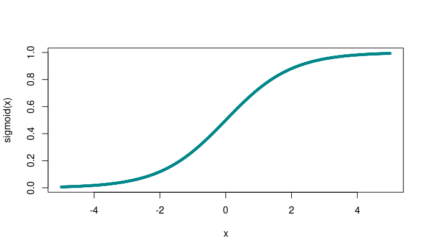
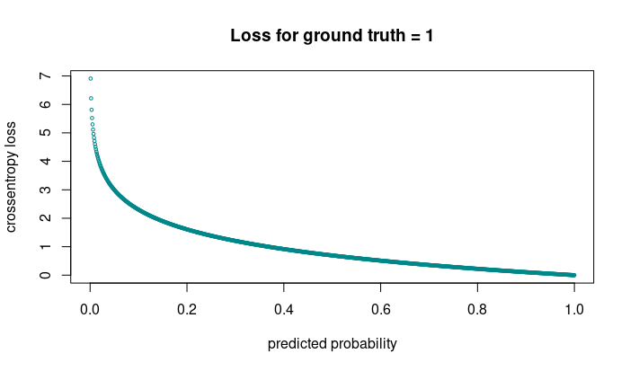
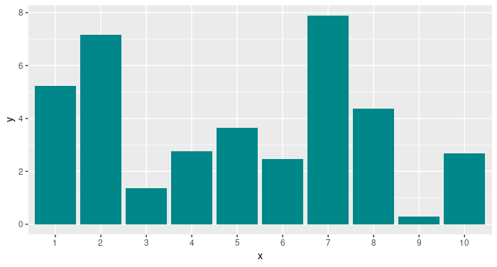
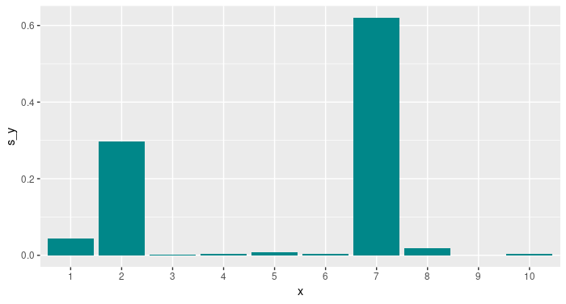

You're building a Keras model. If you haven't been doing deep learning for so long, getting the output activations and cost function right might involve some memorization (or lookup). You might be trying to recall the general guidelines like so:

*So with my cats and dogs, I'm doing 2-class classification, so I have to use sigmoid activation in the output layer, right, and then, it's binary crossentropy for the cost function...*
Or: *I'm doing classification on ImageNet, that's multi-class, so that was softmax for activation, and then, cost should be categorical crossentropy...*

It's fine to memorize stuff like this, but knowing a bit about the reasons behind often makes things easier. So we ask: Why is it that these output activations and cost functions go together? And, do they always have to?

## In a nutshell

Put simply, we choose activations that make the network predict what we want it to predict.
The cost function is then determined by the model.

This is because neural networks are normally optimized using *maximum likelihood*, and depending on the distribution we assume for the output units, maximum likelihood yields different optimization objectives. All of these objectives then minimize the cross entropy (pragmatically: mismatch) between the true distribution and the predicted distribution.

<aside>
For a more mathematical development of these topics, see sections 5.5 and 6.2 of Goodfellow et al., Deep Learning.(Goodfellow et al. 2016)
</aside>

Let's start with the simplest, the linear case.

## Regression

For the botanists among us, here's a super simple network meant to predict sepal width from sepal length:

<aside>
In case you'd like a more comprehensive introduction to doing regression with Keras, see the [tutorial](https://tensorflow.rstudio.com/keras/articles/tutorial_basic_regression.html) on the Keras website.
</aside>

``` r
model <- keras_model_sequential() %>%
  layer_dense(units = 32) %>%
  layer_dense(units = 1)

model %>% compile(
  optimizer = "adam", 
  loss = "mean_squared_error"
)

model %>% fit(
  x = iris$Sepal.Length %>% as.matrix(),
  y = iris$Sepal.Width %>% as.matrix(),
  epochs = 50
)
```

Our model's assumption here is that sepal width is normally distributed, given sepal length. Most often, we're trying to predict the mean of a conditional Gaussian distribution:

$$p(y|\mathbf{x} = N(y; \mathbf{w}^t\mathbf{h} + b)$$

<aside>
This formula assumes a single output unit.
</aside>

In that case, the cost function that minimizes cross entropy (equivalently: optimizes maximum likelihood) is *mean squared error*.
And that's exactly what we're using as a cost function above.

Alternatively, we might wish to predict the median of that conditional distribution. In that case, we'd change the cost function to use mean absolute error:

``` r
model %>% compile(
  optimizer = "adam", 
  loss = "mean_absolute_error"
)
```

Now let's move on beyond linearity.

## Binary classification

We're enthusiastic bird watchers and want an application to notify us when there's a bird in our garden - not when the neighbors landed their airplane, though. We'll thus train a network to distinguish between two classes: birds and airplanes.

<aside>
For a more detailed introduction to classification with Keras, see the [tutorial](https://tensorflow.rstudio.com/keras/articles/tutorial_basic_classification.html) on the Keras website.
</aside>

``` r
# Using the CIFAR-10 dataset that conveniently comes with Keras.
cifar10 <- dataset_cifar10()

x_train <- cifar10$train$x / 255
y_train <- cifar10$train$y

is_bird <- cifar10$train$y == 2
x_bird <- x_train[is_bird, , ,]
y_bird <- rep(0, 5000)

is_plane <- cifar10$train$y == 0
x_plane <- x_train[is_plane, , ,]
y_plane <- rep(1, 5000)

x <- abind::abind(x_bird, x_plane, along = 1)
y <- c(y_bird, y_plane)

model <- keras_model_sequential() %>%
  layer_conv_2d(
    filter = 8,
    kernel_size = c(3, 3),
    padding = "same",
    input_shape = c(32, 32, 3),
    activation = "relu"
  ) %>%
  layer_max_pooling_2d(pool_size = c(2, 2)) %>%
  layer_conv_2d(
    filter = 8,
    kernel_size = c(3, 3),
    padding = "same",
    activation = "relu"
  ) %>%
  layer_max_pooling_2d(pool_size = c(2, 2)) %>%
layer_flatten() %>%
  layer_dense(units = 32, activation = "relu") %>%
  layer_dense(units = 1, activation = "sigmoid")

model %>% compile(
  optimizer = "adam", 
  loss = "binary_crossentropy", 
  metrics = "accuracy"
)

model %>% fit(
  x = x,
  y = y,
  epochs = 50
)
```

Although we normally talk about "binary classification", the way the outcome is usually modeled is as a *Bernoulli random variable*, conditioned on the input data. So:

$$P(y = 1|\mathbf{x}) = p, \ 0\leq p\leq1$$

A Bernoulli random variable takes on values between $0$ and $1$. So that's what our network should produce.
One idea might be to just clip all values of $\mathbf{w}^t\mathbf{h} + b$ outside that interval. But if we do this, the gradient in these regions will be $0$: The network cannot learn.

A better way is to squish the complete incoming interval into the range (0,1), using the logistic *sigmoid* function

$$ \sigma(x) = \frac{1}{1 + e^{(-x)}} $$

<figure>

<figcaption aria-hidden="true">The sigmoid function squishes its input into the interval (0,1).</figcaption>
</figure>

As you can see, the sigmoid function saturates when its input gets very large, or very small. Is this problematic?
It depends. In the end, what we care about is if the cost function saturates. Were we to choose mean squared error here, as in the regression task above, that's indeed what could happen.[^1]

However, if we follow the general principle of maximum likelihood/cross entropy, the loss will be

$$- log P (y|\mathbf{x})$$

<aside>
If you need the details, see section 6.2.2.2 in Goodfellow et al.
</aside>

where the $log$ undoes the $exp$ in the sigmoid.

In Keras, the corresponding loss function is `binary_crossentropy`. For a single item, the loss will be

- $- log(p)$ when the ground truth is 1
- $- log(1-p)$ when the ground truth is 0

<aside>
Here p is the predicted probability, i.e., the output activations of the network.
</aside>

Here, you can see that when for an individual example, the network predicts the wrong class *and* is highly confident about it, this example will contributely very strongly to the loss.

<figure>

<figcaption aria-hidden="true">Cross entropy penalizes wrong predictions most when they are highly confident.</figcaption>
</figure>

What happens when we distinguish between more than two classes?

## Multi-class classification

CIFAR-10 has 10 classes; so now we want to decide which of 10 object classes is present in the image.

Here first is the code: Not many differences to the above, but note the changes in activation and cost function.

``` r
cifar10 <- dataset_cifar10()

x_train <- cifar10$train$x / 255
y_train <- cifar10$train$y

model <- keras_model_sequential() %>%
  layer_conv_2d(
    filter = 8,
    kernel_size = c(3, 3),
    padding = "same",
    input_shape = c(32, 32, 3),
    activation = "relu"
  ) %>%
  layer_max_pooling_2d(pool_size = c(2, 2)) %>%
  layer_conv_2d(
    filter = 8,
    kernel_size = c(3, 3),
    padding = "same",
    activation = "relu"
  ) %>%
  layer_max_pooling_2d(pool_size = c(2, 2)) %>%
  layer_flatten() %>%
  layer_dense(units = 32, activation = "relu") %>%
  layer_dense(units = 10, activation = "softmax")

model %>% compile(
  optimizer = "adam",
  loss = "sparse_categorical_crossentropy",
  metrics = "accuracy"
)

model %>% fit(
  x = x_train,
  y = y_train,
  epochs = 50
)
```

So now we have *softmax* combined with *categorical crossentropy*. Why?

Again, we want a valid probability distribution: Probabilities for all disjunct events should sum to 1.

CIFAR-10 has one object per image; so events are disjunct. Then we have a single-draw multinomial distribution (popularly known as "Multinoulli", mostly due to Murphy's *Machine learning*(Murphy 2012)) that can be modeled by the softmax activation:

$$softmax(\mathbf{z})_i = \frac{e^{z_i}}{\sum_j{e^{z_j}}}$$

Just as the sigmoid, the softmax can saturate. In this case, that will happen when *differences* between outputs become very big.
Also like with the sigmoid, a $log$ in the cost function undoes the $exp$ that's responsible for saturation:

$$log\ softmax(\mathbf{z})_i = z_i - log\sum_j{e^{z_j}}$$

Here $z_i$ is the class we're estimating the probability of - we see that its contribution to the loss is linear and thus, can never saturate.

In Keras, the loss function that does this for us is called `categorical_crossentropy`. We use sparse_categorical_crossentropy in the code which is the same as `categorical_crossentropy` but does not need conversion of integer labels to one-hot vectors.

Let's take a closer look at what softmax does. Assume these are the raw outputs of our 10 output units:

<figure>

<figcaption aria-hidden="true">Simulated output before application of softmax.</figcaption>
</figure>

Now this is what the normalized probability distribution looks like after taking the softmax:

<figure>

<figcaption aria-hidden="true">Final output after softmax.</figcaption>
</figure>

Do you see where the *winner takes all* in the title comes from? This is an important point to keep in mind: Activation functions are not just there to produce certain desired distributions; they can also change relationships between values.

## Conclusion

We started this post alluding to common heuristics, such as "for multi-class classification, we use softmax activation, combined with categorical crossentropy as the loss function". Hopefully, we've succeeded in showing why these heuristics make sense.

However, knowing that background, you can also infer when these rules do not apply. For example, say you want to detect several objects in an image. In that case, the *winner-takes-all* strategy is not the most useful, as we don't want to exaggerate differences between candidates. So here, we'd use *sigmoid* on all output units instead, to determine a probability of presence *per object*.

Goodfellow, Ian, Yoshua Bengio, and Aaron Courville. 2016. *Deep Learning*. MIT Press.

Murphy, Kevin. 2012. *Machine Learning: A Probabilistic Perspective*. MIT Press.

[^1]: The actual outcome depends on the task. In the above simple classification example, training with mean squared error will attain similar accuracy in similar time.
