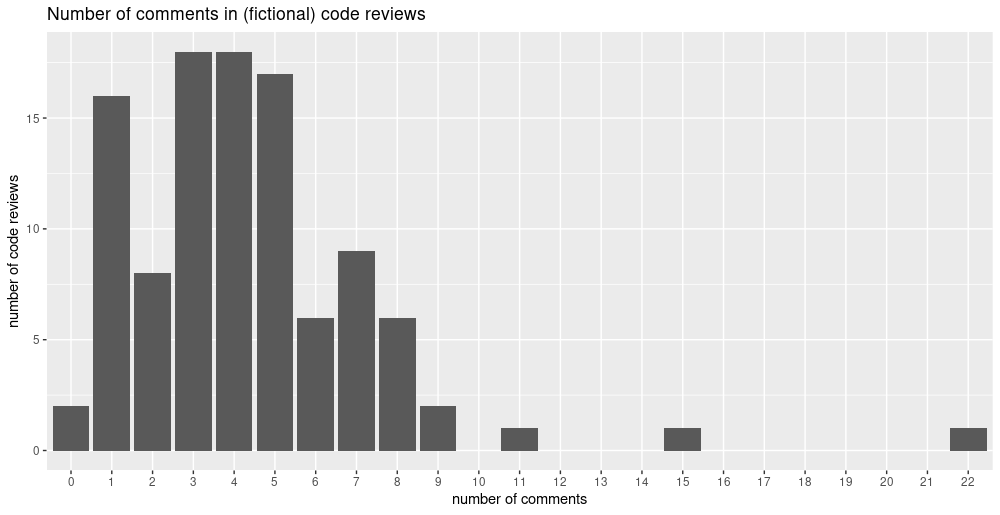
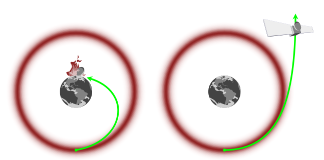

Why a *very (meaning: VERY!) first conceptual introduction to Hamiltonian Monte Carlo* (HMC) on this blog?

Well, in our endeavor to feature the various capabilities of TensorFlow Probability (TFP) / [tfprobability](https://rstudio.github.io/tfprobability/), we started showing examples [^1] of how to fit hierarchical models, using one of TFP's joint distribution classes [^2] and HMC. The technical aspects being complex enough in themselves, we never gave an introduction to the "math side of things". Here we are trying to make up for this.

Seeing how it is impossible, in a short blog post, to provide an introduction to Bayesian modeling and Markov Chain Monte Carlo in general, and how there are so many excellent texts doing this already, we will presuppose some prior knowledge. Our specific focus then is on the latest and greatest, the magic buzzwords, the famous incantations: Hamiltonian Monte Carlo, *leapfrog* steps, NUTS -- as always, trying to demystify, to make things as understandable as possible.
In that spirit, welcome to a "glossary with a narrative".

## So what is it for?

Sampling, or *Monte Carlo*, techniques in general are used when we want to produce samples from, or statistically describe a distribution we don't have a closed-form formulation of. Sometimes, we might really be interested in the samples; sometimes we just want them so we can compute, for example, the mean and variance of the distribution.

What distribution? In the type of applications we're talking about, we have a *model*, a joint distribution, which is supposed to describe some reality. Starting from the most basic scenario, it might look like this:

$$x \sim \mathcal{Poisson}(\lambda)$$

This "joint distribution" only has a single member, a Poisson distribution, that is supposed to model, say, the number of comments in a code review. We also have data on actual code reviews, like this, say [^3]:



We now want to determine the *parameter*, $\lambda$, of the Poisson that make these data most *likely*. So far, we're not even being Bayesian yet: There is no prior on this parameter. But of course, we want to be Bayesian, so we add one -- imagine fixed priors [^4] on *its* parameters:

$$x \sim \mathcal{Poisson}(\lambda)\\
\lambda \sim \gamma(\alpha, \beta)\\
\alpha \sim [...]\\  
\beta \sim [...]$$

This being a joint distribution, we have three parameters to determine: $\lambda$, $\alpha$ and $\beta$.
And what we're interested in is the *posterior distribution* of the parameters given the data.

Now, depending on the distributions involved, we usually cannot calculate the posterior distributions in closed form. Instead, we have to use sampling techniques to determine those parameters. [^5] What we'd like to point out instead is the following: In the upcoming discussions of sampling, HMC & co., it is really easy to forget *what is it that we are sampling*. Try to always keep in mind that what we're sampling isn't the data, it's parameters: the parameters of the posterior distributions we're interested in.

## Sampling

Sampling methods in general consist of two steps: generating a sample ("proposal") and deciding whether to keep it or to throw it away ("acceptance"). Intuitively, in our given scenario -- where we have measured something and are now looking for a mechanism that explains those measurements -- the latter should be easier: We "just" need to determine the likelihood of the data under those hypothetical model parameters. But how do we come up with suggestions to start with?

In theory, straightforward(-ish) methods exist that could be used to generate samples from an unknown (in closed form) distribution -- as long as their unnormalized probabilities can be evaluated, and the problem is (very) low-dimensional. (For concise portraits of those methods, such as uniform sampling, importance sampling, and rejection sampling, see(MacKay 2002).) Those are not used in MCMC software though, for lack of efficiency and non-suitability in high dimensions. Before HMC became the dominant algorithm in such software, the *Metropolis* and *Gibbs* methods were the algorithms of choice. Both are nicely and understandably explained -- in the case of Metropolis, often exemplified by nice stories --, and we refer the interested reader to the go-to references, such as (McElreath 2016) and (Kruschke 2010). Both were shown to be less efficient than HMC, the main topic of this post, due to their random-walk behavior: Every proposal is based on the current position in state space, meaning that samples may be highly correlated and state space exploration proceeds slowly.

## HMC

So HMC is popular because compared to random-walk-based algorithms, it is a *lot* more efficient. Unfortunately, it is also a lot more difficult to "get". [^6] As discussed in [Math, code, concepts: A third road to deep learning](/blog/ai/2019-03-15-concepts-way-to-dl/), there seem to be (at least) three languages to express an algorithm: Math; code (including pseudo-code, which may or may not be on the verge to math notation); and one I call *conceptual* which spans the whole range from very abstract to very concrete, even visual. To me personally, HMC is different from most other cases in that even though I find the conceptual explanations fascinating, they result in less "perceived understanding" than either the equations or the code. For people with backgrounds in physics, statistical mechanics and/or differential geometry this will probably be different!

In any case, physical analogies make for the best start.

## Physical analogies

The classic physical analogy is given in the reference article, Radford Neal's "MCMC using Hamiltonian dynamics" (Neal 2012), and nicely explained in a [video by Ben Lambert](https://www.youtube.com/watch?v=a-wydhEuAm0).

So there's this "thing" we want to maximize, the loglikelihood of the data under the model parameters. Alternatively we can say, we want to minimize the negative loglikelihood (like loss in a neural network). This "thing" to be optimized can then be visualized as an object sliding over a landscape with hills and valleys, and like with gradient descent in deep learning, we want it to end up deep down in some valley.

In Neal's own words

> In two dimensions, we can visualize the dynamics as that of a frictionless puck that slides over a surface of varying height. The state of this system consists of the position of the puck, given by a 2D vector q, and the momentum of the puck (its mass times its velocity), given by a 2D vector p.

Now when you hear "momentum" (and given that I've primed you to think of deep learning) you may feel that sounds familiar, but even though the respective analogies are related the association does not help that much. In deep learning, momentum is commonly praised for its avoidance of ineffective oscillations in imbalanced optimization landscapes [^7].
With HMC however, the focus is on the concept of *energy*.

In [statistical mechanics](https://en.wikipedia.org/wiki/Statistical_mechanics), the probability of being in some state $i$ is inverse-exponentially related to its energy. (Here $T$ is the *temperature*; we won't focus on this so just imagine it being set to 1 in this and subsequent equations.)

$$P(E_i) \sim e^{\frac{-E_i}{T}} $$

As you might or might not remember from school physics, energy comes in two forms: potential energy and kinetic energy. In the sliding-object scenario, the object's potential energy corresponds to its height (position), while its kinetic energy is related to its momentum, $m$, by the formula [^8]

$$K(m) = \frac{m^2}{2 * mass} $$

Now without kinetic energy, the object would slide downhill always, and as soon as the landscape slopes up again, would come to a halt. Through its momentum though, it is able to continue uphill for a while, just as if, going downhill on your bike, you pick up speed you may make it over the next (short) hill without pedaling.

So that's kinetic energy. The other part, potential energy, corresponds to the thing we really want to know - the *negative log posterior* of the parameters we're really after:

$$U(\theta) \sim - log (P(x | \theta) P(\theta))$$

So the "trick" of HMC is augmenting the state space of interest - the vector of posterior parameters - by a momentum vector, to improve optimization efficiency. When we're finished, the momentum part is just thrown away. (This aspect is especially nicely explained in Ben Lambert's video.)

Following his exposition and notation, here we have the energy of a state of parameter and momentum vectors, equaling a sum of potential and kinetic energies:

$$E(\theta, m) = U(\theta) + K(m)$$

The corresponding probability, as per the relationship given above, then is

$$P(E) \sim e^{\frac{-E}{T}} = e^{\frac{- U(\theta)}{T}} e^{\frac{- K(m)}{T}}$$

We now substitute into this equation, assuming a temperature (T) of 1 and a mass of 1:

$$P(E) \sim P(x | \theta) P(\theta) e^{\frac{- m^2}{2}}$$

Now in this formulation, the distribution of momentum is just a standard normal ($e^{\frac{- m^2}{2}}$)! Thus, we can just integrate out the momentum and take $P(\theta)$ as samples from the posterior distribution:[^9]

$$\begin{aligned}
& P(\theta) = 
\int \! P(\theta, m) \mathrm{d}m = \frac{1}{Z} \int \! P(x | \theta) P(\theta) \mathcal{N}(m|0,1) \mathrm{d}m\\
& P(\theta) = \frac{1}{Z} \int \! P(x | \theta) P(\theta)
\end{aligned}$$

How does this work in practice? At every step, we

- sample a new momentum value from its marginal distribution (which is the same as the conditional distribution given $U$, as they are independent), and
- solve for the path of the particle. This is where *Hamilton's equations* come into play.

## Hamilton's equations (equations of motion)

For the sake of less confusion, should you decide to read the paper, here we switch to Radford Neal's notation.

Hamiltonian dynamics operates on a d-dimensional position vector, $q$, and a d-dimensional momentum vector, $p$. The state space is described by the *Hamiltonian*, a function of $p$ and $q$:

$$H(q, p) =U(q) +K(p)$$

Here $U(q)$ is the potential energy (called $U(\theta)$ above), and $K(p)$ is the kinetic energy as a function of momentum (called $K(m)$ above).

The partial derivatives of the Hamiltonian determine how $p$ and $q$ change over time, $t$, according to Hamilton's equations:

$$\begin{aligned}
& \frac{dq}{dt} = \frac{\partial H}{\partial p}\\
& \frac{dp}{dt} = - \frac{\partial H}{\partial q}
\end{aligned}$$

How can we solve this system of partial differential equations? The basic workhorse in numerical integration is *Euler's method*, where time (or the independent variable, in general) is advanced by a step of size $\epsilon$, and a new value of the dependent variable is computed by taking the (partial) derivative and adding it to its current value. For the Hamiltonian system, doing this one equation after the other looks like this:

$$\begin{aligned}
& p(t+\epsilon) = p(t) + \epsilon \frac{dp}{dt}(t) = p(t) − \epsilon \frac{\partial U}{\partial q}(q(t))\\
& q(t+\epsilon) = q(t) + \epsilon \frac{dq}{dt}(t) = q(t) + \epsilon \frac{p(t)}{m})
\end{aligned}$$

Here first a new position is computed for time $t + 1$, making use of the current momentum at time $t$; then a new momentum is computed, also for time $t + 1$, making use of the current position at time $t$.

This process can be improved if in step 2, we make use of the *new* position we just freshly computed in step 1; but let's directly go to what is actually used in contemporary software, the *leapfrog* method.

## Leapfrog algorithm

So after *Hamiltonian*, we've hit the second magic word: *leapfrog*. Unlike *Hamiltonian* however, there is less mystery here. The leapfrog method is "just" a more efficient way to perform the numerical integration.

It consists of three steps, basically splitting up the Euler step 1 into two parts, before and after the momentum update:

$$\begin{aligned}
& p(t+\frac{\epsilon}{2}) = p(t) − \frac{\epsilon}{2} \frac{\partial U}{\partial q}(q(t))\\
& q(t+\epsilon) = q(t) + \epsilon \frac{p(t + \frac{\epsilon}{2})}{m}\\
& p(t+ \epsilon) = p(t+\frac{\epsilon}{2}) − \frac{\epsilon}{2} \frac{\partial U}{\partial q}(q(t + \epsilon))
\end{aligned}$$

As you can see, each step makes use of the corresponding variable-to-differentiate's value computed in the preceding step. In practice, several leapfrog steps are executed before a proposal is made; so steps 3 and 1 (of the subsequent iteration) are combined.

*Proposal* -- this keyword brings us back to the higher-level "plan". All this -- Hamiltonian equations, leapfrog integration -- served to generate a proposal for a new value of the parameters, which can be accepted or not. The way that decision is taken is not particular to HMC and explained in detail in the above-mentioned expositions on the Metropolis algorithm, so we just cover it briefly.

## Acceptance: Metropolis algorithm

Under the Metropolis algorithm, proposed new vectors $q*$ and $p*$ are accepted with probability

$$min(1, exp(−H(q∗, p∗) +H(q, p)))$$

That is, if the proposed parameters yield a higher likelihood, they are accepted; if not, they are accepted only with a certain probability that depends on the ratio between old and new likelihoods.
In theory, energy staying constant in a Hamiltonian system, proposals should always be accepted; in practice, loss of precision due to numerical integration may yield an acceptance rate less than 1.

## HMC in a few lines of code

We've talked about concepts, and we've seen the math, but between analogies and equations, it's easy to lose track of the overall algorithm. Nicely, Radford Neal's paper (Neal 2012) has some code, too! Here it is reproduced, with just a few additional comments added (many comments were preexisting):

``` r
# U is a function that returns the potential energy given q
# grad_U returns the respective partial derivatives
# epsilon stepsize
# L number of leapfrog steps
# current_q current position

# kinetic energy is assumed to be sum(p^2/2) (mass == 1)
HMC <- function (U, grad_U, epsilon, L, current_q) {
  q <- current_q
  # independent standard normal variates
  p <- rnorm(length(q), 0, 1)  
  # Make a half step for momentum at the beginning
  current_p <- p 
  # Alternate full steps for position and momentum
  p <- p - epsilon * grad_U(q) / 2 
  for (i in 1:L) {
    # Make a full step for the position
    q <- q + epsilon * p
    # Make a full step for the momentum, except at end of trajectory
    if (i != L) p <- p - epsilon * grad_U(q)
    }
  # Make a half step for momentum at the end
  p <- p - epsilon * grad_U(q) / 2
  # Negate momentum at end of trajectory to make the proposal symmetric
  p <- -p
  # Evaluate potential and kinetic energies at start and end of trajectory 
  current_U <- U(current_q)
  current_K <- sum(current_p^2) / 2
  proposed_U <- U(q)
  proposed_K <- sum(p^2) / 2
  # Accept or reject the state at end of trajectory, returning either
  # the position at the end of the trajectory or the initial position
  if (runif(1) < exp(current_U-proposed_U+current_K-proposed_K)) {
    return (q)  # accept
  } else {
    return (current_q)  # reject
  }
}
```

Hopefully, you find this piece of code as helpful as I do. Are we through yet? Well, so far we haven't encountered the last magic word: NUTS. What, or who, is NUTS?

## NUTS

NUTS, [added to Stan in 2011](https://statmodeling.stat.columbia.edu/2011/11/30/stan-uses-nuts/) [^10] and about a month ago, to [TensorFlow Probability's master branch](https://github.com/tensorflow/probability/blob/master/tensorflow_probability/python/mcmc/nuts.py), is an algorithm that aims to circumvent one of the practical difficulties in using HMC: The choice of number of leapfrog steps to perform before making a proposal. The acronym stands for No-U-Turn Sampler, alluding to the avoidance of U-turn-shaped curves in the optimization landscape when the number of leapfrog steps is chosen too high.

The reference paper by Hoffman & Gelman (Hoffman and Gelman 2011) also describes a solution to a related difficulty: choosing the step size $\epsilon$. The respective algorithm, *dual averaging*, [was also recently added to TFP](https://github.com/tensorflow/probability/blob/master/tensorflow_probability/python/mcmc/dual_averaging_step_size_adaptation.py).

NUTS being more of algorithm in the computer science usage of the word than a thing to explain conceptually, we'll leave it at that, and ask the interested reader to read the paper -- or even, [consult the TFP documentation to see how NUTS is implemented there](https://github.com/tensorflow/probability/blob/master/discussion/technical_note_on_unrolled_nuts.md). Instead, we'll round up with another conceptual analogy, Michael Bétancourts crashing (or not!) satellite (Betancourt 2017).

## How to avoid crashes

Bétancourt's article is an awesome read, and a paragraph focusing on a single point made in the paper can be nothing than a "teaser" (which is why we'll have a picture, too!).

To introduce the upcoming analogy, the problem starts with high dimensionality, which is a given in most real-world problems. In high dimensions, as usual, the density function has a *mode* (the place where it is maximal), but necessarily, there cannot be much *volume* around it -- just like with k-nearest neighbors, the more dimensions you add, the farther your nearest neighbor will be.
A product of volume and density, the only significant probability mass resides in the so-called [typical set](https://en.wikipedia.org/wiki/Typical_set) [^11], which becomes more and more narrow in high dimensions.

So, the typical set is what we want to explore, but it gets more and more difficult to find it (and stay there). Now as we saw above, HMC uses gradient information to get near the mode, but if it just followed the gradient of the log probability (the *position*) it would leave the typical set and stop at the mode.

This is where momentum comes in -- it counteracts the gradient, and both together ensure that the Markov chain stays on the typical set. Now here's the satellite analogy, in Bétancourt's own words:

> For example, instead of trying to reason about a mode, a gradient, and a typical set, we can equivalently reason about a planet, a gravitational field, and an orbit (Figure 14). The probabilistic endeavor of exploring the typical set then becomes a physical endeavor of placing a satellite in a stable orbit around the hypothetical planet. Because these are just two different perspectives of the same mathematical system, they will suffer from the same pathologies. Indeed, if we place a satellite at rest out in space it will fall in the gravitational field and crash into the surface of the planet, just as naive gradient-driven trajectories crash into the mode (Figure 15). From either the probabilistic or physical perspective we are left with a catastrophic outcome.

> The physical picture, however, provides an immediate solution: although objects at rest will crash into the planet, we can maintain a stable orbit by endowing our satellite with enough momentum to counteract the gravitational attraction. We have to be careful, however, in how exactly we add momentum to our satellite. If we add too little momentum transverse to the gravitational field, for example, then the gravitational attraction will be too strong and the satellite will still crash into the planet (Figure 16a). On the other hand, if we add too much momentum then the gravitational attraction will be too weak to capture the satellite at all and it will instead fly out into the depths of space (Figure 16b).

And here's the picture I promised (Figure 16 from the paper):

<figure>

<figcaption aria-hidden="true">Figure 16 from <span class="citation" data-cites="2017arXiv170102434B">(Betancourt 2017)</span></figcaption>
</figure>

And with this, we conclude. Hopefully, you'll have found this helpful -- unless you knew it all (or more) beforehand, in which case you probably wouldn't have read this post :-)

Thanks for reading!

Betancourt, Michael. 2017. "<span class="nocase">A Conceptual Introduction to Hamiltonian Monte Carlo</span>." *arXiv e-Prints*, January, arXiv:1701.02434. <https://arxiv.org/abs/1701.02434>.

Blei, David M., Alp Kucukelbir, and Jon D. McAuliffe. 2017. "Variational Inference: A Review for Statisticians." *Journal of the American Statistical Association* 112 (518): 859--77. <https://doi.org/10.1080/01621459.2017.1285773>.

Hoffman, Matthew D., and Andrew Gelman. 2011. *The No-u-Turn Sampler: Adaptively Setting Path Lengths in Hamiltonian Monte Carlo*. <https://arxiv.org/abs/1111.4246>.

Kruschke, John K. 2010. *Doing Bayesian Data Analysis: A Tutorial with r and BUGS*. 1st ed. Academic Press, Inc.

MacKay, David J. C. 2002. *Information Theory, Inference & Learning Algorithms*. Cambridge University Press.

McElreath, Richard. 2016. *Statistical Rethinking: A Bayesian Course with Examples in r and Stan*. CRC Press. <http://xcelab.net/rm/statistical-rethinking/>.

Neal, Radford M. 2012. "<span class="nocase">MCMC using Hamiltonian dynamics</span>." *arXiv e-Prints*, June, arXiv:1206.1901. <https://arxiv.org/abs/1206.1901>.

[^1]: See e.g. [Tadpoles on TensorFlow: Hierarchical partial pooling with tfprobability](/blog/ai/2019-05-06-tadpoles-on-tensorflow/) and [Hierarchical partial pooling, continued: Varying slopes models with TensorFlow Probability](/blog/ai/2019-05-24-varying-slopes/)

[^2]: [tfd_joint_distribution_sequential](https://rstudio.github.io/tfprobability/reference/tfd_joint_distribution_sequential.html)

[^3]: data are purely made up

[^4]: elided

[^5]: In some cases, variational inference is an alternative. See (Blei et al. 2017) for a nice introduction.

[^6]: By "get \[it\]" I mean the subjective feeling of understanding what's going on; not more and not less.

[^7]: Though see [this great distill.pub post](https://distill.pub/2017/momentum/) for a different view.

[^8]: $m$ here stands for momentum.

[^9]: Here $Z$ is the normalizer required to have the integral sum to 1.

[^10]: As of today, Stan uses a modified version, see appendix A.5 of (Betancourt 2017), to be cited soon.

[^11]: for a detailed discussion of typical sets, see the book by McKay (MacKay 2002).
