We're happy to introduce Raghilda, a new Python package for building RAG (Retrieval-Augmented Generation) solutions.

RAG is a simple concept that comes up anytime you want to _retrieve_ content for an LLM to improve or _augment_ the _generated_ output.



LLMs are great at reasoning and generating text, but their knowledge is frozen at training time.
They can't access private documents, recent information, or anything that wasn't in the training
data. When asked about these topics, they either refuse to answer or — worse — hallucinate
a confident-sounding response. RAG solves this by giving the model access to relevant
information at query time, without needing to retrain it.

In practice, most tools built on top of LLMs already do this. ChatGPT uses web search to
include recent news in its answers. Claude Code reads the codebase using tools like `grep`,
`list_files`, and `symbol_search` before generating code. RAG is what makes LLMs useful for
tasks that require specific, up-to-date, or private knowledge.

Modern LLMs support context windows of 100K tokens or more, which might seem like it makes
RAG unnecessary — just paste everything into the prompt. But this doesn't work well in
practice. LLMs suffer from "lost in the middle" (sometimes called "context rot"): they pay less
attention to information buried in the middle of a very long prompt, so relevant content gets
missed. On top of that, sending your entire knowledge base with every query is expensive, slow,
and most real-world document collections are too large to fit in a single context window anyway.
Long context and RAG are complementary — a larger window lets you include more retrieved
chunks, but retrieval is what gives you precision: the model sees 5 relevant paragraphs instead
of 500 irrelevant pages.

## raghilda

Building a good retrieval system is the hard part of RAG.
raghilda is a Python framework designed to handle it. You
give it URLs or file paths, and it takes care of the rest.
The defaults are opinionated but transparent — every step is
exposed and replaceable. You can swap the chunker, change the
embedding provider, or write a custom ingestion function
without fighting the framework.

- **Document processing.** Converting HTML pages, PDFs, and DOCX files into clean text is
  surprisingly messy. raghilda handles this automatically, converting documents to Markdown.
  For websites, `find_links()` crawls and discovers pages so you don't have to list them
  by hand.

- **Smart chunking.** Naive fixed-size chunking can split a code block or paragraph in half.
  raghilda's Markdown chunker splits text at semantic boundaries — headings, paragraphs,
  sentences — and preserves the heading hierarchy so each chunk retains context about where
  it came from.

- **Multiple storage backends.** raghilda supports DuckDB (local, zero-config), ChromaDB,
  and OpenAI Vector Stores. The API is the same across backends, so you can start with a
  local DuckDB file and move to a hosted solution later without rewriting your code.

- **Hybrid retrieval.** Pure vector search finds semantically similar content but misses exact
  keyword matches. raghilda combines semantic search, BM25 keyword matching, and attribute
  filters — so you can search by meaning, by keywords, and by metadata (e.g. source URL,
  document type, or any custom attribute) all at once.

## How it works

A retrieval system has two phases: **ingestion** — turning
your documents into a searchable store — and **retrieval** —
finding the right chunks given a query. raghilda exposes both
phases clearly, with each step exposed as an
individual call you can customize or replace.



Let's walk through a minimal example using a Wikipedia article about Princess Ragnhild
of Norway.

First, you **create a store** with an embedding provider. The store is where your chunks and
their vector embeddings will live:

```python
from raghilda.store import DuckDBStore
from raghilda.embedding import EmbeddingOpenAI

store = DuckDBStore.create(
    location="ragnhild.db",
    embed=EmbeddingOpenAI(),
    overwrite=True,
)
```

Then you **read** the document and **chunk** it. `read_as_markdown()` converts the URL
to Markdown, and `MarkdownChunker` splits it into overlapping chunks at semantic boundaries:

```python
from raghilda.read import read_as_markdown
from raghilda.chunker import MarkdownChunker

doc = read_as_markdown(
    "https://en.wikipedia.org/wiki/Princess_Ragnhild,_Mrs._Lorentzen"
)

# We intentionally use a small chunk size for display purposes.
# In practice, chunk sizes of ~1600 characters are a good
# compromise on size versus retrieval quality.
chunker = MarkdownChunker(chunk_size=200, target_overlap=0.25)
chunked = chunker.chunk(doc)
print(f"{len(chunked.chunks)} chunks")
```

```
185 chunks
```

Finally, you **upsert** the chunked document into the store
and build the search indexes. Embedding is handled by the
store itself — since the embedding provider is configured at
creation time, all chunks in a store are guaranteed to use
consistent embeddings:

```python
store.upsert(chunked)
store.build_index()
```

During **retrieval**, you query the store and get back the most relevant chunks. raghilda
runs semantic search and BM25 keyword search, then merges
the results:

```python
chunks = store.retrieve("Did she move to Brazil?", top_k=2)
for chunk in chunks:
    print(chunk.text)
    print("---")
```

```
Lorentzen"), a member of the Lorentzen family of shipping magnates.
In the same year, they moved to Brazil, where her husband was an
industrialist and a main owner of Aracruz Celulose. She lived in
Brazil until her death 59 years later.
---
to Rio de Janeiro, where her husband had substantial business
holdings. Their residence in Brazil was originally temporary, but
they
---
```

> **Tip:** In practice, you'll usually work with many documents at
> once — just loop over your URLs or file paths and call
> `upsert()` for each one.
> See the [Getting Started](https://posit-dev.github.io/raghilda/user-guide/getting-started.html) guide for
> a full walkthrough.

## Using with an LLM

A retrieval system on its own just returns text chunks. To
get actual answers, you connect it to an LLM. The simplest
way to do this is to register a search function as a tool
that the LLM can call when it needs information.

Here's an example using
[chatlas](https://posit-dev.github.io/chatlas/):

```python
from chatlas import ChatOpenAI
import json

def search_ragnhild(query: str) -> str:
    """Search for information about Princess Ragnhild."""
    chunks = store.retrieve(query, top_k=10)
    return json.dumps(
        [{"text": c.text, "context": c.context} for c in chunks]
    )

chat = ChatOpenAI(
    model="gpt-4.1-mini",
    system_prompt="Answer questions about Princess Ragnhild "
    "using the search tool. Always search before answering.",
)
chat.register_tool(search_ragnhild)
_ = chat.chat("Which year did she move to Brazil?", echo="text")
```

```
Princess Ragnhild moved to Brazil in the same year she got married,
1953. Her marriage and the move to Brazil were connected, as her
husband was an industrialist and owner of business holdings in Brazil.
They settled in Rio de Janeiro and lived there until her death in 2012.
```

Compare this with the same question without the search tool:

```python
chat_no_rag = ChatOpenAI(
    model="gpt-4.1-mini",
    system_prompt="Answer questions about Princess Ragnhild.",
)
_ = chat_no_rag.chat(
    "Which year did she move to Brazil?",
    echo="text",
)
```

```
Princess Ragnhild moved to Brazil in 1960.
```

With the search tool, the LLM retrieves the relevant chunks
and grounds its answer in the actual document. Without it,
the model has to rely on its training data — and may
hallucinate or give a vague response.

## Learn more

- [Getting Started](https://posit-dev.github.io/raghilda/user-guide/getting-started.html) — full
  walkthrough building a store from a documentation site
- [Examples](https://github.com/posit-dev/raghilda/tree/main/examples)
  — complete scripts showing RAG workflows with chatlas,
  ChromaDB, and more
- [GitHub repository](https://github.com/posit-dev/raghilda)
  — source code, issues, and contributions
