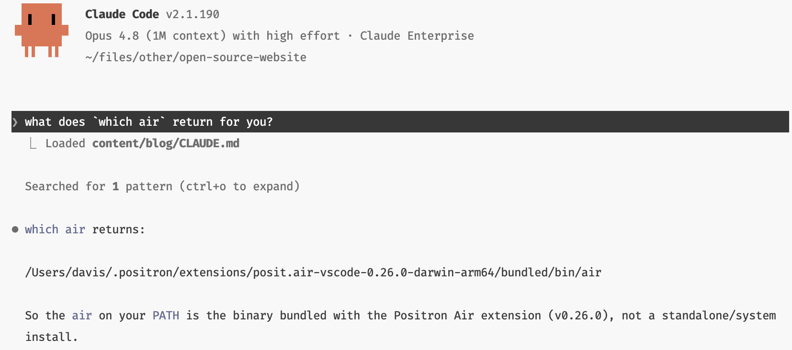
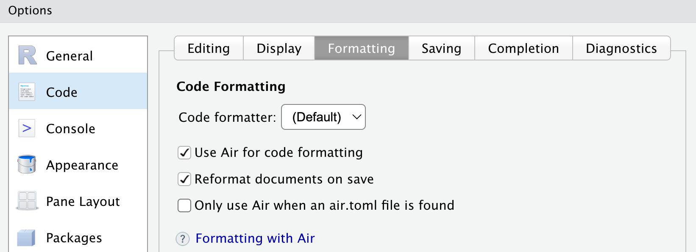

We're very excited to announce that Air 0.10.0 is out now!
[Air](https://github.com/posit-dev/air) is an extremely fast R code formatter, capable of styling entire projects in the blink of an eye.
We haven't done a release post in awhile, so this one will serve as a round up of everything from 0.8.2 to 0.10.0.

If you use [Positron](https://positron.posit.co/), the Air Extension has probably already updated you to the new release!
Otherwise, follow one of Air's [editor guides](https://posit-dev.github.io/air/editors.html) to install the latest version for your editor.

To see every bug fix, check out our [CLI changelog](https://github.com/posit-dev/air/blob/main/CHANGELOG.md) and [extension changelog](https://github.com/posit-dev/air/blob/main/editors/code/CHANGELOG.md).

## Assignment style 😎

The headlining feature of 0.10.0 is a new `assignment-style` option, one of our [top requests](https://github.com/posit-dev/air/issues/359)!
This allows you to enforce `<-` or `=` for assignment throughout your codebase.
Choose one of `"arrow"` for `<-`, `"equal"` for `=`, or `"preserve"` to leave existing code as is.
For example, with `assignment-style = "arrow"`:

<!-- panache-ignore-format-start -->

```r
# This
a = 1
fn = function(x, y) {
  z <- x + y
  z
}

# Is standardized to
a <- 1
fn <- function(x, y) {
  z <- x + y
  z
}
```

<!-- panache-ignore-format-end -->

This option defaults to enforcing `<-` everywhere, which is what the [style guide](https://style.tidyverse.org/syntax.html#assignment-1) already recommended.
Note that this is a breaking change for Air, as the previous behavior didn't enforce any assignment style.
To revert to the old behavior, use `"preserve"`.

This feature is surprisingly sophisticated!
In R, you can always convert from `=` to `<-` without changing the meaning of the code, but the reverse isn't true.
Consider the following:

```r
quote(x <- 1)
```

This quotes the expression `x <- 1` and returns it.
Blindly changing to `=` results in:

```r
quote(x = 1)
```

That's very different!
This sets an argument named `x` to `1`.
Trying to run this will result in an error since `quote()` doesn't have an `x` argument.
Air knows every case where `<-` is allowed but `=` isn't, so you can rest assured that this option won't impact the meaning of your code in any way.

## Positron terminal support

Positron's integration with Air has gotten even better!
When the Air extension activates, it now prepends the bundled Air executable to your integrated terminal's `PATH`.
This means:

- You can now run Air commands from Positron's terminal, even without installing the CLI separately.
- Your terminal version of Air should now always match the version used by the editor itself.



This is particularly useful with agents like Claude Code, where you'll often want to tell your agent to run Air on any R files it touches (see `usethis::use_tidy_agents()` in the development version of usethis for a way to automatically add this to an `AGENTS.md`).



If you've already installed the Air CLI separately, note that the bundled version will take precedence in Positron's terminals by default.
To force both the editor and the integrated terminal to use your externally installed version of Air, set `air.executableStrategy: "environment"`.
To opt-out of terminal support, set `air.addExecutableToTerminalPath: false`.

## RStudio improvements

Thanks to [Kevin Ushey](https://github.com/kevinushey), RStudio's support for Air is improving rapidly!

> Note that you'll need RStudio 2026.06.0 for this, which isn't out yet, but should be by the end of next week.

RStudio now has "native" support for Air, rather than just being configurable as an External Formatter.
If you opt-in to Air, RStudio will now automatically download the latest version of the `air` binary the first time you save a file, making the whole experience much smoother.



You can turn this on via `Tools -> Global Options... -> Code -> Formatting`.
I recommend checking both `Use Air for code formatting` and `Reformat documents on save`.



## ~~Lions, tigers, and bears~~ uv, pixi, and mise, oh my!

Air now lives on PyPi as [`air-formatter`](https://pypi.org/project/air-formatter/) (sadly `air` was already taken), which means that you can now install Air's CLI via [uv](https://github.com/astral-sh/uv):

```bash
# Install globally
uv tool install air-formatter
air format path/to/file.R

# Run one-off command
uvx --from air-formatter air format path/to/file.R
```

It might sound a little absurd to put an R code formatting tool on Python's PyPI, but in a world where an increasingly large number of R users are also uv users, it's pretty darn convenient to be able to invoke it this way!

Additionally, Air is on [conda-forge](https://github.com/conda-forge/air-feedstock) thanks to [`@salim-b`](https://github.com/salim-b), which means you can also install it with [pixi](https://pixi.prefix.dev/latest/) and [mise](https://mise.jdx.dev/):

```bash
# Add to a project
pixi add air
mise use conda:air

# Install globally
pixi global install air
mise use --global conda:air

# Run one-off command
pixi exec air format path/to/my/script.R
mise exec conda:air -- air format path/to/my/script.R
```

## pre-commit support

Air now has [pre-commit](https://pre-commit.com/) and [prek](https://prek.j178.dev/) support via [posit-dev/air-pre-commit](https://github.com/posit-dev/air-pre-commit).
To run Air on changed R files before every commit, add the following to your `.pre-commit-config.yaml`:

```yaml
repos:
- repo: https://github.com/posit-dev/air-pre-commit
  # Air version
  rev: 0.10.0
  hooks:
    # Run the formatter
    - id: air-format
```

## stdin support

Air's CLI now has [stdin support](https://posit-dev.github.io/air/cli.html#stdin)!
You can activate this with the new `--stdin-file-path` option like so:

```bash
cat R/across.R | air format --stdin-file-path R/across.R
```

`air` will receive the contents of `cat R/across.R` on stdin, format it, and then emit the formatted result back out on stdout.

You typically won't call this directly, but it's very useful for editors and IDEs without full language server support.
For example, with [Zed](https://zed.dev/) you can configure Air as an external formatter with the following setup:

```json
"formatter": {
  "external": {
    "command": "air",
    "arguments": ["format", "--stdin-file-path", "{buffer_path}"]
  }
}
```

This allows Zed to invoke Air on every file save.

> Note that Zed does have full language server support, and it's recommended to use our [Air extension for Zed](https://posit-dev.github.io/air/editor-zed.html) instead, but it makes for a nice example anyways!

Invoking Air via stdin can also be useful in some embedded contexts, such as inside [arf](https://github.com/eitsupi/arf), an R console.

## Shell completions

Thanks to [`@salim-b`](https://github.com/salim-b), Air can now generate shell completions for itself via a new `air generate-shell-completion <shell>` command, where `<shell>` can be one of `zsh`, `bash`, `powershell`, `fish`, or `elvish`.
Read the [documentation](https://posit-dev.github.io/air/cli.html#shell-completions) for how to set this up for your specific shell.
With shell completions set up, you can `Tab` your way through `air` commands at the command line:


