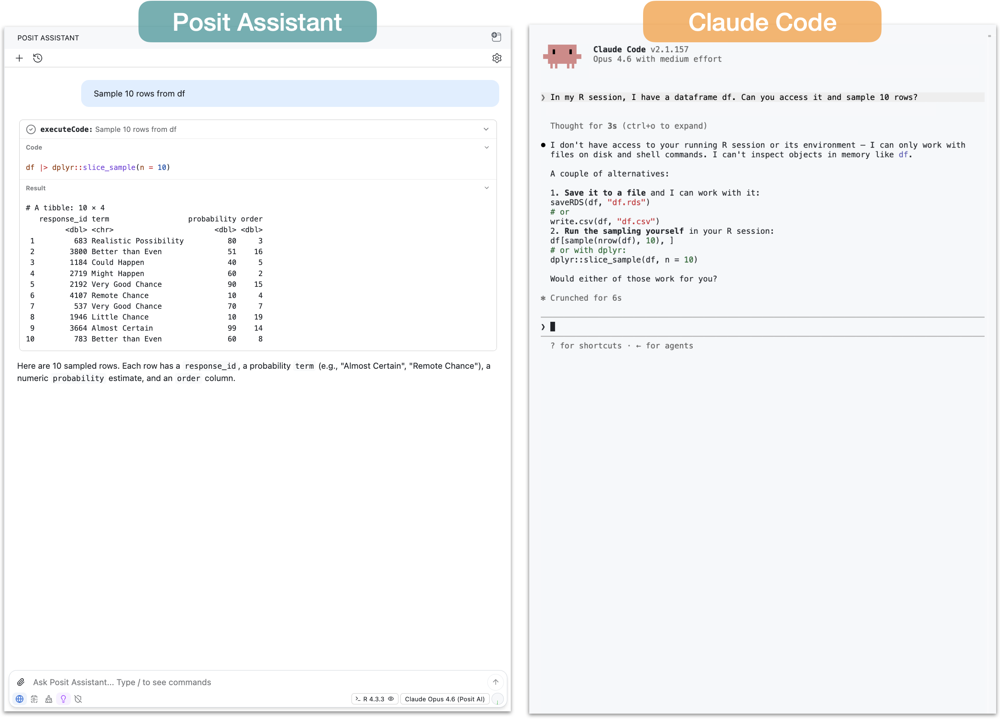
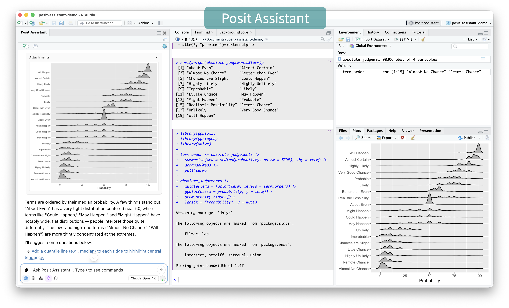

We often get questions about how Posit Assistant compares to Claude Code. If you're already using Posit Assistant with a Claude model, are they really that different? At a high-level, Claude Code is a general-purpose coding agent, but **we designed Posit Assistant specifically for people who work with data.** This post covers three specific differences: 

1. Posit Assistant has out-of-the-box access to your R or Python session. 
2. Posit Assistant can display plots in the chat, leading to easier interpretation for you and the agent. 
3. Posit Assistant has specific interaction modes, skills, and prompting for data analysis. 

You can also see a full demo of the differences between the two in this video:

 

What's the difference between Posit Assistant, Positron Assistant, and Posit AI?

This post talks about [Posit Assistant](https://posit-dev.github.io/assistant/), Posit's latest coding agent available in RStudio and Positron. [Posit AI](https://posit.co/products/ai) is a model subscription service that can power Posit Assistant. [Posit*ron* Assistant](https://positron.posit.co/assistant.html) is a coding agent built into Positron. We plan for Posit Assistant to supersede Positron Assistant in Q3 2026. 

### Coding agents vs. chat apps

Claude Code and Posit Assistant are both _coding agents_. An _agent_ is a ["model running tools in a loop,"](https://simonwillison.net/2025/Sep/18/agents/) meaning an agent can see your environment, take actions in that environment (e.g., run code), and iterate based on the outcome of those actions. These abilities make agents vastly more useful for coding than chat apps like ChatGPT. 

Chat apps can't see your environment or take any actions in your environment. You have to copy-and-paste code into your session, run it yourself, and paste any errors or output back. This both makes the experience more frustrating and increases the probability of errors, because the model is writing code that operates on data and files that it doesn't actually have access to. 

If you haven't tried a coding agent before, and are still relying on chat apps for coding assistance, we recommend trying one out. 

## Built-in access to your R/Python session

**The first major difference is that Posit Assistant has built-in access to your R or Python session.** This means that Posit Assistant, without any additional configuration, can see your R or Python objects and run code directly in your active session.  

Claude Code lacks this ability out of the box. It can write R code to files and run scripts, but it can't directly access data you've loaded or run R code interactively. 

If you ask Claude Code, for example, to filter a tibble `df` you have in your environment, it will write R code to a script and then run that script with the `Rscript` command. This works, but has a couple downsides: 

1. Before running the script, Claude Code can't actually tell that `df` exists. If it doesn't exist, it will have to wait for an error message from the script. 
2. You might not want to create and run scripts for every bit of code. 
3. It leaves you and the agent on different footing: you have direct access to your session, but Claude Code doesn't. This can make errors more likely and the general experience more frustrating. 

It is possible to give Claude Code access to your R or Python session by using an MCP server. In the walkthrough video, we show how to do this using the [btw package](https://github.com/posit-dev/btw), providing Claude Code the ability to access our R session and run R code directly. 

Even with an MCP server, however, Claude Code's interface can make it difficult to see the code being run on your behalf. For some tasks, this might not matter, but if you're analyzing data it can be important to understand the analysis in detail. For data analysis tasks, Posit Assistant is designed for auditability and transparency. The code is visible in the tool call UI with syntax highlighting and styling, so you can easily audit what's happening to your data at each step.

See this comparison in the video: [Claude Code](https://youtu.be/7GI6-4J0AXA?t=220) | [Posit Assistant](https://youtu.be/7GI6-4J0AXA?t=424)

## Data visualization

Claude Code can write code to create plots, but the process is somewhat roundabout. Claude Code in the terminal can't natively display plots and will need an alternate way to show them to you (e.g., opening a file in Preview). Even for the model itself to see the plot, it has to save the plot to a PNG file and then read that file. It works, but it's just not a particularly fluent process for data analysis. 

**Because Posit Assistant runs code in your console, plots show up in the RStudio or Positron plot pane, as well as directly in the chat panel. This makes it easier for you to quickly inspect and analyze the plot and iterate if needed.** Posit Assistant will also automatically see the plot image and typically interpret it or assess if it is correct, which makes it very useful for EDA and data analysis.

This ability for you and the agent to both see the same plot is again important for auditability. There's evidence that even the most advanced models [sometimes misinterpret plots that contradict their expectations](https://simonpcouch.github.io/bluffbench/). While Claude Code can generate plots and can read and interpret those plots, the interface obfuscates the process so that it's not easy to see the same plots that the model is seeing. 

See this comparison in the video: [Claude Code](https://youtu.be/7GI6-4J0AXA?t=560) | [Posit Assistant](https://youtu.be/7GI6-4J0AXA?t=703)

## Specialized data analysis capabilities

Session access and plotting affordances both directly support data analysis, but Posit Assistant also has interaction modes, prompting, and skills specifically designed for data analysis. 

Posit Assistant is both a general-purpose coding agent and a specialized data analysis agent, and it behaves slightly differently depending on your task. During data exploration, it only runs a few bits of code at a time, then summarizes what it found and suggests next steps. Because the purpose of data analysis, especially exploration, is for you to learn about the data, the entire process breaks down if the model runs ahead with analysis you can't keep up with. **Posit Assistant's approach to co-analysis with the user is designed to support your understanding of the data rather than hindering it.** 

<figure>

<figcaption>Posit Assistant explores data iteratively, running a few bits of code at a time before summarizing and suggesting next steps.</figcaption>
</figure>

Claude Code excels at writing code, but is oriented towards writing code to files, executing it, and reviewing, rather than exploring data step-by-step with the user. 

**Posit Assistant also has specialized prompting, skills, and tools that promote sound data analysis.** These include skills for making Shiny apps and Quarto reports, a [data cleaning mode](https://opensource.posit.co/blog/2026-05-08_ai-newsletter/), and prompting about rigorous statistical and modeling practices.

 

See this comparison in the video: [Claude Code](https://youtu.be/7GI6-4J0AXA?t=990) | [Posit Assistant](https://youtu.be/7GI6-4J0AXA?t=1133)

## Posit Assistant is designed for data work

Claude Code, Codex, and other coding agents are very useful tools. They excel at general-purpose coding tasks, and you might want to use them for work that benefits from running multiple agents in parallel or to take advantage of your existing subscription plans.  

However, we made Posit Assistant because we think people who work with data should have an excellent agent specifically designed for them and their needs. Those needs include data analysis and visualization, but also package development, Shiny app creation, and other coding-focused tasks in the data science ecosystem.

Learn more about Posit Assistant: <https://posit-dev.github.io/assistant/>. 