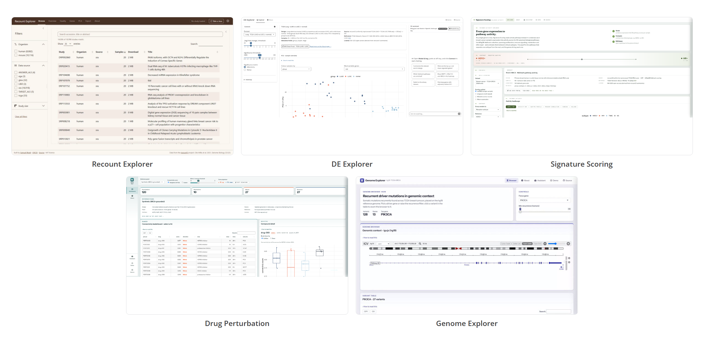

My name is Samuel Bharti and I am a PhD candidate at the University of Alabama at Birmingham, working on rare diseases and cancers, particularly focusing on Neurofibromatosis Type 1 and the cancers associated with it. I spent this summer as a software engineering intern on the Shiny team at Posit. In three short months, I built **10 open-source applications and 5 supporting packages** for computational biology, across R, Python, TypeScript, and JavaScript. Some are tools researchers can use directly. Others sit underneath those applications and solve recurring infrastructure problems.

I came into the internship as a computational biologist. In my PhD research, I work with single-cell sequencing, genomics, and multi-omics data, and with the public databases and identifiers that come with them.

Across different projects, I kept running into the same problems:

- Biological datasets are getting enormous.
- The information needed to interpret them is scattered across many databases.
- Identifiers are surprisingly inconsistent.
- The same API and data-access logic gets rewritten again and again.
- Even when excellent public datasets exist, there can still be a huge gap between **the data being available** and **a researcher being able to use it comfortably**.

Those gaps became the theme of my summer.

> How do we make increasingly large and complicated biological datasets genuinely usable for researchers?

## Making enormous biological datasets explorable

One of the projects I am most excited about is [**Tahoe Explorer**](https://posit-tahoe-explorer.share.connect.posit.cloud/) ([source](https://github.com/samuelbharti/tahoe-explorer)).

[Tahoe-100M](https://huggingface.co/datasets/tahoebio/Tahoe-100M) contains more than 100 million single-cell perturbation profiles. That scale is scientifically exciting, but it creates a practical problem: you cannot treat 100 million observations like a normal dataframe inside an interactive application.

I wanted researchers to be able to answer basic questions before committing to a large analysis. Which cell lines are represented? Which drugs were tested? How much coverage exists for the combination I care about? What do we know about the genomic background of those cell lines? And once I find what I need, how do I retrieve only that part of the dataset?

Tahoe Explorer lets researchers move through drugs, cell lines, samples, genes, coverage, and cell-level metadata without first downloading and loading the entire resource. For the larger data, queries are pushed down to DuckDB, which returns only the rows or summaries the current view needs.

I integrated additional information from resources such as [DepMap](https://depmap.org/portal/) and [Cellosaurus](https://www.cellosaurus.org/), including variant information for the cell lines. That makes it possible to think about perturbation response alongside the genomic context of each cell line.

The Subset builder tab then turns exploration into something reproducible. Users can define the experiment they care about and generate R or Python code for retrieving that subset later.

Another feature of the app is the built-in chat assistant. It can help researchers reason about Tahoe, identify useful filters, interact with supported parts of the app, and finally build those reproducible subset recipes.

What I like most is that the assistant lives inside the app. It can use tools over the data and help operate the workflow. To me, that is a much more interesting direction for AI in scientific software.

<figure>

<figcaption class="text-sm text-center text-gray-500">A quick tour of the Overview and Coverage tabs, then the assistant setting a filter in the Subset builder and reporting what the selection covers.</figcaption>
</figure>

The Tahoe app solved one type of scaling problem: accessing and understanding a dataset that is much larger than the application itself. One layer later, the same issue came back, with the **visualization itself** as the bottleneck.

[**plotomics**](/software/plotomics/) and [**Plotomics Live**](https://posit-plotomics-live.share.connect.posit.cloud/) ([source](https://github.com/samuelbharti/plotomics-live)) came out of that bottleneck.

plotomics is a visualization library for computational biology with a shared TypeScript rendering core and wrappers for R and Python. Its 17 components cover embeddings, heatmaps, volcano plots, networks, oncoplots, genomic views, spatial data, survival analysis, and other common biological visualizations. Of those, 15 ship in R, Python, and JavaScript; the two genome browsers are JavaScript and Python only.

For large visualizations, the browser can draw with WebGL or Canvas. Numeric data can also move to the frontend as binary buffers instead of being serialized into huge JSON payloads.

The visualization logic exists once. The R, Python, and JavaScript wrappers all talk to the same rendering engine.

I built **Plotomics Live** to explore how far that model could go inside Shiny.

The app contains 26 biological visualizations, built from those 17 components with several of them used more than once, across single-cell data, spatial transcriptomics, genomics, networks, perturbation data, and other common workflows. Every one of them renders two ways, and an engine toggle puts the GPU-accelerated React component beside the server-rendered ggplot2 image so you can compare them directly.

One page, for example, interactively renders more than half a million real single-cell observations in the browser.

Plotomics Live is where I worked out what Shiny can look like when R remains the analytical engine and the browser does more of the work it is good at.

<figure>

<figcaption class="text-sm text-center text-gray-500">Two of the 26 pages. The engine toggle swaps the React component for the ggplot2 image, over the same server-side computation.</figcaption>
</figure>

## Connecting biological information that lives everywhere

Scale was only one recurring problem. The other was fragmentation.

A lot of computational biology does not involve one database or one algorithm. It involves assembling an answer from many different resources.

Variant interpretation is a good example. If I am reviewing a variant, I may want information from [ClinVar](https://www.ncbi.nlm.nih.gov/clinvar/), [gnomAD](https://gnomad.broadinstitute.org/), [Ensembl](https://www.ensembl.org/), [UniProt](https://www.uniprot.org/), [AlphaFold](https://alphafold.ebi.ac.uk/), [Open Targets](https://platform.opentargets.org/), [dbNSFP](https://www.dbnsfp.org/), [ProtVar](https://www.ebi.ac.uk/ProtVar/), and several other sources.

[**Variant Reviewer**](https://posit-variant-reviewer.share.connect.posit.cloud/) ([source](https://github.com/samuelbharti/variant-reviewer)) brings those sources together in one reactive workflow.

A researcher can start from a gene, a variant, or both, and the app combines clinical significance, population frequency, prediction scores, gene constraint, protein domains and 3D protein structure.

<figure>

<figcaption class="text-sm text-center text-gray-500">One gene, one variant, one page. Each card is a different public service.</figcaption>
</figure>

But building Variant Reviewer surfaced another problem. Every external biological service behaves differently: its own identifiers, its own failure modes, its own rate limits. One might return a clean "not found" response while another throws an error. And one slow or unavailable service should not break the entire application.

Once I started solving those problems in one app, it became apparent that I should not keep solving them separately.

## Building the infrastructure once

Five packages grew out of problems that kept appearing across the applications.

### biobouncer

[**biobouncer**](/software/biobouncer/) handles biological identifier validation. Gene symbols change. Ontology identifiers have different namespaces. Variants can be syntactically valid but biologically meaningless. Public databases each have their own identifier conventions.

biobouncer provides a common layer for validating these inputs using pattern checks, cached resources, remote validation, and existence checks. It also has implementations across R, Python, and TypeScript backed by the same conformance data.

If the same identifier moves through an R pipeline, a Python analysis, and a web interface, I want "valid" to mean the same thing everywhere.

### biohttp

[**biohttp**](/software/biohttp/) handles the repetitive infrastructure around external APIs. Retries, throttling, caching, batching, timeouts, circuit breaking, and structured errors should not need to be rebuilt in every scientific application.

It also makes an important distinction between a service successfully returning no biological result and the service itself failing. That sounds small until an application depends on several external databases at once.

### bioclients

[**bioclients**](/software/bioclients/) sits on top of that transport layer and provides R clients for 29 biological services. Ensembl, UniProt, gnomAD, Open Targets, ClinVar, AlphaFold, and the rest each get a client that understands the structure and meaning of what they return.

Network requests and response parsing are separated so parsers can be tested against stored responses without requiring a live API.

The separation is intentional:

- **biohttp handles how we talk to a service.**
- **bioclients handles what that biological service returns.**

### plotomics

**plotomics** is the exception in this list. I described it above, because it came out of one specific problem before I was thinking about shared infrastructure at all. It belongs here anyway, for the same reason as the rest: the rendering layer only had to be built once.

### biocohort

Before APIs and visualization even matter, most omics projects have another problem: keeping the study organized. Subjects, samples, assays, species, and the manual corrections made along the way often end up spread across spreadsheets and scripts.

[**biocohort**](/software/biocohort/) provides a validated study representation for keeping those relationships together. The same manifest can describe multiple assay types and organisms, generate pipeline sample sheets, and preserve corrections that would otherwise disappear inside preprocessing code.

This one is particularly close to my own research because these small bookkeeping problems become very expensive once a project grows.

This shift from app-specific code to reusable infrastructure was the biggest change in how I approached the internship. Instead of asking, "How do I make this app work?", I started asking, "Which part of this problem will the next app also need?"

## From retrieving data to synthesizing evidence

Once those pieces became reusable, I could build higher-level research workflows on top of them.

[**Gene List Builder**](https://posit-gene-list-builder.share.connect.posit.cloud/) ([source](https://github.com/samuelbharti/gene-list-builder)) came from another task I have done manually many times: starting with a disease and assembling a defensible list of associated genes.

The application resolves the disease to an ontology term, queries multiple gene-disease resources, normalizes the results, removes duplicates, and produces a ranked list using transparent and adjustable source weights.

The evidence comes from the underlying databases, the scoring is visible, and the provenance remains available. An optional AI layer can then help with curation after that deterministic evidence-gathering step.

[**GeneScout**](https://posit-genescout.share.connect.posit.cloud/) ([source](https://github.com/samuelbharti/genescout)) takes the same idea further.

It acts as an evidence-review workbench for evaluating candidate genes in a disease context. Its deterministic layer resolves genes, retrieves public evidence, keeps citations attached, scores the evidence, and applies caveats. An optional agent can then synthesize what was retrieved and suggest follow-up directions.

Both apps rest on the design principle I came away from the summer caring about most:

**AI can help interpret scientific evidence without needing to be the source of the evidence.**

<figure>

<figcaption class="text-sm text-center text-gray-500">Every number in the breakdown traces back to a public source. Curate with AI and Analyze with specialists are separate, optional steps.</figcaption>
</figure>

## Turning analyses into tools researchers can actually explore

I built several more focused applications around common genomics workflows.

[**Recount Explorer**](https://posit-recount-explorer.share.connect.posit.cloud/) ([source](https://github.com/samuelbharti/recount-explorer)) provides an interactive entry point into [recount3](https://rna.recount.bio/), allowing researchers to browse uniformly processed RNA-seq studies, inspect quality metrics, explore expression and PCA, and export data, without writing any code.

[**DE Explorer**](https://posit-de-explorer.share.connect.posit.cloud/) ([source](https://github.com/posit-dev/shiny-showcase-bioinformatics/tree/main/apps/de-explorer)) makes differential-expression results interactive, moving from a PCA of sample-level structure to a volcano plot, a filterable results table, and a heatmap of the genes you select.

[**Signature Scoring**](https://posit-signature-scoring.share.connect.posit.cloud/) ([source](https://github.com/posit-dev/shiny-showcase-bioinformatics/tree/main/apps/signature-scoring)) summarizes expression profiles into pathway-level scores and lets researchers compare those scores across groups before drilling down into the genes driving a pathway.

[**Drug Perturbation**](https://posit-drug-perturbation.share.connect.posit.cloud/) ([source](https://github.com/posit-dev/shiny-showcase-bioinformatics/tree/main/apps/drug-perturbation)) explores connectivity between gene-expression signatures and reference perturbations, including potential mimics and reversers across different cellular contexts. Its reference panel is synthetic, built over the TCGA-BRCA gene space.

[**Genome Explorer**](https://posit-genome-explorer.share.connect.posit.cloud/) ([source](https://github.com/posit-dev/shiny-showcase-bioinformatics/tree/main/apps/genome-explorer)) places recurrent variants into an interactive genomic view and lets users move from cohort-level patterns to individual loci.

These five are deliberately narrower than the applications above. An analysis can end in a tool: a thin Shiny layer turns a computational result into something the researcher who understands the biology can actually explore.

<figure>

<figcaption class="text-sm text-center text-gray-500">Five smaller applications, each wrapped around one common genomics workflow.</figcaption>
</figure>

## Working in open source

I had worked on open-source software before, but working inside Posit's Open Source group changed how I thought about building research software.

Code review was where a lot of the interesting work happened.

I spent much more time thinking about API design, failure modes, backwards compatibility, and what another developer would experience after I stopped actively working on a project.

That distinction became very clear over the summer:

**Making something run once is different from making something other people can depend on.**

I got to move well outside the R layer I knew best. Across the summer I worked with R, Python, JavaScript, TypeScript, React, WebGL, Shiny internals, and newer work around [shinyreact](https://github.com/posit-dev/shinyreact), which the Shiny team introduced in [Introducing shinyreact](/blog/2026-09-30_introducing-shinyreact/) at the end of September.

Starting the internship at Open Source Work Week in Boston made the whole experience even better. Meeting everyone in person at the beginning made the later remote collaboration feel much more natural.

I am very grateful to [**Barret Schloerke**](/people/barret-schloerke/), [**Carson Sievert**](/people/carson-sievert/), [**Joe Cheng**](/people/joe-cheng/), the rest of the Shiny team, and everyone across Posit who provided feedback, answered questions, challenged ideas, or helped me understand another part of the stack.

I learned a lot from being able to build freely while surrounded by people who know these tools from the inside.

## Next for these projects

The internship ended, but I do not really think of these projects as finished. They are open source, and many of them solve problems I still encounter in my own research. I hope researchers use them, find things I did not anticipate, and help shape where they go next.

The applications and supporting packages are collected in the [**Shiny Showcase: Bioinformatics**](https://github.com/posit-dev/shiny-showcase-bioinformatics) repository, with source code, documentation, examples, and citation information for the individual projects. The [live gallery](https://posit-shiny-showcase-bioinformatics.share.connect.posit.cloud/) links every app to a running deployment you can open in a browser.

I presented this as a talk in August 2026. [The deck](https://www.samuelbharti.com/genomes-prompts-shiny/) covers the same projects in slides, and its [source](https://github.com/samuelbharti/genomes-prompts-shiny) is public.

If you work in computational biology, genomics, or research software, I would genuinely love to hear what is useful and what is missing.

Try an app, use one of the packages, or open an issue if something breaks or could work better. Pull requests are welcome. Or tell me about the research-software problem you keep solving manually.

A lot of this work started exactly that way. I noticed recurring problems in my own research that felt harder than they should be, and I tried to build the tools I wished I already had.
