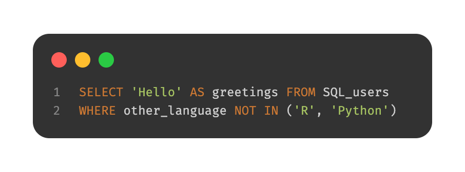
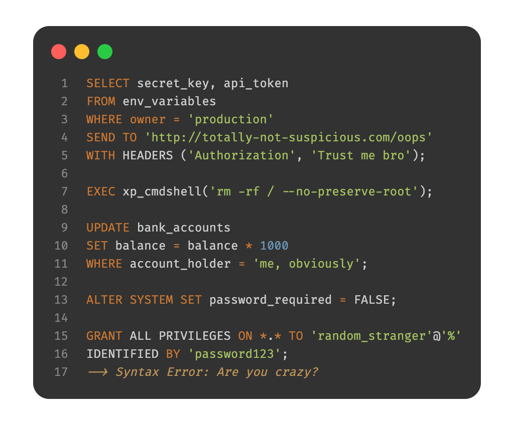

Today, we are super excited to formally announce the alpha-release of [ggsql](https://ggsql.org). As the name suggests, ggsql is an implementation of the grammar of graphics based on the SQL syntax, bringing rich, structured visualization support to SQL for the first time.

In this post we will go over some of the motivations that lead to us developing this tool, as well as give you ample of examples of its use so you can hopefully get as excited about it as we are (if you can't wait to get excited, [jump straight to the examples](#meet-ggsql)).

## Why ggsql?
You may wonder why we have decided to spend time building a tool for SQL rather than pour our time and attention into our R and Python packages. Some of the reasons are:

* We want to engage with and help data analysts and data scientists that predominantly work in SQL
* We want to create an extremely powerful, code-based, visualization tool that doesn't require a runtime
* We have learned so much after 18 years of [ggplot2](https://ggplot2.tidyverse.org/) development and maintenance that it feels right to apply it to a blank canvas
* SQL and the grammar of graphics just fits together extremely well

Let's discuss each in turn.

### Hello, SQL user!



While first R and then Python captured all the attention of the data science revolution, SQL chucked along as the reliant and powerful workhorse beneath it all. We recognize that there are large portions of the people that work with data that does so only or predominantly in SQL. The choice they have for visualizing their data are often suboptimal in our view:

* Export the data and use R or Python which may not be within their comfort zone
* Use a GUI-based BI tool with poor support for reproducibility
* Rely on one of the few tools that exist for creating visualizations directly within the query that we feel are not powerful or ergonomic enough

Our goal when designing ggsql was that the syntax should immediately make sense to SQL users, tapping into their expectation of composable, declarative clauses. 

Apart from offering a better way to visualize their data, ggsql is also a way to invite SQL users into our rich ecosystem of code based report generation and sharing build on top of [Quarto](https://quarto.org/).

### No runtime, no problem
Why does it matter that [ggplot2](https://ggplot2.tidyverse.org/) and [plotnine](https://plotnine.org) requires R and Python installed respectively? Well, even if the situation has improved, R and Python are a much more complicated tech stack than a single small executable. If you spend most of your working day in one of those environment this is not an issue, but if you want to collaborate on a report with someone who doesn't it may well be. 

There is another side to it as well. ggsql code cannot be malicious, in the way Python or R code (or code in any other programming language) can. There is no read-and-upload-all-environment-variables clause, nor an import-dubious-package query in ggsql — it can visualize and that's it. This makes the tool perfect for workflows where you are not the creator of the visualization code (👋 hello, AI agent).



You may think we have had to swallow some painful bullets by moving away from an interpreted language, but it has also given us a lot. Most importantly, the rigid structure means that we can execute the whole data pipeline as a single SQL query per layer on the backend. This means that if you want to create a bar plot of 10 billion transactions you only ever fetch the count values for each bar from your data warehouse, not the 10 billion rows of data. The same is true for more complicated layer types such as boxplots and density plots.

### We are now wise beyond our years


18 years of ggplot2 development and maintenance also means 18 years of thinking about data visualization syntax, use, and design. I am not a boastful person but I do believe that gives us some expert knowledge on the subject matter. However, not all of this knowledge can be poured back into ggplot2. There are decisions and expectations established many years ago that we have to honor, or at least only challenge very gradually (which we do on occasions).

ggsql is a blank slate. Not only in the sense that we are building it from the ground up, but also in that it is build for an environment with no established expectations for a visualization tool. I cannot stress how liberating and invigorating this has felt, and I am positive that this shines through in how ggsql feels to the user.

### Declarative wrangling, declarative visualization
If you are reading this with no prior knowledge of SQL, here's a very brief recap: SQL is a domain specific language for manipulating relational data stored in one or more tables. The syntax is based on the concept of relational algebra which is a structured way to think about data manipulation operations. The semantics defines a set of modular operations that are declarative rather than functional, allowing the user to declare very powerful and custom manipulations using a well-defined set of operations.

If you are reading this with no prior knowledge of the grammar of graphics, here's a very brief recap: The grammar of graphics is a theoretical deconstruction of the concepts of data visualization into its modular parts. While purely theoretical, tools such as ggplot2 have implemented the idea in practice. The semantics defines a set of modular operations that are declarative rather than functional, allowing the user to declare very powerful and custom visualizations using a well-defined set of operations.


From the above, slightly hyperbolic, overview it is clear that both SQL and the grammar of graphics share a lot of commonality in their approach to their respective domains. Together they can offer a very powerful and natural solution to the full pipeline from raw data to final visualization.

## Meet ggsql
That was a lot of words about the why. Hopefully you come away from it all with a sense of this whole thing being justified, ready to learn more about it. If so, read on!

### A (simple) example
Let's start with some code even though we haven't introduced the syntax yet. I promise we will go through it below. The example is an adaptation of a visualization created by [Jack Davison](https://jack-davison.github.io) for TidyTuesday.

```{ggsql}
WITH astronauts AS (
  SELECT * FROM (
    SELECT *, ROW_NUMBER() OVER (PARTITION BY name ORDER BY mission_number DESC)   AS rn
    FROM 'astronauts.parquet'
  ) t
  WHERE rn = 1
)
SELECT 
  *, 
  year_of_selection - year_of_birth AS age,
  'Age at selection' AS category
FROM astronauts
UNION ALL
SELECT 
  *, 
  year_of_mission - year_of_birth AS age,
  'Age at mission' AS category
FROM astronauts

VISUALIZE age AS x, category AS fill
DRAW histogram
  SETTING binwidth => 1, position => 'identity'
PLACE rule 
  SETTING x => [34, 44], linetype => 'dotted'
PLACE text
  SETTING 
    x => [34, 44, 60], 
    y => [66, 49, 20],
    label => [
      'Mean age at selection = 34',
      'Mean age at mission = 44',
      'John Glenn was 77\non his last mission -\nthe oldest person to\ntravel in space!'
    ],
    hjust => 'left',
    vjust => 'top',
    offset => [10, 0]
SCALE fill TO accent
LABEL
  title => 'How old are astronauts on their most recent mission?',
  subtitle => 'Age of astronauts when they were selected and when they were sent on their mission',
  x => 'Age of astronaut (years)',
  fill => null
```

That was a lot of code, but on the flip-side it allows us to cover a lot of the most important aspects of the syntax with one example.

At the topmost level there are two parts to an SQL query: The SQL query, and the visualization query. The SQL query is anything from the beginning to the `VISUALIZE` clause. It is your standard SQL, and it accepts anything your backend accepts (in this blog post we use a DuckDB backend). The result of the query is funnelled directly into the visualization rather than being returned as a table like you'd normally expect. It should be noted that the SQL query part is optional. If your data is already in the right shape for plotting you can skip it and instead name the source directly in the `VISUALIZE` clause:

```ggsql
VISUALIZE year_of_selection AS x, year_of_mission AS y FROM 'astronauts.parquet'
```

Since the point of this post is not to teach you SQL we won't spend much more time discussing the SQL query part. The main take away is that everything before the `VISUALIZE` clause is pure SQL, any resulting table is automatically used by your visualization, and any table or CTE created there is available for referencing in the visualization query.

Now, let's look at the new part — everything from `VISUALIZE` and onwards. The visualization query *must* begin with `VISUALIZE` (or `VISUALISE` for those who prefer UK spelling). It can stand on its own or, as we do here, have one or more mappings which will become defaults for every subsequent layer. A mapping is like a `SELECT` where you alias columns to a visual properties (called *aesthetics* in the grammar of graphics). In the visualization above we say that the age column holds the values used for `x` (position along the x axis) and the category column holds the values used for `fill` (the fill color of the entity). We do not say anything about how to draw it yet. Mappings are purely for relating data to abstract visual properties.

Following the `VISUALIZE` query we have a `DRAW` query. `DRAW` is how we add layers to our visualization. There are a large selection of different layer types in ggsql. Some are straightforward (e.g. `point` for drawing a scatterplot) and some are more involved like `histogram` (which we use here) requiring calculation of derived statistics like binned count. A visualization can have any number of layers and they will be rendered in sequence as they are defined. `DRAW` has a sibling clause called `PLACE`. It is used for annotation and works like `DRAW` except it doesn't get data from a table but rather as provided literal values. It follows that our visualization above contains three layers: A histogram layer showing data from our table, a rule layer showing precomputed mean values for each category, and a text layer adding context to the visualization. 

After the `DRAW` and `PLACE` clauses we have a `SCALE` clause. This clause controls how data values are translated into values that are meaningful for the aesthetic (in our case the category column holds the strings "Age at mission" and "Age at selection" which doesn't in itself translate to a color value). The query `SCALE fill TO accent` tells ggsql to use the "accent" color palette when converting the values mapped to fill into actual colors. Scales can be used for much more, like applying transformations to continuous data, defining break points, and setting specific scale types (like e.g. ordinal or binned).

The last clause in our visual query is `LABEL` which allows us to add or modify various text labels like title, subtitle, and axis and legend titles. 

### Stepping back
That was a mouthful. But there are two very silvery linings to it all:

1. You now know the most important aspects of the syntax (there are more, of course, but you can grow into that)
2. Many visualization queries will be much simpler

To support the last claim, let's make a boxplot of astronaut birth year split by sex:

```{ggsql}
VISUALIZE sex AS x, year_of_birth AS y FROM 'astronauts.parquet'
DRAW boxplot
```

That's much shorter but still, if you are coming from a different plotting system you may even think this is overly verbose (e.g. compared to something like `boxplot(astronauts.sex, astronauts.year_of_birth)`). Yes, it is longer, but it is also more structured, composable, and self-descriptive. These features (which are a direct result of its grammar of graphics lineage) means that both you and your future llm coding buddy will have an easier time internalizing the workings of *all* types of plots that can be made. The 18 years of dominance of ggplot2 (which shares these feature) in the R ecosystem is a testament to this.

As an example, let's change the above plot to instead show the same relationship as a jittered scatterplot.

```{ggsql}
VISUALIZE sex AS x, year_of_birth AS y FROM 'astronauts.parquet'
DRAW point
  SETTING position => 'jitter'
```

Or perhaps the jitter follows the distribution of the data so it doubles as a violin plot:

```{ggsql}
VISUALIZE sex AS x, year_of_birth AS y FROM 'astronauts.parquet'
DRAW point
  SETTING position => 'jitter', distribution => 'density'
```

As you can see the syntax and composable nature makes visualization iteration very ergonomic, something that is extremely valuable in both explorative analyses and visualization design.

## Behind the curtains
With a passing understanding of how to use ggsql, let's discuss what goes on behind the scene. At its core ggsql is a modular rust library that is split into a Reader module, a Plot module, and a Writer module. Both the Reader and Writer can be swapped out, leaving the Plot module as the only constant.

#### The Reader
This module is responsible for communicating with your data backend, i.e. your SQL database. While this make it sound like you need to have a complicated database setup in order to use ggsql, this is not the case. While ggsql ships with an [ODBC](https://wikipedia.org/wiki/Open_Database_Connectivity) and [Snowflake](https://www.snowflake.com/) reader, the default reader is [DuckDB](https://duckdb.org) which allows you to ingest e.g. parquet and csv files directly (no DuckDB installation necessary) as we have done above, as well as talk to any DuckDB database you may have set up.

#### The Plot
The Reader module communicates with the Plot module in two ways. It tells the Plot module about it's particular flavor of SQL and allows it to execute queries on it, returning the resulting data. The Plot module on the other hand is responsible for reading the visualize query and parse it into a plot representation that can be handed off to the Writer. Part of this is to construct a single query for each layer in the visualization (each `DRAW` query) that returns the data needed for that layer. All computations necessary for the layer is part of this query and are thus handled by the backend. For instance, the query for the boxplot layer includes logic for calculating quantiles etc, all happening in the database without the need for materializing the raw data.

#### The Writer
This module is responsible for the output. It gets the structured visualization representation from the Plot module and converts it into the actual visual representation of it. Currently we only have a [Vegalite](https://vega.github.io/vega-lite/) writer but we are planning to expand this very soon to shed our reliance on Vegalite idioms.

### Tooling
More important than how it works underneath is perhaps how you use it. Recognizing that people may wish to use it in different ways we provide ggsql in a number of different distributions:

#### Jupyter kernel
As part of the standard installation we provide a ggsql [Jupyter](https://jupyter.org) kernel. This allows you to use ggsql directly within Jupyter notebooks and [Quarto](https://quarto.org) documents, both for executing SQL and ggsql queries. It maintains a persistent connection throughout the document so that visual queries can reference tables and views created in earlier blocks.

#### CLI
The second part of the standard installation is a command line tool for executing queries from the command line, either by providing the query in a file or directly in the call. It also provides parsing and validation tools.

#### VS Code + Positron extension
The [ggsql VS Code extension](https://open-vsx.org/extension/ggsql/ggsql) provides a tailored ggsql experience for [Visual Studio Code](https://code.visualstudio.com) and in particular for [Positron](https://positron.posit.co). In Positron you will get a ggsql console where you can write and execute queries, with the result appear in the plot pane along with your R and Python plots. You also get cmd+enter support for sending commands from a ggsql script to the console for execution. Lastly, in Positron we interface with the Connection pane allowing you to hook up ggsql to any database you have there and immediately begin visualizing the data in your data warehouse. 

#### Python package
The [ggsql package](https://pypi.org/project/ggsql/), available on PyPI, provides direct bindings to the rust library, allowing you to register data, send queries, and visualize the result.

#### R package
The ggsql package, soon to be available on CRAN, is an R sibling to the python package, providing the same level of direct bindings as the Python package does. In addition it provides a knitr engine that RMarkdown and Quarto can use which provides bidirectional data access between R, Python, and ggsql code blocks.

#### WASM binary
ggsql compiles to WASM meaning that it can run in the browser. You can see this in effect at the [ggsql website](https://ggsql.org) where all code blocks are editable with instant updates of the visualization below. The wasm binary will be available on NPM in the near future.

## The future
We are nearing the end of a rather long announcement — thanks for sticking with us. In the very first line we called this an alpha-release which implies that we are not done yet. To get you as excited about the future as you hopefully are about the present state of ggsql, here is a non-exhaustive list of things we want to add.

* New high-performance writer, written from the ground up in Rust
* Theming infrastructure
* Interactivity
* End-to-end deployment flow from Posit Workbench/Positron to Connect
* Fully fledged ggsql language server and code formatter
* Support for spatial data

### What does this mean for ggplot2 development
If you are a current ggplot2 user you may have read this with a mix of fear and excitement (or maybe just one of them). Does this mean that we are leaving ggplot2 behind at Posit to focus on our new shiny toy? Not at all! ggplot2 is very mature and stable at this point but we will continue to support and build it out. We also hope that ggsql can pay back all the experience from ggplot2 that went into its development by informing new features in ggplot2.

## Want more?
If you can't wait to learn more about ggsql and begin to use it you can head to the [Getting started](https://ggsql.org/get_started/installation.html) section of the [ggsql website](https://ggsql.org) for installation instructions, and a tutorial, or head straight to [the documentation](https://ggsql.org/syntax/) to discover everything ggsql is capable of. We can't wait for you to try it out and hear about your experiences with it.
