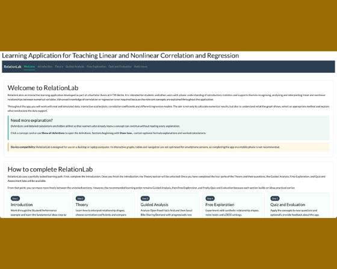

> Welcome to our newsletter, posit::glimpse()!
>
> If you're currently reading this on our blog, consider subscribing to Product Updates - Open Source on our <a href="https://posit.co/about/subscription-management" target="_blank" rel="noopener">subscription page</a> to receive this newsletter directly in your inbox.

Every month, we round up some of the most important open-source news for Posit's community! We hope that you enjoy this newsletter and maybe even share it with a friend.

The table of contents on the right can help you navigate through all the updates. As you scroll, it will open up to show you subcategories →

## Announcements

### Register for posit::conf(2026)

Register for our annual conference, [posit::conf(2026)](https://posit.co/conference/), happening September 14-16 in Houston and online! The amazing [speakers](https://posit.co/blog/posit-conf-2026-agenda-breakdown) and [workshops](https://posit.co/blog/workshops-at-positconf2026) will make for a wonderful time. [Register for posit::conf here](https://conf.posit.co/2026/registration/).

For the first time, the live streams will feature automatically translated subtitles, available in French, German, Italian, Portuguese, and Spanish.

Tidy Dev Day is on September 17, a unique opportunity to collaboratively tackle open-source issues and work directly alongside the very developers who build and maintain the tools you use every day. [Learn more about Tidy Dev Day here](https://opensource.posit.co/blog/2026-06-25_tidy-dev-day-2026/).

### Migrating to Connect Cloud

A thank-you to everyone who published on rpubs.com, quartopub.com, shinyapps.io, and bookdown.org. We're consolidating all our publishing tools into one: [Posit Connect Cloud](https://connect.posit.cloud/). Connect Cloud is built to handle all of the content types in one place, with one account, and we hope to make your transition as smooth as possible.

* Learn more in the [Migrating to Connect Cloud: Posit's unified publishing solution blog post](https://posit.co/blog/migrating-connect-cloud-posits-unified-publishing-solution).
* Join our [webinar on the migration process happening September 9th](https://posit.co/webinar/connect-cloud-migration).

## Key product updates and new releases

### httr2 1.3.0

[httr2](https://httr2.r-lib.org/) is a comprehensive HTTP client for R for working with web APIs. httr2 1.3.0 introduces a breaking change to OAuth token caching that requires one-time re-authentication. Recent patches added 200x faster streaming for short-line responses, OAuth server metadata discovery, OpenTelemetry tracing support, and `httr2_translate()` for converting requests to curl commands.

* Read more in the [httr2 1.3.0 blog post](https://opensource.posit.co/blog/2026-07-14_httr2-1-3-0/).

### ir 0.1.0

Introducing [ir](https://r-lib.github.io/ir/) 0.1.0, a command-line tool for running self-describing R scripts and Quarto documents with embedded package dependencies and R version requirements, inspired by Python's PEP 723 and `uv run --script`. The tool supports isolated environments, CRAN snapshot dates, mixed R/Python workflows, and caches resolved dependencies for efficiency, enabling one-file workflows without full project structures.

* Read more in the [ir 0.1.0 blog post](https://opensource.posit.co/blog/2026-07-23_ir-0-1-0/).

### lorax

[lorax](https://lorax.tidymodels.org/) introduces a unified interface for characterizing tree- and rule-based models across 12 implementations including ranger, XGBoost, LightGBM, and random forests. The package enables extracting decision rules, identifying active predictors, converting trees to partykit format for visualization, and accessing variable importance scores through consistent APIs that work across diverse tree model packages.

* Read more in the [Introducing lorax: Speaking for the Tree-Based Models blog post](https://opensource.posit.co/blog/2026-07-28_lorax/).

### mcptools 1.0.0

[mcptools](https://posit-dev.github.io/mcptools/), an R SDK for the Model Context Protocol, is now on CRAN. It brings image support for rich content in both directions, native authenticated remote server connections eliminating the npm dependency, and streamlined [Posit Connect](https://posit.co/products/enterprise/connect) deployment via `_server.yml`. This R SDK for the Model Context Protocol enables deploying R functions as MCP servers and fetching third-party MCP tools as R functions.

* Read more in the [mcptools 1.0.0 blog post](https://opensource.posit.co/blog/2026-07-06_mcptools-1-0-0/).

### Quarto 1.10

[Quarto](https://quarto.org/) transforms Markdown, code, and computational output into publication-ready articles, reports, presentations, websites, and books. Version 1.10 introduces offline HTML accessibility checking with bundled axe-core and WCAG conformance level targeting, plus localized string support for template authors. The release includes important fixes for `quarto preview` reliability, shortcode resolution in math expressions, and updated dependencies including pandoc 3.10 and typst 0.15.1.

* Read more in the [Quarto 1.10 blog post](https://opensource.posit.co/blog/2026-08-03_quarto-1-10/).

### raghilda v0.2

[Raghilda](https://posit-dev.github.io/raghilda/) is a Python package for building RAG (Retrieval-Augmented Generation) solutions. This release focuses on production-ready features for scaling RAG pipelines, with crawl and ingest API with caching and concurrency, a CloudflareCrawler for JavaScript-rendered sites, a PostgreSQL store backend, and NVIDIA NIM embeddings.

* Check out the [raghilda v0.2 blog post](https://opensource.posit.co/blog/2026-07-01_raghilda-0-2-0/).

### roxygen2 8.1.0

[roxygen2](https://roxygen2.r-lib.org/) 8.1.0 improves performance with consolidated `importFrom()` directives that reduce package loading time from ~120ms to ~9ms for 1,000 imports, and introduces the rdtools package for faster cross-reference resolution during documentation generation. The release also adds multi-line support for `@importFrom` directives with hanging indents.

* Check out the [roxygen2 8.1.0 blog post](https://opensource.posit.co/blog/2026-08-04_roxygen2-8-1-0/).

### Shiny updates

[Shiny](https://shiny.posit.co/) is the framework for building interactive web applications in R and Python. Shiny for R 1.14 adds `startApp()` for non-blocking app launches and `session$destroy()` for proper module cleanup. Shiny for Python 1.7 includes bundled Agent Skills for coding agents and test mode with live JSON snapshots. bslib 0.12 introduces offcanvas panels that slide in from viewport edges, plus direct sidebar handle resizing.

* Read more in the [Shiny updates blog post](https://opensource.posit.co/blog/2026-08-04_shiny-r-1-14-python-1-7/).

## Positron learning resources

The Positron team is on a roll. Here are the key features from the [July Release Highlights](https://opensource.posit.co/blog/2026-07-13_positron-2026-07-release/):

- **The Positron Notebook Editor now serves as the default option for .ipynb files**: You get a fully integrated experience for Jupyter Notebooks out of the box. Key tools like environment management, version control, and AI coding support work automatically the moment you open any .ipynb file.
- **The Packages pane has officially transitioned out of preview status**: Inspect, update, and explore installed libraries without leaving your IDE or relying on Terminal commands.
- **Posit Assistant has reached general availability**: AI assistance is enterprise-ready: enjoy full-fledged coding assistance, debugging help, and inline explanations directly in your workflow with improved stability and performance.
- **Support for opening Excel workbooks has been added to Data Explorer**: No need to export to CSV or switch to Microsoft Excel to check your data: preview, filter, inspect .xlsx sheets directly inside Positron before running any code.
- **Enhanced language intelligence for R**: Navigating large R projects is much faster and less error-prone with features like Go to Definition, Find References, and Rename Symbol that work across all packages and scripts in your workspace. Diagnostics update instantly even when files change externally.

The team has also shared several blog posts packed with tips and tricks for getting the most out of Positron:

* [Discover how Positron paired with uv configures your Python environment in just one click](https://opensource.posit.co/blog/2026-07-08_positron-uv/)
* [Explore strategies for seamlessly managing your R and Python environments within Positron](https://opensource.posit.co/blog/2026-07-15_positron-environment-management-tips/)

## Let's learn about AI

**You can now receive the AI newsletter via email!** Paste the newsletter's [RSS feed URL](https://opensource.posit.co/tags/ai-newsletter/index.xml) into a free RSS-to-email service like https://blogtrottr.com/ to receive the newsletter by email.

* AGENTS.md, Skills, MCP servers, oh my! If you've heard all these terms and want to investigate the differences, check out the [July 3rd edition of the AI Newsletter](https://opensource.posit.co/blog/2026-07-03_ai-newsletter/).
* LLMs often miss subtle visual artifacts in data visualizations, and there are ways of evaluating their oversights. Learn about bluffbench in the [July 17th edition of the AI Newsletter](https://opensource.posit.co/blog/2026-07-17_ai-newsletter/).
* [Posit Assistant](https://assistant.posit.co/) in Positron now includes an EDA log feature to help you keep track of exploratory analysis done with the agent. Learn more in the [July 31st edition of the AI newsletter](https://opensource.posit.co/blog/2026-07-31_ai-newsletter/).

## Do you want event recordings? You got them!

"Will this be recorded?" If it is, you can access our recordings directly on the [event pages](https://opensource.posit.co/events/), and we do our best to post them as quickly as possible.

Be sure to catch the presentations featured below, including Teun van den Brand's session on ggsql and Rich Iannone's presentation on Great Docs:


- resources/videos/2026-06-30_duckcon-7-ggsql-a-grammar-of-graphics-for-sql-teun-van-den-brand/
- resources/videos/2026-07-06_great-docs-the-future-of-documentation-the-python-exchange-june-2026/


Additionally, we have some fantastic recordings from the [Data Science Lab](https://pos.it/dslab). Watch the Lab Managers share their expertise while live coding:


- resources/videos/2026-07-24_live-tidytuesday-data-viz-workflow-nicola-rennie-data-science-lab/
- resources/videos/2026-07-23_mind-blowing-quarto-slide-extensions-emil-hvitfeldt-data-science-lab/


We hope you learn a lot from these resources!

## Showcases from the community

We love learning what you are up to. If you have a project using our tools to share, please let us know. In particular, I'd love to hear how you're adopting and using Positron! Find me on [LinkedIn](https://www.linkedin.com/in/ivelasq/) and [Bluesky](https://bsky.app/profile/ivelasq.bsky.social).



Alfredo H. S. shared a small, opinionated skill for turning papers and other source material into concise Quarto RevealJS presentations with AI coding agents.

Try it out, and let Alfredo know how it goes!

* [Forum discussion](https://forum.posit.co/t/a-small-quarto-ai-skill-for-better-slides/215878)
* [About the skill](https://alfredohs.com/blog/quarto_talks/)
* [SKILL.md](http://SKILL.md)

---





---

REYL Intesa Sanpaolo's Risk Management team built their own Incident Management Tool with Shiny and Posit Connect, cutting incident follow-up from days to 30 minutes. Now, they're eyeing the same R-and-Connect pattern for liquidity monitoring, credit risk appetite, and stress testing.

- [Check out the spotlight](https://posit.co/about/customer-stories/reyl-intesa-sanpaolo)





Interested in testing your regression skills? Angela Heberger is looking for feedback on RelationLab, an interactive Shiny app for learning correlation and regression. Give it a shot and let Angela know what you think!

* [Forum discussion](https://forum.posit.co/t/feedback-requested-on-relationlab-an-interactive-shiny-app-for-learning-correlation-and-regression/216954)
* [Shiny app](https://angela-heberger.shinyapps.io/correlation-regression-learning-app/)

---



We usually find these projects on social media. If you're on LinkedIn, be sure to follow and tag [Posit Open Source](https://www.linkedin.com/showcase/posit-open-source/) for us to share the amazing things you're working on!

## What’s next

Besides posit::conf (have you [registered for conf](https://conf.posit.co/2026/) yet? You should\!), we have lots of goodies on the horizon.

* Emil Hvidtfelt is leading a 2-hour workshop all about making great slides in Quarto on Aug. [Register here](https://events.zoom.us/ev/AhS1wYPFlx9m2sfuhnidFjnvI2UlS3PKv6JRVL_bv4UUydDxeKnK~AtgzvV6vmUoaeLU-9KZrRyj3QUGklZmSV2a1hFRfixtmtlszjyaUoneXVw)\!
* Join us for an upcoming [Data Science Hangout](https://pos.it/dsh) or [Data Science Lab](https://pos.it/dslab).

I would love to know how to make the Glimpse newsletter better. Email me at isabella \[dot\] velasquez \[at\] posit.co.
