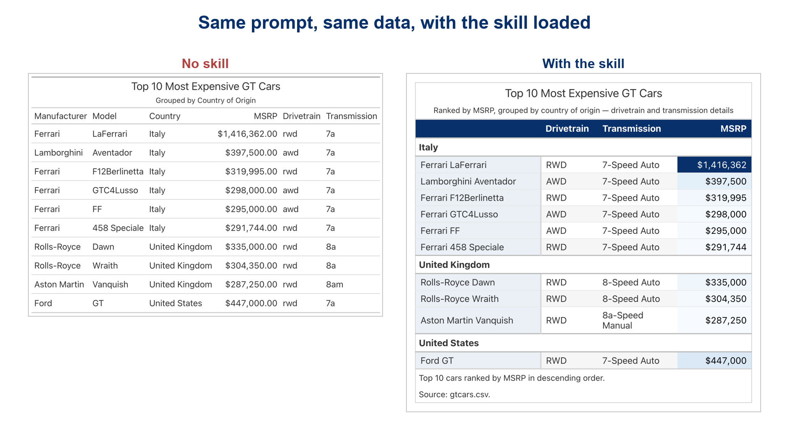
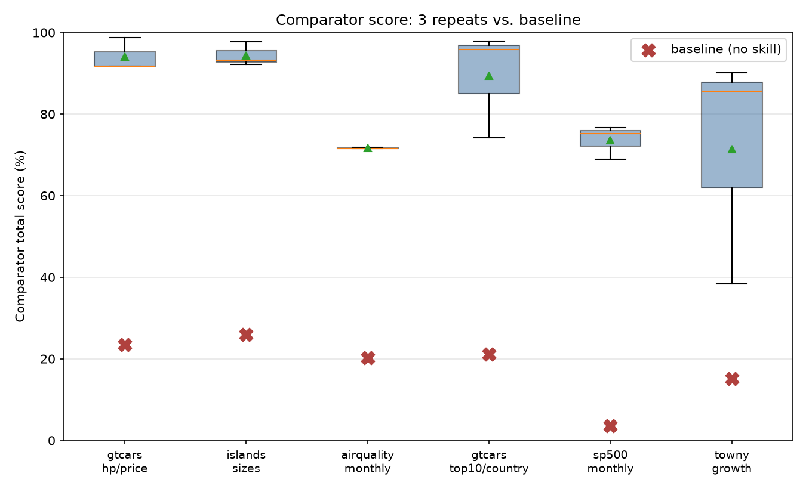
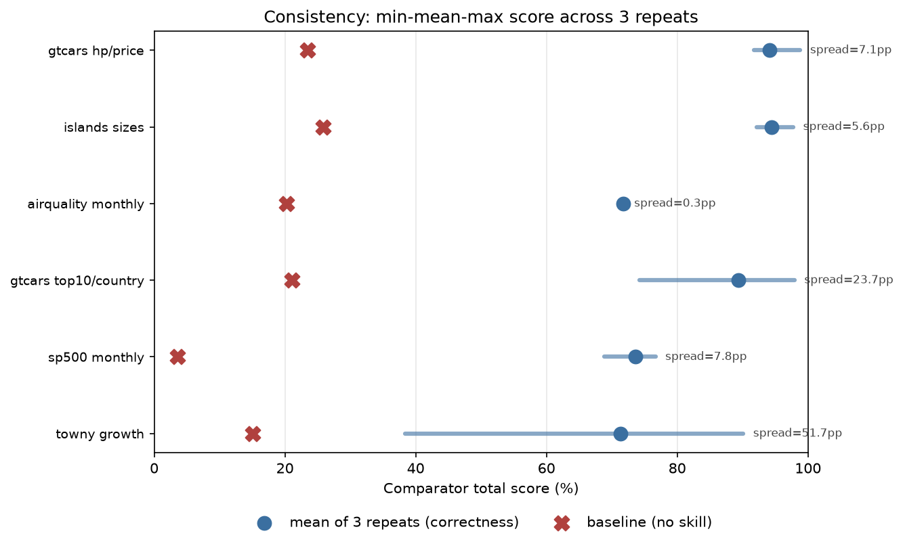
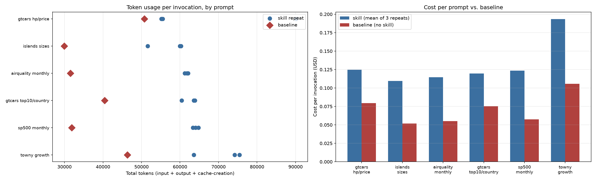
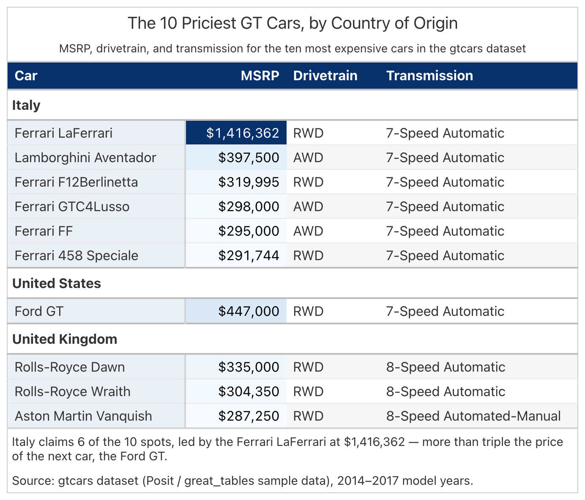

Ask an LLM to turn a CSV into a table and you'll get something back. The
question is whether it looks like someone actually designed it, or like the
model just picked colors and layout on a whim and moved on to the next
thing. [**Great Tables**](https://github.com/posit-dev/great-tables) already has everything you need to
build a genuinely good table in Python. The harder problem is getting an
agent to reach for all of it, the same way, every time it's asked. That's
what an [**Agent Skill**](https://posit-dev.github.io/great-docs/skills.html) is for: a folder of instructions the
agent reads before it writes any code, so the same design decisions get made
the same way on every run instead of getting reinvented from scratch. The
skill this post is about is a small one, built around a single worked
example instead of a long step-by-step procedure, and keeping it small
doesn't seem to cost much in quality.

## Why table design is worth getting right

A table isn't good just because the numbers in it happen to be correct.
Getting it right means a whole list of smaller decisions actually line up.
Color should draw your eye toward what matters instead of sitting there for
decoration. A title and subtitle should tell you what you're even looking
at. Whatever measure the request is actually about should be the one that's
colored, not every numeric column and not none of them. Rows that fall into
natural categories should be grouped so you're comparing within a group
instead of across the whole table at once. And a caption should say where
the numbers came from, or state whatever judgment call the table maker had
to make on an ambiguous request, instead of leaving it unsaid.

An LLM makes every one of those calls whether you notice it happening or
not. Left alone, it tends to make a different set of them each time you ask.

## What the skill actually changes

Here's the same prompt, run against the same data with the same model, once
with no skill loaded and once with the skill attached: "Build a table
showing the top 10 most expensive gt cars, grouped by country of origin,
including their drivetrain and transmission details."

Without the skill, this is close to a bare dump of the data. There's a
plain title and subtitle, the numbers are correct, but the request to group
by country never happens. All 10 cars sit in one flat list, MSRP is just
another plain number among the rest, and there's no source note. With the
skill attached, the same prompt and the same data come back grouped under
Italy, United Kingdom, and United States headers, sorted by price within
each group. MSRP carries a sequential blue heatmap running up to the Ferrari
LaFerrari's \$1.4 million entry, drivetrain and transmission sit under a
shared navy header band, and a source note states where the data came from.
Nobody touched the prompt or cleaned the output up by hand afterward. On
this project's own scoring, a deterministic comparator that checks a
rendered table against a hand-authored ground truth instead of an LLM's
opinion of which one looks nicer, the unstyled version scores 21.1%. The
skill-produced one scores 95.9%.

## How the skill stays thin

A lot of skill designs drive every table through a fixed, numbered
procedure: a router file that dispatches the request to a per-shape
reference example, then a palette doc, then a checklist, sometimes a
checker script that reruns the whole thing until a pass/fail loop is
satisfied. That gets you consistency, but it means reading four or five
files before writing any code, for a two-column list of islands just as
much as for a multi-metric growth ranking.

This skill works off three files instead, read in a fixed order:

1.  **One reference script.** A single script that's both a runnable worked
    example (run it directly and it renders its own reference table) and an
    importable helper module: a shared color palette, plus small helper
    functions for the frame, the header band, row striping, a stub tint, a
    heatmap, a status chip, a summary row, group emphasis, and label
    cleanup. There's no separate directory of examples to choose between.
    Every shape's worked block (a currency hero measure, a signed percent, a
    categorical status column, a stub, a group, a summary row) lives in
    this one file, and the agent pattern-matches whichever block fits its
    data.
2.  **A short data-definitions file**, read before the data becomes
    anything more than a CSV. It answers what actually identifies a row,
    what a named-but-not-literal measure like "growth" is supposed to
    compute, and how to break a tie when two measures both look like
    reasonable candidates for coloring.
3.  **A short rules file**, read last, for the one rule that applies to the
    column kind just matched. It points back at the exact function in the
    reference script by name instead of re-explaining the code.

That's the whole workflow. No router file, no numbered sequence, no checker
loop. A real transcript of the skill in use comes out to eight tool calls
end to end: invoke the skill, read the data, read the one script, read the
one rules section, write the table script, run it, and look at the
rendered PNG.

Thin doesn't mean undisciplined, though. A short list of things is
non-negotiable on every table the skill produces, no matter how simple the
request looks. A title and a subtitle, always both. Two source notes: an
analytical caption stating the finding or whatever ambiguous call got made,
then a separate provenance note. A boxed frame around the whole table.
Body-row hairlines pinned to a specific tone (`great_tables` already draws
a hairline by default in library gray, so skipping this call doesn't remove
the line, it just leaves it the wrong color). And a single mandatory render
call at the end. Color restraint belongs on that list too: only the
measure the request is actually about gets a heatmap, and everything else
stays fully plain, no fill, no bold, nothing. Row striping and a tinted
stub are genuinely conditional on the data, but conditional here means the
gate gets checked every time, not that it's fine to skip when a table looks
simple enough not to need it. And above all of it sits one more rule: an
explicit instruction in the user's prompt always wins over a default.

## The numbers

One example doesn't prove much on its own, so the project ran this same
comparison across a corpus of six prompts, three repeats each, scored
against a ground truth someone built by hand for every prompt.

Averaged across the whole corpus, the skill's mean comparator score is
82.4%, against 18.2% with no skill loaded. That gap holds up prompt by
prompt, not only once everything gets averaged together.

Consistency is where a thin skill has the most to prove. One worked example
has to pin down as much run-to-run agreement as a whole written procedure
would. Across the corpus, the skill's repeat-to-repeat spread averages 16.0
percentage points, but that average hides a wide range. The monthly air
quality summary converges to within three tenths of a point across all
three repeats. The population growth prompt, which asks for the fastest
growing towns by one measure while also asking to compare a second, related
measure across five census periods, spreads 52 points from its lowest
repeat to its highest. That prompt asks the model to resolve more open
judgment calls than any other in the corpus, so it's the one place a single
worked example has the least to point to.

None of that consistency comes for free. Reading the skill's files before
writing any code costs more tokens than not reading anything at all: about
64,000 tokens per table on average, against roughly 38,000 with no skill
loaded. The cost gap lands in about the same place, \$0.131 per table with
the skill attached against \$0.071 without it. For a jump from 18% to 82% on
the answer key and a repeat spread of 16 points, that seems like a fairly
small price per table.

## Checking it against the answer key

Scoring well against a deterministic checklist is one thing. What actually
matters is whether the table is right: the correct measure colored, on the
correct kind of scale, the finding actually stated. So put the skill's
`gtcars` table next to the project's own hand-built answer key for that
exact prompt.

And here's the skill's table again, for direct comparison.

The two are close. Same grouping by country, same measure carrying the
same sequential blue heatmap, same sort order within each group. On this
prompt the skill's table scores 95.9% against the ground truth: 49 of 51
possible points on data compliance, 44 of 46 on formatting. Where it loses
ground is column choice and ordering rather than anything structural. The
ground truth builds a single stub column that combines manufacturer and
model, then places MSRP right after it so the hero measure reads first.
The skill's version keeps the car name as its own stub but puts drivetrain
and transmission before MSRP, so the price the table is actually about
shows up last instead of second. The ground truth's caption also names a
specific finding, that Italy claims 6 of the 10 spots, while the skill's
caption states a more generic one. Those are real gaps, but they're about
polish and ordering, not about whether the table did what was asked.

## Get it

This skill lives in Hrudith Lakshminarasimman's [`gt-skill`
project](https://github.com/HrudithL/gt-skill), along with the harness that ran this evaluation and the
ground-truth corpus referenced above. It isn't bundled into a package
install the way the main `great_tables` skill is, at least not yet. To use
it, copy the skill's folder out of that repo's `.claude/skills/` directory
into your own project's `.claude/skills/`, the same place an agent already
knows to look. Read the skill's own top-level instructions file first. It's
the short file that tells you which of the other files to open next, and in
what order.

We're happy to talk more about any of this over on our
[Discord server](https://discord.com/invite/Ux7nrcXHVV).
