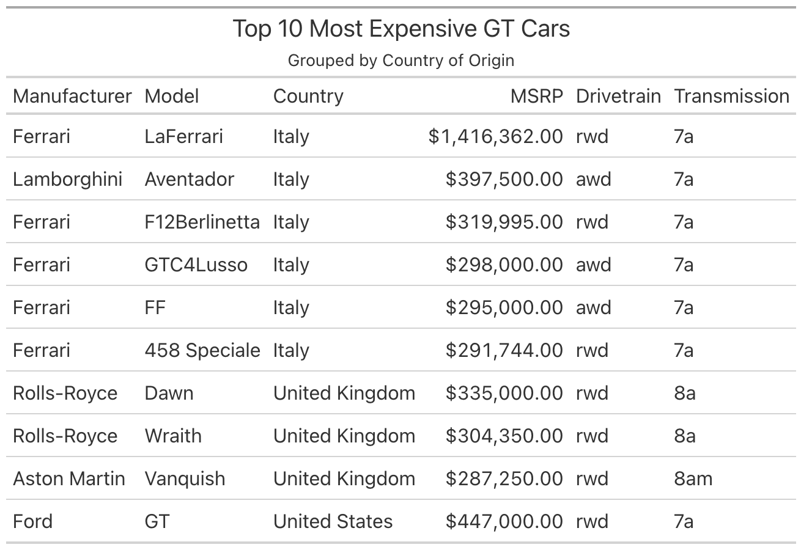
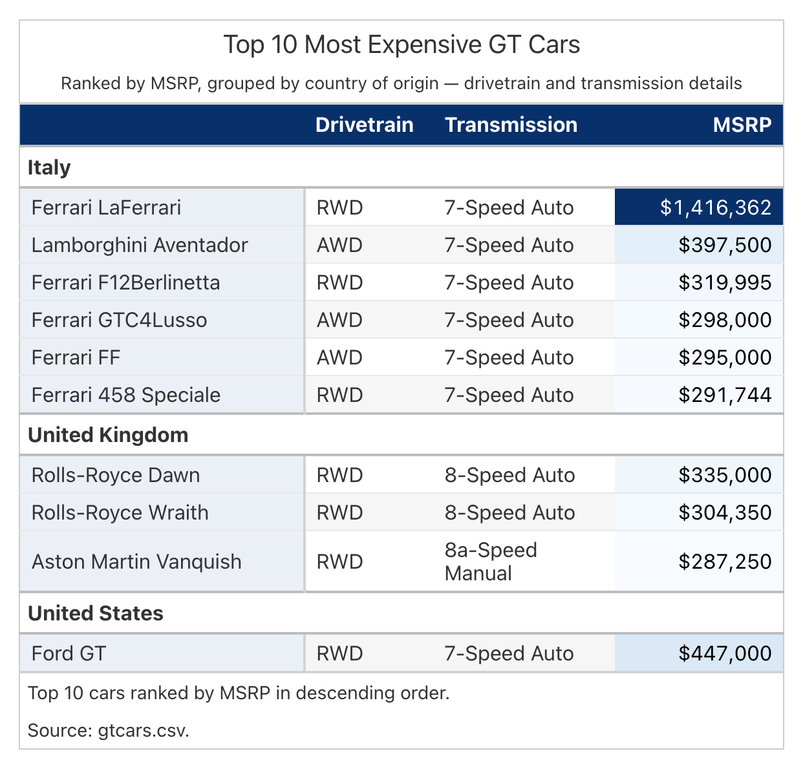
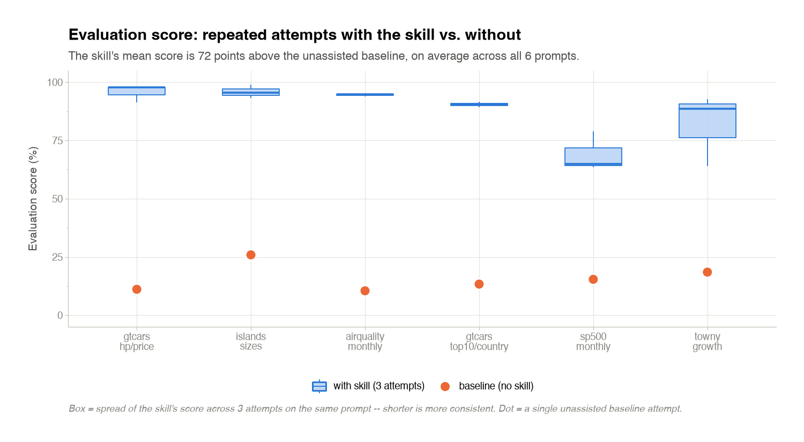
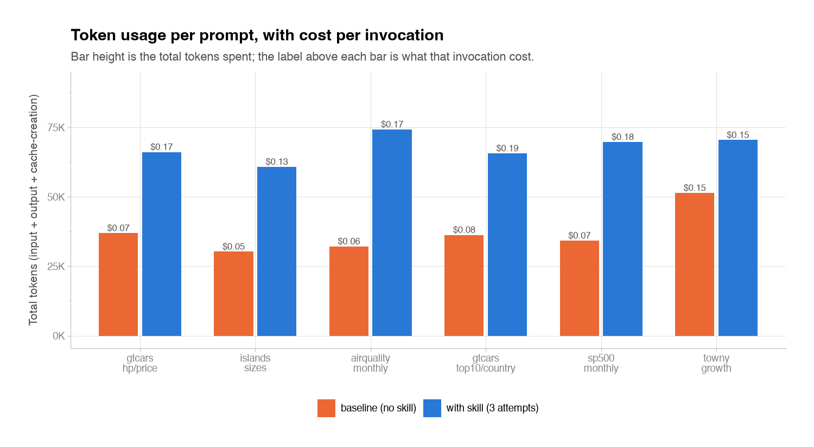

Tables are great!
They let us show off a bunch of data in an easily understandable method, highlighting the information that is truly important.
Plenty of data scientists now use LLM's to help them write code and produce tables and though [Great Tables](https://github.com/posit-dev/great-tables) provides everything needed to produce phenomenal tables, getting an LLM to use everything wisely is often a struggle.
To bridge this gap, the Great Tables Skill handles explaining the structure of a good table and how to use the features provided by Great Tables to consistently build a high quality table.
It sits alongside the package itself, so once it's installed there's nothing extra for the analyst to load in and no change to the prompt they were already going to write.

## Why do we need a skill

When building a table, there is a lot to consider.
Changes as simple as the ordering of columns can greatly affect the way a reader interprets and thinks about the table.
Without any guidance, LLM's are not able to capture the scope of this problem in its entirety and produce tables that are unclear, basic and poorly formatted.
The little decisions add up quickly, and getting any of them wrong turns a table into just numbers on a page.

{width="82%" fig-align="center" fig-alt="A GT Cars table generated without the skill: a flat list of 10 cars with a plain title, no grouping, no color, and no source note."}

Taking a look at this table, it's not clear what we want to focus on or what is valuable information.
Instead everything is just simply shown and it is up to the reader to think about what the data means and derive a conclusion.

{width="82%" fig-align="center" fig-alt="The same GT Cars table generated with the skill loaded: cars grouped under Italy, United Kingdom, and United States headers under a navy header band, a sequential blue heatmap on MSRP, and a source note."}

Now considering this, its obvious to focus on the heatmapped column and the distinction of groups.
The table naturally guides the reader into gaining meaningful information about the data.
The color, the groups, and the source note all do their part, and none of it needed extra prompting from us.

This is the fundamental purpose of the skill.
It allows data scientists to not change anything about their prompt and get a higher quality table from their LLM.
Same request, same data, better table.

## How does the skill work

At a high level, the skill is a flowchart of guidance.
It simply provides the LLM with answers to subjective choices like "How should I format this column?" or "What columns should be spanned together?" so that the LLM can simply follow guidelines and produce results similar to what a data scientist would need to showcase their data.
That guidance lives in just three files: one worked example script that the agent reads once, a short rules file for per-column decisions, and a small data-definitions file that pins down what a row actually is and what an ambiguous measure like "growth" should compute to.
There isn't a big procedure to memorize, just a reference table to pattern-match against.

To test this, we sandboxed an LLM agent, provided it with a prompt and evaluated its performance on this prompt compared to a baseline (without using the skill) and a ground truth (human-made ideal table).
We then repeated this process on various prompts and measured the consistency of the agent's output using the skill, we can track and improve its performance.
The prompts themselves span easy, medium and hard difficulties, ranging from a plain list of islands to a top-N ranking with an ambiguous growth measure.
For more information about this, check out the testing harness repository [GT-SKILL](https://github.com/HrudithL/gt-skill).

## The Numbers

To evaluate the overall performance of the skill, the LLM agent was evaluated against the entire corpus of prompts and benchmarked on its accuracy to the ground truth.
To measure that the skill was producing high quality tables consistently, we tested the agent against each of these prompts several times.
Each score reflects how closely the agent's rendered table matches the ground truth on the same rules the skill is built around, so the ceiling is a table an analyst would happily ship.

{width="95%" fig-align="center" fig-alt="Box plot of evaluation scores across six prompts, comparing repeated attempts with the skill against a no-skill baseline; the skill's mean score is 63 points above the unassisted baseline on average."}

Here we have the results of this evaluation and there is a noticeable increase in performance accuracy.
Notably, this quality improvement is not just a singular instance but consistent over many separate queries, proving the influence of the skill.
On average, the skill's mean score comes in about 63 points above the unassisted baseline, and the runs cluster tightly enough that the jump isn't just one lucky attempt.

{width="95%" fig-align="center" fig-alt="Bar chart of token usage per prompt, comparing the skill against a no-skill baseline, with cost per invocation labeled above each bar."}

To truly understand the improvement made by the skill we must also factor in the cost and token consumption of the skill.
Naturally, the added specification and guidance provided by the skill give the model to read and think about, therefore causing the costs to increase.
However, it is important to note that though there is an increase, the price per table only increases by $0.05 - $0.10.
For most projects that cost is negligible, especially weighed against the jump in quality.

## Get it

To get this skill today, simply installing `great_tables` already installs the skill.
`SKILL.md` and its reference files ship inside the package itself, so there's nothing extra to download.
For an agent to actually find it, though, it needs to sit in a folder an agent knows to look in, like `.claude/skills/great-tables`, and that part is a separate step:

```sh
python -m great_tables.skill install
```

That copies the skill out of the installed package and into `.claude/skills/great-tables`, ready for an agent to read.
Point a different agent's skill installer at the same folder, or copy it out by hand, either works. 

If you would like to discuss this skill or anything else Table related in more detail, please do so in the format of issues and discussion in the [Great Tables repo](https://github.com/posit-dev/great-tables)!
