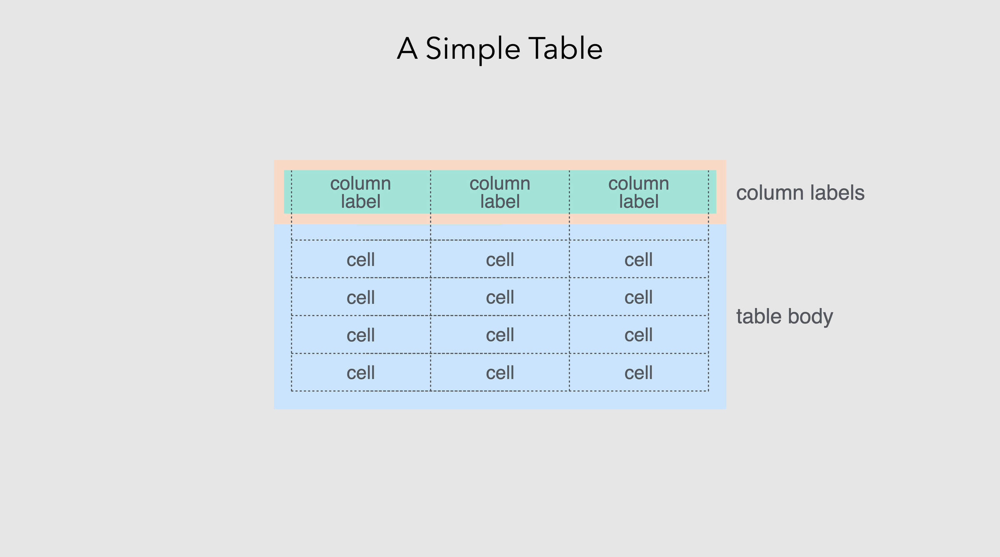
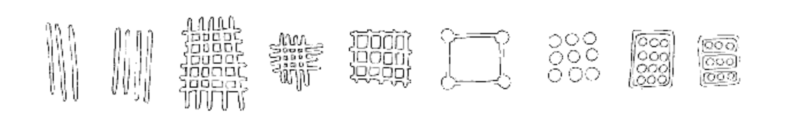
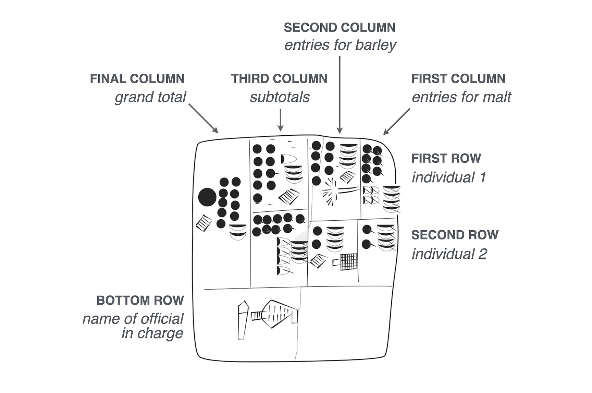
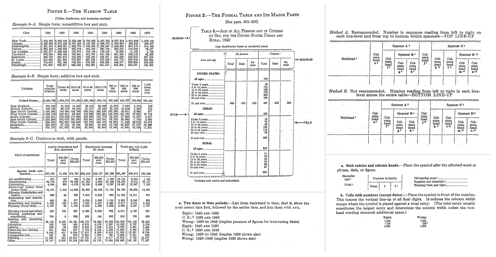
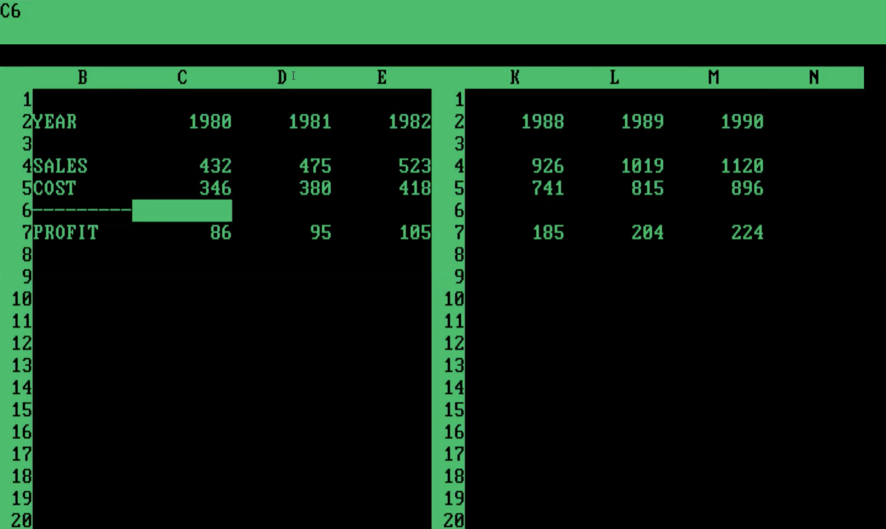
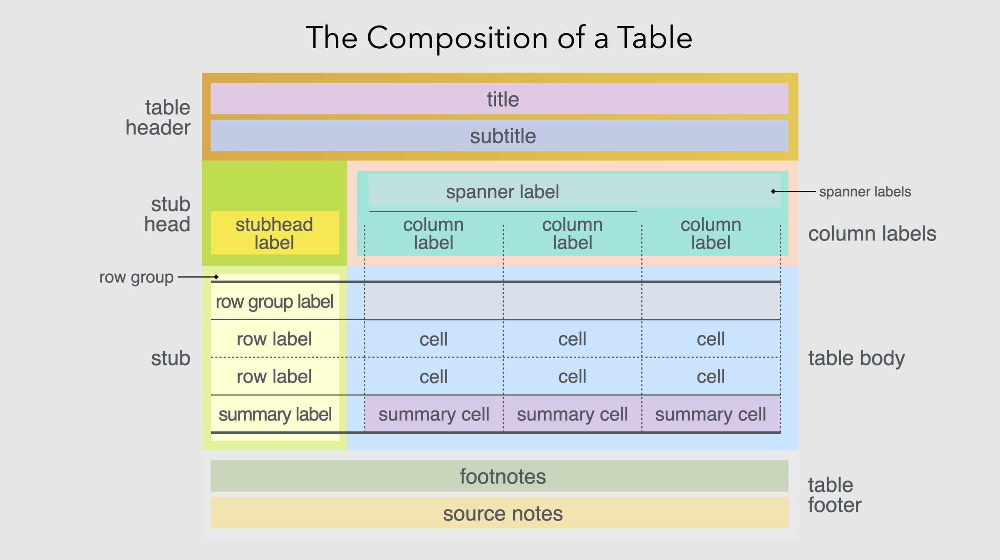

<script src="https://cdn.jsdelivr.net/npm/requirejs@2.3.6/require.min.js" integrity="sha384-c9c+LnTbwQ3aujuU7ULEPVvgLs+Fn6fJUvIGTsuu1ZcCf11fiEubah0ttpca4ntM sha384-6V1/AdqZRWk1KAlWbKBlGhN7VG4iE/yAZcO6NZPMF8od0vukrvr0tg4qY6NSrItx" crossorigin="anonymous"></script>
<script src="https://cdn.jsdelivr.net/npm/jquery@3.5.1/dist/jquery.min.js" integrity="sha384-ZvpUoO/+PpLXR1lu4jmpXWu80pZlYUAfxl5NsBMWOEPSjUn/6Z/hRTt8+pR6L4N2" crossorigin="anonymous" data-relocate-top="true"></script>
<script type="application/javascript">define('jquery', [],function() {return window.jQuery;})</script>


We've spent a lot of time thinking about tables. Tables---like plots---are crucial as a last step toward presenting information. There is surprising sophistication and nuance in designing effective tables. Over the past 5,000 years, they've evolved from simple grids to highly structured displays of data. Although we argue that the mid-1900s served as a high point, the popularization and wider accessibility of computing seemingly brought us back to the simple, ancient times.

Okay, it's not all *that bad* but the workers of data are today confronted with an all-too-familiar dilemma: copy your data into a tool like Excel to make the table, or, display an otherwise unpolished table. Through the exploration of the qualities that make tables shine, the backstory of tables as a display of data, and the issues faced today, it's clear how we can solve the **great table dilemma** with [**Great Tables**](https://github.com/posit-dev/great-tables).


<p style="font-size: 12px;">
Tables made with computers (left to right): (1) a DataFrame printed at the console, (2) an Excel table, and (3) a <strong>Great Tables</strong> table.
</p>

### What is a table, really?

Before getting to what makes tables *shine* we should first define what a table is. This is surprisingly hard! But I believe it can be boiled down to two basic rules:

- the data is represented as columns and rows
- the data is primarily text

Let's look at an example of a simple table with actual data to tie this theory to practice.

<div id="kcvcsyvxpq" style="padding-left:0px;padding-right:0px;padding-top:10px;padding-bottom:10px;overflow-x:auto;overflow-y:auto;width:auto;height:auto;">
<style>
#kcvcsyvxpq table {
          font-family: -apple-system, BlinkMacSystemFont, 'Segoe UI', Roboto, Oxygen, Ubuntu, Cantarell, 'Helvetica Neue', 'Fira Sans', 'Droid Sans', Arial, sans-serif;
          -webkit-font-smoothing: antialiased;
          -moz-osx-font-smoothing: grayscale;
        }

#kcvcsyvxpq thead, tbody, tfoot, tr, td, th { border-style: none; }
 tr { background-color: transparent; }
#kcvcsyvxpq p { margin: 0; padding: 0; }
 #kcvcsyvxpq .gt_table { display: table; border-collapse: collapse; line-height: normal; margin-left: auto; margin-right: auto; color: #333333; font-size: 16px; font-weight: normal; font-style: normal; background-color: #FFFFFF; width: auto; border-top-style: solid; border-top-width: 2px; border-top-color: #A8A8A8; border-right-style: none; border-right-width: 2px; border-right-color: #D3D3D3; border-bottom-style: solid; border-bottom-width: 2px; border-bottom-color: #A8A8A8; border-left-style: none; border-left-width: 2px; border-left-color: #D3D3D3; }
 #kcvcsyvxpq .gt_caption { padding-top: 4px; padding-bottom: 4px; }
 #kcvcsyvxpq .gt_title { color: #333333; font-size: 125%; font-weight: initial; padding-top: 4px; padding-bottom: 4px; padding-left: 5px; padding-right: 5px; border-bottom-color: #FFFFFF; border-bottom-width: 0; }
 #kcvcsyvxpq .gt_subtitle { color: #333333; font-size: 85%; font-weight: initial; padding-top: 3px; padding-bottom: 5px; padding-left: 5px; padding-right: 5px; border-top-color: #FFFFFF; border-top-width: 0; }
 #kcvcsyvxpq .gt_heading { background-color: #FFFFFF; text-align: center; border-bottom-color: #FFFFFF; border-left-style: none; border-left-width: 1px; border-left-color: #D3D3D3; border-right-style: none; border-right-width: 1px; border-right-color: #D3D3D3; }
 #kcvcsyvxpq .gt_bottom_border { border-bottom-style: solid; border-bottom-width: 2px; border-bottom-color: #D3D3D3; }
 #kcvcsyvxpq .gt_col_headings { border-top-style: solid; border-top-width: 2px; border-top-color: #D3D3D3; border-bottom-style: solid; border-bottom-width: 2px; border-bottom-color: #D3D3D3; border-left-style: none; border-left-width: 1px; border-left-color: #D3D3D3; border-right-style: none; border-right-width: 1px; border-right-color: #D3D3D3; }
 #kcvcsyvxpq .gt_col_heading { color: #333333; background-color: #FFFFFF; font-size: 100%; font-weight: normal; text-transform: inherit; border-left-style: none; border-left-width: 1px; border-left-color: #D3D3D3; border-right-style: none; border-right-width: 1px; border-right-color: #D3D3D3; vertical-align: bottom; padding-top: 5px; padding-bottom: 5px; padding-left: 5px; padding-right: 5px; overflow-x: hidden; }
 #kcvcsyvxpq .gt_column_spanner_outer { color: #333333; background-color: #FFFFFF; font-size: 100%; font-weight: normal; text-transform: inherit; padding-top: 0; padding-bottom: 0; padding-left: 4px; padding-right: 4px; }
 #kcvcsyvxpq .gt_column_spanner_outer:first-child { padding-left: 0; }
 #kcvcsyvxpq .gt_column_spanner_outer:last-child { padding-right: 0; }
 #kcvcsyvxpq .gt_column_spanner { border-bottom-style: solid; border-bottom-width: 2px; border-bottom-color: #D3D3D3; vertical-align: bottom; padding-top: 5px; padding-bottom: 5px; overflow-x: hidden; display: inline-block; width: 100%; }
 #kcvcsyvxpq .gt_spanner_row { border-bottom-style: hidden; }
 #kcvcsyvxpq .gt_group_heading { padding-top: 8px; padding-bottom: 8px; padding-left: 5px; padding-right: 5px; color: #333333; background-color: #FFFFFF; font-size: 100%; font-weight: initial; text-transform: inherit; border-top-style: solid; border-top-width: 2px; border-top-color: #D3D3D3; border-bottom-style: solid; border-bottom-width: 2px; border-bottom-color: #D3D3D3; border-left-style: none; border-left-width: 1px; border-left-color: #D3D3D3; border-right-style: none; border-right-width: 1px; border-right-color: #D3D3D3; vertical-align: middle; text-align: left; }
 #kcvcsyvxpq .gt_empty_group_heading { padding: 0.5px; color: #333333; background-color: #FFFFFF; font-size: 100%; font-weight: initial; border-top-style: solid; border-top-width: 2px; border-top-color: #D3D3D3; border-bottom-style: solid; border-bottom-width: 2px; border-bottom-color: #D3D3D3; vertical-align: middle; }
 #kcvcsyvxpq .gt_from_md> :first-child { margin-top: 0; }
 #kcvcsyvxpq .gt_from_md> :last-child { margin-bottom: 0; }
 #kcvcsyvxpq .gt_row { padding-top: 8px; padding-bottom: 8px; padding-left: 5px; padding-right: 5px; margin: 10px; border-top-style: solid; border-top-width: 1px; border-top-color: #D3D3D3; border-left-style: none; border-left-width: 1px; border-left-color: #D3D3D3; border-right-style: none; border-right-width: 1px; border-right-color: #D3D3D3; vertical-align: middle; overflow-x: hidden; }
 #kcvcsyvxpq .gt_stub { color: #333333; background-color: #FFFFFF; font-size: 100%; font-weight: initial; text-transform: inherit; border-right-style: solid; border-right-width: 2px; border-right-color: #D3D3D3; padding-left: 5px; padding-right: 5px; }
 #kcvcsyvxpq .gt_stub_row_group { color: #333333; background-color: #FFFFFF; font-size: 100%; font-weight: initial; text-transform: inherit; border-right-style: solid; border-right-width: 2px; border-right-color: #D3D3D3; padding-left: 5px; padding-right: 5px; vertical-align: top; }
 #kcvcsyvxpq .gt_row_group_first td { border-top-width: 2px; }
 #kcvcsyvxpq .gt_row_group_first th { border-top-width: 2px; }
 #kcvcsyvxpq .gt_striped { color: #333333; background-color: #F4F4F4; }
 #kcvcsyvxpq .gt_table_body { border-top-style: solid; border-top-width: 2px; border-top-color: #D3D3D3; border-bottom-style: solid; border-bottom-width: 2px; border-bottom-color: #D3D3D3; }
 #kcvcsyvxpq .gt_grand_summary_row { color: #333333; background-color: #FFFFFF; text-transform: inherit; padding-top: 8px; padding-bottom: 8px; padding-left: 5px; padding-right: 5px; }
 #kcvcsyvxpq .gt_first_grand_summary_row_bottom { border-top-style: double; border-top-width: 6px; border-top-color: #D3D3D3; }
 #kcvcsyvxpq .gt_last_grand_summary_row_top { border-bottom-style: double; border-bottom-width: 6px; border-bottom-color: #D3D3D3; }
 #kcvcsyvxpq .gt_sourcenotes { color: #333333; background-color: #FFFFFF; border-bottom-style: none; border-bottom-width: 2px; border-bottom-color: #D3D3D3; border-left-style: none; border-left-width: 2px; border-left-color: #D3D3D3; border-right-style: none; border-right-width: 2px; border-right-color: #D3D3D3; }
 #kcvcsyvxpq .gt_sourcenote { font-size: 90%; padding-top: 4px; padding-bottom: 4px; padding-left: 5px; padding-right: 5px; text-align: left; }
 #kcvcsyvxpq .gt_left { text-align: left; }
 #kcvcsyvxpq .gt_center { text-align: center; }
 #kcvcsyvxpq .gt_right { text-align: right; font-variant-numeric: tabular-nums; }
 #kcvcsyvxpq .gt_font_normal { font-weight: normal; }
 #kcvcsyvxpq .gt_font_bold { font-weight: bold; }
 #kcvcsyvxpq .gt_font_italic { font-style: italic; }
 #kcvcsyvxpq .gt_super { font-size: 65%; }
 #kcvcsyvxpq .gt_footnote_marks { font-size: 75%; vertical-align: 0.4em; position: initial; }
 #kcvcsyvxpq .gt_asterisk { font-size: 100%; vertical-align: 0; }
 
</style>

| Name | Address | City | Postcode | DOB | Height | Weight |
|----|----|----|----|----|----|----|
| Dustin B. Roach | 1183 Columbia Road | Holly Oak, DE | 19809 | 1970-09-16 | 5\' 9\" | 202.5 |
| Iwona Adamczyk | ul. Zabłudowska 133 | Warszawa | 04-788 | 1976-01-03 | 5\' 5\" | 123.7 |
| Geneviève Massé | 1415 rue Principale | Amos, QC | J9T 1E4 | 1967-12-08 | 5\' 3\" | 136.3 |
| João Souza Lima | Rua Cosmorama, 538 | São Paulo-SP | 04648-080 | 2001-04-21 | 6\' 2\" | 231.0 |
| Maddison McCabe | 149 Raymond Street | Strathern | Invercargill 9812 | 1982-03-05 | 5\' 8\" | 146.1 |

</div>
<p style="font-size: 12px;">
A table of named individuals along with a select set of characteristics.
</p>

This table arranges records containing personal characteristics as columns and rows. Each person is a row, and each characteristic makes up a different column. The characteristics use different types of data, like dates, numbers, and text. This arrangement makes it easy to look up individual values or make comparisons across the different rows or columns.

Note that there are horizontal lines separating the rows. This aesthetic touch, while not strictly required for a table, serves as a visual reinforcement for separating the individual rows.

The order of the columns matters, and that we start with the `Name` column here is no accident. If that column were the last (i.e., furthest to the right), it would be slightly more confusing for the reader since the subject for the record isn't immediate. In addition to order, column labels play an important role for indicating what data is in each column. They're not always necessary but in most cases they remove the guesswork for what type of data is contained within each column.

We'll go into some detail later about how [**Great Tables**](https://github.com/posit-dev/great-tables) provides affordances for structuring information for better legibility and how the package can be used to adorn the table with other structural elements. For now, our conception of a table can be summarized in this schematic.



<p style="font-size: 12px;">
A simple table has: (1) cells containing data, (2) an arrangement of columns and rows, and (3) column labels to describe the type data in each column.
</p>

Now, let's go back: way back. In examining where tables came from, we might better understand the great story of tables.

### The early history of tables

Tables emerged from square grids. When grids are made like this, you invariably generate containers that may hold some sort of information. The earliest known examples of grids go very far back in human history. Twenty-five thousand year old representations of the grid are found on the walls of the Lascaux and Niaux caves in France[^1].



<p style="font-size: 12px;">
Reproductions of early grids found on cave walls.
</p>

In the second century BC, the Greek astronomer Hipparchus used latitude and longitude to locate celestial and terrestrial positions[^2]. At around AD 150, Ptolmey published *Geographia*, which contains 25 geographical maps accompanied by methodologies for their construction using grids[^3]. The Romans employed a grid system called *centuriation*, which can be described as land measurement (using surveyors' instruments) to realize the formation of square grids using roads, canals, or agricultural plots[^4].

When agriculture became more widespread (ca. 10,000 years ago), there was the need to document and manage economic transactions to do with farming, livestock, and the division of labor. In the fourth millennium BC, Mesopotamian cities that traded with far way kingdoms needed to keep such records. Clay tablets recovered from the ancient Sumerian city of Uruk show early yet sophisticated tables. Here is a drawing of one of the recovered tablets, which contains an accounting of deliveries of barley and malt from two individuals for the production of beer[^5].



<p style="font-size: 12px;">
Drawing of clay tablet from Sumerian city of Uruk, circa 3200-3000 BC. Uruk III Tablet (MSVO 3, 51, Louvre Museum, Paris, France). Annotated with the meanings of the columns, rows, and cells.
</p>

Note that the recovered tablet is meant to be read from right to left. Inside each box is an ideogram (a symbol that represented a word or idea) and a numerical value representing a quantity.

Its structure is where things get super interesting:

- Rows: there are roughly two rows, each corresponding to an individual.
- Columns: the first two columns from the right contain counts of malt (rightmost column) and barley (second rightmost column).
- Subtotals: the third column from the right sums barley and malt within each individual, and the left-most column displays the grand total.

As a bonus, the table has a footer, since the bottom row contains the name of the official in charge.

Zooming ahead about a thousand years, you start to see more systematically structured tables. Here's a photo of a cuneiform tablet that was originally from Mesopotamia (from the Temple of Enlil at Nippur, ca. 1850 BC)[^6], containing sources of revenue and monthly disbursements for 50 temple personnel.


<p style="font-size: 12px;">
Cuneiform tablet, temple of Enlil at Nippur, (CBS 3323, University of Pennsylvania).
</p>

You can see right away that there is a more regular grid and, if you probe deeper, there are more similarities than differerences with the tables of today. While difficult to pick them out, the following table elements are present[^7]:

- column headings (month names) and row titles (names/professions of individuals).
- cells with no information (look at the blank or smooth cells along rows)
- numerical values in the cells
- subtotals for each individual every six months
- grand totals
- annotations with explanatory notes

Later on, tables were less inscribed on clay and more on wax tablets, papyrus, and paper. The media have changed, writing technologies have changed, and the design and presentation of tables also went through changes.

### Midcentury modern tables

Perhaps the best period for tables was around the middle of the 20th century. Technologies for table (and surrounding document) preparation included the offset printer, the typewriter, and varitype[^8] (my favorite). The technologies were sufficiently advanced as to allow the precise typesetting of table elements. While of course constrained by the limited space available on pages, tabular design at this point had many workable solutions for fitting tables into single pages or dispersing the tabular content across multiple pages. The combination of advanced printing technology with advanced knowledge of tabular design resulted in *beautiful tables*.

There's no greater embodiment of that pairing of technology and design than the [*Manual of Tabular Presentation*](https://www2.census.gov/library/publications/1949/general/tabular-presentation.pdf)[^9], written and published by the United States Bureau of the Census. It is truly a remarkable work which goes into great detail on how the department imagines the ideal designs of information-rich tables. The work articulates the different parts of a table (and each part is given a descriptive name), sparing no detail when describing those different table parts in rigorous detail. Throughout its hundreds of pages, the authors make strong recommendations on what to do (and what *not* to do) for many tabulation scenarios. When poring over the tables visually depicted in the book, you can't help but see that tables can both look really good *and* contain a density of information. The promise and the result is a balance of form and function.

We at [**Great Tables**](https://github.com/posit-dev/great-tables) borrow liberally from this work because many of its tabular design principles are just as good now as they were back then (and we'll talk about what we took from that work in the next section). We'll end this brief section with a visual montage of snippets from the *Census Manual*, which provides a glimpse of the sound advice on offer.



<p style="font-size: 12px;">
Little nuggets of wisdom from the *Census Manual*. This may very well be the ultimate book on tabular design.
</p>

### The late history of tables

With computing technologies becoming more accessible by the 1970s and 1980s, people were able to generate tables in both electronic and print form. The democratization of computational tables arguably began with VisiCalc in 1979, a massive success that initiated the computing category of spreadsheeting software. There's an undeniable advantage to having data analyzed and transformed in computing environments, but, this comes at a cost. This is what it looked like:



<p style="font-size: 12px;">
This is a table in VisiCalc (earliest example of a table in a spreadsheet application). It's pretty crude compared to the tables in print but the advantage here is that you can calculate values quickly.
</p>

The grid cells couldn't be styled with borders for presentation purposes, the values couldn't be formatted, and the tables couldn't even be printed. I mean, [try it out](https://www.pcjs.org/software/pcx86/app/other/visicalc/1981/) and you'll see that this is quite limited in more than a few ways.

Over time, and this took about 10-15 years, tables-within-spreadsheets got a little easier on the eyes. By the early 1990s, Excel could paint borders on your tables, better typographical support was available, and the formatting of values was fully-featured (though, [wonky](https://www.cnet.com/tech/computing/prevent-excel-from-reformatting-two-numbers-to-a-date-and-month/)). Great! Problem solved, right? Not really.

While Excel tables from the last three decades looked much better than 1980s-spreadsheet-borne tables, they could never hold a candle to what was shown in the *Census Manual* (no matter how much of an Excel expert you became). Further to this, data analysis started to became a thing accomplished outside of Excel. One example of that is Python and its use inside Jupyter notebooks. We now have a bag of problematic scenarios

- all Python: analyze data and generate tables all in Python (bad tables)
- all Excel: analyze data and make tables in Excel (less flexible analysis)
- split-brained: analyze data in Python, copy over to Excel to make tables (not reproducible)

All of these are suboptimal solutions. We propose that it is far better to do everything in Python: the data ingestion, the data analysis, and the data visualization. The visualization step is what's done for plots and other types of graphics composed from data, it shouldn't be any different when it comes to generating summary tables.

### Approach to tables taken by **Great Tables**

[**Great Tables**](https://github.com/posit-dev/great-tables) restores the elegance of midcentury tables with the power of a coding interface. With [**Great Tables**](https://github.com/posit-dev/great-tables) anyone can make beautiful tables in Python. Our framework expresses a table as a combination of six independent components. With this framework, you can structure the table, format the values, and style the table. We firmly believe that the methods offered in the package enable people to construct a wide variety of useful tables that work across many disciplines.

You build with [**Great Tables**](https://github.com/posit-dev/great-tables) iteratively, starting off with your table body from code, adding styling, formatting and other components. Here is a schematic that outlines our terminology and depicts how the different table components are related to each other:



<p style="font-size: 12px;">
A schematic with the complete set of table components that can be utilized in <strong>Great Tables</strong>.
</p>

Note the following six component pieces:

- **Table Header**: a place for a title and subtitle, where you can succinctly describe the table content
- **Column Labels**: the column labels define the content of each column, and spanners are headings over groups of columns
- **Stub Head**: the 'top-left' location, where a label could be used in a variety of ways
- **Row Stub**: for row information, including row grouping labels
- **Table Body**: contains cells and so it's where the data lives
- **Table Footer**: a place for additional information pertaining to the table content

Here's a table that takes advantage of the different components available in [**Great Tables**](https://github.com/posit-dev/great-tables). It contains the names and addresses of people.

<details class="code-fold">
<summary>Show the code</summary>

``` python
from great_tables import GT, md, system_fonts

(
    GT(simple_table, rowname_col="Name")
    .tab_header(title="Names, Addresses, and Characteristics of Remote Correspondents")
    .tab_stubhead(label=md("*Name*"))
    .tab_spanner(label="Location", columns=["Address", "City", "Postcode"])
    .tab_spanner(label="Personal Characteristics", columns=["DOB", "Height", "Weight"])
    .tab_source_note(source_note=md("**Data last updated**: December 18, 2022."))
    .fmt_date(columns="DOB", date_style="m_day_year")
    .fmt_integer(columns="Weight", pattern="{x} lbs")
    .opt_stylize()
    .opt_align_table_header(align="left")
    .opt_vertical_padding(scale=0.75)
    .tab_options(
        table_font_names=system_fonts(name="rounded-sans"),
        table_font_size="14px",
    )
)
```

</details>
<div id="cjtkmwmuum" style="padding-left:0px;padding-right:0px;padding-top:10px;padding-bottom:10px;overflow-x:auto;overflow-y:auto;width:auto;height:auto;">
<style>
#cjtkmwmuum table {
          font-family: ui-rounded, 'Hiragino Maru Gothic ProN', Quicksand, Comfortaa, Manjari, 'Arial Rounded MT', 'Arial Rounded MT Bold', Calibri, source-sans-pro, sans-serif, 'Apple Color Emoji', 'Segoe UI Emoji', 'Segoe UI Symbol', 'Noto Color Emoji';
          -webkit-font-smoothing: antialiased;
          -moz-osx-font-smoothing: grayscale;
        }

#cjtkmwmuum thead, tbody, tfoot, tr, td, th { border-style: none; }
 tr { background-color: transparent; }
#cjtkmwmuum p { margin: 0; padding: 0; }
 #cjtkmwmuum .gt_table { display: table; border-collapse: collapse; line-height: normal; margin-left: auto; margin-right: auto; color: #333333; font-size: 14px; font-weight: normal; font-style: normal; background-color: #FFFFFF; width: auto; border-top-style: solid; border-top-width: 2px; border-top-color: #004D80; border-right-style: none; border-right-width: 2px; border-right-color: #D3D3D3; border-bottom-style: solid; border-bottom-width: 2px; border-bottom-color: #004D80; border-left-style: none; border-left-width: 2px; border-left-color: #D3D3D3; }
 #cjtkmwmuum .gt_caption { padding-top: 4px; padding-bottom: 4px; }
 #cjtkmwmuum .gt_title { color: #333333; font-size: 125%; font-weight: initial; padding-top: 3px; padding-bottom: 3px; padding-left: 5px; padding-right: 5px; border-bottom-color: #FFFFFF; border-bottom-width: 0; }
 #cjtkmwmuum .gt_subtitle { color: #333333; font-size: 85%; font-weight: initial; padding-top: 2px; padding-bottom: 4px; padding-left: 5px; padding-right: 5px; border-top-color: #FFFFFF; border-top-width: 0; }
 #cjtkmwmuum .gt_heading { background-color: #FFFFFF; text-align: left; border-bottom-color: #FFFFFF; border-left-style: none; border-left-width: 1px; border-left-color: #D3D3D3; border-right-style: none; border-right-width: 1px; border-right-color: #D3D3D3; }
 #cjtkmwmuum .gt_bottom_border { border-bottom-style: solid; border-bottom-width: 2px; border-bottom-color: #0076BA; }
 #cjtkmwmuum .gt_col_headings { border-top-style: solid; border-top-width: 2px; border-top-color: #0076BA; border-bottom-style: solid; border-bottom-width: 2px; border-bottom-color: #0076BA; border-left-style: none; border-left-width: 1px; border-left-color: #D3D3D3; border-right-style: none; border-right-width: 1px; border-right-color: #D3D3D3; }
 #cjtkmwmuum .gt_col_heading { color: #333333; background-color: #FFFFFF; font-size: 100%; font-weight: normal; text-transform: inherit; border-left-style: none; border-left-width: 1px; border-left-color: #D3D3D3; border-right-style: none; border-right-width: 1px; border-right-color: #D3D3D3; vertical-align: bottom; padding-top: 3px; padding-bottom: 4px; padding-left: 5px; padding-right: 5px; overflow-x: hidden; }
 #cjtkmwmuum .gt_column_spanner_outer { color: #333333; background-color: #FFFFFF; font-size: 100%; font-weight: normal; text-transform: inherit; padding-top: 0; padding-bottom: 0; padding-left: 4px; padding-right: 4px; }
 #cjtkmwmuum .gt_column_spanner_outer:first-child { padding-left: 0; }
 #cjtkmwmuum .gt_column_spanner_outer:last-child { padding-right: 0; }
 #cjtkmwmuum .gt_column_spanner { border-bottom-style: solid; border-bottom-width: 2px; border-bottom-color: #0076BA; vertical-align: bottom; padding-top: 3px; padding-bottom: 3px; overflow-x: hidden; display: inline-block; width: 100%; }
 #cjtkmwmuum .gt_spanner_row { border-bottom-style: hidden; }
 #cjtkmwmuum .gt_group_heading { padding-top: 6px; padding-bottom: 6px; padding-left: 5px; padding-right: 5px; color: #333333; background-color: #FFFFFF; font-size: 100%; font-weight: initial; text-transform: inherit; border-top-style: solid; border-top-width: 2px; border-top-color: #0076BA; border-bottom-style: solid; border-bottom-width: 2px; border-bottom-color: #0076BA; border-left-style: none; border-left-width: 1px; border-left-color: #D3D3D3; border-right-style: none; border-right-width: 1px; border-right-color: #D3D3D3; vertical-align: middle; text-align: left; }
 #cjtkmwmuum .gt_empty_group_heading { padding: 0.5px; color: #333333; background-color: #FFFFFF; font-size: 100%; font-weight: initial; border-top-style: solid; border-top-width: 2px; border-top-color: #0076BA; border-bottom-style: solid; border-bottom-width: 2px; border-bottom-color: #0076BA; vertical-align: middle; }
 #cjtkmwmuum .gt_from_md> :first-child { margin-top: 0; }
 #cjtkmwmuum .gt_from_md> :last-child { margin-bottom: 0; }
 #cjtkmwmuum .gt_row { padding-top: 6px; padding-bottom: 6px; padding-left: 5px; padding-right: 5px; margin: 10px; border-top-style: none; border-top-width: 1px; border-top-color: #89D3FE; border-left-style: none; border-left-width: 1px; border-left-color: #89D3FE; border-right-style: none; border-right-width: 1px; border-right-color: #89D3FE; vertical-align: middle; overflow-x: hidden; }
 #cjtkmwmuum .gt_stub { color: #FFFFFF; background-color: #0076BA; font-size: 100%; font-weight: initial; text-transform: inherit; border-right-style: solid; border-right-width: 2px; border-right-color: #0076BA; padding-left: 5px; padding-right: 5px; }
 #cjtkmwmuum .gt_stub_row_group { color: #333333; background-color: #FFFFFF; font-size: 100%; font-weight: initial; text-transform: inherit; border-right-style: solid; border-right-width: 2px; border-right-color: #D3D3D3; padding-left: 5px; padding-right: 5px; vertical-align: top; }
 #cjtkmwmuum .gt_row_group_first td { border-top-width: 2px; }
 #cjtkmwmuum .gt_row_group_first th { border-top-width: 2px; }
 #cjtkmwmuum .gt_striped { color: #333333; background-color: #F4F4F4; }
 #cjtkmwmuum .gt_table_body { border-top-style: solid; border-top-width: 2px; border-top-color: #0076BA; border-bottom-style: solid; border-bottom-width: 2px; border-bottom-color: #0076BA; }
 #cjtkmwmuum .gt_grand_summary_row { color: #333333; background-color: #89D3FE; text-transform: inherit; padding-top: 8px; padding-bottom: 8px; padding-left: 5px; padding-right: 5px; }
 #cjtkmwmuum .gt_first_grand_summary_row_bottom { border-top-style: double; border-top-width: 6px; border-top-color: #D3D3D3; }
 #cjtkmwmuum .gt_last_grand_summary_row_top { border-bottom-style: double; border-bottom-width: 6px; border-bottom-color: #D3D3D3; }
 #cjtkmwmuum .gt_sourcenotes { color: #333333; background-color: #FFFFFF; border-bottom-style: none; border-bottom-width: 2px; border-bottom-color: #D3D3D3; border-left-style: none; border-left-width: 2px; border-left-color: #D3D3D3; border-right-style: none; border-right-width: 2px; border-right-color: #D3D3D3; }
 #cjtkmwmuum .gt_sourcenote { font-size: 90%; padding-top: 3px; padding-bottom: 3px; padding-left: 5px; padding-right: 5px; text-align: left; }
 #cjtkmwmuum .gt_left { text-align: left; }
 #cjtkmwmuum .gt_center { text-align: center; }
 #cjtkmwmuum .gt_right { text-align: right; font-variant-numeric: tabular-nums; }
 #cjtkmwmuum .gt_font_normal { font-weight: normal; }
 #cjtkmwmuum .gt_font_bold { font-weight: bold; }
 #cjtkmwmuum .gt_font_italic { font-style: italic; }
 #cjtkmwmuum .gt_super { font-size: 65%; }
 #cjtkmwmuum .gt_footnote_marks { font-size: 75%; vertical-align: 0.4em; position: initial; }
 #cjtkmwmuum .gt_asterisk { font-size: 100%; vertical-align: 0; }
 
</style>

<table class="gt_table" data-quarto-postprocess="true" data-quarto-disable-processing="false" data-quarto-bootstrap="false">
<thead>
<tr class="gt_heading">
<th colspan="7" class="gt_heading gt_title gt_font_normal">Names, Addresses, and Characteristics of Remote Correspondents</th>
</tr>
<tr class="gt_col_headings gt_spanner_row">
<th rowspan="2" id="&lt;em&gt;Name&lt;/em&gt;" class="gt_col_heading gt_columns_bottom_border gt_left" data-quarto-table-cell-role="th" scope="col"><em>Name</em></th>
<th colspan="3" id="Location" class="gt_center gt_columns_top_border gt_column_spanner_outer" data-quarto-table-cell-role="th" scope="colgroup"><span class="gt_column_spanner">Location</span></th>
<th colspan="3" id="Personal-Characteristics" class="gt_center gt_columns_top_border gt_column_spanner_outer" data-quarto-table-cell-role="th" scope="colgroup"><span class="gt_column_spanner">Personal Characteristics</span></th>
</tr>
<tr class="gt_col_headings">
<th id="Address" class="gt_col_heading gt_columns_bottom_border gt_left" data-quarto-table-cell-role="th" scope="col">Address</th>
<th id="City" class="gt_col_heading gt_columns_bottom_border gt_left" data-quarto-table-cell-role="th" scope="col">City</th>
<th id="Postcode" class="gt_col_heading gt_columns_bottom_border gt_left" data-quarto-table-cell-role="th" scope="col">Postcode</th>
<th id="DOB" class="gt_col_heading gt_columns_bottom_border gt_left" data-quarto-table-cell-role="th" scope="col">DOB</th>
<th id="Height" class="gt_col_heading gt_columns_bottom_border gt_left" data-quarto-table-cell-role="th" scope="col">Height</th>
<th id="Weight" class="gt_col_heading gt_columns_bottom_border gt_right" data-quarto-table-cell-role="th" scope="col">Weight</th>
</tr>
</thead>
<tbody class="gt_table_body">
<tr>
<td class="gt_row gt_left gt_stub" data-quarto-table-cell-role="th">Dustin B. Roach</td>
<td class="gt_row gt_left">1183 Columbia Road</td>
<td class="gt_row gt_left">Holly Oak, DE</td>
<td class="gt_row gt_left">19809</td>
<td class="gt_row gt_left">Sep 16, 1970</td>
<td class="gt_row gt_left">5' 9"</td>
<td class="gt_row gt_right">202 lbs</td>
</tr>
<tr>
<td class="gt_row gt_left gt_stub" data-quarto-table-cell-role="th">Iwona Adamczyk</td>
<td class="gt_row gt_left gt_striped">ul. Zabłudowska 133</td>
<td class="gt_row gt_left gt_striped">Warszawa</td>
<td class="gt_row gt_left gt_striped">04-788</td>
<td class="gt_row gt_left gt_striped">Jan 3, 1976</td>
<td class="gt_row gt_left gt_striped">5' 5"</td>
<td class="gt_row gt_right gt_striped">124 lbs</td>
</tr>
<tr>
<td class="gt_row gt_left gt_stub" data-quarto-table-cell-role="th">Geneviève Massé</td>
<td class="gt_row gt_left">1415 rue Principale</td>
<td class="gt_row gt_left">Amos, QC</td>
<td class="gt_row gt_left">J9T 1E4</td>
<td class="gt_row gt_left">Dec 8, 1967</td>
<td class="gt_row gt_left">5' 3"</td>
<td class="gt_row gt_right">136 lbs</td>
</tr>
<tr>
<td class="gt_row gt_left gt_stub" data-quarto-table-cell-role="th">João Souza Lima</td>
<td class="gt_row gt_left gt_striped">Rua Cosmorama, 538</td>
<td class="gt_row gt_left gt_striped">São Paulo-SP</td>
<td class="gt_row gt_left gt_striped">04648-080</td>
<td class="gt_row gt_left gt_striped">Apr 21, 2001</td>
<td class="gt_row gt_left gt_striped">6' 2"</td>
<td class="gt_row gt_right gt_striped">231 lbs</td>
</tr>
<tr>
<td class="gt_row gt_left gt_stub" data-quarto-table-cell-role="th">Maddison McCabe</td>
<td class="gt_row gt_left">149 Raymond Street</td>
<td class="gt_row gt_left">Strathern</td>
<td class="gt_row gt_left">Invercargill 9812</td>
<td class="gt_row gt_left">Mar 5, 1982</td>
<td class="gt_row gt_left">5' 8"</td>
<td class="gt_row gt_right">146 lbs</td>
</tr>
</tbody><tfoot class="gt_sourcenotes">
<tr>
<td colspan="7" class="gt_sourcenote"><strong>Data last updated</strong>: December 18, 2022.</td>
</tr>
</tfoot>
&#10;</table>

</div>
<p style="font-size: 12px;">
A table of named individuals redone, <strong>Great Tables</strong> style!
</p>

Notice that there is a blue row stub component that makes the row labels distinct from the body of the table. This is important because each person described forms a unique observation and we want to highlight the subject of each row. The heading provides context on what's contained within the table. The two column spanners arrange the columns into sensible groupings (e.g., 'Location'). The consistent use of blue lines and cell backgrounds gives the table a professional look.

If you look at the table code above you'll see that every method for modifying the table starts with `tab_`. These particular methods are concerned with adding a table component (e.g., `tab_header()` creates a **Table Header**) and they're designed to be easy and straightforward to use.

#### Formatting

Table structuring is important, but not the only thing. Tables in different disciplines have a certain set of display requirements specific for any values shown. Even something as simple as a number can be formatted in many different ways depending on a community's norms and expectations. This extends to a very wide area when we consider that dates, times, and currencies also need to be formatted.

Depending on your display requirements, a raw value like 134,000 could presented as:

- scientific notation (`fmt_scientific()`): 1.34 × 10<sup style='font-size: 65%;'>5</sup>
- a number in the German locale (`fmt_number()`): 134.000,00
- a compact integer value (`fmt_integer()`): 134K

The problem grows worse when values need to be conveyed as images or plots. If you're a medical analyst, for example, you might need to effectively convey whether test results for a patient are improving or worsening over time. Reading such data as a sequence of numbers across a row can slow interpretation. But by using *nanoplots*, available as the `fmt_nanoplot()` formatting method, readers can spot trends right away. Here's an example that provides test results over a series of days.

<details class="code-fold">
<summary>Show the code</summary>

``` python
from great_tables import GT, md
from great_tables.data import illness
import polars as pl
from polars import selectors as cs

illness_mini = (
    pl.from_pandas(illness)
    .head(10)
    .select(
        "test", values=pl.concat_str(cs.starts_with("day"), separator=" ", ignore_nulls=True)
    )
    .slice(1, 9)
)

(
    GT(illness_mini, rowname_col="test")
    .fmt_nanoplot(columns="values")
    .tab_header(md("Partial summary of daily tests<br>performed on YF patient"))
    .tab_stubhead(label=md("**Test**"))
    .cols_label(values=md("*Progression*"))
    .cols_align(align="center", columns="values")
    .tab_source_note(source_note="Measurements from Day 3 through Day 9.")
)
```

</details>
<div id="foyajsifjc" style="padding-left:0px;padding-right:0px;padding-top:10px;padding-bottom:10px;overflow-x:auto;overflow-y:auto;width:auto;height:auto;">
<style>
#foyajsifjc table {
          font-family: -apple-system, BlinkMacSystemFont, 'Segoe UI', Roboto, Oxygen, Ubuntu, Cantarell, 'Helvetica Neue', 'Fira Sans', 'Droid Sans', Arial, sans-serif;
          -webkit-font-smoothing: antialiased;
          -moz-osx-font-smoothing: grayscale;
        }

#foyajsifjc thead, tbody, tfoot, tr, td, th { border-style: none; }
 tr { background-color: transparent; }
#foyajsifjc p { margin: 0; padding: 0; }
 #foyajsifjc .gt_table { display: table; border-collapse: collapse; line-height: normal; margin-left: auto; margin-right: auto; color: #333333; font-size: 16px; font-weight: normal; font-style: normal; background-color: #FFFFFF; width: auto; border-top-style: solid; border-top-width: 2px; border-top-color: #A8A8A8; border-right-style: none; border-right-width: 2px; border-right-color: #D3D3D3; border-bottom-style: solid; border-bottom-width: 2px; border-bottom-color: #A8A8A8; border-left-style: none; border-left-width: 2px; border-left-color: #D3D3D3; }
 #foyajsifjc .gt_caption { padding-top: 4px; padding-bottom: 4px; }
 #foyajsifjc .gt_title { color: #333333; font-size: 125%; font-weight: initial; padding-top: 4px; padding-bottom: 4px; padding-left: 5px; padding-right: 5px; border-bottom-color: #FFFFFF; border-bottom-width: 0; }
 #foyajsifjc .gt_subtitle { color: #333333; font-size: 85%; font-weight: initial; padding-top: 3px; padding-bottom: 5px; padding-left: 5px; padding-right: 5px; border-top-color: #FFFFFF; border-top-width: 0; }
 #foyajsifjc .gt_heading { background-color: #FFFFFF; text-align: center; border-bottom-color: #FFFFFF; border-left-style: none; border-left-width: 1px; border-left-color: #D3D3D3; border-right-style: none; border-right-width: 1px; border-right-color: #D3D3D3; }
 #foyajsifjc .gt_bottom_border { border-bottom-style: solid; border-bottom-width: 2px; border-bottom-color: #D3D3D3; }
 #foyajsifjc .gt_col_headings { border-top-style: solid; border-top-width: 2px; border-top-color: #D3D3D3; border-bottom-style: solid; border-bottom-width: 2px; border-bottom-color: #D3D3D3; border-left-style: none; border-left-width: 1px; border-left-color: #D3D3D3; border-right-style: none; border-right-width: 1px; border-right-color: #D3D3D3; }
 #foyajsifjc .gt_col_heading { color: #333333; background-color: #FFFFFF; font-size: 100%; font-weight: normal; text-transform: inherit; border-left-style: none; border-left-width: 1px; border-left-color: #D3D3D3; border-right-style: none; border-right-width: 1px; border-right-color: #D3D3D3; vertical-align: bottom; padding-top: 5px; padding-bottom: 5px; padding-left: 5px; padding-right: 5px; overflow-x: hidden; }
 #foyajsifjc .gt_column_spanner_outer { color: #333333; background-color: #FFFFFF; font-size: 100%; font-weight: normal; text-transform: inherit; padding-top: 0; padding-bottom: 0; padding-left: 4px; padding-right: 4px; }
 #foyajsifjc .gt_column_spanner_outer:first-child { padding-left: 0; }
 #foyajsifjc .gt_column_spanner_outer:last-child { padding-right: 0; }
 #foyajsifjc .gt_column_spanner { border-bottom-style: solid; border-bottom-width: 2px; border-bottom-color: #D3D3D3; vertical-align: bottom; padding-top: 5px; padding-bottom: 5px; overflow-x: hidden; display: inline-block; width: 100%; }
 #foyajsifjc .gt_spanner_row { border-bottom-style: hidden; }
 #foyajsifjc .gt_group_heading { padding-top: 8px; padding-bottom: 8px; padding-left: 5px; padding-right: 5px; color: #333333; background-color: #FFFFFF; font-size: 100%; font-weight: initial; text-transform: inherit; border-top-style: solid; border-top-width: 2px; border-top-color: #D3D3D3; border-bottom-style: solid; border-bottom-width: 2px; border-bottom-color: #D3D3D3; border-left-style: none; border-left-width: 1px; border-left-color: #D3D3D3; border-right-style: none; border-right-width: 1px; border-right-color: #D3D3D3; vertical-align: middle; text-align: left; }
 #foyajsifjc .gt_empty_group_heading { padding: 0.5px; color: #333333; background-color: #FFFFFF; font-size: 100%; font-weight: initial; border-top-style: solid; border-top-width: 2px; border-top-color: #D3D3D3; border-bottom-style: solid; border-bottom-width: 2px; border-bottom-color: #D3D3D3; vertical-align: middle; }
 #foyajsifjc .gt_from_md> :first-child { margin-top: 0; }
 #foyajsifjc .gt_from_md> :last-child { margin-bottom: 0; }
 #foyajsifjc .gt_row { padding-top: 8px; padding-bottom: 8px; padding-left: 5px; padding-right: 5px; margin: 10px; border-top-style: solid; border-top-width: 1px; border-top-color: #D3D3D3; border-left-style: none; border-left-width: 1px; border-left-color: #D3D3D3; border-right-style: none; border-right-width: 1px; border-right-color: #D3D3D3; vertical-align: middle; overflow-x: hidden; }
 #foyajsifjc .gt_stub { color: #333333; background-color: #FFFFFF; font-size: 100%; font-weight: initial; text-transform: inherit; border-right-style: solid; border-right-width: 2px; border-right-color: #D3D3D3; padding-left: 5px; padding-right: 5px; }
 #foyajsifjc .gt_stub_row_group { color: #333333; background-color: #FFFFFF; font-size: 100%; font-weight: initial; text-transform: inherit; border-right-style: solid; border-right-width: 2px; border-right-color: #D3D3D3; padding-left: 5px; padding-right: 5px; vertical-align: top; }
 #foyajsifjc .gt_row_group_first td { border-top-width: 2px; }
 #foyajsifjc .gt_row_group_first th { border-top-width: 2px; }
 #foyajsifjc .gt_striped { color: #333333; background-color: #F4F4F4; }
 #foyajsifjc .gt_table_body { border-top-style: solid; border-top-width: 2px; border-top-color: #D3D3D3; border-bottom-style: solid; border-bottom-width: 2px; border-bottom-color: #D3D3D3; }
 #foyajsifjc .gt_grand_summary_row { color: #333333; background-color: #FFFFFF; text-transform: inherit; padding-top: 8px; padding-bottom: 8px; padding-left: 5px; padding-right: 5px; }
 #foyajsifjc .gt_first_grand_summary_row_bottom { border-top-style: double; border-top-width: 6px; border-top-color: #D3D3D3; }
 #foyajsifjc .gt_last_grand_summary_row_top { border-bottom-style: double; border-bottom-width: 6px; border-bottom-color: #D3D3D3; }
 #foyajsifjc .gt_sourcenotes { color: #333333; background-color: #FFFFFF; border-bottom-style: none; border-bottom-width: 2px; border-bottom-color: #D3D3D3; border-left-style: none; border-left-width: 2px; border-left-color: #D3D3D3; border-right-style: none; border-right-width: 2px; border-right-color: #D3D3D3; }
 #foyajsifjc .gt_sourcenote { font-size: 90%; padding-top: 4px; padding-bottom: 4px; padding-left: 5px; padding-right: 5px; text-align: left; }
 #foyajsifjc .gt_left { text-align: left; }
 #foyajsifjc .gt_center { text-align: center; }
 #foyajsifjc .gt_right { text-align: right; font-variant-numeric: tabular-nums; }
 #foyajsifjc .gt_font_normal { font-weight: normal; }
 #foyajsifjc .gt_font_bold { font-weight: bold; }
 #foyajsifjc .gt_font_italic { font-style: italic; }
 #foyajsifjc .gt_super { font-size: 65%; }
 #foyajsifjc .gt_footnote_marks { font-size: 75%; vertical-align: 0.4em; position: initial; }
 #foyajsifjc .gt_asterisk { font-size: 100%; vertical-align: 0; }
 
</style>

<table class="gt_table" data-quarto-postprocess="true" data-quarto-disable-processing="false" data-quarto-bootstrap="false">
<colgroup>
<col style="width: 50%" />
<col style="width: 50%" />
</colgroup>
<thead>
<tr class="gt_heading">
<th colspan="2" class="gt_heading gt_title gt_font_normal">Partial summary of daily tests<br />
performed on YF patient</th>
</tr>
<tr class="gt_col_headings">
<th id="&lt;strong&gt;Test&lt;/strong&gt;" class="gt_col_heading gt_columns_bottom_border gt_left" data-quarto-table-cell-role="th" scope="col"><strong>Test</strong></th>
<th id="values" class="gt_col_heading gt_columns_bottom_border gt_center" data-quarto-table-cell-role="th" scope="col"><em>Progression</em></th>
</tr>
</thead>
<tbody class="gt_table_body">
<tr>
<td class="gt_row gt_left gt_stub" data-quarto-table-cell-role="th">WBC</td>
<td class="gt_row gt_center"><div>
<svg role="img" viewbox="0 0 450 130" style="height: 2em; margin-left: auto; margin-right: auto; font-size: inherit; overflow: visible; vertical-align: middle; position:relative;">
<defs><pattern id="area_pattern" width="8" height="8" patternunits="userSpaceOnUse"><path class="pattern-line" d="M 0,8 l 8,-8 M -1,1 l 4,-4 M 6,10 l 4,-4" stroke="#FF0000" stroke-width="1.5" stroke-linecap="round" shape-rendering="geometricPrecision"></path></pattern></defs><path class="area-closed" d="M 50.0,111.15384615384616 108.33333333333333,115.0 166.66666666666666,93.23076923076924 225.0,91.03846153846155 283.3333333333333,36.11538461538463 341.6666666666667,15.0 400.0,58.192307692307686 400.0,125 50.0,125 Z" stroke="transparent" stroke-width="2" fill="url(#area_pattern)" fill-opacity="0.7"></path><path d="M 50.0,111.15384615384616 C 75.0,111.15384615384616 83.33333333333333,115.0 108.33333333333333,115.0 C 133.33333333333331,115.0 141.66666666666666,93.23076923076924 166.66666666666666,93.23076923076924 C 191.66666666666666,93.23076923076924 200.0,91.03846153846155 225.0,91.03846153846155 C 250.0,91.03846153846155 258.3333333333333,36.11538461538463 283.3333333333333,36.11538461538463 C 308.3333333333333,36.11538461538463 316.6666666666667,15.0 341.6666666666667,15.0 C 366.6666666666667,15.0 375.0,58.192307692307686 400.0,58.192307692307686" stroke="#4682B4" stroke-width="8" fill="none"></path><circle cx="50.0" cy="111.15384615384616" r="10" stroke="#FFFFFF" stroke-width="4" fill="#FF0000"></circle><circle cx="108.33333333333333" cy="115.0" r="10" stroke="#FFFFFF" stroke-width="4" fill="#FF0000"></circle><circle cx="166.66666666666666" cy="93.23076923076924" r="10" stroke="#FFFFFF" stroke-width="4" fill="#FF0000"></circle><circle cx="225.0" cy="91.03846153846155" r="10" stroke="#FFFFFF" stroke-width="4" fill="#FF0000"></circle><circle cx="283.3333333333333" cy="36.11538461538463" r="10" stroke="#FFFFFF" stroke-width="4" fill="#FF0000"></circle><circle cx="341.6666666666667" cy="15.0" r="10" stroke="#FFFFFF" stroke-width="4" fill="#FF0000"></circle><circle cx="400.0" cy="58.192307692307686" r="10" stroke="#FFFFFF" stroke-width="4" fill="#FF0000"></circle><g class="y-axis-line"><rect x="0" y="0" width="65" height="130" stroke="transparent" stroke-width="0" fill="transparent"></rect><text x="0" y="19.0" fill="transparent" stroke="transparent" font-size="25">30.3</text><text x="0" y="126.0" fill="transparent" stroke="transparent" font-size="25">4.26</text></g><g class="vert-line"><rect x="40.0" y="0" width="20" height="130" stroke="transparent" stroke-width="12" fill="transparent"></rect><text x="60.0" y="20" fill="transparent" stroke="transparent" font-size="30px">5.26</text></g><g class="vert-line"><rect x="98.33333333333333" y="0" width="20" height="130" stroke="transparent" stroke-width="12" fill="transparent"></rect><text x="118.33333333333333" y="20" fill="transparent" stroke="transparent" font-size="30px">4.26</text></g><g class="vert-line"><rect x="156.66666666666666" y="0" width="20" height="130" stroke="transparent" stroke-width="12" fill="transparent"></rect><text x="176.66666666666666" y="20" fill="transparent" stroke="transparent" font-size="30px">9.92</text></g><g class="vert-line"><rect x="215.0" y="0" width="20" height="130" stroke="transparent" stroke-width="12" fill="transparent"></rect><text x="235.0" y="20" fill="transparent" stroke="transparent" font-size="30px">10.5</text></g><g class="vert-line"><rect x="273.3333333333333" y="0" width="20" height="130" stroke="transparent" stroke-width="12" fill="transparent"></rect><text x="293.3333333333333" y="20" fill="transparent" stroke="transparent" font-size="30px">24.8</text></g><g class="vert-line"><rect x="331.6666666666667" y="0" width="20" height="130" stroke="transparent" stroke-width="12" fill="transparent"></rect><text x="351.6666666666667" y="20" fill="transparent" stroke="transparent" font-size="30px">30.3</text></g><g class="vert-line"><rect x="390.0" y="0" width="20" height="130" stroke="transparent" stroke-width="12" fill="transparent"></rect><text x="410.0" y="20" fill="transparent" stroke="transparent" font-size="30px">19.0</text></g>
</svg>
</div></td>
</tr>
<tr>
<td class="gt_row gt_left gt_stub" data-quarto-table-cell-role="th">Neutrophils</td>
<td class="gt_row gt_center"><div>
<svg role="img" viewbox="0 0 450 130" style="height: 2em; margin-left: auto; margin-right: auto; font-size: inherit; overflow: visible; vertical-align: middle; position:relative;">
<defs><pattern id="area_pattern" width="8" height="8" patternunits="userSpaceOnUse"><path class="pattern-line" d="M 0,8 l 8,-8 M -1,1 l 4,-4 M 6,10 l 4,-4" stroke="#FF0000" stroke-width="1.5" stroke-linecap="round" shape-rendering="geometricPrecision"></path></pattern></defs><path class="area-closed" d="M 50.0,114.33184855233853 108.33333333333333,115.0 166.66666666666666,100.74610244988864 225.0,54.9109131403118 283.3333333333333,37.672605790645896 341.6666666666667,15.0 400.0,62.12694877505568 400.0,125 50.0,125 Z" stroke="transparent" stroke-width="2" fill="url(#area_pattern)" fill-opacity="0.7"></path><path d="M 50.0,114.33184855233853 C 75.0,114.33184855233853 83.33333333333333,115.0 108.33333333333333,115.0 C 133.33333333333331,115.0 141.66666666666666,100.74610244988864 166.66666666666666,100.74610244988864 C 191.66666666666666,100.74610244988864 200.0,54.9109131403118 225.0,54.9109131403118 C 250.0,54.9109131403118 258.3333333333333,37.672605790645896 283.3333333333333,37.672605790645896 C 308.3333333333333,37.672605790645896 316.6666666666667,15.0 341.6666666666667,15.0 C 366.6666666666667,15.0 375.0,62.12694877505568 400.0,62.12694877505568" stroke="#4682B4" stroke-width="8" fill="none"></path><circle cx="50.0" cy="114.33184855233853" r="10" stroke="#FFFFFF" stroke-width="4" fill="#FF0000"></circle><circle cx="108.33333333333333" cy="115.0" r="10" stroke="#FFFFFF" stroke-width="4" fill="#FF0000"></circle><circle cx="166.66666666666666" cy="100.74610244988864" r="10" stroke="#FFFFFF" stroke-width="4" fill="#FF0000"></circle><circle cx="225.0" cy="54.9109131403118" r="10" stroke="#FFFFFF" stroke-width="4" fill="#FF0000"></circle><circle cx="283.3333333333333" cy="37.672605790645896" r="10" stroke="#FFFFFF" stroke-width="4" fill="#FF0000"></circle><circle cx="341.6666666666667" cy="15.0" r="10" stroke="#FFFFFF" stroke-width="4" fill="#FF0000"></circle><circle cx="400.0" cy="62.12694877505568" r="10" stroke="#FFFFFF" stroke-width="4" fill="#FF0000"></circle><g class="y-axis-line"><rect x="0" y="0" width="65" height="130" stroke="transparent" stroke-width="0" fill="transparent"></rect><text x="0" y="19.0" fill="transparent" stroke="transparent" font-size="25">27.2</text><text x="0" y="126.0" fill="transparent" stroke="transparent" font-size="25">4.72</text></g><g class="vert-line"><rect x="40.0" y="0" width="20" height="130" stroke="transparent" stroke-width="12" fill="transparent"></rect><text x="60.0" y="20" fill="transparent" stroke="transparent" font-size="30px">4.87</text></g><g class="vert-line"><rect x="98.33333333333333" y="0" width="20" height="130" stroke="transparent" stroke-width="12" fill="transparent"></rect><text x="118.33333333333333" y="20" fill="transparent" stroke="transparent" font-size="30px">4.72</text></g><g class="vert-line"><rect x="156.66666666666666" y="0" width="20" height="130" stroke="transparent" stroke-width="12" fill="transparent"></rect><text x="176.66666666666666" y="20" fill="transparent" stroke="transparent" font-size="30px">7.92</text></g><g class="vert-line"><rect x="215.0" y="0" width="20" height="130" stroke="transparent" stroke-width="12" fill="transparent"></rect><text x="235.0" y="20" fill="transparent" stroke="transparent" font-size="30px">18.2</text></g><g class="vert-line"><rect x="273.3333333333333" y="0" width="20" height="130" stroke="transparent" stroke-width="12" fill="transparent"></rect><text x="293.3333333333333" y="20" fill="transparent" stroke="transparent" font-size="30px">22.1</text></g><g class="vert-line"><rect x="331.6666666666667" y="0" width="20" height="130" stroke="transparent" stroke-width="12" fill="transparent"></rect><text x="351.6666666666667" y="20" fill="transparent" stroke="transparent" font-size="30px">27.2</text></g><g class="vert-line"><rect x="390.0" y="0" width="20" height="130" stroke="transparent" stroke-width="12" fill="transparent"></rect><text x="410.0" y="20" fill="transparent" stroke="transparent" font-size="30px">16.6</text></g>
</svg>
</div></td>
</tr>
<tr>
<td class="gt_row gt_left gt_stub" data-quarto-table-cell-role="th">RBC</td>
<td class="gt_row gt_center"><div>
<svg role="img" viewbox="0 0 450 130" style="height: 2em; margin-left: auto; margin-right: auto; font-size: inherit; overflow: visible; vertical-align: middle; position:relative;">
<defs><pattern id="area_pattern" width="8" height="8" patternunits="userSpaceOnUse"><path class="pattern-line" d="M 0,8 l 8,-8 M -1,1 l 4,-4 M 6,10 l 4,-4" stroke="#FF0000" stroke-width="1.5" stroke-linecap="round" shape-rendering="geometricPrecision"></path></pattern></defs><path class="area-closed" d="M 50.0,22.878787878787897 108.33333333333333,15.0 166.66666666666666,68.03030303030303 225.0,49.84848484848486 283.3333333333333,71.36363636363637 341.6666666666667,115.0 400.0,95.60606060606061 400.0,125 50.0,125 Z" stroke="transparent" stroke-width="2" fill="url(#area_pattern)" fill-opacity="0.7"></path><path d="M 50.0,22.878787878787897 C 75.0,22.878787878787897 83.33333333333333,15.0 108.33333333333333,15.0 C 133.33333333333331,15.0 141.66666666666666,68.03030303030303 166.66666666666666,68.03030303030303 C 191.66666666666666,68.03030303030303 200.0,49.84848484848486 225.0,49.84848484848486 C 250.0,49.84848484848486 258.3333333333333,71.36363636363637 283.3333333333333,71.36363636363637 C 308.3333333333333,71.36363636363637 316.6666666666667,115.0 341.6666666666667,115.0 C 366.6666666666667,115.0 375.0,95.60606060606061 400.0,95.60606060606061" stroke="#4682B4" stroke-width="8" fill="none"></path><circle cx="50.0" cy="22.878787878787897" r="10" stroke="#FFFFFF" stroke-width="4" fill="#FF0000"></circle><circle cx="108.33333333333333" cy="15.0" r="10" stroke="#FFFFFF" stroke-width="4" fill="#FF0000"></circle><circle cx="166.66666666666666" cy="68.03030303030303" r="10" stroke="#FFFFFF" stroke-width="4" fill="#FF0000"></circle><circle cx="225.0" cy="49.84848484848486" r="10" stroke="#FFFFFF" stroke-width="4" fill="#FF0000"></circle><circle cx="283.3333333333333" cy="71.36363636363637" r="10" stroke="#FFFFFF" stroke-width="4" fill="#FF0000"></circle><circle cx="341.6666666666667" cy="115.0" r="10" stroke="#FFFFFF" stroke-width="4" fill="#FF0000"></circle><circle cx="400.0" cy="95.60606060606061" r="10" stroke="#FFFFFF" stroke-width="4" fill="#FF0000"></circle><g class="y-axis-line"><rect x="0" y="0" width="65" height="130" stroke="transparent" stroke-width="0" fill="transparent"></rect><text x="0" y="19.0" fill="transparent" stroke="transparent" font-size="25">5.98</text><text x="0" y="126.0" fill="transparent" stroke="transparent" font-size="25">2.68</text></g><g class="vert-line"><rect x="40.0" y="0" width="20" height="130" stroke="transparent" stroke-width="12" fill="transparent"></rect><text x="60.0" y="20" fill="transparent" stroke="transparent" font-size="30px">5.72</text></g><g class="vert-line"><rect x="98.33333333333333" y="0" width="20" height="130" stroke="transparent" stroke-width="12" fill="transparent"></rect><text x="118.33333333333333" y="20" fill="transparent" stroke="transparent" font-size="30px">5.98</text></g><g class="vert-line"><rect x="156.66666666666666" y="0" width="20" height="130" stroke="transparent" stroke-width="12" fill="transparent"></rect><text x="176.66666666666666" y="20" fill="transparent" stroke="transparent" font-size="30px">4.23</text></g><g class="vert-line"><rect x="215.0" y="0" width="20" height="130" stroke="transparent" stroke-width="12" fill="transparent"></rect><text x="235.0" y="20" fill="transparent" stroke="transparent" font-size="30px">4.83</text></g><g class="vert-line"><rect x="273.3333333333333" y="0" width="20" height="130" stroke="transparent" stroke-width="12" fill="transparent"></rect><text x="293.3333333333333" y="20" fill="transparent" stroke="transparent" font-size="30px">4.12</text></g><g class="vert-line"><rect x="331.6666666666667" y="0" width="20" height="130" stroke="transparent" stroke-width="12" fill="transparent"></rect><text x="351.6666666666667" y="20" fill="transparent" stroke="transparent" font-size="30px">2.68</text></g><g class="vert-line"><rect x="390.0" y="0" width="20" height="130" stroke="transparent" stroke-width="12" fill="transparent"></rect><text x="410.0" y="20" fill="transparent" stroke="transparent" font-size="30px">3.32</text></g>
</svg>
</div></td>
</tr>
<tr>
<td class="gt_row gt_left gt_stub" data-quarto-table-cell-role="th">Hb</td>
<td class="gt_row gt_center"><div>
<svg role="img" viewbox="0 0 450 130" style="height: 2em; margin-left: auto; margin-right: auto; font-size: inherit; overflow: visible; vertical-align: middle; position:relative;">
<defs><pattern id="area_pattern" width="8" height="8" patternunits="userSpaceOnUse"><path class="pattern-line" d="M 0,8 l 8,-8 M -1,1 l 4,-4 M 6,10 l 4,-4" stroke="#FF0000" stroke-width="1.5" stroke-linecap="round" shape-rendering="geometricPrecision"></path></pattern></defs><path class="area-closed" d="M 50.0,15.0 108.33333333333333,38.07692307692307 166.66666666666666,49.61538461538461 225.0,63.71794871794872 283.3333333333333,115.0 341.6666666666667,99.61538461538461 400.0,89.35897435897436 400.0,125 50.0,125 Z" stroke="transparent" stroke-width="2" fill="url(#area_pattern)" fill-opacity="0.7"></path><path d="M 50.0,15.0 C 75.0,15.0 83.33333333333333,38.07692307692307 108.33333333333333,38.07692307692307 C 133.33333333333331,38.07692307692307 141.66666666666666,49.61538461538461 166.66666666666666,49.61538461538461 C 191.66666666666666,49.61538461538461 200.0,63.71794871794872 225.0,63.71794871794872 C 250.0,63.71794871794872 258.3333333333333,115.0 283.3333333333333,115.0 C 308.3333333333333,115.0 316.6666666666667,99.61538461538461 341.6666666666667,99.61538461538461 C 366.6666666666667,99.61538461538461 375.0,89.35897435897436 400.0,89.35897435897436" stroke="#4682B4" stroke-width="8" fill="none"></path><circle cx="50.0" cy="15.0" r="10" stroke="#FFFFFF" stroke-width="4" fill="#FF0000"></circle><circle cx="108.33333333333333" cy="38.07692307692307" r="10" stroke="#FFFFFF" stroke-width="4" fill="#FF0000"></circle><circle cx="166.66666666666666" cy="49.61538461538461" r="10" stroke="#FFFFFF" stroke-width="4" fill="#FF0000"></circle><circle cx="225.0" cy="63.71794871794872" r="10" stroke="#FFFFFF" stroke-width="4" fill="#FF0000"></circle><circle cx="283.3333333333333" cy="115.0" r="10" stroke="#FFFFFF" stroke-width="4" fill="#FF0000"></circle><circle cx="341.6666666666667" cy="99.61538461538461" r="10" stroke="#FFFFFF" stroke-width="4" fill="#FF0000"></circle><circle cx="400.0" cy="89.35897435897436" r="10" stroke="#FFFFFF" stroke-width="4" fill="#FF0000"></circle><g class="y-axis-line"><rect x="0" y="0" width="65" height="130" stroke="transparent" stroke-width="0" fill="transparent"></rect><text x="0" y="19.0" fill="transparent" stroke="transparent" font-size="25">153</text><text x="0" y="126.0" fill="transparent" stroke="transparent" font-size="25">75</text></g><g class="vert-line"><rect x="40.0" y="0" width="20" height="130" stroke="transparent" stroke-width="12" fill="transparent"></rect><text x="60.0" y="20" fill="transparent" stroke="transparent" font-size="30px">153</text></g><g class="vert-line"><rect x="98.33333333333333" y="0" width="20" height="130" stroke="transparent" stroke-width="12" fill="transparent"></rect><text x="118.33333333333333" y="20" fill="transparent" stroke="transparent" font-size="30px">135</text></g><g class="vert-line"><rect x="156.66666666666666" y="0" width="20" height="130" stroke="transparent" stroke-width="12" fill="transparent"></rect><text x="176.66666666666666" y="20" fill="transparent" stroke="transparent" font-size="30px">126</text></g><g class="vert-line"><rect x="215.0" y="0" width="20" height="130" stroke="transparent" stroke-width="12" fill="transparent"></rect><text x="235.0" y="20" fill="transparent" stroke="transparent" font-size="30px">115</text></g><g class="vert-line"><rect x="273.3333333333333" y="0" width="20" height="130" stroke="transparent" stroke-width="12" fill="transparent"></rect><text x="293.3333333333333" y="20" fill="transparent" stroke="transparent" font-size="30px">75</text></g><g class="vert-line"><rect x="331.6666666666667" y="0" width="20" height="130" stroke="transparent" stroke-width="12" fill="transparent"></rect><text x="351.6666666666667" y="20" fill="transparent" stroke="transparent" font-size="30px">87</text></g><g class="vert-line"><rect x="390.0" y="0" width="20" height="130" stroke="transparent" stroke-width="12" fill="transparent"></rect><text x="410.0" y="20" fill="transparent" stroke="transparent" font-size="30px">95</text></g>
</svg>
</div></td>
</tr>
<tr>
<td class="gt_row gt_left gt_stub" data-quarto-table-cell-role="th">PLT</td>
<td class="gt_row gt_center"><div>
<svg role="img" viewbox="0 0 450 130" style="height: 2em; margin-left: auto; margin-right: auto; font-size: inherit; overflow: visible; vertical-align: middle; position:relative;">
<defs><pattern id="area_pattern" width="8" height="8" patternunits="userSpaceOnUse"><path class="pattern-line" d="M 0,8 l 8,-8 M -1,1 l 4,-4 M 6,10 l 4,-4" stroke="#FF0000" stroke-width="1.5" stroke-linecap="round" shape-rendering="geometricPrecision"></path></pattern></defs><path class="area-closed" d="M 50.0,29.63917525773195 108.33333333333333,88.19587628865979 166.66666666666666,111.28865979381443 225.0,113.76288659793815 283.3333333333333,15.0 341.6666666666667,93.14432989690721 400.0,115.0 400.0,125 50.0,125 Z" stroke="transparent" stroke-width="2" fill="url(#area_pattern)" fill-opacity="0.7"></path><path d="M 50.0,29.63917525773195 C 75.0,29.63917525773195 83.33333333333333,88.19587628865979 108.33333333333333,88.19587628865979 C 133.33333333333331,88.19587628865979 141.66666666666666,111.28865979381443 166.66666666666666,111.28865979381443 C 191.66666666666666,111.28865979381443 200.0,113.76288659793815 225.0,113.76288659793815 C 250.0,113.76288659793815 258.3333333333333,15.0 283.3333333333333,15.0 C 308.3333333333333,15.0 316.6666666666667,93.14432989690721 341.6666666666667,93.14432989690721 C 366.6666666666667,93.14432989690721 375.0,115.0 400.0,115.0" stroke="#4682B4" stroke-width="8" fill="none"></path><circle cx="50.0" cy="29.63917525773195" r="10" stroke="#FFFFFF" stroke-width="4" fill="#FF0000"></circle><circle cx="108.33333333333333" cy="88.19587628865979" r="10" stroke="#FFFFFF" stroke-width="4" fill="#FF0000"></circle><circle cx="166.66666666666666" cy="111.28865979381443" r="10" stroke="#FFFFFF" stroke-width="4" fill="#FF0000"></circle><circle cx="225.0" cy="113.76288659793815" r="10" stroke="#FFFFFF" stroke-width="4" fill="#FF0000"></circle><circle cx="283.3333333333333" cy="15.0" r="10" stroke="#FFFFFF" stroke-width="4" fill="#FF0000"></circle><circle cx="341.6666666666667" cy="93.14432989690721" r="10" stroke="#FFFFFF" stroke-width="4" fill="#FF0000"></circle><circle cx="400.0" cy="115.0" r="10" stroke="#FFFFFF" stroke-width="4" fill="#FF0000"></circle><g class="y-axis-line"><rect x="0" y="0" width="65" height="130" stroke="transparent" stroke-width="0" fill="transparent"></rect><text x="0" y="19.0" fill="transparent" stroke="transparent" font-size="25">74.1</text><text x="0" y="126.0" fill="transparent" stroke="transparent" font-size="25">25.6</text></g><g class="vert-line"><rect x="40.0" y="0" width="20" height="130" stroke="transparent" stroke-width="12" fill="transparent"></rect><text x="60.0" y="20" fill="transparent" stroke="transparent" font-size="30px">67.0</text></g><g class="vert-line"><rect x="98.33333333333333" y="0" width="20" height="130" stroke="transparent" stroke-width="12" fill="transparent"></rect><text x="118.33333333333333" y="20" fill="transparent" stroke="transparent" font-size="30px">38.6</text></g><g class="vert-line"><rect x="156.66666666666666" y="0" width="20" height="130" stroke="transparent" stroke-width="12" fill="transparent"></rect><text x="176.66666666666666" y="20" fill="transparent" stroke="transparent" font-size="30px">27.4</text></g><g class="vert-line"><rect x="215.0" y="0" width="20" height="130" stroke="transparent" stroke-width="12" fill="transparent"></rect><text x="235.0" y="20" fill="transparent" stroke="transparent" font-size="30px">26.2</text></g><g class="vert-line"><rect x="273.3333333333333" y="0" width="20" height="130" stroke="transparent" stroke-width="12" fill="transparent"></rect><text x="293.3333333333333" y="20" fill="transparent" stroke="transparent" font-size="30px">74.1</text></g><g class="vert-line"><rect x="331.6666666666667" y="0" width="20" height="130" stroke="transparent" stroke-width="12" fill="transparent"></rect><text x="351.6666666666667" y="20" fill="transparent" stroke="transparent" font-size="30px">36.2</text></g><g class="vert-line"><rect x="390.0" y="0" width="20" height="130" stroke="transparent" stroke-width="12" fill="transparent"></rect><text x="410.0" y="20" fill="transparent" stroke="transparent" font-size="30px">25.6</text></g>
</svg>
</div></td>
</tr>
<tr>
<td class="gt_row gt_left gt_stub" data-quarto-table-cell-role="th">ALT</td>
<td class="gt_row gt_center"><div>
<svg role="img" viewbox="0 0 450 130" style="height: 2em; margin-left: auto; margin-right: auto; font-size: inherit; overflow: visible; vertical-align: middle; position:relative;">
<defs><pattern id="area_pattern" width="8" height="8" patternunits="userSpaceOnUse"><path class="pattern-line" d="M 0,8 l 8,-8 M -1,1 l 4,-4 M 6,10 l 4,-4" stroke="#FF0000" stroke-width="1.5" stroke-linecap="round" shape-rendering="geometricPrecision"></path></pattern></defs><path class="area-closed" d="M 50.0,15.0 108.33333333333333,16.647379611445633 166.66666666666666,67.00444711343386 225.0,84.56243000665444 283.3333333333333,105.9816110236476 341.6666666666667,113.6999496859429 400.0,115.0 400.0,125 50.0,125 Z" stroke="transparent" stroke-width="2" fill="url(#area_pattern)" fill-opacity="0.7"></path><path d="M 50.0,15.0 C 75.0,15.0 83.33333333333333,16.647379611445633 108.33333333333333,16.647379611445633 C 133.33333333333331,16.647379611445633 141.66666666666666,67.00444711343386 166.66666666666666,67.00444711343386 C 191.66666666666666,67.00444711343386 200.0,84.56243000665444 225.0,84.56243000665444 C 250.0,84.56243000665444 258.3333333333333,105.9816110236476 283.3333333333333,105.9816110236476 C 308.3333333333333,105.9816110236476 316.6666666666667,113.6999496859429 341.6666666666667,113.6999496859429 C 366.6666666666667,113.6999496859429 375.0,115.0 400.0,115.0" stroke="#4682B4" stroke-width="8" fill="none"></path><circle cx="50.0" cy="15.0" r="10" stroke="#FFFFFF" stroke-width="4" fill="#FF0000"></circle><circle cx="108.33333333333333" cy="16.647379611445633" r="10" stroke="#FFFFFF" stroke-width="4" fill="#FF0000"></circle><circle cx="166.66666666666666" cy="67.00444711343386" r="10" stroke="#FFFFFF" stroke-width="4" fill="#FF0000"></circle><circle cx="225.0" cy="84.56243000665444" r="10" stroke="#FFFFFF" stroke-width="4" fill="#FF0000"></circle><circle cx="283.3333333333333" cy="105.9816110236476" r="10" stroke="#FFFFFF" stroke-width="4" fill="#FF0000"></circle><circle cx="341.6666666666667" cy="113.6999496859429" r="10" stroke="#FFFFFF" stroke-width="4" fill="#FF0000"></circle><circle cx="400.0" cy="115.0" r="10" stroke="#FFFFFF" stroke-width="4" fill="#FF0000"></circle><g class="y-axis-line"><rect x="0" y="0" width="65" height="130" stroke="transparent" stroke-width="0" fill="transparent"></rect><text x="0" y="19.0" fill="transparent" stroke="transparent" font-size="25">12.8K</text><text x="0" y="126.0" fill="transparent" stroke="transparent" font-size="25">512</text></g><g class="vert-line"><rect x="40.0" y="0" width="20" height="130" stroke="transparent" stroke-width="12" fill="transparent"></rect><text x="60.0" y="20" fill="transparent" stroke="transparent" font-size="30px">12.8K</text></g><g class="vert-line"><rect x="98.33333333333333" y="0" width="20" height="130" stroke="transparent" stroke-width="12" fill="transparent"></rect><text x="118.33333333333333" y="20" fill="transparent" stroke="transparent" font-size="30px">12.6K</text></g><g class="vert-line"><rect x="156.66666666666666" y="0" width="20" height="130" stroke="transparent" stroke-width="12" fill="transparent"></rect><text x="176.66666666666666" y="20" fill="transparent" stroke="transparent" font-size="30px">6.43K</text></g><g class="vert-line"><rect x="215.0" y="0" width="20" height="130" stroke="transparent" stroke-width="12" fill="transparent"></rect><text x="235.0" y="20" fill="transparent" stroke="transparent" font-size="30px">4.26K</text></g><g class="vert-line"><rect x="273.3333333333333" y="0" width="20" height="130" stroke="transparent" stroke-width="12" fill="transparent"></rect><text x="293.3333333333333" y="20" fill="transparent" stroke="transparent" font-size="30px">1.62K</text></g><g class="vert-line"><rect x="331.6666666666667" y="0" width="20" height="130" stroke="transparent" stroke-width="12" fill="transparent"></rect><text x="351.6666666666667" y="20" fill="transparent" stroke="transparent" font-size="30px">673</text></g><g class="vert-line"><rect x="390.0" y="0" width="20" height="130" stroke="transparent" stroke-width="12" fill="transparent"></rect><text x="410.0" y="20" fill="transparent" stroke="transparent" font-size="30px">512</text></g>
</svg>
</div></td>
</tr>
<tr>
<td class="gt_row gt_left gt_stub" data-quarto-table-cell-role="th">AST</td>
<td class="gt_row gt_center"><div>
<svg role="img" viewbox="0 0 450 130" style="height: 2em; margin-left: auto; margin-right: auto; font-size: inherit; overflow: visible; vertical-align: middle; position:relative;">
<defs><pattern id="area_pattern" width="8" height="8" patternunits="userSpaceOnUse"><path class="pattern-line" d="M 0,8 l 8,-8 M -1,1 l 4,-4 M 6,10 l 4,-4" stroke="#FF0000" stroke-width="1.5" stroke-linecap="round" shape-rendering="geometricPrecision"></path></pattern></defs><path class="area-closed" d="M 50.0,15.0 108.33333333333333,25.065750671705366 166.66666666666666,54.06594726839817 225.0,80.4492234430634 283.3333333333333,108.85526114594029 341.6666666666667,113.41630441905677 400.0,115.0 400.0,125 50.0,125 Z" stroke="transparent" stroke-width="2" fill="url(#area_pattern)" fill-opacity="0.7"></path><path d="M 50.0,15.0 C 75.0,15.0 83.33333333333333,25.065750671705366 108.33333333333333,25.065750671705366 C 133.33333333333331,25.065750671705366 141.66666666666666,54.06594726839817 166.66666666666666,54.06594726839817 C 191.66666666666666,54.06594726839817 200.0,80.4492234430634 225.0,80.4492234430634 C 250.0,80.4492234430634 258.3333333333333,108.85526114594029 283.3333333333333,108.85526114594029 C 308.3333333333333,108.85526114594029 316.6666666666667,113.41630441905677 341.6666666666667,113.41630441905677 C 366.6666666666667,113.41630441905677 375.0,115.0 400.0,115.0" stroke="#4682B4" stroke-width="8" fill="none"></path><circle cx="50.0" cy="15.0" r="10" stroke="#FFFFFF" stroke-width="4" fill="#FF0000"></circle><circle cx="108.33333333333333" cy="25.065750671705366" r="10" stroke="#FFFFFF" stroke-width="4" fill="#FF0000"></circle><circle cx="166.66666666666666" cy="54.06594726839817" r="10" stroke="#FFFFFF" stroke-width="4" fill="#FF0000"></circle><circle cx="225.0" cy="80.4492234430634" r="10" stroke="#FFFFFF" stroke-width="4" fill="#FF0000"></circle><circle cx="283.3333333333333" cy="108.85526114594029" r="10" stroke="#FFFFFF" stroke-width="4" fill="#FF0000"></circle><circle cx="341.6666666666667" cy="113.41630441905677" r="10" stroke="#FFFFFF" stroke-width="4" fill="#FF0000"></circle><circle cx="400.0" cy="115.0" r="10" stroke="#FFFFFF" stroke-width="4" fill="#FF0000"></circle><g class="y-axis-line"><rect x="0" y="0" width="65" height="130" stroke="transparent" stroke-width="0" fill="transparent"></rect><text x="0" y="19.0" fill="transparent" stroke="transparent" font-size="25">23.7K</text><text x="0" y="126.0" fill="transparent" stroke="transparent" font-size="25">782</text></g><g class="vert-line"><rect x="40.0" y="0" width="20" height="130" stroke="transparent" stroke-width="12" fill="transparent"></rect><text x="60.0" y="20" fill="transparent" stroke="transparent" font-size="30px">23.7K</text></g><g class="vert-line"><rect x="98.33333333333333" y="0" width="20" height="130" stroke="transparent" stroke-width="12" fill="transparent"></rect><text x="118.33333333333333" y="20" fill="transparent" stroke="transparent" font-size="30px">21.4K</text></g><g class="vert-line"><rect x="156.66666666666666" y="0" width="20" height="130" stroke="transparent" stroke-width="12" fill="transparent"></rect><text x="176.66666666666666" y="20" fill="transparent" stroke="transparent" font-size="30px">14.7K</text></g><g class="vert-line"><rect x="215.0" y="0" width="20" height="130" stroke="transparent" stroke-width="12" fill="transparent"></rect><text x="235.0" y="20" fill="transparent" stroke="transparent" font-size="30px">8.69K</text></g><g class="vert-line"><rect x="273.3333333333333" y="0" width="20" height="130" stroke="transparent" stroke-width="12" fill="transparent"></rect><text x="293.3333333333333" y="20" fill="transparent" stroke="transparent" font-size="30px">2.19K</text></g><g class="vert-line"><rect x="331.6666666666667" y="0" width="20" height="130" stroke="transparent" stroke-width="12" fill="transparent"></rect><text x="351.6666666666667" y="20" fill="transparent" stroke="transparent" font-size="30px">1.14K</text></g><g class="vert-line"><rect x="390.0" y="0" width="20" height="130" stroke="transparent" stroke-width="12" fill="transparent"></rect><text x="410.0" y="20" fill="transparent" stroke="transparent" font-size="30px">782</text></g>
</svg>
</div></td>
</tr>
<tr>
<td class="gt_row gt_left gt_stub" data-quarto-table-cell-role="th">TBIL</td>
<td class="gt_row gt_center"><div>
<svg role="img" viewbox="0 0 450 130" style="height: 2em; margin-left: auto; margin-right: auto; font-size: inherit; overflow: visible; vertical-align: middle; position:relative;">
<defs><pattern id="area_pattern" width="8" height="8" patternunits="userSpaceOnUse"><path class="pattern-line" d="M 0,8 l 8,-8 M -1,1 l 4,-4 M 6,10 l 4,-4" stroke="#FF0000" stroke-width="1.5" stroke-linecap="round" shape-rendering="geometricPrecision"></path></pattern></defs><path class="area-closed" d="M 50.0,94.17383820998278 108.33333333333333,48.39070567986228 166.66666666666666,59.75043029259898 225.0,23.777969018932865 283.3333333333333,76.79001721170395 341.6666666666667,115.0 400.0,15.0 400.0,125 50.0,125 Z" stroke="transparent" stroke-width="2" fill="url(#area_pattern)" fill-opacity="0.7"></path><path d="M 50.0,94.17383820998278 C 75.0,94.17383820998278 83.33333333333333,48.39070567986228 108.33333333333333,48.39070567986228 C 133.33333333333331,48.39070567986228 141.66666666666666,59.75043029259898 166.66666666666666,59.75043029259898 C 191.66666666666666,59.75043029259898 200.0,23.777969018932865 225.0,23.777969018932865 C 250.0,23.777969018932865 258.3333333333333,76.79001721170395 283.3333333333333,76.79001721170395 C 308.3333333333333,76.79001721170395 316.6666666666667,115.0 341.6666666666667,115.0 C 366.6666666666667,115.0 375.0,15.0 400.0,15.0" stroke="#4682B4" stroke-width="8" fill="none"></path><circle cx="50.0" cy="94.17383820998278" r="10" stroke="#FFFFFF" stroke-width="4" fill="#FF0000"></circle><circle cx="108.33333333333333" cy="48.39070567986228" r="10" stroke="#FFFFFF" stroke-width="4" fill="#FF0000"></circle><circle cx="166.66666666666666" cy="59.75043029259898" r="10" stroke="#FFFFFF" stroke-width="4" fill="#FF0000"></circle><circle cx="225.0" cy="23.777969018932865" r="10" stroke="#FFFFFF" stroke-width="4" fill="#FF0000"></circle><circle cx="283.3333333333333" cy="76.79001721170395" r="10" stroke="#FFFFFF" stroke-width="4" fill="#FF0000"></circle><circle cx="341.6666666666667" cy="115.0" r="10" stroke="#FFFFFF" stroke-width="4" fill="#FF0000"></circle><circle cx="400.0" cy="15.0" r="10" stroke="#FFFFFF" stroke-width="4" fill="#FF0000"></circle><g class="y-axis-line"><rect x="0" y="0" width="65" height="130" stroke="transparent" stroke-width="0" fill="transparent"></rect><text x="0" y="19.0" fill="transparent" stroke="transparent" font-size="25">163</text><text x="0" y="126.0" fill="transparent" stroke="transparent" font-size="25">105</text></g><g class="vert-line"><rect x="40.0" y="0" width="20" height="130" stroke="transparent" stroke-width="12" fill="transparent"></rect><text x="60.0" y="20" fill="transparent" stroke="transparent" font-size="30px">117</text></g><g class="vert-line"><rect x="98.33333333333333" y="0" width="20" height="130" stroke="transparent" stroke-width="12" fill="transparent"></rect><text x="118.33333333333333" y="20" fill="transparent" stroke="transparent" font-size="30px">144</text></g><g class="vert-line"><rect x="156.66666666666666" y="0" width="20" height="130" stroke="transparent" stroke-width="12" fill="transparent"></rect><text x="176.66666666666666" y="20" fill="transparent" stroke="transparent" font-size="30px">137</text></g><g class="vert-line"><rect x="215.0" y="0" width="20" height="130" stroke="transparent" stroke-width="12" fill="transparent"></rect><text x="235.0" y="20" fill="transparent" stroke="transparent" font-size="30px">158</text></g><g class="vert-line"><rect x="273.3333333333333" y="0" width="20" height="130" stroke="transparent" stroke-width="12" fill="transparent"></rect><text x="293.3333333333333" y="20" fill="transparent" stroke="transparent" font-size="30px">127</text></g><g class="vert-line"><rect x="331.6666666666667" y="0" width="20" height="130" stroke="transparent" stroke-width="12" fill="transparent"></rect><text x="351.6666666666667" y="20" fill="transparent" stroke="transparent" font-size="30px">105</text></g><g class="vert-line"><rect x="390.0" y="0" width="20" height="130" stroke="transparent" stroke-width="12" fill="transparent"></rect><text x="410.0" y="20" fill="transparent" stroke="transparent" font-size="30px">163</text></g>
</svg>
</div></td>
</tr>
<tr>
<td class="gt_row gt_left gt_stub" data-quarto-table-cell-role="th">DBIL</td>
<td class="gt_row gt_center"><div>
<svg role="img" viewbox="0 0 450 130" style="height: 2em; margin-left: auto; margin-right: auto; font-size: inherit; overflow: visible; vertical-align: middle; position:relative;">
<defs><pattern id="area_pattern" width="8" height="8" patternunits="userSpaceOnUse"><path class="pattern-line" d="M 0,8 l 8,-8 M -1,1 l 4,-4 M 6,10 l 4,-4" stroke="#FF0000" stroke-width="1.5" stroke-linecap="round" shape-rendering="geometricPrecision"></path></pattern></defs><path class="area-closed" d="M 50.0,115.0 108.33333333333333,69.20689655172416 166.66666666666666,83.00000000000001 225.0,15.0 283.3333333333333,51.00000000000001 341.6666666666667,98.17241379310346 400.0,39.27586206896552 400.0,125 50.0,125 Z" stroke="transparent" stroke-width="2" fill="url(#area_pattern)" fill-opacity="0.7"></path><path d="M 50.0,115.0 C 75.0,115.0 83.33333333333333,69.20689655172416 108.33333333333333,69.20689655172416 C 133.33333333333331,69.20689655172416 141.66666666666666,83.00000000000001 166.66666666666666,83.00000000000001 C 191.66666666666666,83.00000000000001 200.0,15.0 225.0,15.0 C 250.0,15.0 258.3333333333333,51.00000000000001 283.3333333333333,51.00000000000001 C 308.3333333333333,51.00000000000001 316.6666666666667,98.17241379310346 341.6666666666667,98.17241379310346 C 366.6666666666667,98.17241379310346 375.0,39.27586206896552 400.0,39.27586206896552" stroke="#4682B4" stroke-width="8" fill="none"></path><circle cx="50.0" cy="115.0" r="10" stroke="#FFFFFF" stroke-width="4" fill="#FF0000"></circle><circle cx="108.33333333333333" cy="69.20689655172416" r="10" stroke="#FFFFFF" stroke-width="4" fill="#FF0000"></circle><circle cx="166.66666666666666" cy="83.00000000000001" r="10" stroke="#FFFFFF" stroke-width="4" fill="#FF0000"></circle><circle cx="225.0" cy="15.0" r="10" stroke="#FFFFFF" stroke-width="4" fill="#FF0000"></circle><circle cx="283.3333333333333" cy="51.00000000000001" r="10" stroke="#FFFFFF" stroke-width="4" fill="#FF0000"></circle><circle cx="341.6666666666667" cy="98.17241379310346" r="10" stroke="#FFFFFF" stroke-width="4" fill="#FF0000"></circle><circle cx="400.0" cy="39.27586206896552" r="10" stroke="#FFFFFF" stroke-width="4" fill="#FF0000"></circle><g class="y-axis-line"><rect x="0" y="0" width="65" height="130" stroke="transparent" stroke-width="0" fill="transparent"></rect><text x="0" y="19.0" fill="transparent" stroke="transparent" font-size="25">144</text><text x="0" y="126.0" fill="transparent" stroke="transparent" font-size="25">71.4</text></g><g class="vert-line"><rect x="40.0" y="0" width="20" height="130" stroke="transparent" stroke-width="12" fill="transparent"></rect><text x="60.0" y="20" fill="transparent" stroke="transparent" font-size="30px">71.4</text></g><g class="vert-line"><rect x="98.33333333333333" y="0" width="20" height="130" stroke="transparent" stroke-width="12" fill="transparent"></rect><text x="118.33333333333333" y="20" fill="transparent" stroke="transparent" font-size="30px">105</text></g><g class="vert-line"><rect x="156.66666666666666" y="0" width="20" height="130" stroke="transparent" stroke-width="12" fill="transparent"></rect><text x="176.66666666666666" y="20" fill="transparent" stroke="transparent" font-size="30px">94.6</text></g><g class="vert-line"><rect x="215.0" y="0" width="20" height="130" stroke="transparent" stroke-width="12" fill="transparent"></rect><text x="235.0" y="20" fill="transparent" stroke="transparent" font-size="30px">144</text></g><g class="vert-line"><rect x="273.3333333333333" y="0" width="20" height="130" stroke="transparent" stroke-width="12" fill="transparent"></rect><text x="293.3333333333333" y="20" fill="transparent" stroke="transparent" font-size="30px">118</text></g><g class="vert-line"><rect x="331.6666666666667" y="0" width="20" height="130" stroke="transparent" stroke-width="12" fill="transparent"></rect><text x="351.6666666666667" y="20" fill="transparent" stroke="transparent" font-size="30px">83.6</text></g><g class="vert-line"><rect x="390.0" y="0" width="20" height="130" stroke="transparent" stroke-width="12" fill="transparent"></rect><text x="410.0" y="20" fill="transparent" stroke="transparent" font-size="30px">126</text></g>
</svg>
</div></td>
</tr>
</tbody><tfoot class="gt_sourcenotes">
<tr>
<td colspan="2" class="gt_sourcenote">Measurements from Day 3 through Day 9.</td>
</tr>
</tfoot>
&#10;</table>

</div>

Notice that if you hover over the data points, you still get values for each of the days. We designed nanoplots to be stripped down plotting visualizations that balance the quick visual interpretation of a plot against the compactness of a table.

[**Great Tables**](https://github.com/posit-dev/great-tables) contains a lot of functionality for formatting. If you peeked at the code in the above table displays you might have noticed there are methods beginning with `fmt_` (i.e., `fmt_date()`, `fmt_integer()`, `fmt_nanoplot()`). We want to make many formatting methods available to serve different users' needs. We also want them to be easy to use, but with many useful options to provide flexibility for all your formatting tasks.

#### Great Tables is focused on display

There are myriad ways that people interact with tables. [**Great Tables**](https://github.com/posit-dev/great-tables) is focused on the display of tables for publication and presentation. If you're analyzing data in a database, you might want a simple table display that offers controls to navigate and filter hundreds, thousands, maybe even more records. And that is great for those situations.

The publication of results is a entirely different task, and the emphasis here is on structuring, formatting, and styling. We believe that beautiful table displays should do the following:

- make information easier to digest
- provide extra context wherever needed
- adhere to the style of the document or of the organization

We wanted to help the type of user that wanted to present data in this way. This is typically what you see in journal articles, in books, and in reports. We think the area of static summary tables deserves it's own focus. This class of tables can look *great* and we offer various `opt_*()` methods in the [**Great Tables**](https://github.com/posit-dev/great-tables) API so it's that much easier to provide a great table to your readers.

### In conclusion

Tables have come a long way and we've learned a lot from our continued research in tabular design. We hope to make the [**Great Tables**](https://github.com/posit-dev/great-tables) package useful for your generation of summary tables. Given there's ample room for innovation in this area, we'll keep plugging away at doing that work to improve the API. We measure success by the quality of the tables the package is able to produce and we always keep that goal top of mind.

We're very excited about where things are going with [**Great Tables**](https://github.com/posit-dev/great-tables) and we genuinely appreciate community feedback. If ever you want to talk tables with us, you're always welcome to jump into our [Discord Server](https://discord.com/invite/Ux7nrcXHVV) and drop us a line!

Many thanks to Curtis Kephart and [Anthony Baker](https://anthonywbaker.com) for providing helpful advice when writing this article.

[^1]: Taylor, B. (2021). Lunar timekeeping in Upper Paleolithic Cave Art. *PRAEHISTORIA New Series*, *3*(13), 215--232.

[^2]: Duke, D. W. (2002). Hipparchus' Coordinate System. *Archive for History of Exact Sciences*, *56*(5), 427-433.

[^3]: <https://en.wikipedia.org/wiki/Geography_(Ptolemy)>

[^4]: Palet, J. M. and Orengo, H. A., The Roman Centuriated Landscape: Conception, Genesis, and Development as Inferred from the Ager Tarraconensis Case. *American Journal of Archaeology*, *115*(3), 383-402.

[^5]: Marchese, F. T., Exploring the Origins of Tables for Information Visualization. *Proceedings of the 2011 15th International Conference on Information Visualisation*, 13-15 July 2011, doi:10.1109/IV.2011.36.

[^6]: M. W. Green, The construction and implementation of the cuneiform writing system, *Visible Writing*, *15*, 1981, 345-72.

[^7]: Robson, E., "Tables and tabular formatting in Sumer, Babylonia, and Assyria, 2500-50 BCE" in M. Campbell-Kelly, M. Croarken, R.G. Flood, and E. Robson (eds.), *The History of Mathematical Tables from Sumer to Spreadsheets*. Oxford: Oxford University Press, 2003, 18--47.

[^8]: <https://site.xavier.edu/polt/typewriters/varityper.html>

[^9]: Manual of Tabular Presentation: An Outline of Theory and Practice in the Presentation of Statistical Data in Tables for Publication. United States. Bureau of the Census. U.S. Government Printing Office, 1949. Resource available at: <https://www2.census.gov/library/publications/1949/general/tabular-presentation.pdf>.
