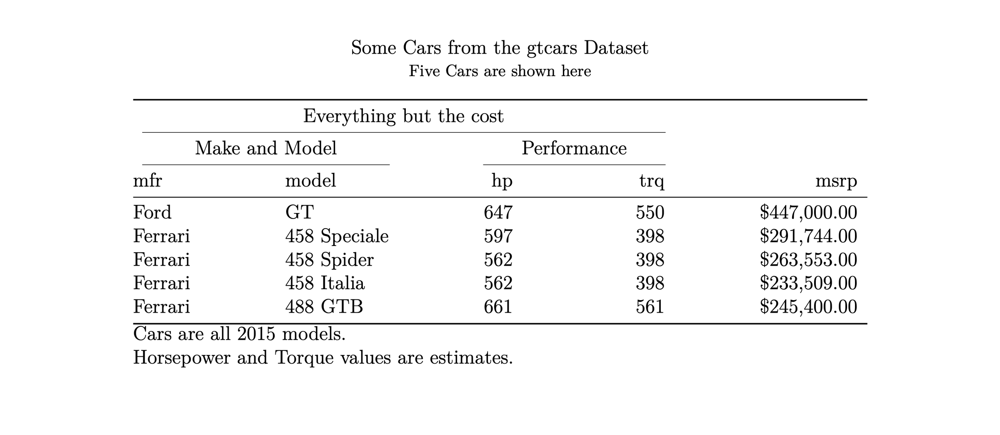

<script src="https://cdn.jsdelivr.net/npm/requirejs@2.3.6/require.min.js" integrity="sha384-c9c+LnTbwQ3aujuU7ULEPVvgLs+Fn6fJUvIGTsuu1ZcCf11fiEubah0ttpca4ntM sha384-6V1/AdqZRWk1KAlWbKBlGhN7VG4iE/yAZcO6NZPMF8od0vukrvr0tg4qY6NSrItx" crossorigin="anonymous"></script>
<script src="https://cdn.jsdelivr.net/npm/jquery@3.5.1/dist/jquery.min.js" integrity="sha384-ZvpUoO/+PpLXR1lu4jmpXWu80pZlYUAfxl5NsBMWOEPSjUn/6Z/hRTt8+pR6L4N2" crossorigin="anonymous" data-relocate-top="true"></script>
<script type="application/javascript">define('jquery', [],function() {return window.jQuery;})</script>


We've been doing quite a bit of work on getting **Great Tables** to produce LaTeX table code and `v0.14.0` introduces the `as_latex()` method to make this possible. For those publishing workflows involving LaTeX documents, it's useful to have a reproducible solution for generating data tables as native LaTeX tables.

In this post, we will go over the following:

- generating LaTeX table code: how we handle the different parts of a table
- rendering to PDF with Quarto: integrating LaTeX table code into PDFs
- current limitations and roadmap: what has been implemented, and what is left

## Generating a LaTeX table with Great Tables

We can use the `GT.as_latex()` method to generate LaTeX table code. This code includes important structural pieces like titles, spanners, and value formatting. For example, here's a simple table output as LaTeX code:

``` python
from great_tables import GT
from great_tables.data import gtcars
import polars as pl

gtcars_pl = (
    pl.from_pandas(gtcars)
    .select(["mfr", "model", "hp", "trq", "mpg_c", "msrp"])
)

gt_tbl = (
    GT(
        gtcars[["mfr", "model", "hp", "trq", "msrp"]].head(5),
    )
    .tab_header(
        title="Some Cars from the gtcars Dataset",
        subtitle="Five Cars are shown here"
    )
    .tab_spanner(
        label="Make and Model",
        columns=["mfr", "model"],
        id="make_model"
    )
    .tab_spanner(
        label="Performance",
        columns=["hp", "trq", "msrp"]
    )
    .tab_spanner(
        label="Everything but the cost",
        columns=["mfr", "model", "hp", "trq"]
    )
    .fmt_integer(columns=["hp", "trq"])
    .fmt_currency(columns="msrp")
    .tab_source_note("Cars are all 2015 models.")
    .tab_source_note("Horsepower and Torque values are estimates.")
)

print(gt_tbl.as_latex())
```

``` latex
\begin{table}
\caption*{
{\large Some Cars from the gtcars Dataset} \\
{\small Five Cars are shown here}
}

\fontsize{12.0pt}{14.4pt}\selectfont

\begin{tabular*}{\linewidth}{@{\extracolsep{\fill}}llrrr}
\toprule
\multicolumn{4}{c}{Everything but the cost} &  \\
\cmidrule(lr){1-4}
\multicolumn{2}{c}{Make and Model} & \multicolumn{3}{c}{Performance} \\
\cmidrule(lr){1-2} \cmidrule(lr){3-5}
mfr & model & hp & trq & msrp \\
\midrule\addlinespace[2.5pt]
Ford & GT & 647 & 550 & \$447,000.00 \\
Ferrari & 458 Speciale & 597 & 398 & \$291,744.00 \\
Ferrari & 458 Spider & 562 & 398 & \$263,553.00 \\
Ferrari & 458 Italia & 562 & 398 & \$233,509.00 \\
Ferrari & 488 GTB & 661 & 561 & \$245,400.00 \\
\bottomrule
\end{tabular*}
\begin{minipage}{\linewidth}
Cars are all 2015 models.\\
Horsepower and Torque values are estimates.\\
\end{minipage}
\end{table}
```

The returned LaTeX table code shows how some of Great Tables' structural components are represented in LaTeX. Note these three important pieces of LaTeX code:

- `\caption*{` produces our title and subtitle (line 2)
- the `\multicolumn{` statements produce spanners (i.e., labels on top of multiple column labels) (line 11)
- the values in the data are escaped, using `\` (e.g., `\$` represents a literal dollar sign) (line 17)

A frequent issue with any programmatic generation of LaTeX table code is LaTeX escaping. Not doing so can lead to LaTeX rendering errors, potentially breaking an entire publishing workflow. Great Tables will automatically escape characters in LaTeX, limiting such errors.

## Using LaTeX output from Great Tables in Quarto

Producing LaTeX table code is especially handy when using [Quarto](https://quarto.org) to generate PDF documents. Quarto is a tool for publishing documents, websites, books, etc., with an emphasis on running Python code. It uses the .qmd file format, which is a superset of Markdown (.md).

Here's an example .qmd file with these pieces in place:

```` markdown
---
format: pdf
---

Using Great Tables in a Quarto PDF document.

```{python}
#| output: asis

from great_tables import GT, exibble

gt_tbl = GT(exibble)

print(gt_tbl.as_latex())
```
````

Notice that in the .qmd above we needed to have the following pieces to generate a PDF:

1.  set `"format: pdf"` in YAML header
2.  set `"output: asis"` in the code cell that's outputting LaTeX table code
3.  use the `as_latex()` method on a GT object and `print()` the text

The example above used a very simple table, but here's the table from the previous example rendered to PDF in Quarto:

<details>
<summary>
.qmd content
</summary>

```` markdown
---
format: pdf
---

Example using the `gtcars` dataset.

```{python}
#| output: asis

from great_tables import GT
from great_tables.data import gtcars
import polars as pl

gtcars_pl = (
    pl.from_pandas(gtcars)
    .select(["mfr", "model", "hp", "trq", "mpg_c", "msrp"])
)

gt_tbl = (
    GT(
        gtcars[["mfr", "model", "hp", "trq", "msrp"]].head(5),
    )
    .tab_header(
        title="Some Cars from the gtcars Dataset",
        subtitle="Five Cars are shown here"
    )
    .tab_spanner(
        label="Make and Model",
        columns=["mfr", "model"],
        id="make_model"
    )
    .tab_spanner(
        label="Performance",
        columns=["hp", "trq"]
    )
    .tab_spanner(
        label="Everything but the cost",
        columns=["mfr", "model", "hp", "trq"]
    )
    .fmt_integer(columns=["hp", "trq"])
    .fmt_currency(columns="msrp")
    .tab_source_note("Cars are all 2015 models.")
    .tab_source_note("Horsepower and Torque values are estimates.")
    .tab_options(table_width="600pt")
)

print(gt_tbl.as_latex())
```
````

</details>



If you'd like to experiment with Great Tables' LaTeX rendering, you can get the text of a working .qmd file in the details below. Make sure your installation of Quarto is [up to date](https://quarto.org/docs/get-started/) and that you have Great Tables upgraded to `v0.14.0`.

## Current limitations of LaTeX table output

The `as_latex()` method is still experimental and has some limitations. The following table lists the work epics that have been done and those planned:

<div id="frhhzxfsek" style="padding-left:0px;padding-right:0px;padding-top:10px;padding-bottom:10px;overflow-x:auto;overflow-y:auto;width:auto;height:auto;">
<style>
@import url('https://fonts.googleapis.com/css2?family=Atkinson+Hyperlegible&display=swap');
#frhhzxfsek table {
          font-family: 'Atkinson Hyperlegible', -apple-system, BlinkMacSystemFont, 'Segoe UI', Roboto, Oxygen, Ubuntu, Cantarell, 'Helvetica Neue', 'Fira Sans', 'Droid Sans', Arial, sans-serif;
          -webkit-font-smoothing: antialiased;
          -moz-osx-font-smoothing: grayscale;
        }

#frhhzxfsek thead, tbody, tfoot, tr, td, th { border-style: none; }
 tr { background-color: transparent; }
#frhhzxfsek p { margin: 0; padding: 0; }
 #frhhzxfsek .gt_table { display: table; border-collapse: collapse; line-height: normal; margin-left: auto; margin-right: auto; color: #333333; font-size: 16px; font-weight: normal; font-style: normal; background-color: #FFFFFF; width: 450px; border-top-style: solid; border-top-width: 2px; border-top-color: #A8A8A8; border-right-style: none; border-right-width: 2px; border-right-color: #D3D3D3; border-bottom-style: solid; border-bottom-width: 2px; border-bottom-color: #A8A8A8; border-left-style: none; border-left-width: 2px; border-left-color: #D3D3D3; }
 #frhhzxfsek .gt_caption { padding-top: 4px; padding-bottom: 4px; }
 #frhhzxfsek .gt_title { color: #333333; font-size: 125%; font-weight: initial; padding-top: 4px; padding-bottom: 4px; padding-left: 5px; padding-right: 5px; border-bottom-color: #FFFFFF; border-bottom-width: 0; }
 #frhhzxfsek .gt_subtitle { color: #333333; font-size: 85%; font-weight: initial; padding-top: 3px; padding-bottom: 5px; padding-left: 5px; padding-right: 5px; border-top-color: #FFFFFF; border-top-width: 0; }
 #frhhzxfsek .gt_heading { background-color: #FFFFFF; text-align: center; border-bottom-color: #FFFFFF; border-left-style: none; border-left-width: 1px; border-left-color: #D3D3D3; border-right-style: none; border-right-width: 1px; border-right-color: #D3D3D3; }
 #frhhzxfsek .gt_bottom_border { border-bottom-style: solid; border-bottom-width: 2px; border-bottom-color: #D3D3D3; }
 #frhhzxfsek .gt_col_headings { border-top-style: solid; border-top-width: 2px; border-top-color: #D3D3D3; border-bottom-style: solid; border-bottom-width: 2px; border-bottom-color: #D3D3D3; border-left-style: none; border-left-width: 1px; border-left-color: #D3D3D3; border-right-style: none; border-right-width: 1px; border-right-color: #D3D3D3; }
 #frhhzxfsek .gt_col_heading { color: #333333; background-color: #FFFFFF; font-size: 18px; font-weight: bolder; text-transform: uppercase; border-left-style: none; border-left-width: 1px; border-left-color: #D3D3D3; border-right-style: none; border-right-width: 1px; border-right-color: #D3D3D3; vertical-align: bottom; padding-top: 5px; padding-bottom: 5px; padding-left: 5px; padding-right: 5px; overflow-x: hidden; }
 #frhhzxfsek .gt_column_spanner_outer { color: #333333; background-color: #FFFFFF; font-size: 18px; font-weight: bolder; text-transform: uppercase; padding-top: 0; padding-bottom: 0; padding-left: 4px; padding-right: 4px; }
 #frhhzxfsek .gt_column_spanner_outer:first-child { padding-left: 0; }
 #frhhzxfsek .gt_column_spanner_outer:last-child { padding-right: 0; }
 #frhhzxfsek .gt_column_spanner { border-bottom-style: solid; border-bottom-width: 2px; border-bottom-color: #D3D3D3; vertical-align: bottom; padding-top: 5px; padding-bottom: 5px; overflow-x: hidden; display: inline-block; width: 100%; }
 #frhhzxfsek .gt_spanner_row { border-bottom-style: hidden; }
 #frhhzxfsek .gt_group_heading { padding-top: 8px; padding-bottom: 8px; padding-left: 5px; padding-right: 5px; color: #333333; background-color: #FFFFFF; font-size: 80%; font-weight: bolder; text-transform: uppercase; border-top-style: solid; border-top-width: 2px; border-top-color: #D3D3D3; border-bottom-style: solid; border-bottom-width: 2px; border-bottom-color: #D3D3D3; border-left-style: none; border-left-width: 1px; border-left-color: #D3D3D3; border-right-style: none; border-right-width: 1px; border-right-color: #D3D3D3; vertical-align: middle; text-align: left; }
 #frhhzxfsek .gt_empty_group_heading { padding: 0.5px; color: #333333; background-color: #FFFFFF; font-size: 80%; font-weight: bolder; border-top-style: solid; border-top-width: 2px; border-top-color: #D3D3D3; border-bottom-style: solid; border-bottom-width: 2px; border-bottom-color: #D3D3D3; vertical-align: middle; }
 #frhhzxfsek .gt_from_md> :first-child { margin-top: 0; }
 #frhhzxfsek .gt_from_md> :last-child { margin-bottom: 0; }
 #frhhzxfsek .gt_row { padding-top: 8px; padding-bottom: 8px; padding-left: 5px; padding-right: 5px; margin: 10px; border-top-style: solid; border-top-width: 1px; border-top-color: #D3D3D3; border-left-style: none; border-left-width: 1px; border-left-color: #D3D3D3; border-right-style: none; border-right-width: 1px; border-right-color: #D3D3D3; vertical-align: middle; overflow-x: hidden; }
 #frhhzxfsek .gt_stub { color: #333333; background-color: #FFFFFF; font-size: 80%; font-weight: bolder; text-transform: uppercase; border-right-style: solid; border-right-width: 2px; border-right-color: #D3D3D3; padding-left: 5px; padding-right: 5px; }
 #frhhzxfsek .gt_stub_row_group { color: #333333; background-color: #FFFFFF; font-size: 100%; font-weight: initial; text-transform: inherit; border-right-style: solid; border-right-width: 2px; border-right-color: #D3D3D3; padding-left: 5px; padding-right: 5px; vertical-align: top; }
 #frhhzxfsek .gt_row_group_first td { border-top-width: 2px; }
 #frhhzxfsek .gt_row_group_first th { border-top-width: 2px; }
 #frhhzxfsek .gt_striped { color: #333333; background-color: #F4F4F4; }
 #frhhzxfsek .gt_table_body { border-top-style: solid; border-top-width: 2px; border-top-color: #D3D3D3; border-bottom-style: solid; border-bottom-width: 2px; border-bottom-color: #D3D3D3; }
 #frhhzxfsek .gt_grand_summary_row { color: #333333; background-color: #FFFFFF; text-transform: inherit; padding-top: 8px; padding-bottom: 8px; padding-left: 5px; padding-right: 5px; }
 #frhhzxfsek .gt_first_grand_summary_row_bottom { border-top-style: double; border-top-width: 6px; border-top-color: #D3D3D3; }
 #frhhzxfsek .gt_last_grand_summary_row_top { border-bottom-style: double; border-bottom-width: 6px; border-bottom-color: #D3D3D3; }
 #frhhzxfsek .gt_sourcenotes { color: #333333; background-color: #FFFFFF; border-bottom-style: none; border-bottom-width: 2px; border-bottom-color: #D3D3D3; border-left-style: none; border-left-width: 2px; border-left-color: #D3D3D3; border-right-style: none; border-right-width: 2px; border-right-color: #D3D3D3; }
 #frhhzxfsek .gt_sourcenote { font-size: 90%; padding-top: 4px; padding-bottom: 4px; padding-left: 5px; padding-right: 5px; text-align: left; }
 #frhhzxfsek .gt_left { text-align: left; }
 #frhhzxfsek .gt_center { text-align: center; }
 #frhhzxfsek .gt_right { text-align: right; font-variant-numeric: tabular-nums; }
 #frhhzxfsek .gt_font_normal { font-weight: normal; }
 #frhhzxfsek .gt_font_bold { font-weight: bold; }
 #frhhzxfsek .gt_font_italic { font-style: italic; }
 #frhhzxfsek .gt_super { font-size: 65%; }
 #frhhzxfsek .gt_footnote_marks { font-size: 75%; vertical-align: 0.4em; position: initial; }
 #frhhzxfsek .gt_asterisk { font-size: 100%; vertical-align: 0; }
 
</style>

| LaTeX Support | status |
|----|----|
| Escaping | ✅ |
| Most `fmt_*()` methods | ✅ |
| `as_latex()` table code generation | ✅ |
| `tab_stub()` for row and group labels | 🚧 |
| `md()` to render Markdown to LaTeX | 🚧 |
| Implementation of Units Notation | 🚧 |
| Allow `fmt_markdown()`, `fmt_units()`, `fmt_image()`, and `fmt_nanoplot()` | 🚧 |
| `sub_missing()` and `sub_zero()` methods | 🚧 |
| `tab_style()` method | 🚧 |

</div>

Some of these TODOs are short-term, notably the ones dealing with the use of the table stub and row groups. We plan to address this soon but having those structural components in a table currently will raise an error when using `as_latex()`.

We don't yet see an obvious solution for Markdown-to-LaTeX conversion. We depend on the `commonmark` library to perform Markdown-to-HTML transformation but the library doesn't support LaTeX output.

Styling a LaTeX table is currently not possible. Having a `tab_style()` statement in your GT code and subsequently using `as_latex()` won't raise an error, but it will warn and essentially no-op. Many of the options available in `tab_options()` are those that perform styling

As development continues, we will work to expand the capabilities of the `as_latex()` method to reduce these limitations and more clearly document what is and is not supported.

## Let's LaTeX!

While this is an early preview of a new rendering capability in Great Tables, we are optimistic that it can be greatly improved in due course. If you're experimenting with this feature, please let us know about any problems you bump into by using the Great Tables [issue tracker](https://github.com/posit-dev/great-tables/issues).

The goal is to make LaTeX output dependable, work within several common LaTeX-publishing workflows, and be fully featured enough to make this table-making route in LaTeX preferable to other solutions in this space.
