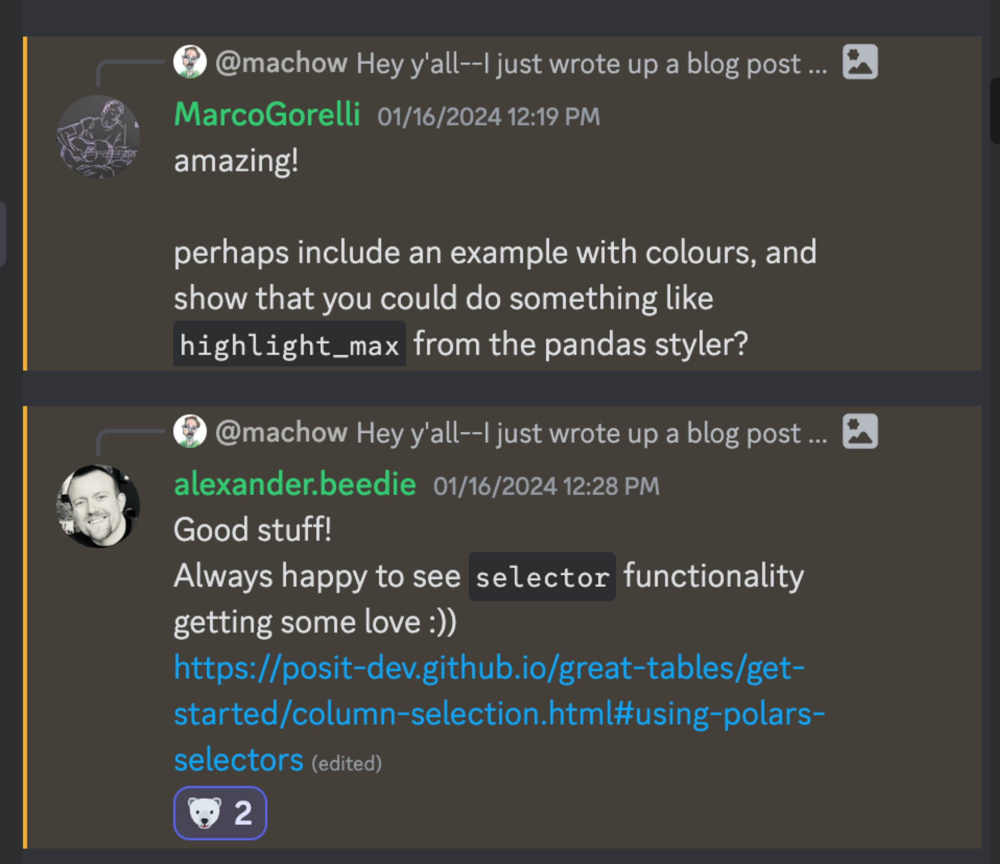
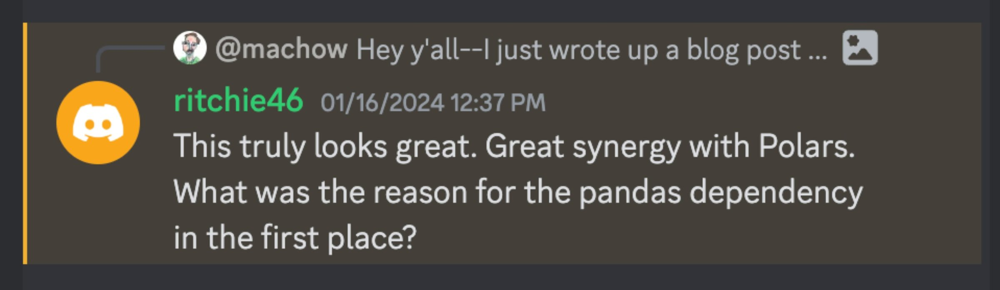
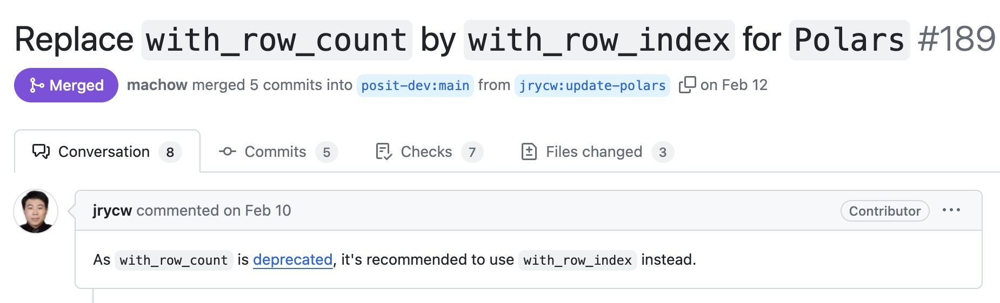
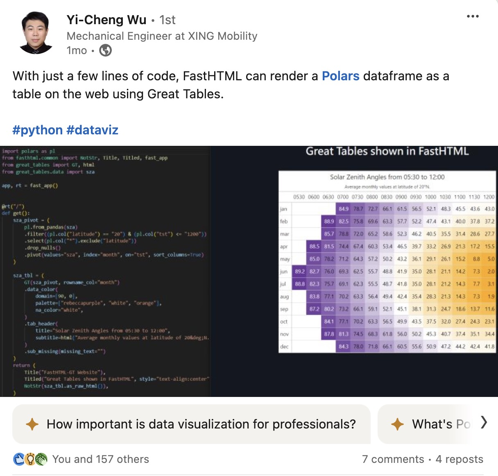

<script src="https://cdn.jsdelivr.net/npm/requirejs@2.3.6/require.min.js" integrity="sha384-c9c+LnTbwQ3aujuU7ULEPVvgLs+Fn6fJUvIGTsuu1ZcCf11fiEubah0ttpca4ntM sha384-6V1/AdqZRWk1KAlWbKBlGhN7VG4iE/yAZcO6NZPMF8od0vukrvr0tg4qY6NSrItx" crossorigin="anonymous"></script>
<script src="https://cdn.jsdelivr.net/npm/jquery@3.5.1/dist/jquery.min.js" integrity="sha384-ZvpUoO/+PpLXR1lu4jmpXWu80pZlYUAfxl5NsBMWOEPSjUn/6Z/hRTt8+pR6L4N2" crossorigin="anonymous" data-relocate-top="true"></script>
<script type="application/javascript">define('jquery', [],function() {return window.jQuery;})</script>


Roughly a year ago, the DataFrame library Polars made its v1.0.0 release.
One neat feature included in the release was a [`DataFrame.style`](https://docs.pola.rs/user-guide/misc/styling/) property---which returns a Great Tables object, so you can
add things like titles, column labels, and highlighting for reporting.

When talking about the Polars integration, people are often surprised to hear it happened when Great Tables was only 8 months old.
Moreover, the whole process of how open source maintainers chat and
discuss teaming up can feel shrouded in mystery.

In this post, I want to take some time to discuss how folks in the Polars and Great Tables communities
got to `DataFrame.style`. There are three big pieces:

- **How we got there**: the magic of the Polars discord.
- **Making `.style` work**: enabling Great Tables to work as a property.
- **What's next?**

## How we got there

### First contact: Polars discord

Roughly a year ago, Rich Iannone and I (Michael Chow) started working together on Great Tables---a Python library
for creating display tables. Initially, Great Tables only supported Pandas, but this made a few things difficult.
For example, selecting columns and applying conditional styles took a surprising amount of code.

As an experiment, we added support for Polars, and wrote a post called
[Great Tables: The Polars DataFrame Styler of Your Dreams](/blog/great-tables/polars-styling/).

Curious in what folks thought, we dropped it in the Polars discord, and got some Great Feedback:



But Ritchie Vink, the creator of Polars, knew we were harboring a shameful Pandas dependency secret:



It's true, we had baked Pandas in as a dependency. We were just kids back then when starting Great Tables.
We didn't realize that the world was moving to DataFrame agnostic support 😓.

But the more we used Polars with Great Tables, the happier we were.
So we made some architectural tweaks to make Great Tables [BYODF (Bring Your Own DataFrame)](/blog/great-tables/bring-your-own-df/).
With these changes, Polars users could install and use Great Tables without pulling in an unnecessary
dependency on another DataFrame library (Pandas).

These interactions were critical early on for co-designing Great Tables with Polars in mind.
But the real magic for us was when Polars users started opening PRs on Great Tables, to make sure we got things right. Chief among them, Jerry Wu!

### Jerry Wu: power contributor

Luckily, members of the Polars community, like Jerry Wu [(jrycw)](https://github.com/jrycw), showed up to make sure we wired up to Polars correctly, and to weigh in on how Polars should be used.

For example, Jerry's first PR was ensuring we handled a Polars deprecation correctly.



I really can't overstate how much we appreciate his help, and how critical it has been in ensuring we get the details right.

In addition to his PRs, Jerry has done really Great Work sharing about table display. The most interesting example of this to me is that he discovered that Polars, Great Tables, and FastHTML work well together.



Rich and I had no idea that was possible, and the FastHTML folks ended up adapting his example into an [entry on their gallery](https://fastht.ml/gallery/split_view?category=visualizations&project=great_tables_tables).
Jerry is constantly teaching us about what Great Tables can do.

### Growing up: making the case for `.style`

With so much joy coming out of the Polars integration, and support from folks in the Polars community, we started to wonder: how could Great Tables make Polars a first-class citizen?

This ultimately boiled down to asking: what would it take for the `polars.DataFrame.style` property to return a Great Tables object?

After some discussion on discord, the big pieces folks needed were some sense that Great Tables used a reasonable approach to table styling, carried few dependencies, and was engineered such that it could be returned from a `DataFrame.style` property.
Ultimately, the next few months were spent getting Great Tables up to snuff, and the Polars PR merged.

## Making `.style` work

The [PR to implement `.style` in Polars](https://github.com/pola-rs/polars/pull/16809) went super quick, from advice on discord April to merged by June. A huge force behind the PR was [Marco Gorelli](https://github.com/MarcoGorelli), who encouraged us through the process!

In this section I'll look at how we addressed the 3 big requirements behind making a strong case for `.DataFrame.style` returning a Great Tables object:

- **Design Credibility**: It's clear Great Tables is reasonably thought out.
- **Working with Polars selectors**: It integrates well with pieces like Polars selectors.
- **Technical**: Great Tables can be returned from a `DataFrame.style` property.

### Design credibility

Our biggest hurdle was that the Great Tables library was less than a year old.
However, this youthful appearance is a bit misleading, because Great Tables builds on decades of
table design and tooling. For example, Rich's version of Great Tables in R, called `gt`, has been around since 2019 (see [his rstudio::conf() talk](https://youtu.be/h1KAjSfSbmk)).

My favorite aspect of `gt` is that the community ran **table contests** every year. The contests don't even require the use of `gt` or Great Tables, just a zest for the art of table styling. The [2024 Table Contest](https://posit.co/blog/2024-table-contest-winners/) had around **60 submissions**, and is something we often draw on for inspiration.

For more on the long history of table design, see [The Design Philosophy of Great Tables](https://posit-dev.github.io/great-tables/blog/design-philosophy/), or this [Fred Hutch better tables workshop](https://hutchdatascience.org/better_tables/).

### Working with Polars selectors

One important task was **sorting out how we use Polars selectors**, to ensure they didn't break down the road.

For example, Great Tables allows Polars selectors to set styles on specific columns data.
However, one challenge we ran into was figuring out what Polars considers an expression versus a selector.
Essentially, selectors choose columns, but expressions represent operations on the data itself.

The code below shows cases where the `.exclude()` results in expressions or selectors.

``` python
import polars as pl
import polars.selectors as cs

# selector: all columns except "a"
cs.exclude("a")

# expression: same columns as above ¯\_(ツ)_/¯
cs.all().exclude("a")
```

After discussing with Polars folks [in this Polars issue](https://github.com/pola-rs/polars/issues/16448),
we landed on **4 rules for selectors**:

| rule | description | example |
|-----------------|---------------------------------|----------------------|
| `cs` functions | top-level `cs` selection functions -\> **selector** | `cs.starts_with("a")` |
| infix selectors | infix operators over all selectors -\> **selector** | `cs.starts_with("a") - cs.by_name("abc")` |
| infix expressions | infix operators over any non-selectors -\> **expression** | `cs.starts_with("a") - "abc"` |
| method expressions | method calls off selectors -\> **expression** | `cs.all().exclude("a")` |

Clarifying this was critical in Great Tables, because in some place we only accept selectors, so
we needed to be able to articulate to users how to produce them.

### Technical wiring work

The last hurdle was tweaking the `great_tables.GT` class to fit the flow of `DataFrame.style`.
For example, here is what creating a `GT()` object looked like before and after `.style`:

- Before: `GT(my_data, id="my-table")`
- After: `my_data.style.with_id("my-table")`

Notice that before, the `GT(id=...)` argument could set the html id for a table.
However, `DataFrame.style` is a property that can't take arguments, so we needed methods like `with_id()`
to set these kinds of options.

Here's a full code example, in case you want to see it in action.

``` python
import polars as pl
from great_tables import GT
from great_tables import exibble

# create a GT object ----
GT(exibble, id="my-table")

# create GT object via .style property ----
pl.DataFrame(exibble).style
```

<div id="pgelgeqlbq" style="padding-left:0px;padding-right:0px;padding-top:10px;padding-bottom:10px;overflow-x:auto;overflow-y:auto;width:auto;height:auto;">
<style>
#pgelgeqlbq table {
          font-family: -apple-system, BlinkMacSystemFont, 'Segoe UI', Roboto, Oxygen, Ubuntu, Cantarell, 'Helvetica Neue', 'Fira Sans', 'Droid Sans', Arial, sans-serif;
          -webkit-font-smoothing: antialiased;
          -moz-osx-font-smoothing: grayscale;
        }

#pgelgeqlbq thead, tbody, tfoot, tr, td, th { border-style: none; }
 tr { background-color: transparent; }
#pgelgeqlbq p { margin: 0; padding: 0; }
 #pgelgeqlbq .gt_table { display: table; border-collapse: collapse; line-height: normal; margin-left: auto; margin-right: auto; color: #333333; font-size: 16px; font-weight: normal; font-style: normal; background-color: #FFFFFF; width: auto; border-top-style: solid; border-top-width: 2px; border-top-color: #A8A8A8; border-right-style: none; border-right-width: 2px; border-right-color: #D3D3D3; border-bottom-style: solid; border-bottom-width: 2px; border-bottom-color: #A8A8A8; border-left-style: none; border-left-width: 2px; border-left-color: #D3D3D3; }
 #pgelgeqlbq .gt_caption { padding-top: 4px; padding-bottom: 4px; }
 #pgelgeqlbq .gt_title { color: #333333; font-size: 125%; font-weight: initial; padding-top: 4px; padding-bottom: 4px; padding-left: 5px; padding-right: 5px; border-bottom-color: #FFFFFF; border-bottom-width: 0; }
 #pgelgeqlbq .gt_subtitle { color: #333333; font-size: 85%; font-weight: initial; padding-top: 3px; padding-bottom: 5px; padding-left: 5px; padding-right: 5px; border-top-color: #FFFFFF; border-top-width: 0; }
 #pgelgeqlbq .gt_heading { background-color: #FFFFFF; text-align: center; border-bottom-color: #FFFFFF; border-left-style: none; border-left-width: 1px; border-left-color: #D3D3D3; border-right-style: none; border-right-width: 1px; border-right-color: #D3D3D3; }
 #pgelgeqlbq .gt_bottom_border { border-bottom-style: solid; border-bottom-width: 2px; border-bottom-color: #D3D3D3; }
 #pgelgeqlbq .gt_col_headings { border-top-style: solid; border-top-width: 2px; border-top-color: #D3D3D3; border-bottom-style: solid; border-bottom-width: 2px; border-bottom-color: #D3D3D3; border-left-style: none; border-left-width: 1px; border-left-color: #D3D3D3; border-right-style: none; border-right-width: 1px; border-right-color: #D3D3D3; }
 #pgelgeqlbq .gt_col_heading { color: #333333; background-color: #FFFFFF; font-size: 100%; font-weight: normal; text-transform: inherit; border-left-style: none; border-left-width: 1px; border-left-color: #D3D3D3; border-right-style: none; border-right-width: 1px; border-right-color: #D3D3D3; vertical-align: bottom; padding-top: 5px; padding-bottom: 5px; padding-left: 5px; padding-right: 5px; overflow-x: hidden; }
 #pgelgeqlbq .gt_column_spanner_outer { color: #333333; background-color: #FFFFFF; font-size: 100%; font-weight: normal; text-transform: inherit; padding-top: 0; padding-bottom: 0; padding-left: 4px; padding-right: 4px; }
 #pgelgeqlbq .gt_column_spanner_outer:first-child { padding-left: 0; }
 #pgelgeqlbq .gt_column_spanner_outer:last-child { padding-right: 0; }
 #pgelgeqlbq .gt_column_spanner { border-bottom-style: solid; border-bottom-width: 2px; border-bottom-color: #D3D3D3; vertical-align: bottom; padding-top: 5px; padding-bottom: 5px; overflow-x: hidden; display: inline-block; width: 100%; }
 #pgelgeqlbq .gt_spanner_row { border-bottom-style: hidden; }
 #pgelgeqlbq .gt_group_heading { padding-top: 8px; padding-bottom: 8px; padding-left: 5px; padding-right: 5px; color: #333333; background-color: #FFFFFF; font-size: 100%; font-weight: initial; text-transform: inherit; border-top-style: solid; border-top-width: 2px; border-top-color: #D3D3D3; border-bottom-style: solid; border-bottom-width: 2px; border-bottom-color: #D3D3D3; border-left-style: none; border-left-width: 1px; border-left-color: #D3D3D3; border-right-style: none; border-right-width: 1px; border-right-color: #D3D3D3; vertical-align: middle; text-align: left; }
 #pgelgeqlbq .gt_empty_group_heading { padding: 0.5px; color: #333333; background-color: #FFFFFF; font-size: 100%; font-weight: initial; border-top-style: solid; border-top-width: 2px; border-top-color: #D3D3D3; border-bottom-style: solid; border-bottom-width: 2px; border-bottom-color: #D3D3D3; vertical-align: middle; }
 #pgelgeqlbq .gt_from_md> :first-child { margin-top: 0; }
 #pgelgeqlbq .gt_from_md> :last-child { margin-bottom: 0; }
 #pgelgeqlbq .gt_row { padding-top: 8px; padding-bottom: 8px; padding-left: 5px; padding-right: 5px; margin: 10px; border-top-style: solid; border-top-width: 1px; border-top-color: #D3D3D3; border-left-style: none; border-left-width: 1px; border-left-color: #D3D3D3; border-right-style: none; border-right-width: 1px; border-right-color: #D3D3D3; vertical-align: middle; overflow-x: hidden; }
 #pgelgeqlbq .gt_stub { color: #333333; background-color: #FFFFFF; font-size: 100%; font-weight: initial; text-transform: inherit; border-right-style: solid; border-right-width: 2px; border-right-color: #D3D3D3; padding-left: 5px; padding-right: 5px; }
 #pgelgeqlbq .gt_stub_row_group { color: #333333; background-color: #FFFFFF; font-size: 100%; font-weight: initial; text-transform: inherit; border-right-style: solid; border-right-width: 2px; border-right-color: #D3D3D3; padding-left: 5px; padding-right: 5px; vertical-align: top; }
 #pgelgeqlbq .gt_row_group_first td { border-top-width: 2px; }
 #pgelgeqlbq .gt_row_group_first th { border-top-width: 2px; }
 #pgelgeqlbq .gt_striped { color: #333333; background-color: #F4F4F4; }
 #pgelgeqlbq .gt_table_body { border-top-style: solid; border-top-width: 2px; border-top-color: #D3D3D3; border-bottom-style: solid; border-bottom-width: 2px; border-bottom-color: #D3D3D3; }
 #pgelgeqlbq .gt_grand_summary_row { color: #333333; background-color: #FFFFFF; text-transform: inherit; padding-top: 8px; padding-bottom: 8px; padding-left: 5px; padding-right: 5px; }
 #pgelgeqlbq .gt_first_grand_summary_row_bottom { border-top-style: double; border-top-width: 6px; border-top-color: #D3D3D3; }
 #pgelgeqlbq .gt_last_grand_summary_row_top { border-bottom-style: double; border-bottom-width: 6px; border-bottom-color: #D3D3D3; }
 #pgelgeqlbq .gt_sourcenotes { color: #333333; background-color: #FFFFFF; border-bottom-style: none; border-bottom-width: 2px; border-bottom-color: #D3D3D3; border-left-style: none; border-left-width: 2px; border-left-color: #D3D3D3; border-right-style: none; border-right-width: 2px; border-right-color: #D3D3D3; }
 #pgelgeqlbq .gt_sourcenote { font-size: 90%; padding-top: 4px; padding-bottom: 4px; padding-left: 5px; padding-right: 5px; text-align: left; }
 #pgelgeqlbq .gt_left { text-align: left; }
 #pgelgeqlbq .gt_center { text-align: center; }
 #pgelgeqlbq .gt_right { text-align: right; font-variant-numeric: tabular-nums; }
 #pgelgeqlbq .gt_font_normal { font-weight: normal; }
 #pgelgeqlbq .gt_font_bold { font-weight: bold; }
 #pgelgeqlbq .gt_font_italic { font-style: italic; }
 #pgelgeqlbq .gt_super { font-size: 65%; }
 #pgelgeqlbq .gt_footnote_marks { font-size: 75%; vertical-align: 0.4em; position: initial; }
 #pgelgeqlbq .gt_asterisk { font-size: 100%; vertical-align: 0; }
 
</style>

| num | char | fctr | date | time | datetime | currency | row | group |
|----|----|----|----|----|----|----|----|----|
| 0.1111 | apricot | one | 2015-01-15 | 13:35 | 2018-01-01 02:22 | 49.95 | row_1 | grp_a |
| 2.222 | banana | two | 2015-02-15 | 14:40 | 2018-02-02 14:33 | 17.95 | row_2 | grp_a |
| 33.33 | coconut | three | 2015-03-15 | 15:45 | 2018-03-03 03:44 | 1.39 | row_3 | grp_a |
| 444.4 | durian | four | 2015-04-15 | 16:50 | 2018-04-04 15:55 | 65100.0 | row_4 | grp_a |
| 5550.0 | None | five | 2015-05-15 | 17:55 | 2018-05-05 04:00 | 1325.81 | row_5 | grp_b |
| None | fig | six | 2015-06-15 | None | 2018-06-06 16:11 | 13.255 | row_6 | grp_b |
| 777000.0 | grapefruit | seven | None | 19:10 | 2018-07-07 05:22 | None | row_7 | grp_b |
| 8880000.0 | honeydew | eight | 2015-08-15 | 20:20 | None | 0.44 | row_8 | grp_b |

</div>

The `DataFrame.style` property is special, in that you don't pass any parameters to it.
The motivation for this in Polars is that it matches the Pandas `pandas.DataFrame.style` approach,
so provides a familiar interface for users coming from that package.
It also matches the `DataFrame.plot` flow of both packages.

As it turns out, allowing every options settable in the `GT()` constructor to be set somewhere else was not something anticipated in the design of Great Tables. But after some light architectural wrestling, we introduced `.tab_stub()`, `.with_id()`, and `.with_locale()` to capture arguments you might pass to `GT()`.

## What's next?

Currently, we're really excited about using Great Tables in different ways!

- [Pointblank](https://github.com/posit-dev/pointblank): validate your DataFrames and database tables. Pointblank is quick to fire up and produces delightfully styled reports (using Great Tables 😎).
- [reactable](https://github.com/machow/reactable-py): create interactive tables. We want to use reactable to render a Great Tables object interactively.

We're also focused on keeping bug fixes and features cooking in Great Tables. If there's anything
in particular you're looking for, definitely reach out on the [Great Tables discussion page](https://github.com/posit-dev/great-tables/discussions).

## In conclusion

This post looked at how interacting with the Polars community discord shaped Great Tables development early on, and how community members like Jerry ended up ensuring Great Tables and Polars played well together.
We ended up putting a ring on it, and ensuring Great Tables design, dependencies, and architecture worked
well enough to justify returning via `polars.DataFrame.style`. (Though this is still marked unstable in Polars!)

We're excited to look at different use cases for Great Tables (and table styling in general) over the
next year!
