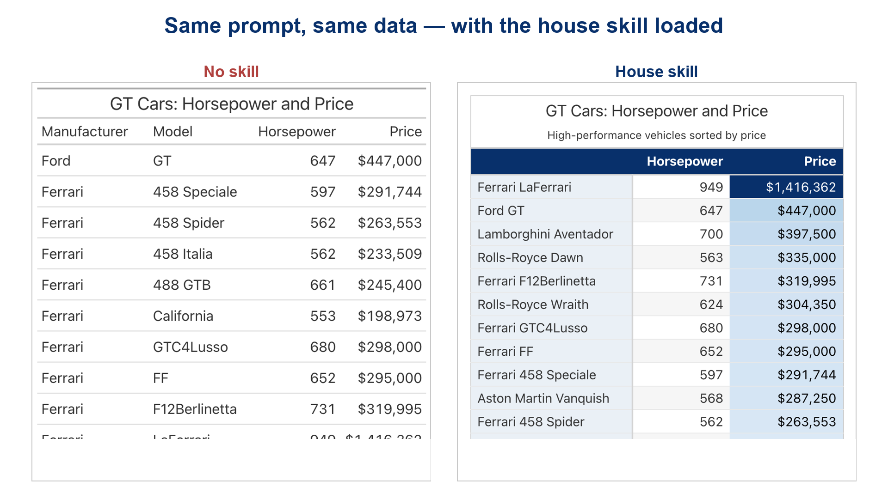
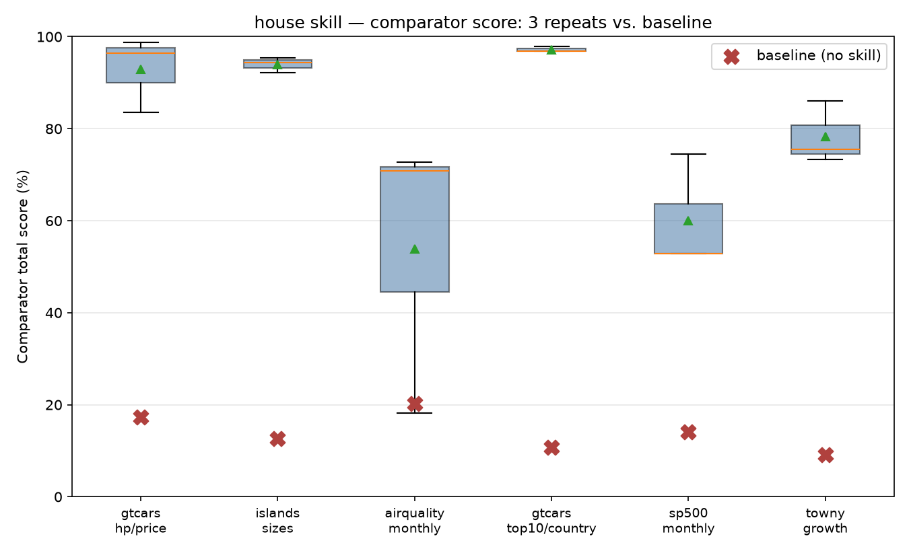
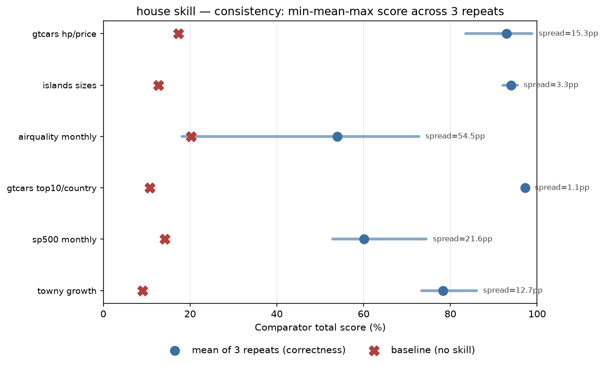
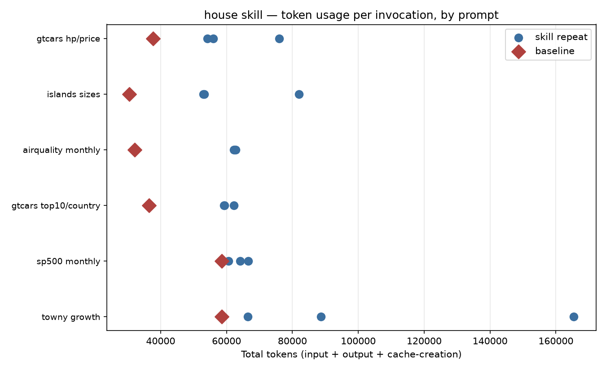
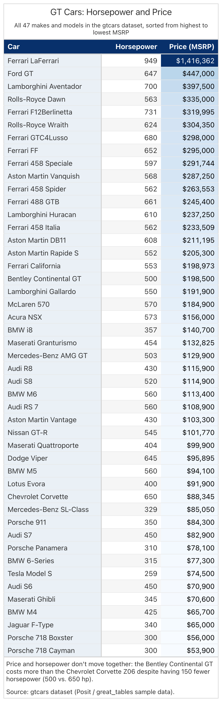
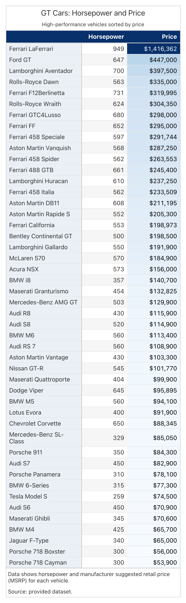

Ask an LLM to turn a CSV into a table and you'll get *something* back --- the
question is whether it looks like anyone actually designed it, or like the
model picked colors and layout on a whim and moved on. [**Great
Tables**](https://github.com/posit-dev/great-tables) already has everything needed to build a genuinely
good table in Python. The harder problem is getting an agent to reach for all
of it, the same way, every time it's asked. That's the job an [**Agent
Skill**](https://posit-dev.github.io/great-docs/skills.html) is supposed to do, but a skill's own design is itself a
choice: a full step-by-step procedure pins the output down tightly, at the
cost of the agent reading a long procedure before it writes a single line of
code --- every request pays the same tax, whether the table in front of it is a
two-column list or a seventy-row financial summary. An internal comparison
project put that tradeoff to the test across three different skill designs
for Great Tables, scored against the same hand-built answer keys. The
thinnest of the three --- one worked reference script and a short rules file,
no flowchart --- turned out to be the cheapest to run per table, and it's the
one this post is about.

## Why table design is worth getting right

A table isn't good just because the numbers in it are correct. Getting it
right means a list of smaller decisions all line up. Color should point at
what actually matters, not sit there as decoration. A title and subtitle
should say what the table is before a reader gets to the numbers. Whatever
measure the request is actually about should be the thing that's colored ---
not every numeric column, and not none of them. A row needs something
anchoring it --- a stub column holding the label apart from the data --- so a
reader always knows which row they're looking at. And a caption should say
where the numbers came from, or state whatever judgment call the table maker
had to make on an ambiguous request, instead of leaving it silent.

An LLM makes every one of those calls whether anyone's watching or not. Left
alone, run the same prompt twice and it tends to make a different set of them
each time.

## What the skill actually changes

Here's the same prompt, run against the same data with the same model, once
with no skill loaded and once with the house skill attached: "Show me a table
of the gt cars with their horsepower and price."

Without the skill, this is close to a bare dump of the data: a plain title,
no subtitle, correct numbers, no sense that price --- the actual subject of
"horsepower and price" --- deserves more attention than any other column, and
the rows sit in whatever order they arrived in. With the house skill attached, the same
prompt and the same data come back sorted from highest price to lowest, with
horsepower left plain and price carrying a sequential blue heatmap running
from the cheapest car straight through to the Ferrari LaFerrari's
\$1.4 million ceiling --- the one number in the whole table meant to jump out.
A stub column holds the manufacturer and model apart from the data, a navy
header band anchors the columns, and a two-line source note states the
finding ("price and horsepower don't move together") and where the data came
from. Nobody touched the prompt or cleaned the output up afterward. On the
project's own scoring --- a deterministic comparator that checks a rendered
table against a hand-authored ground truth answer, not an LLM's opinion of
which one looks nicer --- the unstyled version scores 17.3%. The
skill-produced one scores 92.9%, averaged across three repeats of this exact
prompt.

## How the house skill stays thin

The other two skill designs in this comparison drive every table through a
fixed, numbered procedure: a router file dispatches the request to a
per-data-shape reference example, then a palette doc, then a polish
checklist --- one of the two also adds a checker script that re-runs the whole
thing until a mechanical pass/fail loop is satisfied. That gets consistency,
but it means reading four or five files before writing any code, for a
two-column list of islands exactly as much as for a multi-metric growth
ranking.

The house skill collapses that into three files, and reads them in a fixed
order:

1.  **`scripts/house_table.py`** --- a single script that's both a runnable
    worked example (run it directly and it renders its own reference table)
    and an importable helper module: a shared `PALETTE`, plus `frame`,
    `finalize`, `band`, `stripe`, `stub_tint`, `heatmap`, `status_chip`,
    `summary_row`, `group_emphasis`, and `humanize_labels`. There's no
    per-data-shape example directory to choose between --- every shape's
    worked block (a currency hero measure, a signed percent, a categorical
    status column, a stub, a group, a summary row) lives in this one file,
    and the agent pattern-matches whichever block fits.
2.  **`references/data.md`**, read before the data becomes anything more than
    a CSV --- it answers what actually identifies a row, what a named-but-not-
    literal measure like "growth" computes to, and how to break a tie when
    two measures are both plausible candidates for coloring.
3.  **`references/RULES.md`**, read last, for the one rule that applies to
    the column kind just matched --- it points back at the exact function in
    `house_table.py` by name rather than re-explaining the code.

That's the whole workflow: no router file, no numbered sequence, no checker
loop. A real transcript of the skill in use is eight tool calls end to end ---
invoke the skill, read the data, read the one script, read the one rules
section, write the table script, run it, and look at the rendered PNG ---
against fourteen to seventeen for the flowchart-driven designs on the same
prompt.

Thin doesn't mean undisciplined. A short list of items is genuinely
non-negotiable on every table the skill produces, regardless of how simple
the request looks: a title *and* a subtitle, always both; two source notes
(an analytical caption stating the finding or whatever ambiguous call got
made, then a separate provenance note); the boxed frame; body-row hairlines
pinned to the house tone (`great_tables` already draws a hairline by
default, in library gray --- skipping this call doesn't remove the line, it
just leaves it the wrong color); and `finalize()` as the mandatory last call.
Color restraint is on that list too: only the measure the request is
actually about gets a heatmap, and everything else renders fully plain --- no
fill, no bold, no color-adjacent consolation prize for the runner-up
measure. Row striping and stub tinting are genuinely conditional on the
data, but "conditional" means the gate gets checked on every table, not that
it's optional decoration to skip when the table looks simple enough not to
need it. And Rule 0 sits above all of it: an explicit instruction in the
user's prompt always overrides a default.

## The numbers

One example doesn't prove much by itself, so the project ran all three skill
designs --- plus a no-skill control --- across a corpus of six prompts, three
repeats each, scored against a ground truth a person built by hand for every
prompt.

Averaged across the whole corpus, the house skill's mean comparator score is
79.4%, against 14.0% with no skill loaded --- and that gap holds prompt by
prompt, not just once everything gets averaged together.

Consistency is where a thin skill has more to prove than a heavy one --- one
example has to pin down as much run-to-run agreement as a whole procedure
does. Across the corpus, the house skill's repeat-to-repeat spread averages
18.1 percentage points, the tightest of the three designs tested (the
flowchart-plus-router design spread 23.5 points, the flowchart-plus-checker
design 20.2). Simple, structurally regular prompts converge tightest --- the
two `gtcars` prompts land within a point or two of themselves across
repeats --- while a prompt with more open judgment calls, like a
multi-metric financial summary, spreads further. That's the honest shape of
what one worked example can pin down versus what still comes down to the
model's read of an underspecified request.

None of that consistency is free --- every skill design reads more before
writing a line of code than no skill does. But the three designs don't pay
the same amount for it:

| Skill design | Mean comparator score | Mean cost per table | Repeat spread |
|------------------|------------------|------------------|------------------|
| flowchart + checker loop | 82.3% | \$0.184 | 20.2pp |
| **house** (one script, no flowchart) | 79.4% | **\$0.134** | **18.1pp** |
| flowchart + router | 79.0% | \$0.182 | 23.5pp |
| no skill | 14--22% | \$0.07--0.08 | --- |

(A fourth design, built around a differently structured reference script and
cheatsheet, was tried too and scored *below* the no-skill baseline every
time it's been measured --- a real result, not a rounding artifact, and the
reason it isn't one of the three compared here.)

The house skill reads fewer tokens per table than either flowchart-driven
design --- about 64,000 on average against roughly 78,000 for the
router-based design and 72,000 for the checker-loop one --- and that gap
widens once the metering actually happens: the house skill's per-table cost
comes out around 27% lower than either, since reading three short files
instead of four or five leaves less that needs writing to cache in the first
place. For a comparator score within half a point of the best of
the three and the tightest repeat-to-repeat spread of all of them, that's the
actual case for reaching for one worked example instead of a full procedure:
cheaper, more consistent, and not meaningfully worse.

## Checking it against the answer key

Scoring well against a deterministic checklist is one thing; what actually
matters is whether the table is *right* --- the correct measure colored, on
the correct kind of scale, the finding actually stated. So put the house
skill's `gtcars` table next to the project's own hand-built answer key for
that exact prompt.

And here's the house skill's table again, for direct comparison.

The two are nearly identical: the same sort order, the same measure carrying
the same sequential blue heatmap, the same stub, the same restrained,
uncolored horsepower column. On this prompt the house skill's table scores
98.8% against the ground truth --- 42 of 42 possible points on data-compliance,
42 of 43 on formatting. The single point it drops is the one recurring soft
spot across every skill design tested on this corpus: the ground truth's
caption calls out the Bentley Continental GT and Chevrolet Corvette Z06 by
name as the concrete example of price and horsepower not moving together,
and the skill's caption states the same finding in general terms without
naming those two cars specifically. That's a real, if narrow, gap --- not a
misreading of the table's job.

## Get it

`great-tables-house` is one of three skill designs evaluated in this
comparison, alongside a full-flowchart design and a flowchart-plus-checker
design, in [Hrudith Lakshminarasimman's `gt-skill` project](https://github.com/HrudithL/gt-skill) --- the
harness, all three skills, the ground-truth corpus, and the full evaluation
results referenced in this post all live there. Unlike the shipped
`great_tables` skill, this one isn't bundled into a package install yet --- to
use it, copy `.claude/skills/great-tables-house` out of that repo into your
own project's `.claude/skills/`, the same folder an agent already knows to
look in. Read `SKILL.md` first; it's the short file that tells you which of
the other three to open next, and in what order.

We're happy to talk more about any of this over on our
[Discord server](https://discord.com/invite/Ux7nrcXHVV).
