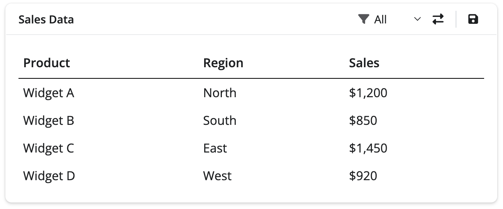
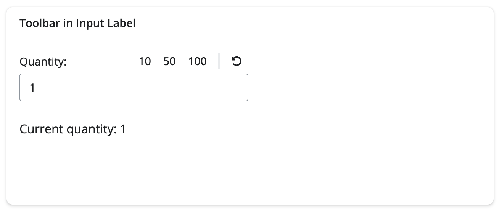
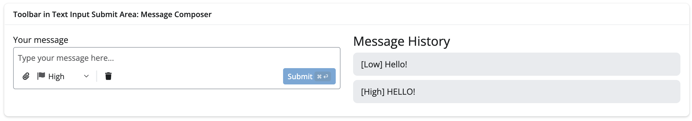

You're building a dashboard. It's looking pretty good. But every time you talk to your users, someone comes up with another must-have filter or button. Maybe you're even adding an AI chat feature for the first time and realizing that you've got less space than it takes to write "this text box is smaller than I thought" to fit all those buttons and selects.

Good news! Toolbars are here to save you.

Their small size and low-profile aesthetic is perfect for keeping your favorite filters and buttons compact and legible. They're modular and they work in some of your favorite existing components.
Seeing is believing, so let's jump in!

We're going to provide some examples of classic spots where you might want a toolbar.

<div class="callout callout-tip" role="note" aria-label="Tip">
<div class="callout-header">
<span class="callout-title">Short on time?</span>
</div>
<div class="callout-body">

Jump straight to the functionality you're most interested in:

- [Toolbars in Card Headers & Footers](#toolbars-in-card-headers--footers)
- [Toolbars in Input Labels](#attaching-controls-to-inputs)
- [Complex Text Inputs with Toolbars](#complex-text-inputs-with-toolbars)

</div>
</div>
<div class="callout callout-note" role="note" aria-label="Note">
<div class="callout-header">
<span class="callout-title">Getting toolbars</span>
</div>
<div class="callout-body">

Toolbars ship in **bslib 0.11.0** (R) and **py-shiny 1.6.0** (Python).

<div class="panel-tabset" data-tabset-group="language">
<ul id="tabset-1" class="panel-tabset-tabby">
<li><a data-tabby-default href="#tabset-1-1">R</a></li>
<li><a href="#tabset-1-2">Python</a></li>
</ul>
<div id="tabset-1-1">

``` r
install.packages("bslib")
```

</div>
<div id="tabset-1-2">

``` bash
pip install --upgrade shiny
```

</div>
</div>
</div>
</div>

## Our Example

We're going to build a version of this app piece by piece:



## Setup Code

Let's get you set up with a basic app with some cards. We'll use this canvas as a starting point for our toolbar components.

<div class="panel-tabset" data-tabset-group="language">
<ul id="tabset-2" class="panel-tabset-tabby">
<li><a data-tabby-default href="#tabset-2-1">R</a></li>
<li><a href="#tabset-2-2">Python</a></li>
</ul>
<div id="tabset-2-1">

``` r { filename="app_1.R" }
library(shiny)
library(bslib)

ui <- page_fluid(
  h2("Example App"),
  layout_columns(
    card(
      card_header(
        "Toolbar in header & label"
      ),
      card_body(
        p("Placeholder text.")
      )
    ),
    card(
      card_header(
        "Toolbar in header, footer, label"
      ),
      card_body(
        p("More placeholder text.")
      ),
      card_footer(
        p("Footer content here.")
      )
    ),
    col_widths = c(6, 6)
  ),
  card(
    card_header(
      "Toolbar in Text Input Submit Area: Message Composer"
    ),
    card_body(
      layout_columns(
        p("Placeholder for an input"),
        div(
          p("Placeholder for outputs")
        ),
        col_widths = c(6, 6)
      )
    )
  )
)

server <- function(input, output, session) {
  # Placeholder
}

shinyApp(ui, server)
```

</div>
<div id="tabset-2-2">

``` python { filename="app_1.py" }
from faicons import icon_svg

from shiny import App, Inputs, Outputs, Session, reactive, render, ui

app_ui = ui.page_fluid(
    ui.h2("Example App"),
    ui.layout_columns(
        ui.card(
            ui.card_header(
                "Toolbar in header & label",
            ),
            ui.card_body(ui.p("Placeholder text.")),
        ),
        ui.card(
            ui.card_header(
                "Toolbar in header, footer, label",
            ),
            ui.card_body(ui.p("More placeholder text.")),
            ui.card_footer(ui.p("Footer content here.")),
        ),
        col_widths=[6, 6],
    ),
    ui.card(
        ui.card_header(
            "Toolbar in Text Input Submit Area: Message Composer",
        ),
        ui.card_body(
            ui.layout_columns(
                ui.p("Placeholder for an input"),
                ui.div(ui.p("Placeholder for outputs")),
                col_widths=[6, 6],
            ),
        ),
    ),
)


def server(input: Inputs, output: Outputs, session: Session) -> None:
    pass


app = App(app_ui, server)
```

</div>
</div>

A toolbar on its own is pretty simple. All you have to do is:

<div class="panel-tabset" data-tabset-group="language">
<ul id="tabset-3" class="panel-tabset-tabby">
<li><a data-tabby-default href="#tabset-3-1">R</a></li>
<li><a href="#tabset-3-2">Python</a></li>
</ul>
<div id="tabset-3-1">

``` r
toolbar(align = "right")
```

</div>
<div id="tabset-3-2">

``` python
ui.toolbar(align="right")
```

</div>
</div>

That's just an empty container. The real fun is when we start adding our toolbar inputs and connecting them to card contents.

## Toolbars in Card Headers & Footers

Toolbars are great for card headers and footers because they provide a clear way to associate a set of controls with a given subset of the app. For example, you can see below that the header toolbar provides controls that clearly correspond to the contents of the card.

<figure>

<figcaption aria-hidden="true">Sales Data card with a header toolbar holding a region select toolbar dropdown and two toolbar buttons (swap and save), above a sales table.</figcaption>
</figure>

<div class="panel-tabset" data-tabset-group="language">
<ul id="tabset-4" class="panel-tabset-tabby">
<li><a data-tabby-default href="#tabset-4-1">R</a></li>
<li><a href="#tabset-4-2">Python</a></li>
</ul>
<div id="tabset-4-1">

``` r
card_header(
  "Sales Data",
  toolbar(
    align = "right",
    toolbar_input_select(
      id = "region_filter",
      label = "Region",
      choices = c("All", "North", "South", "East", "West"),
      icon = icon("filter")
    ),
    toolbar_divider(),
    toolbar_input_button(
      id = "save_btn",
      label = "Save",
      icon = icon("floppy-disk")
    )
  )
)
```

<details>
<summary>
Complete app code
</summary>

``` r { filename="app_2.R" }
library(shiny)
library(bslib)

ui <- page_fluid(
  h2("Example App"),
  layout_columns(
    card(
      card_header(
        "Sales Data",
        toolbar(
          align = "right",
          toolbar_input_select(
            id = "region_filter",
            label = "Region",
            choices = c("All", "North", "South", "East", "West"),
            icon = icon("filter")
          ),
          toolbar_divider(),
          toolbar_input_button(
            id = "save_btn",
            label = "Save",
            icon = icon("floppy-disk")
          )
        )
      ),
      card_body(
        tableOutput("sales_table")
      )
    ),
    card(
      card_header(
        "Toolbar in header, footer, label"
      ),
      card_body(
        p("More placeholder text.")
      ),
      card_footer(
        p("Footer content here.")
      )
    ),
    col_widths = c(6, 6)
  ),
  card(
    card_header(
      "Toolbar in Text Input Submit Area: Message Composer"
    ),
    card_body(
      layout_columns(
        p("Placeholder for an input"),
        div(
          p("Placeholder for outputs")
        ),
        col_widths = c(6, 6)
      )
    )
  )
)

server <- function(input, output, session) {
  # Handle save button click
  observeEvent(input$save_btn, {
    # Change icon to checkmark and show notification
    update_toolbar_input_button(
      "save_btn",
      icon = icon("check"),
      label = "Saved",
      session = session
    )
    showNotification("Saving", type = "message")
  })

  # Sample sales data
  sales_data <- reactive({
    data.frame(
      Product = c("Widget A", "Widget B", "Widget C", "Widget D"),
      Region = c("North", "South", "East", "West"),
      Sales = c(1200, 850, 1450, 920),
      stringsAsFactors = FALSE
    )
  })

  # Filtered sales data based on region filter
  filtered_data <- reactive({
    data <- sales_data()

    if (input$region_filter != "All") {
      data <- data[data$Region == input$region_filter, ]
    }

    data
  })

  # Render the table
  output$sales_table <- renderTable({
    data <- filtered_data()
    data$Sales <- paste0("$", format(data$Sales, big.mark = ",", trim = TRUE))
    data
  })
}

shinyApp(ui, server)
```

</details>
</div>
<div id="tabset-4-2">

``` python
ui.card_header(
    "Sales Data",
    ui.toolbar(
        ui.toolbar_input_select(
            id="region_filter",
            label="Region",
            choices=["All", "North", "South", "East", "West"],
            icon=icon_svg("filter"),
        ),
        ui.toolbar_divider(),
        ui.toolbar_input_button(
            id="save_btn",
            label="Save",
            icon=icon_svg("floppy-disk"),
        ),
        align="right",
    ),
),
```

<details>
<summary>
Complete app code
</summary>

``` python { filename="app_2.py" }
import pandas as pd
from faicons import icon_svg

from shiny import App, Inputs, Outputs, Session, reactive, render, ui

app_ui = ui.page_fluid(
    ui.h2("Example App"),
    ui.layout_columns(
        ui.card(
            ui.card_header(
                "Sales Data",
                ui.toolbar(
                    ui.toolbar_input_select(
                        id="region_filter",
                        label="Region",
                        choices=["All", "North", "South", "East", "West"],
                        icon=icon_svg("filter"),
                    ),
                    ui.toolbar_divider(),
                    ui.toolbar_input_button(
                        id="save_btn",
                        label="Save",
                        icon=icon_svg("floppy-disk"),
                    ),
                    align="right",
                ),
            ),
            ui.card_body(ui.output_table("sales_table")),
        ),
        ui.card(
            ui.card_header(
                "Toolbar in header, footer, label",
            ),
            ui.card_body(ui.p("More placeholder text.")),
            ui.card_footer(ui.p("Footer content here.")),
        ),
        col_widths=[6, 6],
    ),
    ui.card(
        ui.card_header(
            "Toolbar in Text Input Submit Area: Message Composer",
        ),
        ui.card_body(
            ui.layout_columns(
                ui.p("Placeholder for an input"),
                ui.div(ui.p("Placeholder for outputs")),
                col_widths=[6, 6],
            ),
        ),
    ),
)


def server(input: Inputs, output: Outputs, session: Session) -> None:
    @reactive.effect
    @reactive.event(input.save_btn)
    def update():
        ui.update_toolbar_input_button(
            "save_btn",
            icon=icon_svg("check"),
            label="Saved",
        )
        ui.notification_show("Saving", type="message")

    # Sample sales data
    @reactive.calc
    def sales_data():
        return pd.DataFrame(
            {
                "Product": ["Widget A", "Widget B", "Widget C", "Widget D"],
                "Region": ["North", "South", "East", "West"],
                "Sales": [1200, 850, 1450, 920],
            }
        )

    # Filtered sales data based on region filter
    @reactive.calc
    def filtered_data():
        data = sales_data()

        if input.region_filter() != "All":
            data = data[data["Region"] == input.region_filter()]

        return data

    # Render the table
    @render.table
    def sales_table():
        return (
            filtered_data()
            .style.hide(axis="index")
            .format({"Sales": "${:,.0f}"})
            .set_table_styles([
                {"selector": "th", "props": [
                    ("border-bottom", "1px solid black"),
                    ("padding", "8px 6px"),
                    ("text-align", "left"),
                ]},
                {"selector": "td", "props": [
                    ("padding", "6px"),
                ]},
            ])
        )


app = App(app_ui, server)
```

</details>
</div>
</div>

### Toolbars in Card Footers

We can also add toolbars in card footers. Footers are a great spot for secondary actions like sharing, exporting, or navigating to related content.

<div class="panel-tabset" data-tabset-group="language">
<ul id="tabset-5" class="panel-tabset-tabby">
<li><a data-tabby-default href="#tabset-5-1">R</a></li>
<li><a href="#tabset-5-2">Python</a></li>
</ul>
<div id="tabset-5-1">

``` r
card_footer(
  toolbar(
    align = "right",
    toolbar_input_button(
      id = "share_btn",
      label = "Share",
      icon = icon("share-nodes"),
      show_label = TRUE
    ),
    toolbar_input_button(
      id = "export_btn",
      label = "Export",
      icon = icon("download")
    )
  )
)
```

<details>
<summary>
Complete app code
</summary>

``` r { filename="app_3.R" }
library(shiny)
library(bslib)

ui <- page_fluid(
  h2("Example App"),
  layout_columns(
    card(
      card_header(
        "Sales Data",
        toolbar(
          align = "right",
          toolbar_input_select(
            id = "region_filter",
            label = "Region",
            choices = c("All", "North", "South", "East", "West"),
            icon = icon("filter")
          ),
          toolbar_divider(),
          toolbar_input_button(
            id = "save_btn",
            label = "Save",
            icon = icon("floppy-disk")
          )
        )
      ),
      card_body(
        tableOutput("sales_table")
      )
    ),
    card(
      card_header(
        "Toolbar in header, footer, label"
      ),
      card_body(
        p("More placeholder text.")
      ),
      card_footer(
        toolbar(
          align = "right",
          toolbar_input_button(
            id = "share_btn",
            label = "Share",
            icon = icon("share-nodes"),
            show_label = TRUE
          ),
          toolbar_input_button(
            id = "export_btn",
            label = "Export",
            icon = icon("download")
          )
        )
      )
    ),
    col_widths = c(6, 6)
  ),
  card(
    card_header(
      "Toolbar in Text Input Submit Area: Message Composer"
    ),
    card_body(
      layout_columns(
        p("Placeholder for an input"),
        div(
          p("Placeholder for outputs")
        ),
        col_widths = c(6, 6)
      )
    )
  )
)

server <- function(input, output, session) {
  # Sample sales data
  sales_data <- reactive({
    data.frame(
      Product = c("Widget A", "Widget B", "Widget C", "Widget D"),
      Region = c("North", "South", "East", "West"),
      Sales = c(1200, 850, 1450, 920),
      stringsAsFactors = FALSE
    )
  })

  # Filtered sales data based on region filter
  filtered_data <- reactive({
    data <- sales_data()

    if (input$region_filter != "All") {
      data <- data[data$Region == input$region_filter, ]
    }

    data
  })

  # Render the table
  output$sales_table <- renderTable({
    data <- filtered_data()
    data$Sales <- paste0("$", format(data$Sales, big.mark = ",", trim = TRUE))
    data
  })
}

shinyApp(ui, server)
```

</details>
</div>
<div id="tabset-5-2">

``` python
ui.card_footer(
    ui.toolbar(
        ui.toolbar_input_button(
            id="share_btn",
            label="Share",
            icon=icon_svg("share-nodes"),
            show_label=True,
        ),
        ui.toolbar_input_button(
            id="export_btn",
            label="Export",
            icon=icon_svg("download")
        ),
        align="right",
    ),
),
```

<details>
<summary>
Complete app code
</summary>

``` python { filename="app_3.py" }
import pandas as pd
from faicons import icon_svg

from shiny import App, Inputs, Outputs, Session, reactive, render, ui

app_ui = ui.page_fluid(
    ui.h2("Example App"),
    ui.layout_columns(
        ui.card(
            ui.card_header(
                "Sales Data",
                ui.toolbar(
                    ui.toolbar_input_select(
                        id="region_filter",
                        label="Region",
                        choices=["All", "North", "South", "East", "West"],
                        icon=icon_svg("filter"),
                    ),
                    ui.toolbar_divider(),
                    ui.toolbar_input_button(
                        id="save_btn",
                        label="Save",
                        icon=icon_svg("floppy-disk"),
                    ),
                    align="right",
                ),
            ),
            ui.card_body(ui.output_table("sales_table")),
        ),
        ui.card(
            ui.card_header(
                "Toolbar in header, footer, label",
            ),
            ui.card_body(ui.p("More placeholder text.")),
            ui.card_footer(
                ui.toolbar(
                    ui.toolbar_input_button(
                        id="share_btn",
                        label="Share",
                        icon=icon_svg("share-nodes"),
                        show_label=True,
                    ),
                    ui.toolbar_input_button(
                        id="export_btn",
                        label="Export",
                        icon=icon_svg("download")
                    ),
                    align="right",
                ),
            ),
        ),
        col_widths=[6, 6],
    ),
    ui.card(
        ui.card_header(
            "Toolbar in Text Input Submit Area: Message Composer",
        ),
        ui.card_body(
            ui.layout_columns(
                ui.p("Placeholder for an input"),
                ui.div(ui.p("Placeholder for outputs")),
                col_widths=[6, 6],
            ),
        ),
    ),
)


def server(input: Inputs, output: Outputs, session: Session) -> None:
    # Sample sales data
    @reactive.calc
    def sales_data():
        return pd.DataFrame(
            {
                "Product": ["Widget A", "Widget B", "Widget C", "Widget D"],
                "Region": ["North", "South", "East", "West"],
                "Sales": [1200, 850, 1450, 920],
            }
        )

    # Filtered sales data based on region filter
    @reactive.calc
    def filtered_data():
        data = sales_data()

        if input.region_filter() != "All":
            data = data[data["Region"] == input.region_filter()]

        return data

    # Render the table
    @render.table
    def sales_table():
        return (
            filtered_data()
            .style.hide(axis="index")
            .format({"Sales": "${:,.0f}"})
            .set_table_styles([
                {"selector": "th", "props": [
                    ("border-bottom", "1px solid black"),
                    ("padding", "8px 6px"),
                    ("text-align", "left"),
                ]},
                {"selector": "td", "props": [
                    ("padding", "6px"),
                ]},
            ])
        )


app = App(app_ui, server)
```

</details>
</div>
</div>

Notice in these examples we use both toolbar buttons and toolbar select inputs. Both of these inputs also have update functions.

For example you might want to update an icon on submit or change out the list of choices depending on user input. We'll talk more about that in the next section.

### Updating Toolbar Inputs

Toolbar input buttons and selects can be updated dynamically, just like regular Shiny inputs. This is useful for doing things like changing icons after an action (ex. to show a checkmark after saving) or updating available choices based on app state.

<div class="panel-tabset" data-tabset-group="language">
<ul id="tabset-6" class="panel-tabset-tabby">
<li><a data-tabby-default href="#tabset-6-1">R</a></li>
<li><a href="#tabset-6-2">Python</a></li>
</ul>
<div id="tabset-6-1">

### A simple example of updating a button

``` r
observeEvent(input$save_btn, {
  # Change icon to checkmark and update label
  update_toolbar_input_button(
    "save_btn",
    icon = icon("check"),
    label = "Saved",
    session = session
  )
  showNotification("Changes saved!", type = "message")
})
```

See the complete app code below for more complex examples, including `update_toolbar_input_select()`

<details>
<summary>
Complete app code
</summary>

``` r { filename="app_4.R" }
library(shiny)
library(bslib)

ui <- page_fluid(
  h2("Example App"),
  layout_columns(
    card(
      card_header(
        "Sales Data",
        toolbar(
          align = "right",
          toolbar_input_select(
            id = "data_filter",
            label = "Region",
            choices = c("All", "North", "South", "East", "West"),
            icon = icon("filter"),
            tooltip = "Region"
          ),
          toolbar_input_button(
            id = "toggle_filter",
            label = "Switch to Product",
            icon = icon("right-left"),
            tooltip = "Switch to filtering by Product"
          ),
          toolbar_divider(),
          toolbar_input_button(
            id = "save_btn",
            label = "Save",
            icon = icon("floppy-disk")
          )
        )
      ),
      card_body(
        tableOutput("sales_table")
      )
    ),
    card(
      card_header(
        "Toolbar in header, footer, label"
      ),
      card_body(
        p("More placeholder text.")
      ),
      card_footer(
        toolbar(
          align = "right",
          toolbar_input_button(
            id = "share_btn",
            label = "Share",
            icon = icon("share-nodes"),
            show_label = TRUE
          ),
          toolbar_input_button(
            id = "export_btn",
            label = "Export",
            icon = icon("download")
          )
        )
      )
    ),
    col_widths = c(6, 6)
  ),
  card(
    card_header(
      "Toolbar in Text Input Submit Area: Message Composer"
    ),
    card_body(
      layout_columns(
        p("Placeholder for an input"),
        div(
          p("Placeholder for outputs")
        ),
        col_widths = c(6, 6)
      )
    )
  )
)

server <- function(input, output, session) {
  # Track current filter mode

  filter_mode <- reactiveVal("Region")

  # Handle save button click
  observeEvent(input$save_btn, {
    update_toolbar_input_button(
      "save_btn",
      icon = icon("check"),
      label = "Saved"
    )
    showNotification("Saving", type = "message")
  })

  # Handle toggle filter button click
  observeEvent(input$toggle_filter, {
    if (filter_mode() == "Region") {
      filter_mode("Product")
      update_toolbar_input_select(
        "data_filter",
        label = "Product",
        choices = c("All", "Widget A", "Widget B", "Widget C", "Widget D"),
        selected = "All"
      )
      update_toolbar_input_button(
        "toggle_filter",
        label = "Switch to Region"
      )
      update_tooltip("toggle_filter_tooltip", "Switch to filtering by Region")
      update_tooltip("data_filter_tooltip", "Product")
    } else {
      filter_mode("Region")
      update_toolbar_input_select(
        "data_filter",
        label = "Region",
        choices = c("All", "North", "South", "East", "West"),
        selected = "All"
      )
      update_toolbar_input_button(
        "toggle_filter",
        label = "Switch to Product"
      )
      update_tooltip("toggle_filter_tooltip", "Switch to filtering by Product")
      update_tooltip("data_filter_tooltip", "Region")
    }
  })

  # Sample sales data
  sales_data <- reactive({
    data.frame(
      Product = c("Widget A", "Widget B", "Widget C", "Widget D"),
      Region = c("North", "South", "East", "West"),
      Sales = c(1200, 850, 1450, 920),
      stringsAsFactors = FALSE
    )
  })

  # Filtered sales data based on current filter
  filtered_data <- reactive({
    data <- sales_data()

    if (input$data_filter != "All") {
      if (filter_mode() == "Region") {
        data <- data[data$Region == input$data_filter, ]
      } else {
        data <- data[data$Product == input$data_filter, ]
      }
    }

    data
  })

  # Render the table
  output$sales_table <- renderTable({
    data <- filtered_data()
    if (nrow(data) > 0) {
      data$Sales <- paste0("$", format(data$Sales, big.mark = ",", trim = TRUE))
    }
    data
  })
}

shinyApp(ui, server)
```

</details>
</div>
<div id="tabset-6-2">

### A simple example of updating a button

``` python
@reactive.effect
@reactive.event(input.save_btn)
def update():
    ui.update_toolbar_input_button(
        "save_btn",
        icon=icon_svg("check"),
        label="Saved",
    )
    ui.notification_show("Changes saved!", type="message")
```

See the complete app code below for more complex examples, including `ui.update_toolbar_input_select()`

<details>
<summary>
Complete app code
</summary>

``` python { filename="app_4.py" }
import pandas as pd
from faicons import icon_svg

from shiny import App, Inputs, Outputs, Session, reactive, render, ui

app_ui = ui.page_fluid(
    ui.h2("Example App"),
    ui.layout_columns(
        ui.card(
            ui.card_header(
                "Sales Data",
                ui.toolbar(
                    ui.toolbar_input_select(
                        id="data_filter",
                        label="Region",
                        choices=["All", "North", "South", "East", "West"],
                        icon=icon_svg("filter"),
                        tooltip="Region",
                    ),
                    ui.toolbar_input_button(
                        id="toggle_filter",
                        label="Switch to Product",
                        icon=icon_svg("right-left"),
                        tooltip="Switch to filtering by Product",
                    ),
                    ui.toolbar_divider(),
                    ui.toolbar_input_button(
                        id="save_btn",
                        label="Save",
                        icon=icon_svg("floppy-disk"),
                    ),
                    align="right",
                ),
            ),
            ui.card_body(ui.output_table("sales_table")),
        ),
        ui.card(
            ui.card_header(
                "Toolbar in header, footer, label",
            ),
            ui.card_body(ui.p("More placeholder text.")),
            ui.card_footer(
                ui.toolbar(
                    ui.toolbar_input_button(
                        id="share_btn",
                        label="Share",
                        icon=icon_svg("share-nodes"),
                        show_label=True,
                    ),
                    ui.toolbar_input_button(
                        id="export_btn",
                        label="Export",
                        icon=icon_svg("download")
                    ),
                    align="right",
                ),
            ),
        ),
        col_widths=[6, 6],
    ),
    ui.card(
        ui.card_header(
            "Toolbar in Text Input Submit Area: Message Composer",
        ),
        ui.card_body(
            ui.layout_columns(
                ui.p("Placeholder for an input"),
                ui.div(ui.p("Placeholder for outputs")),
                col_widths=[6, 6],
            ),
        ),
    ),
)


def server(input: Inputs, output: Outputs, session: Session) -> None:
    # Track current filter mode
    filter_mode = reactive.value("Region")

    @reactive.effect
    @reactive.event(input.save_btn)
    def _():
        ui.update_toolbar_input_button(
            "save_btn",
            icon=icon_svg("check"),
            label="Saved",
        )
        ui.notification_show("Saving", type="message")

    # Handle toggle filter button click
    @reactive.effect
    @reactive.event(input.toggle_filter)
    def _():
        if filter_mode() == "Region":
            filter_mode.set("Product")
            ui.update_toolbar_input_select(
                "data_filter",
                label="Product",
                choices=["All", "Widget A", "Widget B", "Widget C", "Widget D"],
                selected="All"
            )
            ui.update_toolbar_input_button(
                "toggle_filter",
                label="Switch to Region",
            )
            ui.update_tooltip("toggle_filter_tooltip", "Switch to filtering by Region")
            ui.update_tooltip("data_filter_tooltip", "Product")
        else:
            filter_mode.set("Region")
            ui.update_toolbar_input_select(
                "data_filter",
                label="Region",
                choices=["All", "North", "South", "East", "West"],
                selected="All"
            )
            ui.update_toolbar_input_button(
                "toggle_filter",
                label="Switch to Product",
            )
            ui.update_tooltip("toggle_filter_tooltip", "Switch to filtering by Product")
            ui.update_tooltip("data_filter_tooltip", "Region")

    # Sample sales data
    @reactive.calc
    def sales_data():
        return pd.DataFrame(
            {
                "Product": ["Widget A", "Widget B", "Widget C", "Widget D"],
                "Region": ["North", "South", "East", "West"],
                "Sales": [1200, 850, 1450, 920],
            }
        )

    # Filtered sales data based on current filter
    @reactive.calc
    def filtered_data():
        data = sales_data()

        if input.data_filter() != "All":
            if filter_mode() == "Region":
                data = data[data["Region"] == input.data_filter()]
            else:
                data = data[data["Product"] == input.data_filter()]

        return data

    # Render the table
    @render.table
    def sales_table():
        return (
            filtered_data()
            .style.hide(axis="index")
            .format({"Sales": "${:,.0f}"})
            .set_table_styles([
                {"selector": "th", "props": [
                    ("border-bottom", "1px solid black"),
                    ("padding", "8px 6px"),
                    ("text-align", "left"),
                ]},
                {"selector": "td", "props": [
                    ("padding", "6px"),
                ]},
            ])
        )


app = App(app_ui, server)
```

</details>
</div>
</div>

## Attaching Controls to Inputs

Toolbars aren't just for headers and footers. We can also put them in input labels to attach small controls directly to inputs.
This pattern works well for adding quick actions like preset values or reset buttons next to numeric inputs.

<figure>

<figcaption aria-hidden="true">Quantity input with an inline toolbar in its label offering preset buttons (10, 50, 100) and a reset button.</figcaption>
</figure>

Here's an example of a quantity input with toolbar buttons for setting preset values and resetting:

<div class="panel-tabset" data-tabset-group="language">
<ul id="tabset-7" class="panel-tabset-tabby">
<li><a data-tabby-default href="#tabset-7-1">R</a></li>
<li><a href="#tabset-7-2">Python</a></li>
</ul>
<div id="tabset-7-1">

``` r
numericInput(
  "quantity",
  label = toolbar(
    "Quantity:",
    toolbar_spacer(),
    toolbar_input_button(
      id = "btn_preset_10",
      label = "10",
      show_label = TRUE,
      tooltip = "Set to 10"
    ),
    toolbar_input_button(
      id = "btn_preset_50",
      label = "50",
      show_label = TRUE,
      tooltip = "Set to 50"
    ),
    toolbar_input_button(
      id = "btn_preset_100",
      label = "100",
      show_label = TRUE,
      tooltip = "Set to 100"
    ),
    toolbar_divider(),
    toolbar_input_button(
      id = "btn_reset",
      label = "Reset",
      icon = icon("rotate-left"),
      tooltip = "Reset to 1"
    ),
    align = "right"
  ),
  value = 1,
  min = 1,
  max = 1000
)
```

<details>
<summary>
Complete app code
</summary>

``` r { filename="app_5.R" }
library(shiny)
library(bslib)

ui <- page_fluid(
  h2("Example App"),
  layout_columns(
    card(
      card_header(
        "Sales Data",
        toolbar(
          align = "right",
          toolbar_input_select(
            id = "data_filter",
            label = "Region",
            choices = c("All", "North", "South", "East", "West"),
            icon = icon("filter"),
            tooltip = "Region"
          ),
          toolbar_input_button(
            id = "toggle_filter",
            label = "Switch to Product",
            icon = icon("right-left"),
            tooltip = "Switch to filtering by Product"
          ),
          toolbar_divider(),
          toolbar_input_button(
            id = "save_btn",
            label = "Save",
            icon = icon("floppy-disk")
          )
        )
      ),
      card_body(
        tableOutput("sales_table")
      )
    ),
    card(
      card_header("Toolbar in Input Label"),
      card_body(
        numericInput(
          "quantity",
          label = toolbar(
            "Quantity:",
            toolbar_spacer(),
            toolbar_input_button(
              id = "btn_preset_10",
              label = "10",
              show_label = TRUE,
              tooltip = "Set to 10"
            ),
            toolbar_input_button(
              id = "btn_preset_50",
              label = "50",
              show_label = TRUE,
              tooltip = "Set to 50"
            ),
            toolbar_input_button(
              id = "btn_preset_100",
              label = "100",
              show_label = TRUE,
              tooltip = "Set to 100"
            ),
            toolbar_divider(),
            toolbar_input_button(
              id = "btn_reset",
              label = "Reset",
              icon = icon("rotate-left"),
              tooltip = "Reset to 1"
            ),
            align = "right"
          ),
          value = 1,
          min = 1,
          max = 1000
        ),
        textOutput("quantity_output")
      )
    ),
    col_widths = c(6, 6)
  ),
  card(
    card_header("Toolbar in Text Input Submit Area: Message Composer"),
    card_body(
      layout_columns(
        p("Placeholder for an input"),
        div(
          p("Placeholder for outputs")
        ),
        col_widths = c(6, 6)
      )
    )
  )
)

server <- function(input, output, session) {
  # Track current filter mode

  filter_mode <- reactiveVal("Region")

  # Handle save button click
  observeEvent(input$save_btn, {
    update_toolbar_input_button(
      "save_btn",
      icon = icon("check"),
      label = "Saved"
    )
    showNotification("Saving", type = "message")
  })

  # Handle toggle filter button click
  observeEvent(input$toggle_filter, {
    if (filter_mode() == "Region") {
      filter_mode("Product")
      update_toolbar_input_select(
        "data_filter",
        label = "Product",
        choices = c("All", "Widget A", "Widget B", "Widget C", "Widget D"),
        selected = "All"
      )
      update_toolbar_input_button(
        "toggle_filter",
        label = "Switch to Region"
      )
      update_tooltip("toggle_filter_tooltip", "Switch to filtering by Region")
      update_tooltip("data_filter_tooltip", "Product")
    } else {
      filter_mode("Region")
      update_toolbar_input_select(
        "data_filter",
        label = "Region",
        choices = c("All", "North", "South", "East", "West"),
        selected = "All"
      )
      update_toolbar_input_button(
        "toggle_filter",
        label = "Switch to Product"
      )
      update_tooltip("toggle_filter_tooltip", "Switch to filtering by Product")
      update_tooltip("data_filter_tooltip", "Region")
    }
  })

  # Handle numeric input preset buttons
  observeEvent(input$btn_preset_10, {
    updateNumericInput(session, "quantity", value = 10)
  })

  observeEvent(input$btn_preset_50, {
    updateNumericInput(session, "quantity", value = 50)
  })

  observeEvent(input$btn_preset_100, {
    updateNumericInput(session, "quantity", value = 100)
  })

  observeEvent(input$btn_reset, {
    updateNumericInput(session, "quantity", value = 1)
  })

  output$quantity_output <- renderText({
    paste("Current quantity:", input$quantity)
  })

  # Sample sales data
  sales_data <- reactive({
    data.frame(
      Product = c("Widget A", "Widget B", "Widget C", "Widget D"),
      Region = c("North", "South", "East", "West"),
      Sales = c(1200, 850, 1450, 920),
      stringsAsFactors = FALSE
    )
  })

  # Filtered sales data based on current filter
  filtered_data <- reactive({
    data <- sales_data()

    if (input$data_filter != "All") {
      if (filter_mode() == "Region") {
        data <- data[data$Region == input$data_filter, ]
      } else {
        data <- data[data$Product == input$data_filter, ]
      }
    }

    data
  })

  # Render the table
  output$sales_table <- renderTable({
    data <- filtered_data()
    if (nrow(data) > 0) {
      data$Sales <- paste0("$", format(data$Sales, big.mark = ",", trim = TRUE))
    }
    data
  })
}

shinyApp(ui, server)
```

</details>
</div>
<div id="tabset-7-2">

``` python
ui.input_numeric(
    "quantity",
    label=ui.toolbar(
        "Quantity:",
        ui.toolbar_spacer(),
        ui.toolbar_input_button(
            "btn_preset_10",
            label="10",
            show_label=True,
            tooltip="Set to 10",
        ),
        ui.toolbar_input_button(
            "btn_preset_50",
            label="50",
            show_label=True,
            tooltip="Set to 50",
        ),
        ui.toolbar_input_button(
            "btn_preset_100",
            label="100",
            show_label=True,
            tooltip="Set to 100",
        ),
        ui.toolbar_divider(),
        ui.toolbar_input_button(
            "btn_reset",
            label="Reset",
            icon=icon_svg("rotate-left"),
            tooltip="Reset to 1",
        ),
        align="right",
    ),
    value=1,
    min=1,
    max=1000,
)
```

<details>
<summary>
Complete app code
</summary>

``` python { filename="app_5.py" }
import pandas as pd
from faicons import icon_svg

from shiny import App, Inputs, Outputs, Session, reactive, render, ui

app_ui = ui.page_fluid(
    ui.h2("Example App"),
    ui.layout_columns(
        ui.card(
            ui.card_header(
                "Sales Data",
                ui.toolbar(
                    ui.toolbar_input_select(
                        id="data_filter",
                        label="Region",
                        choices=["All", "North", "South", "East", "West"],
                        icon=icon_svg("filter"),
                        tooltip="Region",
                    ),
                    ui.toolbar_input_button(
                        id="toggle_filter",
                        label="Switch to Product",
                        icon=icon_svg("right-left"),
                        tooltip="Switch to filtering by Product",
                    ),
                    ui.toolbar_divider(),
                    ui.toolbar_input_button(
                        id="save_btn",
                        label="Save",
                        icon=icon_svg("floppy-disk"),
                    ),
                    align="right",
                ),
            ),
            ui.card_body(ui.output_table("sales_table")),
        ),
        ui.card(
            ui.card_header("Toolbar in Input Label"),
            ui.card_body(
                ui.input_numeric(
                    "quantity",
                    label=ui.toolbar(
                        "Quantity:",
                        ui.toolbar_spacer(),
                        ui.toolbar_input_button(
                            "btn_preset_10",
                            label="10",
                            show_label=True,
                            tooltip="Set to 10",
                        ),
                        ui.toolbar_input_button(
                            "btn_preset_50",
                            label="50",
                            show_label=True,
                            tooltip="Set to 50",
                        ),
                        ui.toolbar_input_button(
                            "btn_preset_100",
                            label="100",
                            show_label=True,
                            tooltip="Set to 100",
                        ),
                        ui.toolbar_divider(),
                        ui.toolbar_input_button(
                            "btn_reset",
                            label="Reset",
                            icon=icon_svg("rotate-left"),
                            tooltip="Reset to 1",
                        ),
                        align="right",
                    ),
                    value=1,
                    min=1,
                    max=1000,
                ),
                ui.output_text("quantity_output"),
            ),
        ),
        col_widths=[6, 6],
    ),
    ui.card(
        ui.card_header("Toolbar in Text Input Submit Area: Message Composer"),
        ui.card_body(
            ui.layout_columns(
                ui.p("Placeholder for an input"),
                ui.div(ui.p("Placeholder for outputs")),
                col_widths=[6, 6],
            ),
        ),
    ),
)


def server(input: Inputs, output: Outputs, session: Session) -> None:
    # Track current filter mode
    filter_mode = reactive.value("Region")

    @reactive.effect
    @reactive.event(input.save_btn)
    def _():
        ui.update_toolbar_input_button(
            "save_btn",
            icon=icon_svg("check"),
            label="Saved",
        )
        ui.notification_show("Saving", type="message")

    # Handle toggle filter button click
    @reactive.effect
    @reactive.event(input.toggle_filter)
    def _():
        if filter_mode() == "Region":
            filter_mode.set("Product")
            ui.update_toolbar_input_select(
                "data_filter",
                label="Product",
                choices=["All", "Widget A", "Widget B", "Widget C", "Widget D"],
                selected="All"
            )
            ui.update_toolbar_input_button(
                "toggle_filter",
                label="Switch to Region",
            )
            ui.update_tooltip("toggle_filter_tooltip", "Switch to filtering by Region")
            ui.update_tooltip("data_filter_tooltip", "Product")
        else:
            filter_mode.set("Region")
            ui.update_toolbar_input_select(
                "data_filter",
                label="Region",
                choices=["All", "North", "South", "East", "West"],
                selected="All"
            )
            ui.update_toolbar_input_button(
                "toggle_filter",
                label="Switch to Product",
            )
            ui.update_tooltip("toggle_filter_tooltip", "Switch to filtering by Product")
            ui.update_tooltip("data_filter_tooltip", "Region")

    # Handle numeric input preset buttons
    @reactive.effect
    @reactive.event(input.btn_preset_10)
    def _():
        ui.update_numeric("quantity", value=10)

    @reactive.effect
    @reactive.event(input.btn_preset_50)
    def _():
        ui.update_numeric("quantity", value=50)

    @reactive.effect
    @reactive.event(input.btn_preset_100)
    def _():
        ui.update_numeric("quantity", value=100)

    @reactive.effect
    @reactive.event(input.btn_reset)
    def _():
        ui.update_numeric("quantity", value=1)

    @render.text
    def quantity_output():
        return f"Current quantity: {input.quantity()}"

    # Sample sales data
    @reactive.calc
    def sales_data():
        return pd.DataFrame(
            {
                "Product": ["Widget A", "Widget B", "Widget C", "Widget D"],
                "Region": ["North", "South", "East", "West"],
                "Sales": [1200, 850, 1450, 920],
            }
        )

    # Filtered sales data based on current filter
    @reactive.calc
    def filtered_data():
        data = sales_data()

        if input.data_filter() != "All":
            if filter_mode() == "Region":
                data = data[data["Region"] == input.data_filter()]
            else:
                data = data[data["Product"] == input.data_filter()]

        return data

    # Render the table
    @render.table
    def sales_table():
        return (
            filtered_data()
            .style.hide(axis="index")
            .format({"Sales": "${:,.0f}"})
            .set_table_styles([
                {"selector": "th", "props": [
                    ("border-bottom", "1px solid black"),
                    ("padding", "8px 6px"),
                    ("text-align", "left"),
                ]},
                {"selector": "td", "props": [
                    ("padding", "6px"),
                ]},
            ])
        )


app = App(app_ui, server)
```

</details>
</div>
</div>

The key here is passing the toolbar directly as the label. Include your label text as the first element, then use `toolbar_spacer()` to push the buttons to the right side. Toolbars automatically expand to full width when used as input labels, creating a compact control.

## Complex Text Inputs with Toolbars

Chatbots and AI applications have accelerated the need for more toolbars within text input areas to provide tools for attaching context or manipulating text.
Some newer Shiny components like `input_submit_textarea()` allow you to pass a toolbar directly into the input itself.

Here's a message composer example that includes buttons for attaching files, selecting a priority, and clearing the message:

<figure>

<figcaption aria-hidden="true">Message composer textarea with a submit-area toolbar (attach, priority flag, delete) and a Submit button, beside a message history panel.</figcaption>
</figure>

<div class="panel-tabset" data-tabset-group="language">
<ul id="tabset-8" class="panel-tabset-tabby">
<li><a data-tabby-default href="#tabset-8-1">R</a></li>
<li><a href="#tabset-8-2">Python</a></li>
</ul>
<div id="tabset-8-1">

``` r
input_submit_textarea(
  id = "message",
  label = "Your message",
  placeholder = "Type your message here...",
  toolbar = toolbar(
    align = "left",
    toolbar_input_button(
      id = "attach_file",
      label = "Attach",
      icon = icon("paperclip")
    ),
    toolbar_input_select(
      id = "priority",
      label = "Priority",
      choices = c("Low", "Medium", "High", "Urgent"),
      icon = icon("flag")
    ),
    toolbar_divider(),
    toolbar_input_button(
      id = "clear_message",
      label = "Clear",
      icon = icon("trash")
    )
  )
)
```

<details>
<summary>
Complete app code
</summary>

``` r { filename="app_6.R" }
library(shiny)
library(bslib)

ui <- page_fluid(
  h2("Example App"),
  layout_columns(
    card(
      card_header(
        "Sales Data",
        toolbar(
          align = "right",
          toolbar_input_select(
            id = "data_filter",
            label = "Region",
            choices = c("All", "North", "South", "East", "West"),
            icon = icon("filter"),
            tooltip = "Region"
          ),
          toolbar_input_button(
            id = "toggle_filter",
            label = "Switch to Product",
            icon = icon("right-left"),
            tooltip = "Switch to filtering by Product"
          ),
          toolbar_divider(),
          toolbar_input_button(
            id = "save_btn",
            label = "Save",
            icon = icon("floppy-disk")
          )
        )
      ),
      card_body(
        tableOutput("sales_table")
      )
    ),
    card(
      card_header("Toolbar in Input Label"),
      card_body(
        numericInput(
          "quantity",
          label = toolbar(
            "Quantity:",
            toolbar_spacer(),
            toolbar_input_button(
              id = "btn_preset_10",
              label = "10",
              show_label = TRUE,
              tooltip = "Set to 10"
            ),
            toolbar_input_button(
              id = "btn_preset_50",
              label = "50",
              show_label = TRUE,
              tooltip = "Set to 50"
            ),
            toolbar_input_button(
              id = "btn_preset_100",
              label = "100",
              show_label = TRUE,
              tooltip = "Set to 100"
            ),
            toolbar_divider(),
            toolbar_input_button(
              id = "btn_reset",
              label = "Reset",
              icon = icon("rotate-left"),
              tooltip = "Reset to 1"
            ),
            align = "right"
          ),
          value = 1,
          min = 1,
          max = 1000
        ),
        textOutput("quantity_output")
      )
    ),
    col_widths = c(6, 6)
  ),
  card(
    card_header("Toolbar in Text Input Submit Area: Message Composer"),
    card_body(
      layout_columns(
        input_submit_textarea(
          id = "message",
          label = "Your message",
          placeholder = "Type your message here...",
          toolbar = toolbar(
            align = "left",
            toolbar_input_button(
              id = "attach_file",
              label = "Attach",
              icon = icon("paperclip")
            ),
            toolbar_input_select(
              id = "priority",
              label = "Priority",
              choices = c("Low", "Medium", "High", "Urgent"),
              icon = icon("flag")
            ),
            toolbar_divider(),
            toolbar_input_button(
              id = "clear_message",
              label = "Clear",
              icon = icon("trash")
            )
          )
        ),
        div(
          h4("Message History"),
          uiOutput("message_history"),
          style = "max-height: 400px; overflow-y: auto;"
        ),
        col_widths = c(6, 6)
      )
    )
  )
)

server <- function(input, output, session) {
  # Track current filter mode

  filter_mode <- reactiveVal("Region")

  # Handle save button click
  observeEvent(input$save_btn, {
    update_toolbar_input_button(
      "save_btn",
      icon = icon("check"),
      label = "Saved"
    )
    showNotification("Saving", type = "message")
  })

  # Handle toggle filter button click
  observeEvent(input$toggle_filter, {
    if (filter_mode() == "Region") {
      filter_mode("Product")
      update_toolbar_input_select(
        "data_filter",
        label = "Product",
        choices = c("All", "Widget A", "Widget B", "Widget C", "Widget D"),
        selected = "All"
      )
      update_toolbar_input_button(
        "toggle_filter",
        label = "Switch to Region"
      )
      update_tooltip("toggle_filter_tooltip", "Switch to filtering by Region")
      update_tooltip("data_filter_tooltip", "Product")
    } else {
      filter_mode("Region")
      update_toolbar_input_select(
        "data_filter",
        label = "Region",
        choices = c("All", "North", "South", "East", "West"),
        selected = "All"
      )
      update_toolbar_input_button(
        "toggle_filter",
        label = "Switch to Product"
      )
      update_tooltip("toggle_filter_tooltip", "Switch to filtering by Product")
      update_tooltip("data_filter_tooltip", "Region")
    }
  })

  # Handle numeric input preset buttons
  observeEvent(input$btn_preset_10, {
    updateNumericInput(session, "quantity", value = 10)
  })

  observeEvent(input$btn_preset_50, {
    updateNumericInput(session, "quantity", value = 50)
  })

  observeEvent(input$btn_preset_100, {
    updateNumericInput(session, "quantity", value = 100)
  })

  observeEvent(input$btn_reset, {
    updateNumericInput(session, "quantity", value = 1)
  })

  output$quantity_output <- renderText({
    paste("Current quantity:", input$quantity)
  })

  # Sample sales data
  sales_data <- reactive({
    data.frame(
      Product = c("Widget A", "Widget B", "Widget C", "Widget D"),
      Region = c("North", "South", "East", "West"),
      Sales = c(1200, 850, 1450, 920),
      stringsAsFactors = FALSE
    )
  })

  # Filtered sales data based on current filter
  filtered_data <- reactive({
    data <- sales_data()

    if (input$data_filter != "All") {
      if (filter_mode() == "Region") {
        data <- data[data$Region == input$data_filter, ]
      } else {
        data <- data[data$Product == input$data_filter, ]
      }
    }

    data
  })

  # Render the table
  output$sales_table <- renderTable({
    data <- filtered_data()
    if (nrow(data) > 0) {
      data$Sales <- paste0("$", format(data$Sales, big.mark = ",", trim = TRUE))
    }
    data
  })

  # Handle message input with toolbar
  messages <- reactiveVal(character(0))

  observeEvent(input$message, {
    new_message <- paste0(
      "[", input$priority, "] ",
      input$message
    )
    messages(c(messages(), new_message))
  })

  observeEvent(input$attach_file, {
    showNotification("File attachment feature clicked", type = "message")
  })

  observeEvent(input$clear_message, {
    updateTextAreaInput(session, "message", value = "")
  })

  output$message_history <- renderUI({
    if (length(messages()) == 0) {
      p("No messages yet")
    } else {
      tagList(
        lapply(messages(), function(msg) {
          div(
            msg,
            class = "mb-2",
            style = "background-color: #e9ecef; padding: 10px 15px; border-radius: 8px;"
          )
        })
      )
    }
  })
}

shinyApp(ui, server)
```

</details>
</div>
<div id="tabset-8-2">

``` python
ui.input_submit_textarea(
    id="message",
    label="Your message",
    placeholder="Type your message here...",
    toolbar=ui.toolbar(
        ui.toolbar_input_button(
            id="attach_file",
            label="Attach",
            icon=icon_svg("paperclip"),
        ),
        ui.toolbar_input_select(
            id="priority",
            label="Priority",
            choices=["Low", "Medium", "High", "Urgent"],
            icon=icon_svg("flag"),
        ),
        ui.toolbar_divider(),
        ui.toolbar_input_button(
            id="clear_message",
            label="Clear",
            icon=icon_svg("trash"),
        ),
        align="left",
    ),
)
```

<details>
<summary>
Complete app code
</summary>

``` python { filename="app_6.py" }
import pandas as pd
from faicons import icon_svg

from shiny import App, Inputs, Outputs, Session, reactive, render, ui

app_ui = ui.page_fluid(
    ui.h2("Example App"),
    ui.layout_columns(
        ui.card(
            ui.card_header(
                "Sales Data",
                ui.toolbar(
                    ui.toolbar_input_select(
                        id="data_filter",
                        label="Region",
                        choices=["All", "North", "South", "East", "West"],
                        icon=icon_svg("filter"),
                        tooltip="Region",
                    ),
                    ui.toolbar_input_button(
                        id="toggle_filter",
                        label="Switch to Product",
                        icon=icon_svg("right-left"),
                        tooltip="Switch to filtering by Product",
                    ),
                    ui.toolbar_divider(),
                    ui.toolbar_input_button(
                        id="save_btn",
                        label="Save",
                        icon=icon_svg("floppy-disk"),
                    ),
                    align="right",
                ),
            ),
            ui.card_body(ui.output_table("sales_table")),
        ),
        ui.card(
            ui.card_header("Toolbar in Input Label"),
            ui.card_body(
                ui.input_numeric(
                    "quantity",
                    label=ui.toolbar(
                        "Quantity:",
                        ui.toolbar_spacer(),
                        ui.toolbar_input_button(
                            "btn_preset_10",
                            label="10",
                            show_label=True,
                            tooltip="Set to 10",
                        ),
                        ui.toolbar_input_button(
                            "btn_preset_50",
                            label="50",
                            show_label=True,
                            tooltip="Set to 50",
                        ),
                        ui.toolbar_input_button(
                            "btn_preset_100",
                            label="100",
                            show_label=True,
                            tooltip="Set to 100",
                        ),
                        ui.toolbar_divider(),
                        ui.toolbar_input_button(
                            "btn_reset",
                            label="Reset",
                            icon=icon_svg("rotate-left"),
                            tooltip="Reset to 1",
                        ),
                        align="right",
                    ),
                    value=1,
                    min=1,
                    max=1000,
                ),
                ui.output_text("quantity_output"),
            ),
        ),
        col_widths=[6, 6],
    ),
    ui.card(
        ui.card_header("Toolbar in Text Input Submit Area: Message Composer"),
        ui.card_body(
            ui.layout_columns(
                ui.input_submit_textarea(
                    id="message",
                    label="Your message",
                    placeholder="Type your message here...",
                    toolbar=ui.toolbar(
                        ui.toolbar_input_button(
                            id="attach_file",
                            label="Attach",
                            icon=icon_svg("paperclip"),
                        ),
                        ui.toolbar_input_select(
                            id="priority",
                            label="Priority",
                            choices=["Low", "Medium", "High", "Urgent"],
                            icon=icon_svg("flag"),
                        ),
                        ui.toolbar_divider(),
                        ui.toolbar_input_button(
                            id="clear_message",
                            label="Clear",
                            icon=icon_svg("trash"),
                        ),
                        align="left",
                    ),
                ),
                ui.div(
                    ui.h4("Message History"),
                    ui.output_ui("message_history"),
                    style="max-height: 400px; overflow-y: auto;",
                ),
                col_widths=[6, 6],
            ),
        ),
    ),
)


def server(input: Inputs, output: Outputs, session: Session) -> None:
    # Track current filter mode
    filter_mode = reactive.value("Region")

    @reactive.effect
    @reactive.event(input.save_btn)
    def _():
        ui.update_toolbar_input_button(
            "save_btn",
            icon=icon_svg("check"),
            label="Saved",
        )
        ui.notification_show("Saving", type="message")

    # Handle toggle filter button click
    @reactive.effect
    @reactive.event(input.toggle_filter)
    def _():
        if filter_mode() == "Region":
            filter_mode.set("Product")
            ui.update_toolbar_input_select(
                "data_filter",
                label="Product",
                choices=["All", "Widget A", "Widget B", "Widget C", "Widget D"],
                selected="All"
            )
            ui.update_toolbar_input_button(
                "toggle_filter",
                label="Switch to Region",
            )
            ui.update_tooltip("toggle_filter_tooltip", "Switch to filtering by Region")
            ui.update_tooltip("data_filter_tooltip", "Product")
        else:
            filter_mode.set("Region")
            ui.update_toolbar_input_select(
                "data_filter",
                label="Region",
                choices=["All", "North", "South", "East", "West"],
                selected="All"
            )
            ui.update_toolbar_input_button(
                "toggle_filter",
                label="Switch to Product",
            )
            ui.update_tooltip("toggle_filter_tooltip", "Switch to filtering by Product")
            ui.update_tooltip("data_filter_tooltip", "Region")

    # Handle numeric input preset buttons
    @reactive.effect
    @reactive.event(input.btn_preset_10)
    def _():
        ui.update_numeric("quantity", value=10)

    @reactive.effect
    @reactive.event(input.btn_preset_50)
    def _():
        ui.update_numeric("quantity", value=50)

    @reactive.effect
    @reactive.event(input.btn_preset_100)
    def _():
        ui.update_numeric("quantity", value=100)

    @reactive.effect
    @reactive.event(input.btn_reset)
    def _():
        ui.update_numeric("quantity", value=1)

    @render.text
    def quantity_output():
        return f"Current quantity: {input.quantity()}"

    # Sample sales data
    @reactive.calc
    def sales_data():
        return pd.DataFrame(
            {
                "Product": ["Widget A", "Widget B", "Widget C", "Widget D"],
                "Region": ["North", "South", "East", "West"],
                "Sales": [1200, 850, 1450, 920],
            }
        )

    # Filtered sales data based on current filter
    @reactive.calc
    def filtered_data():
        data = sales_data()

        if input.data_filter() != "All":
            if filter_mode() == "Region":
                data = data[data["Region"] == input.data_filter()]
            else:
                data = data[data["Product"] == input.data_filter()]

        return data

    # Render the table
    @render.table
    def sales_table():
        return (
            filtered_data()
            .style.hide(axis="index")
            .format({"Sales": "${:,.0f}"})
            .set_table_styles([
                {"selector": "th", "props": [
                    ("border-bottom", "1px solid black"),
                    ("padding", "8px 6px"),
                    ("text-align", "left"),
                ]},
                {"selector": "td", "props": [
                    ("padding", "6px"),
                ]},
            ])
        )

    # Handle message input with toolbar
    messages = reactive.value([])

    @reactive.effect
    @reactive.event(input.message)
    def _():
        new_message = f"[{input.priority()}] {input.message()}"
        messages.set(messages.get() + [new_message])

    @reactive.effect
    @reactive.event(input.attach_file)
    def _():
        ui.notification_show("File attachment feature clicked", type="message")

    @reactive.effect
    @reactive.event(input.clear_message)
    def _():
        ui.update_text_area("message", value="")

    @render.ui
    def message_history():
        if len(messages.get()) == 0:
            return ui.p("No messages yet")
        else:
            return ui.TagList([
                ui.div(
                    msg,
                    class_="mb-2",
                    style="background-color: #e9ecef; padding: 10px 15px; border-radius: 8px;"
                )
                for msg in messages.get()
            ])


app = App(app_ui, server)
```

</details>
</div>
</div>

The `input_submit_textarea()` component accepts a `toolbar` parameter directly, making it easy to add contextual controls right where users need them.

## Toolbar Input Components

Here's a quick reference of the toolbar input components available in both [bslib](https://rstudio.github.io/bslib/) and [py-shiny](https://shiny.posit.co/py/):

| R (bslib) | Python (py-shiny) | Description |
|-------------------|--------------------------------|----------------------|
| [`toolbar()`](https://rstudio.github.io/bslib/reference/toolbar.html) | [`ui.toolbar()`](https://shiny.posit.co/py/api/ui.toolbar.html) | The container for toolbar inputs |
| [`toolbar_input_button()`](https://rstudio.github.io/bslib/reference/toolbar_input_button.html) | [`ui.toolbar_input_button()`](https://shiny.posit.co/py/api/ui.toolbar_input_button.html) | A small action button |
| [`toolbar_input_select()`](https://rstudio.github.io/bslib/reference/toolbar_input_select.html) | [`ui.toolbar_input_select()`](https://shiny.posit.co/py/api/ui.toolbar_input_select.html) | A compact dropdown select |
| [`toolbar_divider()`](https://rstudio.github.io/bslib/reference/toolbar_divider.html) | [`ui.toolbar_divider()`](https://shiny.posit.co/py/api/ui.toolbar_divider.html) | A visual separator between groups of controls |
| [`toolbar_spacer()`](https://rstudio.github.io/bslib/reference/toolbar_divider.html) | [`ui.toolbar_spacer()`](https://shiny.posit.co/py/api/ui.toolbar_spacer.html) | A flexible spacer that pushes subsequent items to the opposite end of the toolbar |

Each toolbar input also has a corresponding `update_*` function (R) / `update_*` method on `ui` (Python) for modifying it dynamically.

## Summary

Toolbars provide a flexible way to add compact controls to your Shiny apps:

- **Card headers and footers** - Associate controls directly with card content
- **Input labels** - Add quick actions like reset or format buttons
- **Text area inputs** - Build rich message composers with attachment and formatting tools

Their small footprint makes them perfect for dashboards and modern app interfaces where screen real estate is at a premium. Give them a try in your next Shiny app!

<div class="callout callout-tip" role="note" aria-label="Tip">
<div class="callout-header">
<span class="callout-title">What else is new?</span>
</div>
<div class="callout-body">

See what else is new in the [bslib changelog](https://rstudio.github.io/bslib/news/index.html) (R) and the [py-shiny changelog](https://github.com/posit-dev/py-shiny/blob/main/CHANGELOG.md) (Python).

</div>
</div>
