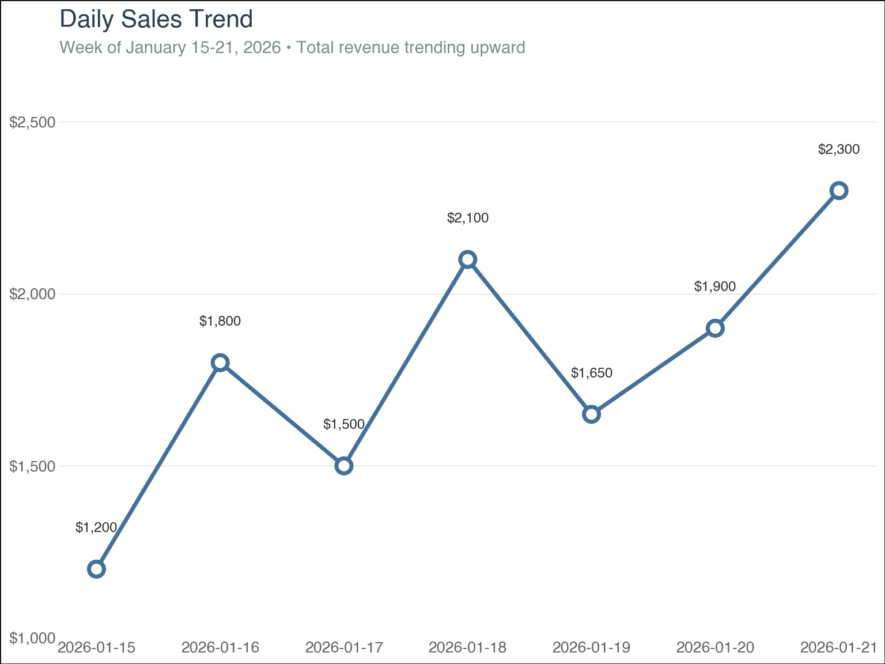
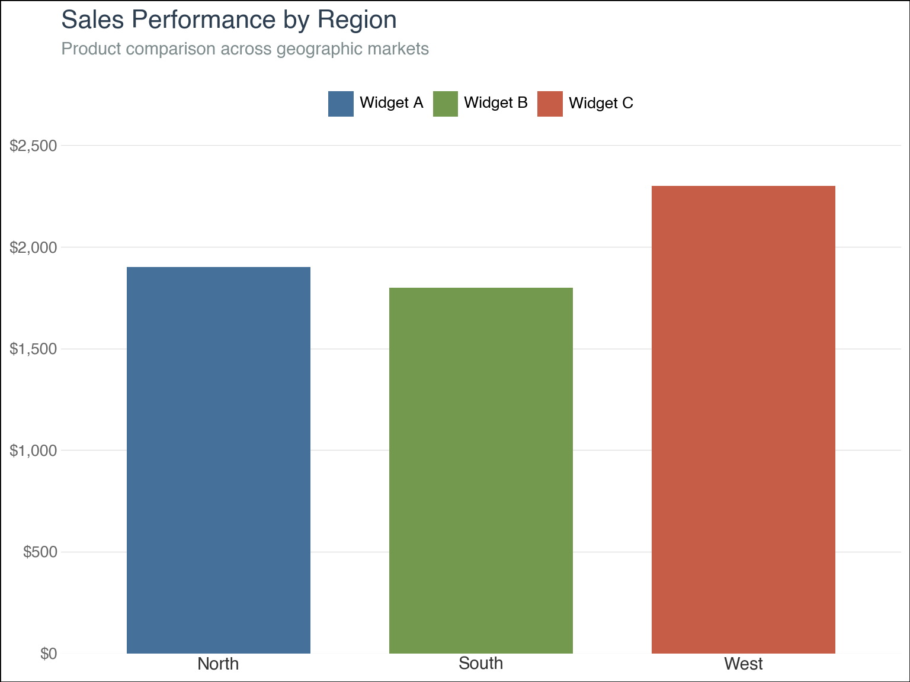

<script src="https://cdn.jsdelivr.net/npm/requirejs@2.3.6/require.min.js" integrity="sha384-c9c+LnTbwQ3aujuU7ULEPVvgLs+Fn6fJUvIGTsuu1ZcCf11fiEubah0ttpca4ntM sha384-6V1/AdqZRWk1KAlWbKBlGhN7VG4iE/yAZcO6NZPMF8od0vukrvr0tg4qY6NSrItx" crossorigin="anonymous"></script>
<script src="https://cdn.jsdelivr.net/npm/jquery@3.5.1/dist/jquery.min.js" integrity="sha384-ZvpUoO/+PpLXR1lu4jmpXWu80pZlYUAfxl5NsBMWOEPSjUn/6Z/hRTt8+pR6L4N2" crossorigin="anonymous" data-relocate-top="true"></script>
<script type="application/javascript">define('jquery', [],function() {return window.jQuery;})</script>


We (Emil Hvitfeldt, Jeroen Janssens, Michael Chow, and I) just got back from PyCon US 2026, and there was **so much buzz** around [Polars](https://pola.rs/). What is Polars? Why should I switch to Polars? *How* do I switch to Polars?

I mean, just check out the line for the book signing of Jeroen's book, [Python Polars: The Definitive Guide](https://polarsguide.com/).

<figure>

<figcaption aria-hidden="true">A long line of conference attendees waiting at Jeroen’s book signing booth in PyCon US’ large convention hall</figcaption>
</figure>

If Polars is new to you, it is a library for efficient data manipulation in Python. It's built on Rust, so it's super fast. And a lot of people (including [the creator of Pandas](https://polarsguide.com/praise/)!) like the intuitive way you write Polars code. However, if you work in Python, you might know that different DataFrames have different requirements, so you want to make sure to use libraries that support Polars (I admit, I come from the R world, and this was mind blowing to me).

And, we're happy to say that we (Posit) have excellent Polars support across our Python libraries that work across the data science workflow! In this post, we'll walk through four:

- [**pointblank**](https://posit-dev.github.io/pointblank/) for data validation and quality checks
- [**Great Tables**](https://posit-dev.github.io/great-tables/articles/intro.html) for creating publication-quality tables
- [**plotnine**](https://plotnine.org/) for ggplot2-style visualizations
- [**mall**](https://mlverse.github.io/mall/) for LLM-powered data analysis

Let's check them out!

## Setup

First, let's install the libraries:

``` python
pip install polars great_tables pointblank plotnine mlverse-mall
```

Now, import what we need:

``` python
import polars as pl
from great_tables import GT
import pointblank as pb
from plotnine import (
    ggplot, aes, geom_point, geom_line, geom_bar, geom_text, geom_col,
    labs, theme_minimal, theme, element_text, scale_fill_manual,
    scale_y_continuous, element_rect, element_blank, element_line,
    scale_color_manual, position_dodge, annotate
)
import mall
```

## The dataset

For this example, we'll use `sales_data`, a sample sales dataset, to demonstrate a typical data workflow.

``` python
sales_data = pl.DataFrame({
    "date": ["2026-01-15", "2026-01-16", "2026-01-17", "2026-01-18",
             "2026-01-19", "2026-01-20", "2026-01-21"],
    "region": ["North", "South", "North", "West", "South", "North", "West"],
    "product": ["Widget A", "Widget B", "Widget A", "Widget C",
                "Widget B", "Widget A", "Widget C"],
    "sales": [1200, 1800, 1500, 2100, 1650, 1900, 2300],
    "units_sold": [24, 36, 30, 42, 33, 38, 46],
    "customer_rating": [4.5, 4.8, 4.6, 4.9, 4.7, 4.8, 4.9]
}).with_columns(
    pl.col("date").str.strptime(pl.Date, "%Y-%m-%d")
)

sales_data
```

<div><style>
.dataframe > thead > tr,
.dataframe > tbody > tr {
  text-align: right;
  white-space: pre-wrap;
}
</style>
<small>shape: (7, 6)</small>

| date       | region    | product      | sales | units_sold | customer_rating |
|------------|-----------|--------------|-------|------------|-----------------|
| date       | str       | str          | i64   | i64        | f64             |
| 2026-01-15 | \"North\" | \"Widget A\" | 1200  | 24         | 4.5             |
| 2026-01-16 | \"South\" | \"Widget B\" | 1800  | 36         | 4.8             |
| 2026-01-17 | \"North\" | \"Widget A\" | 1500  | 30         | 4.6             |
| 2026-01-18 | \"West\"  | \"Widget C\" | 2100  | 42         | 4.9             |
| 2026-01-19 | \"South\" | \"Widget B\" | 1650  | 33         | 4.7             |
| 2026-01-20 | \"North\" | \"Widget A\" | 1900  | 38         | 4.8             |
| 2026-01-21 | \"West\"  | \"Widget C\" | 2300  | 46         | 4.9             |

</div>

We can confirm that it is, indeed, a Polars DataFrame!

``` python
isinstance(sales_data, pl.DataFrame)
```

    True

## Data validation with pointblank

Before diving into analysis, let's validate our data quality using [**pointblank**](https://posit-dev.github.io/pointblank/):

``` python
agent = (
    pb.Validate(sales_data)
    .col_vals_not_null(columns="date")
    .col_vals_between(columns="sales", left=0, right=10000)
    .col_vals_between(columns="customer_rating", left=1.0, right=5.0)
    .col_vals_in_set(columns="region", set=["North", "South", "East", "West"])
    .interrogate()
)

agent
```

<div id="pb_tbl" style="padding-left:0px;padding-right:0px;padding-top:10px;padding-bottom:10px;overflow-x:auto;overflow-y:auto;width:auto;height:auto;">
<style>
@import url('https://fonts.googleapis.com/css2?family=IBM+Plex+Mono&display=swap');
@import url('https://fonts.googleapis.com/css2?family=IBM+Plex+Sans&display=swap');
#pb_tbl table {
          font-family: 'IBM Plex Sans', -apple-system, BlinkMacSystemFont, 'Segoe UI', Roboto, Oxygen, Ubuntu, Cantarell, 'Helvetica Neue', 'Fira Sans', 'Droid Sans', Arial, sans-serif;
          -webkit-font-smoothing: antialiased;
          -moz-osx-font-smoothing: grayscale;
        }

#pb_tbl thead, tbody, tfoot, tr, td, th { border-style: none; }
 tr { background-color: transparent; }
#pb_tbl p { margin: 0; padding: 0; }
 #pb_tbl .gt_table { display: table; border-collapse: collapse; line-height: normal; margin-left: auto; margin-right: auto; color: #333333; font-size: 90%; font-weight: normal; font-style: normal; background-color: #FFFFFF; width: auto; border-top-style: solid; border-top-width: 2px; border-top-color: #A8A8A8; border-right-style: none; border-right-width: 2px; border-right-color: #D3D3D3; border-bottom-style: solid; border-bottom-width: 2px; border-bottom-color: #A8A8A8; border-left-style: none; border-left-width: 2px; border-left-color: #D3D3D3; }
 #pb_tbl .gt_caption { padding-top: 4px; padding-bottom: 4px; }
 #pb_tbl .gt_title { color: #333333; font-size: 125%; font-weight: initial; padding-top: 4px; padding-bottom: 4px; padding-left: 5px; padding-right: 5px; border-bottom-color: #FFFFFF; border-bottom-width: 0; }
 #pb_tbl .gt_subtitle { color: #333333; font-size: 85%; font-weight: initial; padding-top: 3px; padding-bottom: 5px; padding-left: 5px; padding-right: 5px; border-top-color: #FFFFFF; border-top-width: 0; }
 #pb_tbl .gt_heading { background-color: #FFFFFF; text-align: left; border-bottom-color: #FFFFFF; border-left-style: none; border-left-width: 1px; border-left-color: #D3D3D3; border-right-style: none; border-right-width: 1px; border-right-color: #D3D3D3; }
 #pb_tbl .gt_bottom_border { border-bottom-style: solid; border-bottom-width: 2px; border-bottom-color: #D3D3D3; }
 #pb_tbl .gt_col_headings { border-top-style: solid; border-top-width: 2px; border-top-color: #D3D3D3; border-bottom-style: solid; border-bottom-width: 2px; border-bottom-color: #D3D3D3; border-left-style: none; border-left-width: 1px; border-left-color: #D3D3D3; border-right-style: none; border-right-width: 1px; border-right-color: #D3D3D3; }
 #pb_tbl .gt_col_heading { color: #333333; background-color: #FFFFFF; font-size: 100%; font-weight: normal; text-transform: inherit; border-left-style: none; border-left-width: 1px; border-left-color: #D3D3D3; border-right-style: none; border-right-width: 1px; border-right-color: #D3D3D3; vertical-align: bottom; padding-top: 5px; padding-bottom: 5px; padding-left: 5px; padding-right: 5px; overflow-x: hidden; }
 #pb_tbl .gt_column_spanner_outer { color: #333333; background-color: #FFFFFF; font-size: 100%; font-weight: normal; text-transform: inherit; padding-top: 0; padding-bottom: 0; padding-left: 4px; padding-right: 4px; }
 #pb_tbl .gt_column_spanner_outer:first-child { padding-left: 0; }
 #pb_tbl .gt_column_spanner_outer:last-child { padding-right: 0; }
 #pb_tbl .gt_column_spanner { border-bottom-style: solid; border-bottom-width: 2px; border-bottom-color: #D3D3D3; vertical-align: bottom; padding-top: 5px; padding-bottom: 5px; overflow-x: hidden; display: inline-block; width: 100%; }
 #pb_tbl .gt_spanner_row { border-bottom-style: hidden; }
 #pb_tbl .gt_group_heading { padding-top: 8px; padding-bottom: 8px; padding-left: 5px; padding-right: 5px; color: #333333; background-color: #FFFFFF; font-size: 100%; font-weight: initial; text-transform: inherit; border-top-style: solid; border-top-width: 2px; border-top-color: #D3D3D3; border-bottom-style: solid; border-bottom-width: 2px; border-bottom-color: #D3D3D3; border-left-style: none; border-left-width: 1px; border-left-color: #D3D3D3; border-right-style: none; border-right-width: 1px; border-right-color: #D3D3D3; vertical-align: middle; text-align: left; }
 #pb_tbl .gt_empty_group_heading { padding: 0.5px; color: #333333; background-color: #FFFFFF; font-size: 100%; font-weight: initial; border-top-style: solid; border-top-width: 2px; border-top-color: #D3D3D3; border-bottom-style: solid; border-bottom-width: 2px; border-bottom-color: #D3D3D3; vertical-align: middle; }
 #pb_tbl .gt_from_md> :first-child { margin-top: 0; }
 #pb_tbl .gt_from_md> :last-child { margin-bottom: 0; }
 #pb_tbl .gt_row { padding-top: 8px; padding-bottom: 8px; padding-left: 5px; padding-right: 5px; margin: 10px; border-top-style: solid; border-top-width: 1px; border-top-color: #D3D3D3; border-left-style: none; border-left-width: 1px; border-left-color: #D3D3D3; border-right-style: none; border-right-width: 1px; border-right-color: #D3D3D3; vertical-align: middle; overflow-x: hidden; }
 #pb_tbl .gt_stub { color: #333333; background-color: #FFFFFF; font-size: 100%; font-weight: initial; text-transform: inherit; border-right-style: solid; border-right-width: 2px; border-right-color: #D3D3D3; padding-left: 5px; padding-right: 5px; }
 #pb_tbl .gt_stub_row_group { color: #333333; background-color: #FFFFFF; font-size: 100%; font-weight: initial; text-transform: inherit; border-right-style: solid; border-right-width: 2px; border-right-color: #D3D3D3; padding-left: 5px; padding-right: 5px; vertical-align: top; }
 #pb_tbl .gt_row_group_first td { border-top-width: 2px; }
 #pb_tbl .gt_row_group_first th { border-top-width: 2px; }
 #pb_tbl .gt_striped { color: #333333; background-color: #F4F4F4; }
 #pb_tbl .gt_table_body { border-top-style: solid; border-top-width: 2px; border-top-color: #D3D3D3; border-bottom-style: solid; border-bottom-width: 2px; border-bottom-color: #D3D3D3; }
 #pb_tbl .gt_grand_summary_row { color: #333333; background-color: #FFFFFF; text-transform: inherit; padding-top: 8px; padding-bottom: 8px; padding-left: 5px; padding-right: 5px; }
 #pb_tbl .gt_first_grand_summary_row_bottom { border-top-style: double; border-top-width: 6px; border-top-color: #D3D3D3; }
 #pb_tbl .gt_last_grand_summary_row_top { border-bottom-style: double; border-bottom-width: 6px; border-bottom-color: #D3D3D3; }
 #pb_tbl .gt_sourcenotes { color: #333333; background-color: #FFFFFF; border-bottom-style: none; border-bottom-width: 2px; border-bottom-color: #D3D3D3; border-left-style: none; border-left-width: 2px; border-left-color: #D3D3D3; border-right-style: none; border-right-width: 2px; border-right-color: #D3D3D3; }
 #pb_tbl .gt_sourcenote { font-size: 90%; padding-top: 4px; padding-bottom: 4px; padding-left: 5px; padding-right: 5px; text-align: left; }
 #pb_tbl .gt_left { text-align: left; }
 #pb_tbl .gt_center { text-align: center; }
 #pb_tbl .gt_right { text-align: right; font-variant-numeric: tabular-nums; }
 #pb_tbl .gt_font_normal { font-weight: normal; }
 #pb_tbl .gt_font_bold { font-weight: bold; }
 #pb_tbl .gt_font_italic { font-style: italic; }
 #pb_tbl .gt_super { font-size: 65%; }
 #pb_tbl .gt_footnote_marks { font-size: 75%; vertical-align: 0.4em; position: initial; }
 #pb_tbl .gt_asterisk { font-size: 100%; vertical-align: 0; }
 
</style>
<table style="table-layout: fixed;; width: 0px" class="gt_table" data-quarto-disable-processing="true" data-quarto-bootstrap="false">
<colgroup>
  <col style="width:4px;"/>
  <col style="width:35px;"/>
  <col style="width:190px;"/>
  <col style="width:120px;"/>
  <col style="width:120px;"/>
  <col style="width:50px;"/>
  <col style="width:50px;"/>
  <col style="width:60px;"/>
  <col style="width:60px;"/>
  <col style="width:60px;"/>
  <col style="width:30px;"/>
  <col style="width:30px;"/>
  <col style="width:30px;"/>
  <col style="width:65px;"/>
</colgroup>

<thead>

  <tr class="gt_heading">
    <td colspan="14" class="gt_heading gt_title gt_font_normal" style="color: #444444;font-size: 28px;text-align: left;font-weight: bold; text-align: left;">Pointblank Validation</td>
  </tr>
  <tr class="gt_heading">
    <td colspan="14" class="gt_heading gt_subtitle gt_font_normal gt_bottom_border" style="text-align: left;"><div><span style='text-decoration-style: solid; text-decoration-color: #ADD8E6; text-decoration-line: underline; text-underline-position: under; color: #333333; font-variant-numeric: tabular-nums; padding-left: 4px; margin-right: 5px; padding-right: 2px;'>2026-05-28|20:24:03</span><div style="padding-top: 10px; padding-bottom: 5px;"><span style='background-color: #0075FF; color: #FFFFFF; padding: 0.5em 0.5em; position: inherit; text-transform: uppercase; margin: 5px 10px 5px 0px; border: solid 1px #0075FF; font-weight: bold; padding: 2px 10px 2px 10px; font-size: 10px;'>Polars</span></div></div></td>
  </tr>
<tr class="gt_col_headings">
  <th class="gt_col_heading gt_columns_bottom_border gt_left" rowspan="1" colspan="1" style="color: #666666;font-weight: bold;" scope="col" id="pb_tbl-status_color"></th>
  <th class="gt_col_heading gt_columns_bottom_border gt_right" rowspan="1" colspan="1" style="color: #666666;font-weight: bold;" scope="col" id="pb_tbl-i"></th>
  <th class="gt_col_heading gt_columns_bottom_border gt_left" rowspan="1" colspan="1" style="color: #666666;font-weight: bold;" scope="col" id="pb_tbl-type_upd">STEP</th>
  <th class="gt_col_heading gt_columns_bottom_border gt_left" rowspan="1" colspan="1" style="color: #666666;font-weight: bold;" scope="col" id="pb_tbl-columns_upd">COLUMNS</th>
  <th class="gt_col_heading gt_columns_bottom_border gt_left" rowspan="1" colspan="1" style="color: #666666;font-weight: bold;" scope="col" id="pb_tbl-values_upd">VALUES</th>
  <th class="gt_col_heading gt_columns_bottom_border gt_center" rowspan="1" colspan="1" style="color: #666666;font-weight: bold;" scope="col" id="pb_tbl-tbl">TBL</th>
  <th class="gt_col_heading gt_columns_bottom_border gt_center" rowspan="1" colspan="1" style="color: #666666;font-weight: bold;" scope="col" id="pb_tbl-eval">EVAL</th>
  <th class="gt_col_heading gt_columns_bottom_border gt_right" rowspan="1" colspan="1" style="color: #666666;font-weight: bold;" scope="col" id="pb_tbl-test_units">UNITS</th>
  <th class="gt_col_heading gt_columns_bottom_border gt_right" rowspan="1" colspan="1" style="color: #666666;font-weight: bold;" scope="col" id="pb_tbl-pass">PASS</th>
  <th class="gt_col_heading gt_columns_bottom_border gt_right" rowspan="1" colspan="1" style="color: #666666;font-weight: bold;" scope="col" id="pb_tbl-fail">FAIL</th>
  <th class="gt_col_heading gt_columns_bottom_border gt_center" rowspan="1" colspan="1" style="color: #666666;font-weight: bold;" scope="col" id="pb_tbl-w_upd">W</th>
  <th class="gt_col_heading gt_columns_bottom_border gt_center" rowspan="1" colspan="1" style="color: #666666;font-weight: bold;" scope="col" id="pb_tbl-e_upd">E</th>
  <th class="gt_col_heading gt_columns_bottom_border gt_center" rowspan="1" colspan="1" style="color: #666666;font-weight: bold;" scope="col" id="pb_tbl-c_upd">C</th>
  <th class="gt_col_heading gt_columns_bottom_border gt_center" rowspan="1" colspan="1" style="color: #666666;font-weight: bold;" scope="col" id="pb_tbl-extract_upd">EXT</th>
</tr>
</thead>
<tbody class="gt_table_body">
  <tr>
    <td style="height: 40px; background-color: #4CA64C; color: transparent;font-size: 0px;" class="gt_row gt_left">#4CA64C</td>
    <td style="height: 40px; color: #666666;font-size: 13px;font-weight: bold;" class="gt_row gt_right">1</td>
    <td style="height: 40px; color: black;font-family: IBM Plex Mono;font-size: 11px;" class="gt_row gt_left">
        <div style="margin: 0; padding: 0; display: inline-block; height: 30px; vertical-align: middle; width: 16%;">
            <!--?xml version="1.0" encoding="UTF-8"?--><?xml version="1.0" encoding="UTF-8"?>
<svg width="30px" height="30px" viewBox="0 0 67 67" version="1.1" xmlns="http://www.w3.org/2000/svg" xmlns:xlink="http://www.w3.org/1999/xlink">
    <title>col_vals_not_null</title>
    <g id="Icons" stroke="none" stroke-width="1" fill="none" fill-rule="evenodd">
        <g id="col_vals_not_null" transform="translate(0.000000, 0.551724)">
            <path d="M56.712234,1 C59.1975153,1 61.4475153,2.00735931 63.076195,3.63603897 C64.7048747,5.26471863 65.712234,7.51471863 65.712234,10 L65.712234,10 L65.712234,65 L10.712234,65 C8.22695259,65 5.97695259,63.9926407 4.34827294,62.363961 C2.71959328,60.7352814 1.71223397,58.4852814 1.71223397,56 L1.71223397,56 L1.71223397,10 C1.71223397,7.51471863 2.71959328,5.26471863 4.34827294,3.63603897 C5.97695259,2.00735931 8.22695259,1 10.712234,1 L10.712234,1 Z" id="rectangle" stroke="#000000" stroke-width="2" fill="#FFFFFF"></path>
            <path d="M40.6120805,47.037834 C37.4692348,47.037834 35.0126139,45.9348613 33.712234,44.0140597 C32.4118541,45.9348613 29.9552331,47.037834 26.8123883,47.037834 C22.6574397,47.037834 16.0646712,43.4437723 16.0646712,33.8021619 C16.0646712,29.3401361 17.4715879,18.962166 30.5035862,18.962166 C30.9454018,18.962166 31.3057481,19.3225124 31.3057481,19.7643279 L31.3057481,21.3686518 C31.3057481,21.8104674 30.9454018,22.1708138 30.5035862,22.1708138 C26.6400486,22.1708138 22.4819668,25.8118774 22.4819668,33.8021619 C22.4819668,37.5090277 23.7635456,43.0270243 27.2949384,43.0270243 C29.795428,43.0270243 31.224279,40.4231312 32.0985095,38.2861221 C30.5067194,35.6101596 29.7014243,33.1034035 29.7014243,30.8347892 C29.7014243,25.6238707 31.8603677,23.7751377 33.712234,23.7751377 C35.5641002,23.7751377 37.7230437,25.6238707 37.7230437,30.8347892 C37.7230437,33.1347383 36.9396828,35.5788255 35.3290916,38.2861221 C36.6294715,41.4321009 38.243196,43.0270243 40.1295295,43.0270243 C43.6609223,43.0270243 44.9425012,37.5090277 44.9425012,33.8021619 C44.9425012,25.8118774 40.7844193,22.1708138 36.9208817,22.1708138 C36.4759329,22.1708138 36.1187198,21.8104674 36.1187198,21.3686518 L36.1187198,19.7643279 C36.1187198,19.3225124 36.4759329,18.962166 36.9208817,18.962166 C49.9528801,18.962166 51.3597967,29.3401361 51.3597967,33.8021619 C51.3597967,43.4437723 44.7670282,47.037834 40.6120805,47.037834 Z" id="omega" fill="#000000" fill-rule="nonzero"></path>
            <path d="M33,7.93597705 C33.2761424,7.93597705 33.5,8.15983467 33.5,8.43597705 L33.5,57.564023 C33.5,57.8401653 33.2761424,58.064023 33,58.064023 C32.7238576,58.064023 32.5,57.8401653 32.5,57.564023 L32.5,8.43597705 C32.5,8.15983467 32.7238576,7.93597705 33,7.93597705 Z" id="line_black" fill="#000000" transform="translate(33.000000, 33.000000) rotate(-320.000000) translate(-33.000000, -33.000000) "></path>
            <polygon id="line_white" fill="#FFFFFF" transform="translate(34.899496, 32.153303) rotate(-320.000000) translate(-34.899496, -32.153303) " points="34.3994962 8.54160469 35.3994962 8.54160469 35.3994962 55.7650019 34.3994962 55.7650019"></polygon>
        </g>
    </g>
</svg>
        </div>
        <div style="font-family: 'IBM Plex Mono', monospace, courier; color: black; font-size: 10px; display: inline-block; vertical-align: middle;">
            <div>col_vals_not_null()</div>
        </div>
        
        </td>
    <td style="height: 40px; color: black;font-family: IBM Plex Mono;font-size: 11px; border-left: 1px dashed #E5E5E5; white-space: nowrap; text-overflow: ellipsis; overflow: hidden;" class="gt_row gt_left">date</td>
    <td style="height: 40px; color: black;font-family: IBM Plex Mono;font-size: 11px; border-left: 1px dashed #E5E5E5; white-space: nowrap; text-overflow: ellipsis; overflow: hidden;" class="gt_row gt_left">&mdash;</td>
    <td style="height: 40px; background-color: #FCFCFC; border-left: 1px solid #D3D3D3;" class="gt_row gt_center"><svg width="25px" height="25px" viewBox="0 0 25 25" version="1.1" xmlns="http://www.w3.org/2000/svg" xmlns:xlink="http://www.w3.org/1999/xlink" style="vertical-align: middle;">
    <g id="unchanged" stroke="none" stroke-width="1" fill="none" fill-rule="evenodd">
        <g id="unchanged" transform="translate(0.500000, 0.570147)">
            <rect id="Rectangle" x="0.125132506" y="0" width="23.749735" height="23.7894737"></rect>
            <path d="M5.80375046,8.18194736 C3.77191832,8.18194736 2.11875046,9.83495328 2.11875046,11.8669474 C2.11875046,13.8989414 3.77191832,15.5519474 5.80375046,15.5519474 C7.8355826,15.5519474 9.48875046,13.8989414 9.48875046,11.8669474 C9.48875046,9.83495328 7.83552863,8.18194736 5.80375046,8.18194736 Z M5.80375046,14.814915 C4.17821997,14.814915 2.85578285,13.4924778 2.85578285,11.8669474 C2.85578285,10.2414169 4.17821997,8.91897975 5.80375046,8.91897975 C7.42928095,8.91897975 8.75171807,10.2414169 8.75171807,11.8669474 C8.75171807,13.4924778 7.42928095,14.814915 5.80375046,14.814915 Z" id="Shape" fill="#000000" fill-rule="nonzero"></path>
            <path d="M13.9638189,8.699335 C13.9364621,8.70430925 13.9091059,8.71176968 13.8842359,8.71923074 C13.7822704,8.73663967 13.6877654,8.77643115 13.6056956,8.83860518 L10.2433156,11.3852598 C10.0766886,11.5046343 9.97720993,11.6986181 9.97720993,11.9025491 C9.97720993,12.1064807 10.0766886,12.3004639 10.2433156,12.4198383 L13.6056956,14.966493 C13.891697,15.1803725 14.2970729,15.1231721 14.5109517,14.8371707 C14.7248313,14.5511692 14.6676309,14.145794 14.3816294,13.9319145 L12.5313257,12.5392127 L21.8812495,12.5392127 L21.8812495,11.2658854 L12.5313257,11.2658854 L14.3816294,9.87318364 C14.6377872,9.71650453 14.7497006,9.40066014 14.6477351,9.11714553 C14.5482564,8.83363156 14.262255,8.65954352 13.9638189,8.699335 Z" id="arrow" fill="#000000" transform="translate(15.929230, 11.894737) rotate(-180.000000) translate(-15.929230, -11.894737) "></path>
        </g>
    </g>
</svg></td>
    <td style="height: 40px; background-color: #FCFCFC; border-right: 1px solid #D3D3D3;" class="gt_row gt_center"><span style="color:#4CA64C;">&check;</span></td>
    <td style="height: 40px; color: black;font-family: IBM Plex Mono;font-size: 11px;" class="gt_row gt_right">7</td>
    <td style="height: 40px; color: black;font-family: IBM Plex Mono;font-size: 11px; border-left: 1px dashed #E5E5E5;" class="gt_row gt_right">7<br />1.00</td>
    <td style="height: 40px; color: black;font-family: IBM Plex Mono;font-size: 11px; border-left: 1px dashed #E5E5E5;" class="gt_row gt_right">0<br />0.00</td>
    <td style="height: 40px; background-color: #FCFCFC; border-left: 1px solid #D3D3D3;" class="gt_row gt_center">&mdash;</td>
    <td style="height: 40px; background-color: #FCFCFC;" class="gt_row gt_center">&mdash;</td>
    <td style="height: 40px; background-color: #FCFCFC; border-right: 1px solid #D3D3D3;" class="gt_row gt_center">&mdash;</td>
    <td style="height: 40px;" class="gt_row gt_center">—</td>
  </tr>
  <tr>
    <td style="height: 40px; background-color: #4CA64C; color: transparent;font-size: 0px;" class="gt_row gt_left">#4CA64C</td>
    <td style="height: 40px; color: #666666;font-size: 13px;font-weight: bold;" class="gt_row gt_right">2</td>
    <td style="height: 40px; color: black;font-family: IBM Plex Mono;font-size: 11px;" class="gt_row gt_left">
        <div style="margin: 0; padding: 0; display: inline-block; height: 30px; vertical-align: middle; width: 16%;">
            <!--?xml version="1.0" encoding="UTF-8"?--><?xml version="1.0" encoding="UTF-8"?>
<svg width="30px" height="30px" viewBox="0 0 67 67" version="1.1" xmlns="http://www.w3.org/2000/svg" xmlns:xlink="http://www.w3.org/1999/xlink">
    <title>col_vals_between</title>
    <g id="Icons" stroke="none" stroke-width="1" fill="none" fill-rule="evenodd">
        <g id="col_vals_between" transform="translate(0.000000, 0.206897)">
            <path d="M56.712234,1 C59.1975153,1 61.4475153,2.00735931 63.076195,3.63603897 C64.7048747,5.26471863 65.712234,7.51471863 65.712234,10 L65.712234,10 L65.712234,65 L10.712234,65 C8.22695259,65 5.97695259,63.9926407 4.34827294,62.363961 C2.71959328,60.7352814 1.71223397,58.4852814 1.71223397,56 L1.71223397,56 L1.71223397,10 C1.71223397,7.51471863 2.71959328,5.26471863 4.34827294,3.63603897 C5.97695259,2.00735931 8.22695259,1 10.712234,1 L10.712234,1 Z" id="rectangle" stroke="#000000" stroke-width="2" fill="#FFFFFF"></path>
            <path d="M11.993484,21.96875 C10.962234,22.082031 10.188797,22.964844 10.212234,24 L10.212234,42 C10.200515,42.722656 10.579422,43.390625 11.204422,43.753906 C11.825515,44.121094 12.598953,44.121094 13.220047,43.753906 C13.845047,43.390625 14.223953,42.722656 14.212234,42 L14.212234,24 C14.220047,23.457031 14.009109,22.9375 13.626297,22.554688 C13.243484,22.171875 12.723953,21.960938 12.180984,21.96875 C12.118484,21.964844 12.055984,21.964844 11.993484,21.96875 Z M55.993484,21.96875 C54.962234,22.082031 54.188797,22.964844 54.212234,24 L54.212234,42 C54.200515,42.722656 54.579422,43.390625 55.204422,43.753906 C55.825515,44.121094 56.598953,44.121094 57.220047,43.753906 C57.845047,43.390625 58.223953,42.722656 58.212234,42 L58.212234,24 C58.220047,23.457031 58.009109,22.9375 57.626297,22.554688 C57.243484,22.171875 56.723953,21.960938 56.180984,21.96875 C56.118484,21.964844 56.055984,21.964844 55.993484,21.96875 Z M16.212234,22 C15.661453,22 15.212234,22.449219 15.212234,23 C15.212234,23.550781 15.661453,24 16.212234,24 C16.763015,24 17.212234,23.550781 17.212234,23 C17.212234,22.449219 16.763015,22 16.212234,22 Z M20.212234,22 C19.661453,22 19.212234,22.449219 19.212234,23 C19.212234,23.550781 19.661453,24 20.212234,24 C20.763015,24 21.212234,23.550781 21.212234,23 C21.212234,22.449219 20.763015,22 20.212234,22 Z M24.212234,22 C23.661453,22 23.212234,22.449219 23.212234,23 C23.212234,23.550781 23.661453,24 24.212234,24 C24.763015,24 25.212234,23.550781 25.212234,23 C25.212234,22.449219 24.763015,22 24.212234,22 Z M28.212234,22 C27.661453,22 27.212234,22.449219 27.212234,23 C27.212234,23.550781 27.661453,24 28.212234,24 C28.763015,24 29.212234,23.550781 29.212234,23 C29.212234,22.449219 28.763015,22 28.212234,22 Z M32.212234,22 C31.661453,22 31.212234,22.449219 31.212234,23 C31.212234,23.550781 31.661453,24 32.212234,24 C32.763015,24 33.212234,23.550781 33.212234,23 C33.212234,22.449219 32.763015,22 32.212234,22 Z M36.212234,22 C35.661453,22 35.212234,22.449219 35.212234,23 C35.212234,23.550781 35.661453,24 36.212234,24 C36.763015,24 37.212234,23.550781 37.212234,23 C37.212234,22.449219 36.763015,22 36.212234,22 Z M40.212234,22 C39.661453,22 39.212234,22.449219 39.212234,23 C39.212234,23.550781 39.661453,24 40.212234,24 C40.763015,24 41.212234,23.550781 41.212234,23 C41.212234,22.449219 40.763015,22 40.212234,22 Z M44.212234,22 C43.661453,22 43.212234,22.449219 43.212234,23 C43.212234,23.550781 43.661453,24 44.212234,24 C44.763015,24 45.212234,23.550781 45.212234,23 C45.212234,22.449219 44.763015,22 44.212234,22 Z M48.212234,22 C47.661453,22 47.212234,22.449219 47.212234,23 C47.212234,23.550781 47.661453,24 48.212234,24 C48.763015,24 49.212234,23.550781 49.212234,23 C49.212234,22.449219 48.763015,22 48.212234,22 Z M52.212234,22 C51.661453,22 51.212234,22.449219 51.212234,23 C51.212234,23.550781 51.661453,24 52.212234,24 C52.763015,24 53.212234,23.550781 53.212234,23 C53.212234,22.449219 52.763015,22 52.212234,22 Z M21.462234,27.96875 C21.419265,27.976563 21.376297,27.988281 21.337234,28 C21.177078,28.027344 21.02864,28.089844 20.899734,28.1875 L15.618484,32.1875 C15.356765,32.375 15.200515,32.679688 15.200515,33 C15.200515,33.320313 15.356765,33.625 15.618484,33.8125 L20.899734,37.8125 C21.348953,38.148438 21.985672,38.058594 22.321609,37.609375 C22.657547,37.160156 22.567703,36.523438 22.118484,36.1875 L19.212234,34 L49.212234,34 L46.305984,36.1875 C45.856765,36.523438 45.766922,37.160156 46.102859,37.609375 C46.438797,38.058594 47.075515,38.148438 47.524734,37.8125 L52.805984,33.8125 C53.067703,33.625 53.223953,33.320313 53.223953,33 C53.223953,32.679688 53.067703,32.375 52.805984,32.1875 L47.524734,28.1875 C47.30989,28.027344 47.040359,27.960938 46.774734,28 C46.743484,28 46.712234,28 46.680984,28 C46.282547,28.074219 45.96614,28.382813 45.884109,28.78125 C45.802078,29.179688 45.970047,29.585938 46.305984,29.8125 L49.212234,32 L19.212234,32 L22.118484,29.8125 C22.520828,29.566406 22.696609,29.070313 22.536453,28.625 C22.380203,28.179688 21.930984,27.90625 21.462234,27.96875 Z M16.212234,42 C15.661453,42 15.212234,42.449219 15.212234,43 C15.212234,43.550781 15.661453,44 16.212234,44 C16.763015,44 17.212234,43.550781 17.212234,43 C17.212234,42.449219 16.763015,42 16.212234,42 Z M20.212234,42 C19.661453,42 19.212234,42.449219 19.212234,43 C19.212234,43.550781 19.661453,44 20.212234,44 C20.763015,44 21.212234,43.550781 21.212234,43 C21.212234,42.449219 20.763015,42 20.212234,42 Z M24.212234,42 C23.661453,42 23.212234,42.449219 23.212234,43 C23.212234,43.550781 23.661453,44 24.212234,44 C24.763015,44 25.212234,43.550781 25.212234,43 C25.212234,42.449219 24.763015,42 24.212234,42 Z M28.212234,42 C27.661453,42 27.212234,42.449219 27.212234,43 C27.212234,43.550781 27.661453,44 28.212234,44 C28.763015,44 29.212234,43.550781 29.212234,43 C29.212234,42.449219 28.763015,42 28.212234,42 Z M32.212234,42 C31.661453,42 31.212234,42.449219 31.212234,43 C31.212234,43.550781 31.661453,44 32.212234,44 C32.763015,44 33.212234,43.550781 33.212234,43 C33.212234,42.449219 32.763015,42 32.212234,42 Z M36.212234,42 C35.661453,42 35.212234,42.449219 35.212234,43 C35.212234,43.550781 35.661453,44 36.212234,44 C36.763015,44 37.212234,43.550781 37.212234,43 C37.212234,42.449219 36.763015,42 36.212234,42 Z M40.212234,42 C39.661453,42 39.212234,42.449219 39.212234,43 C39.212234,43.550781 39.661453,44 40.212234,44 C40.763015,44 41.212234,43.550781 41.212234,43 C41.212234,42.449219 40.763015,42 40.212234,42 Z M44.212234,42 C43.661453,42 43.212234,42.449219 43.212234,43 C43.212234,43.550781 43.661453,44 44.212234,44 C44.763015,44 45.212234,43.550781 45.212234,43 C45.212234,42.449219 44.763015,42 44.212234,42 Z M48.212234,42 C47.661453,42 47.212234,42.449219 47.212234,43 C47.212234,43.550781 47.661453,44 48.212234,44 C48.763015,44 49.212234,43.550781 49.212234,43 C49.212234,42.449219 48.763015,42 48.212234,42 Z M52.212234,42 C51.661453,42 51.212234,42.449219 51.212234,43 C51.212234,43.550781 51.661453,44 52.212234,44 C52.763015,44 53.212234,43.550781 53.212234,43 C53.212234,42.449219 52.763015,42 52.212234,42 Z" id="inside_range" fill="#000000" fill-rule="nonzero"></path>
        </g>
    </g>
</svg>
        </div>
        <div style="font-family: 'IBM Plex Mono', monospace, courier; color: black; font-size: 10px; display: inline-block; vertical-align: middle;">
            <div>col_vals_between()</div>
        </div>
        
        </td>
    <td style="height: 40px; color: black;font-family: IBM Plex Mono;font-size: 11px; border-left: 1px dashed #E5E5E5; white-space: nowrap; text-overflow: ellipsis; overflow: hidden;" class="gt_row gt_left">sales</td>
    <td style="height: 40px; color: black;font-family: IBM Plex Mono;font-size: 11px; border-left: 1px dashed #E5E5E5; white-space: nowrap; text-overflow: ellipsis; overflow: hidden;" class="gt_row gt_left">[0, 10000]</td>
    <td style="height: 40px; background-color: #FCFCFC; border-left: 1px solid #D3D3D3;" class="gt_row gt_center"><svg width="25px" height="25px" viewBox="0 0 25 25" version="1.1" xmlns="http://www.w3.org/2000/svg" xmlns:xlink="http://www.w3.org/1999/xlink" style="vertical-align: middle;">
    <g id="unchanged" stroke="none" stroke-width="1" fill="none" fill-rule="evenodd">
        <g id="unchanged" transform="translate(0.500000, 0.570147)">
            <rect id="Rectangle" x="0.125132506" y="0" width="23.749735" height="23.7894737"></rect>
            <path d="M5.80375046,8.18194736 C3.77191832,8.18194736 2.11875046,9.83495328 2.11875046,11.8669474 C2.11875046,13.8989414 3.77191832,15.5519474 5.80375046,15.5519474 C7.8355826,15.5519474 9.48875046,13.8989414 9.48875046,11.8669474 C9.48875046,9.83495328 7.83552863,8.18194736 5.80375046,8.18194736 Z M5.80375046,14.814915 C4.17821997,14.814915 2.85578285,13.4924778 2.85578285,11.8669474 C2.85578285,10.2414169 4.17821997,8.91897975 5.80375046,8.91897975 C7.42928095,8.91897975 8.75171807,10.2414169 8.75171807,11.8669474 C8.75171807,13.4924778 7.42928095,14.814915 5.80375046,14.814915 Z" id="Shape" fill="#000000" fill-rule="nonzero"></path>
            <path d="M13.9638189,8.699335 C13.9364621,8.70430925 13.9091059,8.71176968 13.8842359,8.71923074 C13.7822704,8.73663967 13.6877654,8.77643115 13.6056956,8.83860518 L10.2433156,11.3852598 C10.0766886,11.5046343 9.97720993,11.6986181 9.97720993,11.9025491 C9.97720993,12.1064807 10.0766886,12.3004639 10.2433156,12.4198383 L13.6056956,14.966493 C13.891697,15.1803725 14.2970729,15.1231721 14.5109517,14.8371707 C14.7248313,14.5511692 14.6676309,14.145794 14.3816294,13.9319145 L12.5313257,12.5392127 L21.8812495,12.5392127 L21.8812495,11.2658854 L12.5313257,11.2658854 L14.3816294,9.87318364 C14.6377872,9.71650453 14.7497006,9.40066014 14.6477351,9.11714553 C14.5482564,8.83363156 14.262255,8.65954352 13.9638189,8.699335 Z" id="arrow" fill="#000000" transform="translate(15.929230, 11.894737) rotate(-180.000000) translate(-15.929230, -11.894737) "></path>
        </g>
    </g>
</svg></td>
    <td style="height: 40px; background-color: #FCFCFC; border-right: 1px solid #D3D3D3;" class="gt_row gt_center"><span style="color:#4CA64C;">&check;</span></td>
    <td style="height: 40px; color: black;font-family: IBM Plex Mono;font-size: 11px;" class="gt_row gt_right">7</td>
    <td style="height: 40px; color: black;font-family: IBM Plex Mono;font-size: 11px; border-left: 1px dashed #E5E5E5;" class="gt_row gt_right">7<br />1.00</td>
    <td style="height: 40px; color: black;font-family: IBM Plex Mono;font-size: 11px; border-left: 1px dashed #E5E5E5;" class="gt_row gt_right">0<br />0.00</td>
    <td style="height: 40px; background-color: #FCFCFC; border-left: 1px solid #D3D3D3;" class="gt_row gt_center">&mdash;</td>
    <td style="height: 40px; background-color: #FCFCFC;" class="gt_row gt_center">&mdash;</td>
    <td style="height: 40px; background-color: #FCFCFC; border-right: 1px solid #D3D3D3;" class="gt_row gt_center">&mdash;</td>
    <td style="height: 40px;" class="gt_row gt_center">—</td>
  </tr>
  <tr>
    <td style="height: 40px; background-color: #4CA64C; color: transparent;font-size: 0px;" class="gt_row gt_left">#4CA64C</td>
    <td style="height: 40px; color: #666666;font-size: 13px;font-weight: bold;" class="gt_row gt_right">3</td>
    <td style="height: 40px; color: black;font-family: IBM Plex Mono;font-size: 11px;" class="gt_row gt_left">
        <div style="margin: 0; padding: 0; display: inline-block; height: 30px; vertical-align: middle; width: 16%;">
            <!--?xml version="1.0" encoding="UTF-8"?--><?xml version="1.0" encoding="UTF-8"?>
<svg width="30px" height="30px" viewBox="0 0 67 67" version="1.1" xmlns="http://www.w3.org/2000/svg" xmlns:xlink="http://www.w3.org/1999/xlink">
    <title>col_vals_between</title>
    <g id="Icons" stroke="none" stroke-width="1" fill="none" fill-rule="evenodd">
        <g id="col_vals_between" transform="translate(0.000000, 0.206897)">
            <path d="M56.712234,1 C59.1975153,1 61.4475153,2.00735931 63.076195,3.63603897 C64.7048747,5.26471863 65.712234,7.51471863 65.712234,10 L65.712234,10 L65.712234,65 L10.712234,65 C8.22695259,65 5.97695259,63.9926407 4.34827294,62.363961 C2.71959328,60.7352814 1.71223397,58.4852814 1.71223397,56 L1.71223397,56 L1.71223397,10 C1.71223397,7.51471863 2.71959328,5.26471863 4.34827294,3.63603897 C5.97695259,2.00735931 8.22695259,1 10.712234,1 L10.712234,1 Z" id="rectangle" stroke="#000000" stroke-width="2" fill="#FFFFFF"></path>
            <path d="M11.993484,21.96875 C10.962234,22.082031 10.188797,22.964844 10.212234,24 L10.212234,42 C10.200515,42.722656 10.579422,43.390625 11.204422,43.753906 C11.825515,44.121094 12.598953,44.121094 13.220047,43.753906 C13.845047,43.390625 14.223953,42.722656 14.212234,42 L14.212234,24 C14.220047,23.457031 14.009109,22.9375 13.626297,22.554688 C13.243484,22.171875 12.723953,21.960938 12.180984,21.96875 C12.118484,21.964844 12.055984,21.964844 11.993484,21.96875 Z M55.993484,21.96875 C54.962234,22.082031 54.188797,22.964844 54.212234,24 L54.212234,42 C54.200515,42.722656 54.579422,43.390625 55.204422,43.753906 C55.825515,44.121094 56.598953,44.121094 57.220047,43.753906 C57.845047,43.390625 58.223953,42.722656 58.212234,42 L58.212234,24 C58.220047,23.457031 58.009109,22.9375 57.626297,22.554688 C57.243484,22.171875 56.723953,21.960938 56.180984,21.96875 C56.118484,21.964844 56.055984,21.964844 55.993484,21.96875 Z M16.212234,22 C15.661453,22 15.212234,22.449219 15.212234,23 C15.212234,23.550781 15.661453,24 16.212234,24 C16.763015,24 17.212234,23.550781 17.212234,23 C17.212234,22.449219 16.763015,22 16.212234,22 Z M20.212234,22 C19.661453,22 19.212234,22.449219 19.212234,23 C19.212234,23.550781 19.661453,24 20.212234,24 C20.763015,24 21.212234,23.550781 21.212234,23 C21.212234,22.449219 20.763015,22 20.212234,22 Z M24.212234,22 C23.661453,22 23.212234,22.449219 23.212234,23 C23.212234,23.550781 23.661453,24 24.212234,24 C24.763015,24 25.212234,23.550781 25.212234,23 C25.212234,22.449219 24.763015,22 24.212234,22 Z M28.212234,22 C27.661453,22 27.212234,22.449219 27.212234,23 C27.212234,23.550781 27.661453,24 28.212234,24 C28.763015,24 29.212234,23.550781 29.212234,23 C29.212234,22.449219 28.763015,22 28.212234,22 Z M32.212234,22 C31.661453,22 31.212234,22.449219 31.212234,23 C31.212234,23.550781 31.661453,24 32.212234,24 C32.763015,24 33.212234,23.550781 33.212234,23 C33.212234,22.449219 32.763015,22 32.212234,22 Z M36.212234,22 C35.661453,22 35.212234,22.449219 35.212234,23 C35.212234,23.550781 35.661453,24 36.212234,24 C36.763015,24 37.212234,23.550781 37.212234,23 C37.212234,22.449219 36.763015,22 36.212234,22 Z M40.212234,22 C39.661453,22 39.212234,22.449219 39.212234,23 C39.212234,23.550781 39.661453,24 40.212234,24 C40.763015,24 41.212234,23.550781 41.212234,23 C41.212234,22.449219 40.763015,22 40.212234,22 Z M44.212234,22 C43.661453,22 43.212234,22.449219 43.212234,23 C43.212234,23.550781 43.661453,24 44.212234,24 C44.763015,24 45.212234,23.550781 45.212234,23 C45.212234,22.449219 44.763015,22 44.212234,22 Z M48.212234,22 C47.661453,22 47.212234,22.449219 47.212234,23 C47.212234,23.550781 47.661453,24 48.212234,24 C48.763015,24 49.212234,23.550781 49.212234,23 C49.212234,22.449219 48.763015,22 48.212234,22 Z M52.212234,22 C51.661453,22 51.212234,22.449219 51.212234,23 C51.212234,23.550781 51.661453,24 52.212234,24 C52.763015,24 53.212234,23.550781 53.212234,23 C53.212234,22.449219 52.763015,22 52.212234,22 Z M21.462234,27.96875 C21.419265,27.976563 21.376297,27.988281 21.337234,28 C21.177078,28.027344 21.02864,28.089844 20.899734,28.1875 L15.618484,32.1875 C15.356765,32.375 15.200515,32.679688 15.200515,33 C15.200515,33.320313 15.356765,33.625 15.618484,33.8125 L20.899734,37.8125 C21.348953,38.148438 21.985672,38.058594 22.321609,37.609375 C22.657547,37.160156 22.567703,36.523438 22.118484,36.1875 L19.212234,34 L49.212234,34 L46.305984,36.1875 C45.856765,36.523438 45.766922,37.160156 46.102859,37.609375 C46.438797,38.058594 47.075515,38.148438 47.524734,37.8125 L52.805984,33.8125 C53.067703,33.625 53.223953,33.320313 53.223953,33 C53.223953,32.679688 53.067703,32.375 52.805984,32.1875 L47.524734,28.1875 C47.30989,28.027344 47.040359,27.960938 46.774734,28 C46.743484,28 46.712234,28 46.680984,28 C46.282547,28.074219 45.96614,28.382813 45.884109,28.78125 C45.802078,29.179688 45.970047,29.585938 46.305984,29.8125 L49.212234,32 L19.212234,32 L22.118484,29.8125 C22.520828,29.566406 22.696609,29.070313 22.536453,28.625 C22.380203,28.179688 21.930984,27.90625 21.462234,27.96875 Z M16.212234,42 C15.661453,42 15.212234,42.449219 15.212234,43 C15.212234,43.550781 15.661453,44 16.212234,44 C16.763015,44 17.212234,43.550781 17.212234,43 C17.212234,42.449219 16.763015,42 16.212234,42 Z M20.212234,42 C19.661453,42 19.212234,42.449219 19.212234,43 C19.212234,43.550781 19.661453,44 20.212234,44 C20.763015,44 21.212234,43.550781 21.212234,43 C21.212234,42.449219 20.763015,42 20.212234,42 Z M24.212234,42 C23.661453,42 23.212234,42.449219 23.212234,43 C23.212234,43.550781 23.661453,44 24.212234,44 C24.763015,44 25.212234,43.550781 25.212234,43 C25.212234,42.449219 24.763015,42 24.212234,42 Z M28.212234,42 C27.661453,42 27.212234,42.449219 27.212234,43 C27.212234,43.550781 27.661453,44 28.212234,44 C28.763015,44 29.212234,43.550781 29.212234,43 C29.212234,42.449219 28.763015,42 28.212234,42 Z M32.212234,42 C31.661453,42 31.212234,42.449219 31.212234,43 C31.212234,43.550781 31.661453,44 32.212234,44 C32.763015,44 33.212234,43.550781 33.212234,43 C33.212234,42.449219 32.763015,42 32.212234,42 Z M36.212234,42 C35.661453,42 35.212234,42.449219 35.212234,43 C35.212234,43.550781 35.661453,44 36.212234,44 C36.763015,44 37.212234,43.550781 37.212234,43 C37.212234,42.449219 36.763015,42 36.212234,42 Z M40.212234,42 C39.661453,42 39.212234,42.449219 39.212234,43 C39.212234,43.550781 39.661453,44 40.212234,44 C40.763015,44 41.212234,43.550781 41.212234,43 C41.212234,42.449219 40.763015,42 40.212234,42 Z M44.212234,42 C43.661453,42 43.212234,42.449219 43.212234,43 C43.212234,43.550781 43.661453,44 44.212234,44 C44.763015,44 45.212234,43.550781 45.212234,43 C45.212234,42.449219 44.763015,42 44.212234,42 Z M48.212234,42 C47.661453,42 47.212234,42.449219 47.212234,43 C47.212234,43.550781 47.661453,44 48.212234,44 C48.763015,44 49.212234,43.550781 49.212234,43 C49.212234,42.449219 48.763015,42 48.212234,42 Z M52.212234,42 C51.661453,42 51.212234,42.449219 51.212234,43 C51.212234,43.550781 51.661453,44 52.212234,44 C52.763015,44 53.212234,43.550781 53.212234,43 C53.212234,42.449219 52.763015,42 52.212234,42 Z" id="inside_range" fill="#000000" fill-rule="nonzero"></path>
        </g>
    </g>
</svg>
        </div>
        <div style="font-family: 'IBM Plex Mono', monospace, courier; color: black; font-size: 10px; display: inline-block; vertical-align: middle;">
            <div>col_vals_between()</div>
        </div>
        
        </td>
    <td style="height: 40px; color: black;font-family: IBM Plex Mono;font-size: 11px; border-left: 1px dashed #E5E5E5; white-space: nowrap; text-overflow: ellipsis; overflow: hidden;" class="gt_row gt_left">customer_rating</td>
    <td style="height: 40px; color: black;font-family: IBM Plex Mono;font-size: 11px; border-left: 1px dashed #E5E5E5; white-space: nowrap; text-overflow: ellipsis; overflow: hidden;" class="gt_row gt_left">[1.0, 5.0]</td>
    <td style="height: 40px; background-color: #FCFCFC; border-left: 1px solid #D3D3D3;" class="gt_row gt_center"><svg width="25px" height="25px" viewBox="0 0 25 25" version="1.1" xmlns="http://www.w3.org/2000/svg" xmlns:xlink="http://www.w3.org/1999/xlink" style="vertical-align: middle;">
    <g id="unchanged" stroke="none" stroke-width="1" fill="none" fill-rule="evenodd">
        <g id="unchanged" transform="translate(0.500000, 0.570147)">
            <rect id="Rectangle" x="0.125132506" y="0" width="23.749735" height="23.7894737"></rect>
            <path d="M5.80375046,8.18194736 C3.77191832,8.18194736 2.11875046,9.83495328 2.11875046,11.8669474 C2.11875046,13.8989414 3.77191832,15.5519474 5.80375046,15.5519474 C7.8355826,15.5519474 9.48875046,13.8989414 9.48875046,11.8669474 C9.48875046,9.83495328 7.83552863,8.18194736 5.80375046,8.18194736 Z M5.80375046,14.814915 C4.17821997,14.814915 2.85578285,13.4924778 2.85578285,11.8669474 C2.85578285,10.2414169 4.17821997,8.91897975 5.80375046,8.91897975 C7.42928095,8.91897975 8.75171807,10.2414169 8.75171807,11.8669474 C8.75171807,13.4924778 7.42928095,14.814915 5.80375046,14.814915 Z" id="Shape" fill="#000000" fill-rule="nonzero"></path>
            <path d="M13.9638189,8.699335 C13.9364621,8.70430925 13.9091059,8.71176968 13.8842359,8.71923074 C13.7822704,8.73663967 13.6877654,8.77643115 13.6056956,8.83860518 L10.2433156,11.3852598 C10.0766886,11.5046343 9.97720993,11.6986181 9.97720993,11.9025491 C9.97720993,12.1064807 10.0766886,12.3004639 10.2433156,12.4198383 L13.6056956,14.966493 C13.891697,15.1803725 14.2970729,15.1231721 14.5109517,14.8371707 C14.7248313,14.5511692 14.6676309,14.145794 14.3816294,13.9319145 L12.5313257,12.5392127 L21.8812495,12.5392127 L21.8812495,11.2658854 L12.5313257,11.2658854 L14.3816294,9.87318364 C14.6377872,9.71650453 14.7497006,9.40066014 14.6477351,9.11714553 C14.5482564,8.83363156 14.262255,8.65954352 13.9638189,8.699335 Z" id="arrow" fill="#000000" transform="translate(15.929230, 11.894737) rotate(-180.000000) translate(-15.929230, -11.894737) "></path>
        </g>
    </g>
</svg></td>
    <td style="height: 40px; background-color: #FCFCFC; border-right: 1px solid #D3D3D3;" class="gt_row gt_center"><span style="color:#4CA64C;">&check;</span></td>
    <td style="height: 40px; color: black;font-family: IBM Plex Mono;font-size: 11px;" class="gt_row gt_right">7</td>
    <td style="height: 40px; color: black;font-family: IBM Plex Mono;font-size: 11px; border-left: 1px dashed #E5E5E5;" class="gt_row gt_right">7<br />1.00</td>
    <td style="height: 40px; color: black;font-family: IBM Plex Mono;font-size: 11px; border-left: 1px dashed #E5E5E5;" class="gt_row gt_right">0<br />0.00</td>
    <td style="height: 40px; background-color: #FCFCFC; border-left: 1px solid #D3D3D3;" class="gt_row gt_center">&mdash;</td>
    <td style="height: 40px; background-color: #FCFCFC;" class="gt_row gt_center">&mdash;</td>
    <td style="height: 40px; background-color: #FCFCFC; border-right: 1px solid #D3D3D3;" class="gt_row gt_center">&mdash;</td>
    <td style="height: 40px;" class="gt_row gt_center">—</td>
  </tr>
  <tr>
    <td style="height: 40px; background-color: #4CA64C; color: transparent;font-size: 0px;" class="gt_row gt_left">#4CA64C</td>
    <td style="height: 40px; color: #666666;font-size: 13px;font-weight: bold;" class="gt_row gt_right">4</td>
    <td style="height: 40px; color: black;font-family: IBM Plex Mono;font-size: 11px;" class="gt_row gt_left">
        <div style="margin: 0; padding: 0; display: inline-block; height: 30px; vertical-align: middle; width: 16%;">
            <!--?xml version="1.0" encoding="UTF-8"?--><?xml version="1.0" encoding="UTF-8"?>
<svg width="30px" height="30px" viewBox="0 0 67 67" version="1.1" xmlns="http://www.w3.org/2000/svg" xmlns:xlink="http://www.w3.org/1999/xlink">
    <title>col_vals_in_set</title>
    <g id="Icons" stroke="none" stroke-width="1" fill="none" fill-rule="evenodd">
        <g id="col_vals_in_set" transform="translate(0.000000, 0.172414)">
            <path d="M56.712234,1 C59.1975153,1 61.4475153,2.00735931 63.076195,3.63603897 C64.7048747,5.26471863 65.712234,7.51471863 65.712234,10 L65.712234,10 L65.712234,65 L10.712234,65 C8.22695259,65 5.97695259,63.9926407 4.34827294,62.363961 C2.71959328,60.7352814 1.71223397,58.4852814 1.71223397,56 L1.71223397,56 L1.71223397,10 C1.71223397,7.51471863 2.71959328,5.26471863 4.34827294,3.63603897 C5.97695259,2.00735931 8.22695259,1 10.712234,1 L10.712234,1 Z" id="rectangle" stroke="#000000" stroke-width="2" fill="#FFFFFF"></path>
            <path d="M44.127969,41.1538382 L31.0814568,41.1538382 C29.9510748,41.1536429 28.8827052,40.9256134 27.9079888,40.5136953 C26.4467442,39.8960136 25.19849,38.8599685 24.3189894,37.5577099 C23.8792391,36.906727 23.5314818,36.1899233 23.2936866,35.4252675 C23.2130217,35.16589 23.1460289,34.9005554 23.0913409,34.6307286 L44.1278714,34.6307286 C45.028466,34.6306309 45.7586488,33.9004481 45.7586488,32.9998535 C45.7586488,32.0992589 45.028466,31.3690761 44.1278714,31.3690761 L23.0905596,31.3690761 C23.1990567,30.8337194 23.3597028,30.3180894 23.5675173,29.8264831 C24.185199,28.3652386 25.2212442,27.1169844 26.5236004,26.2374838 C27.1745833,25.7977334 27.891387,25.4499762 28.6560428,25.2122786 C29.4208939,24.9744833 30.2334994,24.8459665 31.0813591,24.8459665 L44.1277737,24.8459665 C45.0283683,24.8459665 45.7586488,24.1157837 45.7586488,23.2151891 C45.7586488,22.3145945 45.0283683,21.5844117 44.1277737,21.5844117 L31.0813591,21.5844117 C29.5096643,21.5844117 28.0039858,21.9038483 26.6373711,22.4820765 C24.5866678,23.3498583 22.8469049,24.7950871 21.6163267,26.616296 C20.3856508,28.4362354 19.665136,30.6413347 19.6658191,33.0000488 C19.6658191,34.5717436 19.9852563,36.0774222 20.5635822,37.4440369 C21.4312663,39.4947402 22.8765927,41.2345031 24.697704,42.4650813 C26.5176434,43.6957572 28.7227427,44.4155883 31.0814568,44.4155883 L44.1278714,44.4155883 C45.028466,44.4155883 45.7586488,43.6854055 45.7586488,42.7848109 C45.7586488,41.8842163 45.0285636,41.1538382 44.127969,41.1538382 Z" id="set_of" fill="#000000" fill-rule="nonzero"></path>
        </g>
    </g>
</svg>
        </div>
        <div style="font-family: 'IBM Plex Mono', monospace, courier; color: black; font-size: 11px; display: inline-block; vertical-align: middle;">
            <div>col_vals_in_set()</div>
        </div>
        
        </td>
    <td style="height: 40px; color: black;font-family: IBM Plex Mono;font-size: 11px; border-left: 1px dashed #E5E5E5; white-space: nowrap; text-overflow: ellipsis; overflow: hidden;" class="gt_row gt_left">region</td>
    <td style="height: 40px; color: black;font-family: IBM Plex Mono;font-size: 11px; border-left: 1px dashed #E5E5E5; white-space: nowrap; text-overflow: ellipsis; overflow: hidden;" class="gt_row gt_left">North, South, East, West</td>
    <td style="height: 40px; background-color: #FCFCFC; border-left: 1px solid #D3D3D3;" class="gt_row gt_center"><svg width="25px" height="25px" viewBox="0 0 25 25" version="1.1" xmlns="http://www.w3.org/2000/svg" xmlns:xlink="http://www.w3.org/1999/xlink" style="vertical-align: middle;">
    <g id="unchanged" stroke="none" stroke-width="1" fill="none" fill-rule="evenodd">
        <g id="unchanged" transform="translate(0.500000, 0.570147)">
            <rect id="Rectangle" x="0.125132506" y="0" width="23.749735" height="23.7894737"></rect>
            <path d="M5.80375046,8.18194736 C3.77191832,8.18194736 2.11875046,9.83495328 2.11875046,11.8669474 C2.11875046,13.8989414 3.77191832,15.5519474 5.80375046,15.5519474 C7.8355826,15.5519474 9.48875046,13.8989414 9.48875046,11.8669474 C9.48875046,9.83495328 7.83552863,8.18194736 5.80375046,8.18194736 Z M5.80375046,14.814915 C4.17821997,14.814915 2.85578285,13.4924778 2.85578285,11.8669474 C2.85578285,10.2414169 4.17821997,8.91897975 5.80375046,8.91897975 C7.42928095,8.91897975 8.75171807,10.2414169 8.75171807,11.8669474 C8.75171807,13.4924778 7.42928095,14.814915 5.80375046,14.814915 Z" id="Shape" fill="#000000" fill-rule="nonzero"></path>
            <path d="M13.9638189,8.699335 C13.9364621,8.70430925 13.9091059,8.71176968 13.8842359,8.71923074 C13.7822704,8.73663967 13.6877654,8.77643115 13.6056956,8.83860518 L10.2433156,11.3852598 C10.0766886,11.5046343 9.97720993,11.6986181 9.97720993,11.9025491 C9.97720993,12.1064807 10.0766886,12.3004639 10.2433156,12.4198383 L13.6056956,14.966493 C13.891697,15.1803725 14.2970729,15.1231721 14.5109517,14.8371707 C14.7248313,14.5511692 14.6676309,14.145794 14.3816294,13.9319145 L12.5313257,12.5392127 L21.8812495,12.5392127 L21.8812495,11.2658854 L12.5313257,11.2658854 L14.3816294,9.87318364 C14.6377872,9.71650453 14.7497006,9.40066014 14.6477351,9.11714553 C14.5482564,8.83363156 14.262255,8.65954352 13.9638189,8.699335 Z" id="arrow" fill="#000000" transform="translate(15.929230, 11.894737) rotate(-180.000000) translate(-15.929230, -11.894737) "></path>
        </g>
    </g>
</svg></td>
    <td style="height: 40px; background-color: #FCFCFC; border-right: 1px solid #D3D3D3;" class="gt_row gt_center"><span style="color:#4CA64C;">&check;</span></td>
    <td style="height: 40px; color: black;font-family: IBM Plex Mono;font-size: 11px;" class="gt_row gt_right">7</td>
    <td style="height: 40px; color: black;font-family: IBM Plex Mono;font-size: 11px; border-left: 1px dashed #E5E5E5;" class="gt_row gt_right">7<br />1.00</td>
    <td style="height: 40px; color: black;font-family: IBM Plex Mono;font-size: 11px; border-left: 1px dashed #E5E5E5;" class="gt_row gt_right">0<br />0.00</td>
    <td style="height: 40px; background-color: #FCFCFC; border-left: 1px solid #D3D3D3;" class="gt_row gt_center">&mdash;</td>
    <td style="height: 40px; background-color: #FCFCFC;" class="gt_row gt_center">&mdash;</td>
    <td style="height: 40px; background-color: #FCFCFC; border-right: 1px solid #D3D3D3;" class="gt_row gt_center">&mdash;</td>
    <td style="height: 40px;" class="gt_row gt_center">—</td>
  </tr>
</tbody>
  <tfoot class="gt_sourcenotes">
  
  <tr>
    <td class="gt_sourcenote" colspan="14" style="text-align: left;"><div style='margin-top: 5px; margin-bottom: 5px;'><span style='background-color: #FFF; color: #444; padding: 0.5em 0.5em; position: inherit; text-transform: uppercase; margin-left: 10px; margin-right: 5px; border: solid 1px #999999; font-variant-numeric: tabular-nums; border-radius: 0; padding: 2px 10px 2px 10px;'>2026-05-28 20:24:03 UTC</span><span style='background-color: #FFF; color: #444; padding: 0.5em 0.5em; position: inherit; margin-right: 5px; border: solid 1px #999999; font-variant-numeric: tabular-nums; border-radius: 0; padding: 2px 10px 2px 10px;'>< 1 s</span><span style='background-color: #FFF; color: #444; padding: 0.5em 0.5em; position: inherit; text-transform: uppercase; margin: 5px 1px 5px -1px; border: solid 1px #999999; font-variant-numeric: tabular-nums; border-radius: 0; padding: 2px 10px 2px 10px;'>2026-05-28 20:24:03 UTC</span></div></td>
  </tr>

</tfoot>

</table>

</div>

In natural language, the steps that the agent performs are:

- Validate the `sales_data` DataFrame
- Make sure that no values in `Date` are null
- Make sure that the values in `sales` are between 0 and 10000
- Make sure that the values in `customer_rating` are between 1 and 5
- Make sure that the values in `region` are "North", "South", "East", or "West"
- Now, interrogate!

The resulting table lets us know for each step what was expected, how many values passed, the percentage of values that passed, and so on. And, the validation agent works directly with Polars DataFrames, no need to convert to pandas!

Also, about that nifty table that gets output? 👀 **Directly** in this blog post (written in [Quarto](https://quarto.org/))? [That is Great Tables](https://posit-dev.github.io/great-tables/)! But Great Tables isn't just for pointblank. Let's check it out.

## Creating beautiful tables with Great Tables

Let's summarize some data:

``` python
daily_summary = (
    sales_data.group_by("date")
    .agg(
        [
            pl.col("sales").sum().alias("total_sales"),
            pl.col("units_sold").sum().alias("total_units"),
            pl.col("customer_rating").mean().alias("avg_rating"),
        ]
    )
    .sort("date")
)

regional_summary = (
    sales_data.group_by("region")
    .agg(
        [
            pl.col("sales").sum().alias("total_sales"),
            pl.col("sales").mean().alias("avg_sales"),
            pl.col("units_sold").sum().alias("total_units"),
            pl.col("sales").alias("sales_trend"),
        ]
    )
    .sort("total_sales", descending=True)
)
```

1.  Calculate daily metrics
2.  Calculate regional performance with daily trends

Let's present our regional summary in a publication-quality table using **Great Tables**. We'll add colors, conditional formatting, and even nanoplots to show trends:

``` python
from great_tables import loc, style

(
    GT(regional_summary)
    .tab_header(
        title="Regional Sales Performance",
        subtitle="Week of January 15-21, 2026"
    )
    .fmt_currency(
        columns=["total_sales", "avg_sales"],
        currency="USD"
    )
    .fmt_number(
        columns="total_units",
        decimals=0,
        sep_mark=","
    )
    .fmt_nanoplot(
        columns="sales_trend",
        plot_type="line",
        autoscale=True
    )
    .cols_label(
        region="Region",
        total_sales="Total Sales",
        avg_sales="Average Sale",
        total_units="Units Sold",
        sales_trend="Trend"
    )
    .data_color(
        columns="total_sales",
        palette=["#f0f0f0", "#447099"],
        domain=[1000, 5000]
    )
    .tab_style(
        style=style.text(weight="bold"),
        locations=loc.body(columns="region")
    )
    .tab_style(
        style=style.fill(color="#e8f4f8"),
        locations=loc.body(rows=[0])  # Highlight top performer
    )
    .tab_source_note("Data validated with pointblank · Trend shows daily sales pattern")
    .tab_options(
        table_font_size="14px",
        heading_title_font_size="18px",
        heading_subtitle_font_size="14px"
    )
)
```

<div id="bjrhiiqzko" style="padding-left:0px;padding-right:0px;padding-top:10px;padding-bottom:10px;overflow-x:auto;overflow-y:auto;width:auto;height:auto;">
<style>
#bjrhiiqzko table {
          font-family: -apple-system, BlinkMacSystemFont, 'Segoe UI', Roboto, Oxygen, Ubuntu, Cantarell, 'Helvetica Neue', 'Fira Sans', 'Droid Sans', Arial, sans-serif;
          -webkit-font-smoothing: antialiased;
          -moz-osx-font-smoothing: grayscale;
        }

#bjrhiiqzko thead, tbody, tfoot, tr, td, th { border-style: none; }
 tr { background-color: transparent; }
#bjrhiiqzko p { margin: 0; padding: 0; }
 #bjrhiiqzko .gt_table { display: table; border-collapse: collapse; line-height: normal; margin-left: auto; margin-right: auto; color: #333333; font-size: 14px; font-weight: normal; font-style: normal; background-color: #FFFFFF; width: auto; border-top-style: solid; border-top-width: 2px; border-top-color: #A8A8A8; border-right-style: none; border-right-width: 2px; border-right-color: #D3D3D3; border-bottom-style: solid; border-bottom-width: 2px; border-bottom-color: #A8A8A8; border-left-style: none; border-left-width: 2px; border-left-color: #D3D3D3; }
 #bjrhiiqzko .gt_caption { padding-top: 4px; padding-bottom: 4px; }
 #bjrhiiqzko .gt_title { color: #333333; font-size: 18px; font-weight: initial; padding-top: 4px; padding-bottom: 4px; padding-left: 5px; padding-right: 5px; border-bottom-color: #FFFFFF; border-bottom-width: 0; }
 #bjrhiiqzko .gt_subtitle { color: #333333; font-size: 14px; font-weight: initial; padding-top: 3px; padding-bottom: 5px; padding-left: 5px; padding-right: 5px; border-top-color: #FFFFFF; border-top-width: 0; }
 #bjrhiiqzko .gt_heading { background-color: #FFFFFF; text-align: center; border-bottom-color: #FFFFFF; border-left-style: none; border-left-width: 1px; border-left-color: #D3D3D3; border-right-style: none; border-right-width: 1px; border-right-color: #D3D3D3; }
 #bjrhiiqzko .gt_bottom_border { border-bottom-style: solid; border-bottom-width: 2px; border-bottom-color: #D3D3D3; }
 #bjrhiiqzko .gt_col_headings { border-top-style: solid; border-top-width: 2px; border-top-color: #D3D3D3; border-bottom-style: solid; border-bottom-width: 2px; border-bottom-color: #D3D3D3; border-left-style: none; border-left-width: 1px; border-left-color: #D3D3D3; border-right-style: none; border-right-width: 1px; border-right-color: #D3D3D3; }
 #bjrhiiqzko .gt_col_heading { color: #333333; background-color: #FFFFFF; font-size: 100%; font-weight: normal; text-transform: inherit; border-left-style: none; border-left-width: 1px; border-left-color: #D3D3D3; border-right-style: none; border-right-width: 1px; border-right-color: #D3D3D3; vertical-align: bottom; padding-top: 5px; padding-bottom: 5px; padding-left: 5px; padding-right: 5px; overflow-x: hidden; }
 #bjrhiiqzko .gt_column_spanner_outer { color: #333333; background-color: #FFFFFF; font-size: 100%; font-weight: normal; text-transform: inherit; padding-top: 0; padding-bottom: 0; padding-left: 4px; padding-right: 4px; }
 #bjrhiiqzko .gt_column_spanner_outer:first-child { padding-left: 0; }
 #bjrhiiqzko .gt_column_spanner_outer:last-child { padding-right: 0; }
 #bjrhiiqzko .gt_column_spanner { border-bottom-style: solid; border-bottom-width: 2px; border-bottom-color: #D3D3D3; vertical-align: bottom; padding-top: 5px; padding-bottom: 5px; overflow-x: hidden; display: inline-block; width: 100%; }
 #bjrhiiqzko .gt_spanner_row { border-bottom-style: hidden; }
 #bjrhiiqzko .gt_group_heading { padding-top: 8px; padding-bottom: 8px; padding-left: 5px; padding-right: 5px; color: #333333; background-color: #FFFFFF; font-size: 100%; font-weight: initial; text-transform: inherit; border-top-style: solid; border-top-width: 2px; border-top-color: #D3D3D3; border-bottom-style: solid; border-bottom-width: 2px; border-bottom-color: #D3D3D3; border-left-style: none; border-left-width: 1px; border-left-color: #D3D3D3; border-right-style: none; border-right-width: 1px; border-right-color: #D3D3D3; vertical-align: middle; text-align: left; }
 #bjrhiiqzko .gt_empty_group_heading { padding: 0.5px; color: #333333; background-color: #FFFFFF; font-size: 100%; font-weight: initial; border-top-style: solid; border-top-width: 2px; border-top-color: #D3D3D3; border-bottom-style: solid; border-bottom-width: 2px; border-bottom-color: #D3D3D3; vertical-align: middle; }
 #bjrhiiqzko .gt_from_md> :first-child { margin-top: 0; }
 #bjrhiiqzko .gt_from_md> :last-child { margin-bottom: 0; }
 #bjrhiiqzko .gt_row { padding-top: 8px; padding-bottom: 8px; padding-left: 5px; padding-right: 5px; margin: 10px; border-top-style: solid; border-top-width: 1px; border-top-color: #D3D3D3; border-left-style: none; border-left-width: 1px; border-left-color: #D3D3D3; border-right-style: none; border-right-width: 1px; border-right-color: #D3D3D3; vertical-align: middle; overflow-x: hidden; }
 #bjrhiiqzko .gt_stub { color: #333333; background-color: #FFFFFF; font-size: 100%; font-weight: initial; text-transform: inherit; border-right-style: solid; border-right-width: 2px; border-right-color: #D3D3D3; padding-left: 5px; padding-right: 5px; }
 #bjrhiiqzko .gt_stub_row_group { color: #333333; background-color: #FFFFFF; font-size: 100%; font-weight: initial; text-transform: inherit; border-right-style: solid; border-right-width: 2px; border-right-color: #D3D3D3; padding-left: 5px; padding-right: 5px; vertical-align: top; }
 #bjrhiiqzko .gt_row_group_first td { border-top-width: 2px; }
 #bjrhiiqzko .gt_row_group_first th { border-top-width: 2px; }
 #bjrhiiqzko .gt_striped { color: #333333; background-color: #F4F4F4; }
 #bjrhiiqzko .gt_table_body { border-top-style: solid; border-top-width: 2px; border-top-color: #D3D3D3; border-bottom-style: solid; border-bottom-width: 2px; border-bottom-color: #D3D3D3; }
 #bjrhiiqzko .gt_grand_summary_row { color: #333333; background-color: #FFFFFF; text-transform: inherit; padding-top: 8px; padding-bottom: 8px; padding-left: 5px; padding-right: 5px; }
 #bjrhiiqzko .gt_first_grand_summary_row_bottom { border-top-style: double; border-top-width: 6px; border-top-color: #D3D3D3; }
 #bjrhiiqzko .gt_last_grand_summary_row_top { border-bottom-style: double; border-bottom-width: 6px; border-bottom-color: #D3D3D3; }
 #bjrhiiqzko .gt_sourcenotes { color: #333333; background-color: #FFFFFF; border-bottom-style: none; border-bottom-width: 2px; border-bottom-color: #D3D3D3; border-left-style: none; border-left-width: 2px; border-left-color: #D3D3D3; border-right-style: none; border-right-width: 2px; border-right-color: #D3D3D3; }
 #bjrhiiqzko .gt_sourcenote { font-size: 90%; padding-top: 4px; padding-bottom: 4px; padding-left: 5px; padding-right: 5px; text-align: left; }
 #bjrhiiqzko .gt_left { text-align: left; }
 #bjrhiiqzko .gt_center { text-align: center; }
 #bjrhiiqzko .gt_right { text-align: right; font-variant-numeric: tabular-nums; }
 #bjrhiiqzko .gt_font_normal { font-weight: normal; }
 #bjrhiiqzko .gt_font_bold { font-weight: bold; }
 #bjrhiiqzko .gt_font_italic { font-style: italic; }
 #bjrhiiqzko .gt_super { font-size: 65%; }
 #bjrhiiqzko .gt_footnote_marks { font-size: 75%; vertical-align: 0.4em; position: initial; }
 #bjrhiiqzko .gt_asterisk { font-size: 100%; vertical-align: 0; }
 
</style>

<table class="gt_table" data-quarto-postprocess="true" data-quarto-disable-processing="false" data-quarto-bootstrap="false">
<colgroup>
<col style="width: 20%" />
<col style="width: 20%" />
<col style="width: 20%" />
<col style="width: 20%" />
<col style="width: 20%" />
</colgroup>
<thead>
<tr class="gt_heading">
<th colspan="5" class="gt_heading gt_title gt_font_normal">Regional Sales Performance</th>
</tr>
<tr class="gt_heading">
<th colspan="5" class="gt_heading gt_subtitle gt_font_normal gt_bottom_border">Week of January 15-21, 2026</th>
</tr>
<tr class="gt_col_headings">
<th id="region" class="gt_col_heading gt_columns_bottom_border gt_left" data-quarto-table-cell-role="th" scope="col">Region</th>
<th id="total_sales" class="gt_col_heading gt_columns_bottom_border gt_right" data-quarto-table-cell-role="th" scope="col">Total Sales</th>
<th id="avg_sales" class="gt_col_heading gt_columns_bottom_border gt_right" data-quarto-table-cell-role="th" scope="col">Average Sale</th>
<th id="total_units" class="gt_col_heading gt_columns_bottom_border gt_right" data-quarto-table-cell-role="th" scope="col">Units Sold</th>
<th id="sales_trend" class="gt_col_heading gt_columns_bottom_border gt_center" data-quarto-table-cell-role="th" scope="col">Trend</th>
</tr>
</thead>
<tbody class="gt_table_body">
<tr>
<td class="gt_row gt_left" style="font-weight: bold; background-color: #e8f4f8">North</td>
<td class="gt_row gt_right" style="color: #000000; background-color: #557da2; background-color: #e8f4f8">$4,600.00</td>
<td class="gt_row gt_right" style="background-color: #e8f4f8">$1,533.33</td>
<td class="gt_row gt_right" style="background-color: #e8f4f8">92</td>
<td class="gt_row gt_center" style="background-color: #e8f4f8"><div>
<svg role="img" viewbox="0 0 250 130" style="height: 2em; margin-left: auto; margin-right: auto; font-size: inherit; overflow: visible; vertical-align: middle; position:relative;">
<defs><pattern id="area_pattern" width="8" height="8" patternunits="userSpaceOnUse"><path class="pattern-line" d="M 0,8 l 8,-8 M -1,1 l 4,-4 M 6,10 l 4,-4" stroke="#FF0000" stroke-width="1.5" stroke-linecap="round" shape-rendering="geometricPrecision"></path></pattern></defs><path class="area-closed" d="M 50.0,115.0 125.0,87.72727272727273 200.0,51.36363636363637 200.0,125 50.0,125 Z" stroke="transparent" stroke-width="2" fill="url(#area_pattern)" fill-opacity="0.7"></path><path d="M 50.0,115.0 C 75.0,115.0 100.0,87.72727272727273 125.0,87.72727272727273 C 150.0,87.72727272727273 175.0,51.36363636363637 200.0,51.36363636363637" stroke="#4682B4" stroke-width="8" fill="none"></path><circle cx="50.0" cy="115.0" r="10" stroke="#FFFFFF" stroke-width="4" fill="#FF0000"></circle><circle cx="125.0" cy="87.72727272727273" r="10" stroke="#FFFFFF" stroke-width="4" fill="#FF0000"></circle><circle cx="200.0" cy="51.36363636363637" r="10" stroke="#FFFFFF" stroke-width="4" fill="#FF0000"></circle><g class="y-axis-line"><rect x="0" y="0" width="65" height="130" stroke="transparent" stroke-width="0" fill="transparent"></rect><text x="0" y="19.0" fill="transparent" stroke="transparent" font-size="25">2.30K</text><text x="0" y="126.0" fill="transparent" stroke="transparent" font-size="25">1.20K</text></g><g class="vert-line"><rect x="40.0" y="0" width="20" height="130" stroke="transparent" stroke-width="12" fill="transparent"></rect><text x="60.0" y="20" fill="transparent" stroke="transparent" font-size="30px">1.20K</text></g><g class="vert-line"><rect x="115.0" y="0" width="20" height="130" stroke="transparent" stroke-width="12" fill="transparent"></rect><text x="135.0" y="20" fill="transparent" stroke="transparent" font-size="30px">1.50K</text></g><g class="vert-line"><rect x="190.0" y="0" width="20" height="130" stroke="transparent" stroke-width="12" fill="transparent"></rect><text x="210.0" y="20" fill="transparent" stroke="transparent" font-size="30px">1.90K</text></g>
</svg>
</div></td>
</tr>
<tr>
<td class="gt_row gt_left" style="font-weight: bold">West</td>
<td class="gt_row gt_right" style="color: #000000; background-color: #5e83a6">$4,400.00</td>
<td class="gt_row gt_right">$2,200.00</td>
<td class="gt_row gt_right">88</td>
<td class="gt_row gt_center"><div>
<svg role="img" viewbox="0 0 200 130" style="height: 2em; margin-left: auto; margin-right: auto; font-size: inherit; overflow: visible; vertical-align: middle; position:relative;">
<defs><pattern id="area_pattern" width="8" height="8" patternunits="userSpaceOnUse"><path class="pattern-line" d="M 0,8 l 8,-8 M -1,1 l 4,-4 M 6,10 l 4,-4" stroke="#FF0000" stroke-width="1.5" stroke-linecap="round" shape-rendering="geometricPrecision"></path></pattern></defs><path class="area-closed" d="M 50.0,33.18181818181817 150.0,15.0 150.0,125 50.0,125 Z" stroke="transparent" stroke-width="2" fill="url(#area_pattern)" fill-opacity="0.7"></path><path d="M 50.0,33.18181818181817 C 75.0,33.18181818181817 125.0,15.0 150.0,15.0" stroke="#4682B4" stroke-width="8" fill="none"></path><circle cx="50.0" cy="33.18181818181817" r="10" stroke="#FFFFFF" stroke-width="4" fill="#FF0000"></circle><circle cx="150.0" cy="15.0" r="10" stroke="#FFFFFF" stroke-width="4" fill="#FF0000"></circle><g class="y-axis-line"><rect x="0" y="0" width="65" height="130" stroke="transparent" stroke-width="0" fill="transparent"></rect><text x="0" y="19.0" fill="transparent" stroke="transparent" font-size="25">2.30K</text><text x="0" y="126.0" fill="transparent" stroke="transparent" font-size="25">1.20K</text></g><g class="vert-line"><rect x="40.0" y="0" width="20" height="130" stroke="transparent" stroke-width="12" fill="transparent"></rect><text x="60.0" y="20" fill="transparent" stroke="transparent" font-size="30px">2.10K</text></g><g class="vert-line"><rect x="140.0" y="0" width="20" height="130" stroke="transparent" stroke-width="12" fill="transparent"></rect><text x="160.0" y="20" fill="transparent" stroke="transparent" font-size="30px">2.30K</text></g>
</svg>
</div></td>
</tr>
<tr>
<td class="gt_row gt_left" style="font-weight: bold">South</td>
<td class="gt_row gt_right" style="color: #000000; background-color: #87a2bb">$3,450.00</td>
<td class="gt_row gt_right">$1,725.00</td>
<td class="gt_row gt_right">69</td>
<td class="gt_row gt_center"><div>
<svg role="img" viewbox="0 0 200 130" style="height: 2em; margin-left: auto; margin-right: auto; font-size: inherit; overflow: visible; vertical-align: middle; position:relative;">
<defs><pattern id="area_pattern" width="8" height="8" patternunits="userSpaceOnUse"><path class="pattern-line" d="M 0,8 l 8,-8 M -1,1 l 4,-4 M 6,10 l 4,-4" stroke="#FF0000" stroke-width="1.5" stroke-linecap="round" shape-rendering="geometricPrecision"></path></pattern></defs><path class="area-closed" d="M 50.0,60.45454545454546 150.0,74.09090909090908 150.0,125 50.0,125 Z" stroke="transparent" stroke-width="2" fill="url(#area_pattern)" fill-opacity="0.7"></path><path d="M 50.0,60.45454545454546 C 75.0,60.45454545454546 125.0,74.09090909090908 150.0,74.09090909090908" stroke="#4682B4" stroke-width="8" fill="none"></path><circle cx="50.0" cy="60.45454545454546" r="10" stroke="#FFFFFF" stroke-width="4" fill="#FF0000"></circle><circle cx="150.0" cy="74.09090909090908" r="10" stroke="#FFFFFF" stroke-width="4" fill="#FF0000"></circle><g class="y-axis-line"><rect x="0" y="0" width="65" height="130" stroke="transparent" stroke-width="0" fill="transparent"></rect><text x="0" y="19.0" fill="transparent" stroke="transparent" font-size="25">2.30K</text><text x="0" y="126.0" fill="transparent" stroke="transparent" font-size="25">1.20K</text></g><g class="vert-line"><rect x="40.0" y="0" width="20" height="130" stroke="transparent" stroke-width="12" fill="transparent"></rect><text x="60.0" y="20" fill="transparent" stroke="transparent" font-size="30px">1.80K</text></g><g class="vert-line"><rect x="140.0" y="0" width="20" height="130" stroke="transparent" stroke-width="12" fill="transparent"></rect><text x="160.0" y="20" fill="transparent" stroke="transparent" font-size="30px">1.65K</text></g>
</svg>
</div></td>
</tr>
</tbody><tfoot class="gt_sourcenotes">
<tr>
<td colspan="5" class="gt_sourcenote">Data validated with pointblank · Trend shows daily sales pattern</td>
</tr>
</tfoot>
&#10;</table>

</div>

Great Tables brings the power of publication-ready tables to Python, with full Polars support. In this example:

- **Color scales**: The total sales column uses a gradient from light gray to blue
- **Nanoplots**: The trend column shows a miniature line chart of daily sales for each region
- **Conditional styling**: The top-performing region gets a light blue background
- **Formatted numbers**: Currency formatting with proper symbols and thousand separators
- **Custom fonts**: Adjusted sizes for better readability

In fact, Great Tables is the [default way to style Polars DataFrames](https://docs.pola.rs/user-guide/misc/styling/), using `df.style`.

## Visualizations with plotnine

For visualizations, [**plotnine**](https://plotnine.org/) brings the [grammar of graphics](https://en.wikipedia.org/wiki/Wilkinson%27s_Grammar_of_Graphics) to Python. Let's create some publication-quality plots:

### Daily sales trend

``` python
(
    ggplot(daily_summary, aes(x="date", y="total_sales"))
    + geom_line(color="#447099", size=1.5)
    + geom_point(color="#447099", size=4, fill="white", stroke=1.5)
    + geom_text(
        aes(label="total_sales"),
        va="bottom",
        nudge_y=100,
        size=9,
        color="#333333",
        format_string="${:,.0f}"
    )
    + scale_y_continuous(
        labels=lambda l: [f"${x:,.0f}" for x in l],
        limits=(1000, 2600),
        expand=(0, 0)
    )
    + labs(
        title="Daily Sales Trend",
        subtitle="Week of January 15-21, 2026 • Total revenue trending upward",
        x="",
        y=""
    )
    + theme_minimal()
    + theme(
        plot_title=element_text(size=16, weight="bold", color="#2c3e50"),
        plot_subtitle=element_text(size=11, color="#7f8c8d", margin={"b": 15}),
        axis_title_y=element_blank(),
        axis_text_y=element_text(size=10, color="#666666"),
        axis_text_x=element_text(size=10, color="#666666"),
        panel_grid_major_x=element_blank(),
        panel_grid_minor=element_blank(),
        panel_grid_major_y=element_line(color="#e0e0e0", size=0.5),
        plot_background=element_rect(fill="white"),
        panel_background=element_rect(fill="white"),
        figure_size=(8, 6)
    )
)
```



### Sales by region and product

``` python
# Custom color palette with Posit-inspired colors
product_colors = {
    "Widget A": "#447099",  # Blue
    "Widget B": "#72994e",  # Green
    "Widget C": "#c65d47",  # Rust
}

(
    ggplot(sales_data, aes(x="region", y="sales", fill="product"))
    + geom_col(position=position_dodge(width=0.8), width=0.7)
    + scale_fill_manual(values=product_colors)
    + scale_y_continuous(
        labels=lambda l: [f"${x:,.0f}" for x in l],
        limits=(0, 2500),
        breaks=range(0, 2501, 500),
        expand=(0, 0),
    )
    + labs(
        title="Sales Performance by Region",
        subtitle="Product comparison across geographic markets",
        x="",
        y="",
        fill="",
    )
    + theme_minimal()
    + theme(
        plot_title=element_text(size=16, weight="bold", color="#2c3e50"),
        plot_subtitle=element_text(size=11, color="#7f8c8d", margin={"b": 15}),
        axis_title=element_blank(),
        axis_text_y=element_text(size=10, color="#666666"),
        axis_text_x=element_text(size=11, color="#333333", weight="bold"),
        legend_position="top",
        legend_title=element_blank(),
        legend_text=element_text(size=10),
        legend_box_margin=0,
        panel_grid_major_x=element_blank(),
        panel_grid_minor=element_blank(),
        panel_grid_major_y=element_line(color="#e0e0e0", size=0.5),
        plot_background=element_rect(fill="white"),
        panel_background=element_rect(fill="white"),
        figure_size=(8, 6),
    )
)
```



Plotnine works seamlessly with Polars DataFrames, no conversion needed! These visualizations can include:

- **Data labels**: Values displayed directly on points for easy reading
- **Custom typography**: Larger, bolder titles with subtle subtitle styling
- **Controlled spacing**: Bar width and dodge positioning optimized for readability
- **Clean backgrounds**: Pure white backgrounds with subtle gray gridlines
- **Smart axis formatting**: Currency labels, appropriate limits, and controlled breaks

## AI-powered insights with mall

Finally, let's use [**mall**](https://mlverse.github.io/mall/) to add LLM-powered analysis to our workflow. Mall extends Polars DataFrames with an `.llm` accessor that provides natural language operations. I used [Ollama](https://ollama.com/) [^1] with a local model, but mall works with OpenAI, Anthropic, and other providers through the [chatlas](https://github.com/cpsievert/chatlas) package.

Let's use mall to add natural language descriptions to our sales data. We can rate the performance of each row as "low", "medium", or "high":

``` python
sales_data.llm.use("ollama", "llama3.2")

sales_with_performance = sales_data.llm.classify(
    "sales",
    ["high", "medium", "low"],
    pred_name="performance",
)

sales_with_performance.select(
    ["date", "region", "product", "sales", "performance"]
)
```

<div><style>
.dataframe > thead > tr,
.dataframe > tbody > tr {
  text-align: right;
  white-space: pre-wrap;
}
</style>
<small>shape: (7, 5)</small>

| date       | region    | product      | sales | performance |
|------------|-----------|--------------|-------|-------------|
| date       | str       | str          | i64   | str         |
| 2026-01-15 | \"North\" | \"Widget A\" | 1200  | \"low\"     |
| 2026-01-16 | \"South\" | \"Widget B\" | 1800  | \"low\"     |
| 2026-01-17 | \"North\" | \"Widget A\" | 1500  | \"low\"     |
| 2026-01-18 | \"West\"  | \"Widget C\" | 2100  | \"low\"     |
| 2026-01-19 | \"South\" | \"Widget B\" | 1650  | \"low\"     |
| 2026-01-20 | \"North\" | \"Widget A\" | 1900  | \"low\"     |
| 2026-01-21 | \"West\"  | \"Widget C\" | 2300  | \"low\"     |

</div>

Or we can generate custom descriptions for each product:

``` python
sales_with_description = sales_data.llm.custom(
    "product",
    pred_name="description",
    prompt="Create a brief, compelling marketing description for this product in 10 words or less",
)

with pl.Config(fmt_str_lengths=200):
    sales_with_description.select(["product", "description"])
```

Mall has a bunch of other powerful operations you can use:

- `.llm.classify()` --- Categorize data into predefined labels
- `.llm.sentiment()` --- Analyze sentiment (positive/negative/neutral)
- `.llm.summarize()` --- Condense text columns to key points
- `.llm.extract()` --- Pull specific information from text
- `.llm.translate()` --- Convert text to another language
- `.llm.verify()` --- Check if statements are supported by data

The key advantage? **Mall keeps everything in Polars format**. That means fast, AI-enhanced data operations that fit naturally into your Polars pipelines.

## Wrapping up

The Python data ecosystem has embraced Polars, and so has Posit! These four libraries show how you can build complete data workflows without ever leaving the Polars DataFrame format:

- **pointblank** --- Ensure your data quality before analysis begins
- **Great Tables** --- Create publication-ready tables with rich formatting options
- **plotnine** --- Build beautiful, reproducible visualizations with the grammar of graphics
- **mall** --- Integrate LLM capabilities directly into your data pipelines

All of these libraries work seamlessly with Polars, so you can stay in the fast, efficient world of Polars from start to finish. Hope you check them out!

## Learn more

- [pointblank documentation](https://posit-dev.github.io/pointblank/)
- [Great Tables documentation](https://posit-dev.github.io/great-tables/)
- [plotnine documentation](https://plotnine.org/)
- [mall documentation](https://mlverse.github.io/mall/)

[^1]: For instructions, please review the [Setting up local LLMs for R and Python](https://posit.co/blog/setting-up-local-llms-for-r-and-python) blog post.
