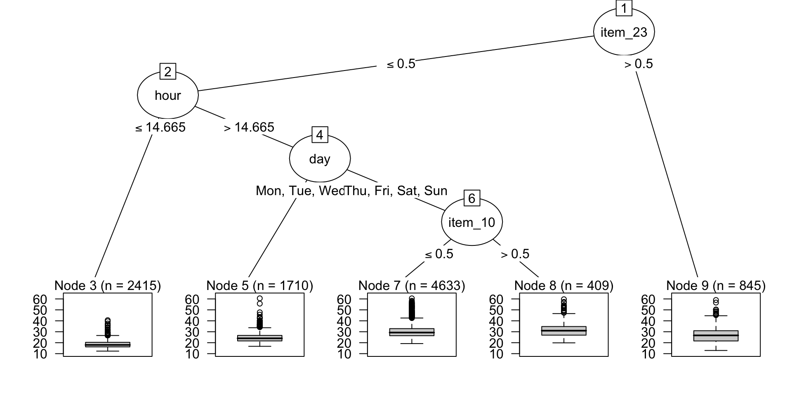
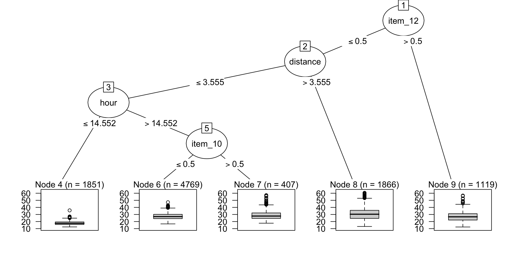
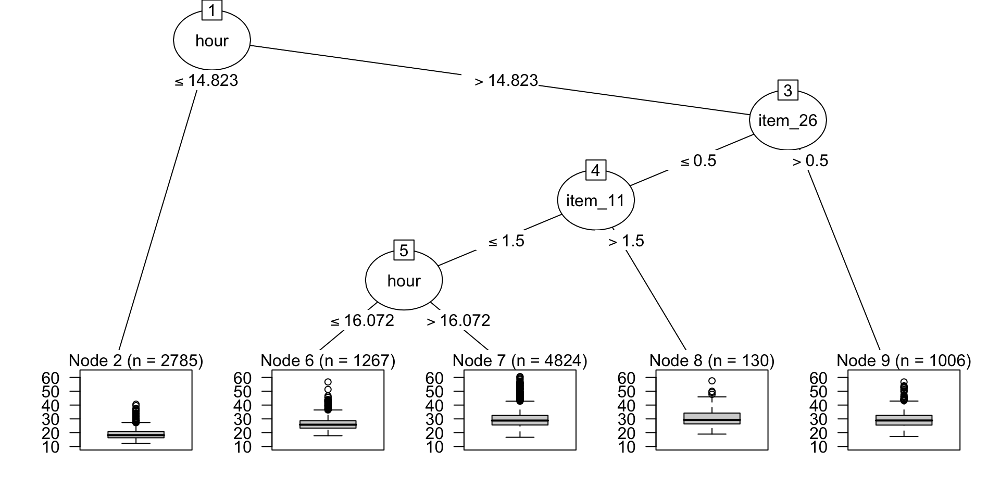

When building tree-based models, such as [CART](https://cran.r-project.org/package=rpart), [random forests](https://en.wikipedia.org/wiki/Random_forest), or [XGBoost](https://en.wikipedia.org/wiki/XGBoost), we might be interested in knowing a little more about how the model works. For example, if a CART and XGBoost model had roughly the same performance, we might want to characterize how complex each is so that we are more informed about which to prefer. Knowing how many predictors were used, how many terminal nodes are in the tree, and similar characteristics can help understand the model. We might desire to visualize the tree (or a tree in the ensemble), and so on.

The problem is that many packages store the tree's splits in different ways or offer incompatible APIs to access different characteristics. lorax helps capture this information for many different implementations.

You can install the CRAN version of lorax via

``` r
install.packages("lorax")
```

or get the development version using

``` r
pak::pak("tidymodels/lorax")
```

Let's start by using the ranger package to create a random forest model using the food delivery data in the modeldata package. For illustration, the trees will be coerced to be more shallow than usual so that we can better plot them using the `min.node.size` argument:

``` r
library(tidymodels) # <- to easily get dplyr, tidyr, ggplot2, etc
library(ranger)
library(lorax)

set.seed(872)
rgr_fit <-
  ranger(
    time_to_delivery ~ .,
    data = modeldata::deliveries,
    num.trees = 1000,
    min.node.size = 5000,
    importance = "impurity"
  )

rgr_fit
```

    Ranger result

    Call:
     ranger(time_to_delivery ~ ., data = modeldata::deliveries, num.trees = 1000,      min.node.size = 5000, importance = "impurity") 

    Type:                             Regression 
    Number of trees:                  1000 
    Sample size:                      10012 
    Number of independent variables:  30 
    Mtry:                             5 
    Target node size:                 5000 
    Variable importance mode:         impurity 
    Splitrule:                        variance 
    OOB prediction error (MSE):       24.26389 
    R squared (OOB):                  0.4879119 

## Visualizing the Trees

lorax contains methods for the `as.party()` function in the partykit package. This enables us to use all of the methods from that package. For example, `plot.party()` is an excellent visualization tool for the tree. Random forest has *many* trees and we can plot any of them:

``` r
rgr_fit |>
  as.party(tree = 1, data = modeldata::deliveries) |>
  plot()
```



``` r
rgr_fit |>
  as.party(tree = 100, data = modeldata::deliveries) |>
  plot()
```



``` r
rgr_fit |>
  as.party(tree = 1000, data = modeldata::deliveries) |>
  plot()
```



## Which Predictors Were Used?

Since trees automatically conduct *feature selection* as the model is trained, it helps to know which ones are *actually* used by the model. The `active_predictors()` function does just that:

``` r
rgr_vars <- active_predictors(rgr_fit, tree = 1:1000)
rgr_vars
```

    # A tibble: 1,000 × 2
       active_predictors  tree
       <list>            <int>
     1 <chr [4]>             1
     2 <chr [5]>             2
     3 <chr [3]>             3
     4 <chr [4]>             4
     5 <chr [4]>             5
     6 <chr [3]>             6
     7 <chr [3]>             7
     8 <chr [7]>             8
     9 <chr [3]>             9
    10 <chr [6]>            10
    # ℹ 990 more rows

``` r
# The column names are in a nested vector:
rgr_vars$active_predictors[[1]]
```

    [1] "day"     "hour"    "item_10" "item_23"

``` r
# We can expand the list too:
rgr_vars |>
  unnest(cols = c(active_predictors))
```

    # A tibble: 4,306 × 2
       active_predictors  tree
       <chr>             <int>
     1 day                   1
     2 hour                  1
     3 item_10               1
     4 item_23               1
     5 day                   2
     6 distance              2
     7 item_10               2
     8 item_12               2
     9 item_26               2
    10 hour                  3
    # ℹ 4,296 more rows

How often are predictors used?

``` r
rgr_vars |>
  unnest(cols = c(active_predictors)) |>
  count(active_predictors) |>
  arrange(active_predictors)
```

    # A tibble: 30 × 2
       active_predictors     n
       <chr>             <int>
     1 day                 516
     2 distance            507
     3 hour                623
     4 item_01             329
     5 item_02             131
     6 item_03              57
     7 item_04              66
     8 item_05              26
     9 item_06              92
    10 item_07              91
    # ℹ 20 more rows

How many predictors are used in each rule (on average)? A rule is the full logical statement that defines the path to the terminal nodes.

``` r
rgr_vars |>
  mutate(num_vars = map_int(active_predictors, ~ length(.x))) |>
  summarize(mean_num_vars = mean(num_vars))
```

    # A tibble: 1 × 1
      mean_num_vars
              <dbl>
    1          4.31

Many packages can compute *variable importance scores* for each predictor but each has a different interface. The lorax package has an accessor function to pull these from the model called `var_imp()`:

``` r
var_imp(rgr_fit)
```

    # A tibble: 30 × 2
       term     estimate
       <chr>       <dbl>
     1 hour     108892. 
     2 day       16054. 
     3 distance  25689. 
     4 item_01     673. 
     5 item_02      86.3
     6 item_03      30.4
     7 item_04      43.7
     8 item_05      11.0
     9 item_06      50.1
    10 item_07      55.2
    # ℹ 20 more rows

## Examining Rules

We can also get detailed information on the model's rules (for each tree). Using the same ranger model fit:

``` r
rgr_rules <- extract_rules(rgr_fit, data = modeldata::deliveries)
rgr_rules
```

    # A tibble: 5 × 3
         id rules       tree
      <int> <list>     <int>
    1     3 <language>     1
    2     5 <language>     1
    3     7 <language>     1
    4     8 <language>     1
    5     9 <language>     1

``` r
# With components
rgr_rules$rules[[1]] |> class()
```

    [1] "call"

``` r
rgr_rules$rules[[1]]
```

    item_23 <= 0.5 & hour <= 14.6645

We can compute on these and/or use them to determine which specific data were contained in the terminal node:

``` r
modeldata::deliveries |> filter(!!rgr_rules$rules[[1]])
```

    # A tibble: 2,415 × 31
       time_to_delivery  hour day   distance item_01 item_02 item_03 item_04 item_05
                  <dbl> <dbl> <fct>    <dbl>   <int>   <int>   <int>   <int>   <int>
     1             16.1  11.9 Thu       3.15       0       0       2       0       0
     2             19.6  13.0 Sat       3.35       1       0       0       1       0
     3             17.4  11.9 Sun       2.75       0       2       1       0       0
     4             18.0  12.1 Tue       2.4        0       0       0       1       0
     5             22.1  14.4 Thu       2.69       0       0       0       0       0
     6             17.6  12.9 Sat       2.47       0       1       0       0       0
     7             17.0  12.3 Sat       3.88       0       0       0       0       0
     8             19.5  13.5 Tue       3.55       0       0       0       0       0
     9             17.6  12.9 Fri       2.88       0       0       1       1       0
    10             21.6  14.3 Sat       3          0       0       0       1       0
    # ℹ 2,405 more rows
    # ℹ 22 more variables: item_06 <int>, item_07 <int>, item_08 <int>,
    #   item_09 <int>, item_10 <int>, item_11 <int>, item_12 <int>, item_13 <int>,
    #   item_14 <int>, item_15 <int>, item_16 <int>, item_17 <int>, item_18 <int>,
    #   item_19 <int>, item_20 <int>, item_21 <int>, item_22 <int>, item_23 <int>,
    #   item_24 <int>, item_25 <int>, item_26 <int>, item_27 <int>

## A List of Methods

Here are the details of which models and methods are supported in the first CRAN version:

| class         | var_imp | active_predictors | as.party | extract_rules |
|:--------------|:--------|:------------------|:---------|:--------------|
| bart          | n/a     | ✔                 | ✔        | ✔             |
| C5.0          | n/a     | ✔                 | ✔        | ✔             |
| cforest       | ✔       | ✔                 | n/a      | ✔             |
| cubist        | ✖       | ✔                 | ✖        | ✔             |
| grf           | ✔       | ✔                 | ✔        | ✔             |
| lgb.Booster   | ✔       | ✔                 | ✔        | ✔             |
| ObliqueForest | ✔       | ✔                 | ✖        | ✔             |
| party         | ✔       | ✔                 | n/a      | ✔             |
| randomForest  | ✔       | ✔                 | ✔        | ✔             |
| ranger        | ✔       | ✔                 | ✔        | ✔             |
| rpart         | ✔       | ✔                 | n/a      | ✔             |
| xgb.Booster   | ✔       | ✔                 | ✔        | ✔             |

Note that `as.party.rpart()` is in the partykit package and that cforest is made out of party objects.

## What's Next?

We'll work on adding [CatBoost](https://catboost.ai/) models to the list of supported methods. Please [add an issue](https://github.com/tidymodels/lorax/issues) if there are other aspects of trees that should be quantified in these models.
