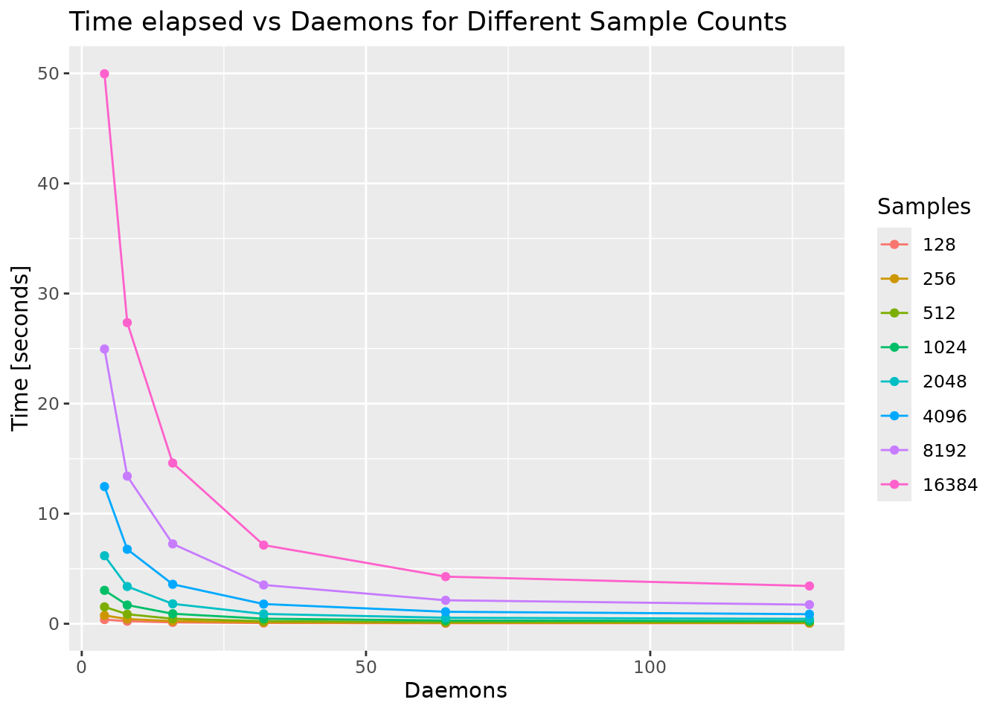

[mirai](https://mirai.r-lib.org) is R's framework for parallel and distributed computing, spreading work across processes locally or on remote infrastructure.
Its HTTP launcher, introduced in [mirai 2.6.0](/blog/2026-02-12_mirai-2-6-0/), launches workers by calling a platform's own HTTP job API -- an approach still uncommon among R parallel backends.
mirai 2.7.1 adds a `headers` argument to [`http_config()`](https://mirai.r-lib.org/reference/http_config.html), now the main way to authenticate: pass a session cookie, bearer token, API key, or any other header the platform requires.
(The `cookie` and `token` arguments remain as conveniences.)

This follows mirai's long-standing principle: write your code once, then deploy it anywhere -- your local machine, a remote server over SSH, a fleet of HPC nodes, and now **any platform with an HTTP API for launching jobs**.
The computation stays the same; only the launch configuration changes.
[Posit Workbench](https://posit.co/products/enterprise/workbench/) is the easiest case to show, but the same launcher works with any HTTP job API -- Kubernetes, cloud container services, or an internal scheduler.

## Scalability at a glance

Before the how, a look at what this launcher delivers.
The benchmark below spreads work across mirai daemons launched as Posit Workbench jobs via `http_config()` -- from 4 daemons up to 128, each with 1 CPU and 1 GB of memory -- timing `mirai_map()` batches of a small model fit, from 128 fits up to 16,384.

, at every daemon count.")



Time grows linearly with the amount of work and falls away as daemons are added -- scheduling across 128 workers is as routine as scheduling across 4.
The code and setup behind these charts are in the [full benchmark](https://pub.current.posit.team/public/mirai_http_config/mirai-daemon.html).

## The same interface, everywhere

Every mirai launcher plugs into the same place -- the `remote` argument of `daemons()`.
You always describe *how many* daemons you want and the `url` they should dial back to, then hand off the *how* to a configuration helper:

```r
library(mirai)

# Local
daemons(n = 4)

# HPC via a scheduler
daemons(n = 100, url = host_url(), remote = cluster_config())

# Cloud / enterprise via an HTTP API
daemons(n = 4, url = host_url(), remote = http_config())
```

`host_url()` generates the URL on the host machine that daemons connect back to.
The daemons are launched wherever the configuration sends them, but they all dial home to the same address, where work is dispatched to them transparently.
Your `mirai()` and `mirai_map()` calls never need to know where the compute actually lives.

## Posit Workbench: zero configuration

On Posit Workbench (2026.01+), `http_config()` reads the Posit Workbench environment automatically.
There is nothing to configure:

```r
library(mirai)

daemons(n = 4, url = host_url(), remote = http_config())
```

That's it.
Four daemons launch as Posit Workbench jobs, connect back to your session, and you can start sending work to them.
No YAML, no job scripts, no leaving your session.

 call.")

The jobs panel on the left shows each daemon running as a managed `Rscript` job -- launched, tracked, and torn down by Posit Workbench itself, all from the single line of R in the console on the right.

Where those jobs run depends on the backend Posit Workbench is configured with.
On a Local backend the daemons share the server hosting your session; on a Kubernetes (or Slurm) backend, each daemon is scheduled onto the cluster as its own job -- the same single line now scales your session out across many machines.
For organisations using Kubernetes as their Posit Workbench backend, this unlocks genuine scale-out compute with no cluster credentials, manifests, or admin involvement required.

### Customising the Posit Workbench launch

The defaults just work, but you can shape the launched jobs by passing extra arguments through `http_config()`.
Target a named cluster and resource profile:

```r
daemons(
  n = 2,
  url = host_url(),
  remote = http_config(
    cluster = "Kubernetes",
    resource_profile = "rstudio"
  )
)
```

Or specify custom resources directly -- here 4 CPUs and 8 GB of memory per daemon:

```r
daemons(
  n = 2,
  url = host_url(),
  remote = http_config(
    cluster = "Kubernetes",
    cpus = 4,
    memory = 8192
  )
)
```

Both examples pass their arguments straight through `...`.
The full set of Posit Workbench options, as documented for [`http_config()`](https://mirai.r-lib.org/reference/http_config.html):

| Argument | Description | Default |
|---|---|---|
| `rscript` | Path to the `Rscript` executable | `"Rscript"` |
| `job_name` | Base name for the launched jobs | `"mirai_daemon"` |
| `cluster` | Name of the cluster to launch into | first available cluster |
| `resource_profile` | Named resource profile, e.g. `"rstudio"` | first profile on the chosen cluster |
| `cpus` | Number of CPUs per daemon | from `resource_profile` |
| `memory` | Memory per daemon, in MB | from `resource_profile` |

`cpus` and `memory` define a custom resource allocation -- supply either or both to override `resource_profile`.

## Customising for enterprise platforms and APIs

Posit Workbench is the zero-config case, but `http_config()` is a general HTTP launcher, and its arguments map directly onto an HTTP request:

```r
http_config(
  url,                 # endpoint that launches a job
  method = "POST",     # HTTP method
  headers,             # named character vector of HTTP headers
  data,                # request body, with a "%s" placeholder
  ...,
  cookie = NULL,       # convenience: appends Cookie: <value>
  token = NULL         # convenience: appends Authorization: Bearer <value>
)
```

The two pieces that adapt mirai to a new platform are `data` and `headers`:

- **`data`** is the request body -- JSON or any formatted string -- that describes the job.
  It must contain a `"%s"` placeholder, where mirai inserts the daemon's launch expression at launch time.
  That expression is a `mirai::daemon()` call which the remote job runs (via `Rscript -e`) to start a daemon and dial back to your `host_url()`.
- **`headers`** -- new in 2.7.1 and now the primary way to authenticate -- carries a named character vector of HTTP headers: a session cookie, a bearer token, an API key, an API version, whatever the endpoint expects.
  The `cookie` and `token` arguments remain as conveniences that append the common `Cookie:` and `Authorization: Bearer` entries for you.

Here is a self-contained example targeting a generic launch API:

```r
daemons(
  n = 2,
  url = host_url(),
  remote = http_config(
    url = "https://api.example.com/launch",
    method = "POST",
    headers = function() c(
      Authorization = sprintf("Bearer %s", Sys.getenv("MY_API_KEY")),
      `X-API-Version` = "2"
    ),
    data = '{"command": "%s"}'
  )
)
```

At launch, mirai replaces the `"%s"` with the daemon expression -- quotes and newlines escaped so the result stays valid JSON.
For one daemon it looks something like:

```r
mirai::daemon("tls+tcp://10.0.0.7:34291")
```

so the receiving platform only has to run it with `Rscript -e`.
(The host URL is filled in from your `host_url()`; under TLS the certificate travels in the expression too.)

### A worked example: Kubernetes Jobs

We're using Kubernetes as an example here, not so much as a deployment guide, but rather as a complete illustration of the recipe for you to map onto whatever launch API your own platform exposes.
Kubernetes creates a Job with a `POST` to `/apis/batch/v1/namespaces/<namespace>/jobs`, authenticated with the pod's service-account bearer token.
The request body is a Job manifest whose container runs `Rscript -e "%s"`.

Construct the Job manifest with jsonlite, then build the configuration once -- an ordinary object you can store and reuse:

```r
library(mirai)

k8s <- "https://kubernetes.default.svc"   # in-cluster API server
ns  <- "default"                          # target namespace

# Job manifest -- "%s" marks where mirai injects the daemon launch expression
manifest <- jsonlite::toJSON(
  list(
    apiVersion = "batch/v1",
    kind = "Job",
    metadata = list(generateName = "mirai-daemon-"),
    spec = list(
      backoffLimit = 0L,
      template = list(spec = list(
        restartPolicy = "Never",
        containers = list(list(
          name = "mirai",
          image = "your-registry/r-mirai:latest",
          command = c("Rscript", "-e", "%s")
        ))
      ))
    )
  ),
  auto_unbox = TRUE
)

k8s_config <- http_config(
  url = sprintf("%s/apis/batch/v1/namespaces/%s/jobs", k8s, ns),
  method = "POST",
  headers = function() c(
    `Content-Type` = "application/json",
    Authorization = sprintf(
      "Bearer %s",
      readLines(
        "/var/run/secrets/kubernetes.io/serviceaccount/token",
        warn = FALSE
      )
    )
  ),
  data = manifest
)
```

Then hand it to `daemons()` whenever you need workers:

```r
daemons(n = 4, url = host_url(), remote = k8s_config)
```

Because the credentials are supplied as a function, the same `k8s_config` object can be reused to scale up again later in the session -- the token is read fresh on each launch.

<div class="callout callout-note" role="note" aria-label="Note">
<div class="callout-header">
<span class="callout-title">On a real cluster – and what Posit Workbench solves for you</span>
</div>
<div class="callout-body">

Getting this sketch working end to end -- let alone on a production cluster -- raises questions that have little to do with mirai:

- **Permissions.** The service account must be allowed to create Jobs in the namespace, and reading service-account tokens is typically an admin privilege -- in most managed environments, data scientists hold neither.
- **Consistent environments.** The image must carry R, mirai, and the packages your tasks use -- at the same versions as the session driving it -- and keeping the two in sync is now your job.
  (Testing with an image you built locally?
  The `:latest` tag makes Kubernetes default to `imagePullPolicy: Always` -- add `imagePullPolicy: Never`, or pin a specific tag, so the Job uses your locally loaded image.)
- **Networking.** The pods must be able to reach `host_url()` to dial back: check the address resolves and the port is open from inside the cluster, and reach for `host_url(tls = TRUE)` if that traffic leaves a trusted network.
- **Data and storage.** mirai ships your function and its arguments to each daemon, but anything read from disk -- data files, sourced scripts -- must also be reachable from the pods, which in practice means shared storage mounted on both sides.

These are exactly the problems the Posit Workbench integration solves: jobs launch with your session's identity, in the same environment, on the same network, with access to the same storage.
If your organisation runs Posit Workbench -- including on a Kubernetes backend -- the zero-config path above gives you all of this for free.

</div>
</div>

The same recipe adapts to a cloud container service or an internal scheduler -- only three pieces change:

- **`url`** -- point at the endpoint that launches a job.
- **`headers`** -- supply your credential.
  Just a bearer token or session cookie?
  The `token` and `cookie` conveniences assemble the header for you -- the whole `headers` function above shrinks to `token = function() readLines("/var/run/secrets/kubernetes.io/serviceaccount/token", warn = FALSE)`.
- **`data`** -- wrap the `"%s"` daemon expression in whatever request body the API expects.

## Credentials as functions

Notice that `headers` and `token` above are written as **functions**, not plain strings.
Every argument that can change between launches -- `url`, `headers`, `data`, `cookie`, `token` -- accepts either a value or a function.

A plain value is captured when you *create* the configuration.
A function is evaluated lazily, at the moment a daemon is *launched*.
This distinction matters for credentials: session cookies and API tokens expire.
By supplying them as functions, mirai fetches a fresh credential each time it launches a daemon -- even if you built the configuration hours earlier, or reuse it to scale up later in a long-running session.
It is the recommended way to supply anything sensitive or time-bound.

## TLS for untrusted networks

The launch API call is an ordinary HTTPS request, but there is a second channel to consider: the connection daemons use to dial back and exchange work and results with your session.
On a trusted internal network, plain TCP is fine.
When that traffic crosses an untrusted network, or you need to guarantee encryption in transit, encrypt the channel by setting `tls = TRUE` on `host_url()`:

```r
daemons(n = 4, url = host_url(tls = TRUE), remote = http_config())
```

This switches the connection scheme to `tls+tcp://` and upgrades the daemon channel to TLS.
By default mirai generates an ephemeral self-signed certificate automatically, so there is nothing to manage.
To use your own certificate instead, pass a PEM-encoded certificate and key to the `tls` argument of `daemons()`.
Everything else -- the launcher, your `mirai()` and `mirai_map()` calls -- stays exactly the same.

## Getting started

Update to the latest mirai to use the HTTP launcher:

```r
install.packages("mirai")
```

Then, on Posit Workbench, parallel and distributed computing is a single line away:

```r
library(mirai)

daemons(n = 4, url = host_url(), remote = http_config())

# work now runs across four Posit Workbench jobs
results <- mirai_map(1:1000, expensive_function)
```

And on any other platform with an HTTP launch API, the same `daemons()` call gets you there -- you just describe the endpoint once.
Write your code once, deploy it anywhere.

## Links

- [mirai website](https://mirai.r-lib.org/)
- [`http_config()` reference](https://mirai.r-lib.org/reference/http_config.html)
- [mirai on GitHub](https://github.com/r-lib/mirai)
