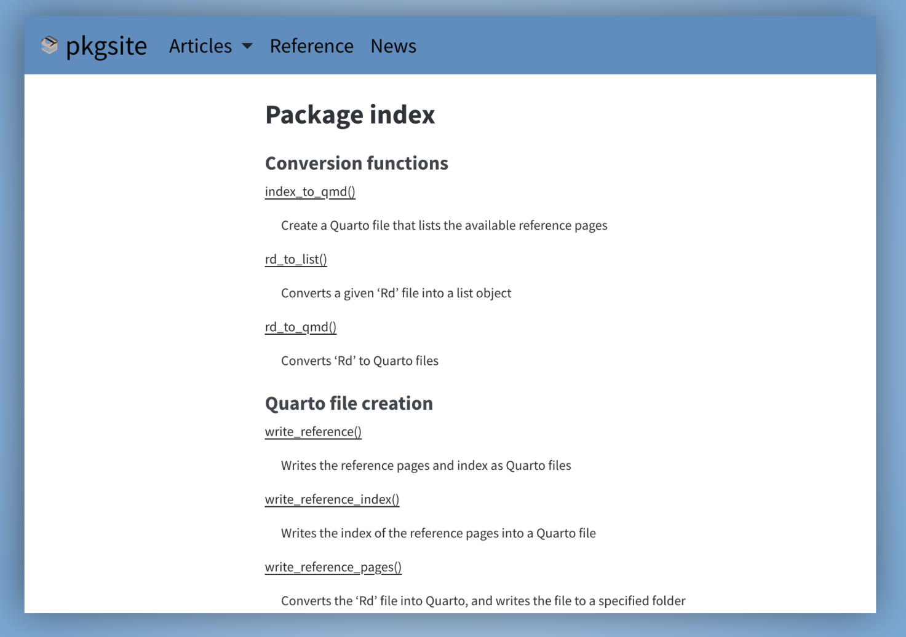
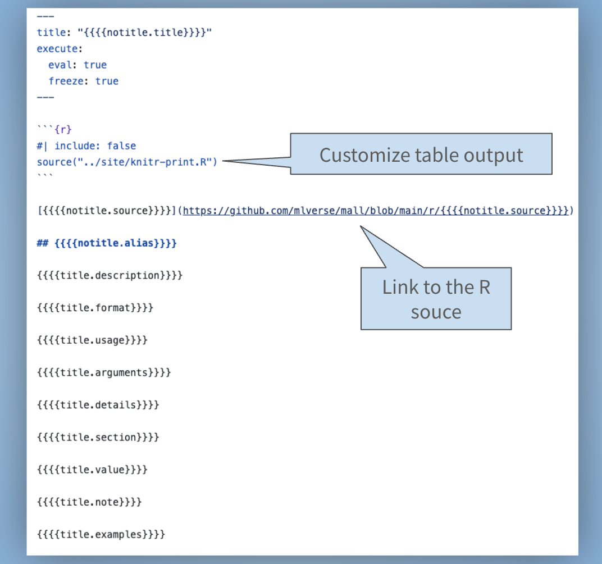

We are happy to introduce `pkgsite`. It reads the compiled `.Rd` files in your
R package and converts them into `.qmd` files. It can also automatically create
a reference index page that lists all your exported functions. You can customize
the format of both using templates, then let Quarto render the HTML. `pkgsite`
is now available on CRAN, to install use:

```r
install.packages("pkgsite")
```

`pkgsite` is inspired by Python's [`Quartodoc`](https://machow.github.io/quartodoc/get-started/overview.html),
which does the same for Python packages.

## Why `pkgsite`?

The main website builder for R packages is [`pkgdown`](https://pkgdown.r-lib.org/).
It goes all the way to a finished, publication-ready HTML website in one step,
and for most packages that is exactly what you want. It is mature, has a large
ecosystem of themes and extensions, and just works.

`pkgsite`, on the other hand, only creates `.qmd` files with the help content.
You decide how to structure the site around them, and Quarto handles the final
HTML output.

To see what that looks like, compare the
[source `.Rd` file](https://github.com/mlverse/mall/blob/main/r/man/llm_sentiment.Rd)
for `llm_sentiment()` in `mall` with the
[`.qmd` file `pkgsite` generated from it](https://github.com/mlverse/mall/blob/main/reference/llm_sentiment.qmd).

Two cases where we have seen it make a difference are:

- Examples that require local resources
- Unified R and Python Quarto sites

### Examples that require local resources

Some packages depend on things that are not available on automated build and
publishing platforms such as GitHub Actions or Netlify: databases, large
language models, or Spark clusters. Running their examples there is not
feasible, yet you still want working, rendered documentation.

Quarto's [freeze](https://quarto.org/docs/projects/code-execution.html#freeze)
solves this cleanly. You render the site once locally where those resources are
available, commit the `_freeze/` folder alongside your source, and GitHub
rebuilds the site on every push without re-executing a single line of code.

The [`mall`](https://mlverse.github.io/mall/) and
[`lang`](https://mlverse.github.io/lang/) packages are concrete examples.
Their function examples call an LLM, so they cannot run on those platforms.
With `pkgsite` and freeze, rendering happens on a developer machine where the
model is accessible, and the frozen output travels with the repository.

In the `llm_sentiment()` function, the example section looks like this in the
resulting `.qmd` file:

````markdown
## Examples
```{r}
library(mall)

data("reviews")

llm_use("ollama", "llama3.2", seed = 100, .silent = TRUE)

llm_sentiment(reviews, review)

# Use 'pred_name' to customize the new column's name
llm_sentiment(reviews, review, pred_name = "review_sentiment")
```
````

And this is what the [rendered page](https://mlverse.github.io/mall/reference/llm_sentiment.html#examples) looks like on the `mall` website:


### Unified R and Python sites

If your project ships both an R package and a Python package, you can combine
`pkgsite`'s output with
[`Quartodoc`](https://machow.github.io/quartodoc/get-started/overview.html)'s
output into a single Quarto website. Both tools write `.qmd` reference pages
that Quarto assembles together, giving R and Python users a consistent
experience on one site. The `mall` package's
[reference section](https://mlverse.github.io/mall/reference/) is a live
example: R and Python pages side by side, built from two different tools,
served as one site.

## Getting started

From within your package directory, one function call does the work:

```r
library(pkgsite)
write_reference()
```

`write_reference()` creates a `reference/index.qmd` that links to all your
exported functions, and converts each `.Rd` file in `man/` into its own `.qmd`
reference page.

You can customize its behavior through arguments. For example, if you want to
skip running the examples when Quarto renders the reference pages:

```r
write_reference(examples = FALSE, not_run_examples = FALSE)
```

Calling it without arguments reads any configuration from a `pkgsite:` section
at the top level of `_quarto.yml`. Following the same convention as
[`Quartodoc`](https://machow.github.io/quartodoc/get-started/overview.html),
the Python equivalent, this is where you set the package root, the output
folder, templates, and optionally how functions are grouped and ordered in the
index:

```yaml
pkgsite:
  dir: "."                    # path to the package root
  reference:
    dir: reference            # where to write the .qmd files
    not_run_examples: false   # whether to execute \dontrun{} examples
    template: inst/templates/_reference.qmd   # custom page template
    index:
      file: index.qmd         # name of the index file
      template: inst/templates/_index.qmd     # custom index template
      contents:               # optional: custom function grouping
        - section: "Write files"
          contents:
            - write_reference.qmd
            - write_reference_index.qmd
            - write_reference_pages.qmd
        - section: "Conversion"
          contents:
            - rd_to_qmd.qmd
            - rd_to_list.qmd
            - index_to_qmd.qmd
```

If you omit `contents`, `pkgsite` falls back to grouping by `roxygen2`
`@family` tags, then alphabetical order. You only need to re-run
`write_reference()` when you add, rename, or remove exported functions.

Use arguments for one-off adjustments; the `_quarto.yml` configuration is the
better choice when you want those settings to apply consistently every time
`write_reference()` is called.

This is what the rendered reference index page looks like on the `pkgsite`
website, using the grouping specified in the example YAML above:



## Customizing the page layout

The layout of every reference page and the index is driven by a Quarto template
file that uses four-curly-brace placeholders like `{{{{title.description}}}}`.
The prefix — `title.` or `notitle.` — controls whether the section heading is
included. The defaults work well for most packages, but if you want to
re-order sections, add a logo, link to source code, or adjust per-page
frontmatter, you can supply your own template. For example, a minimal template
that shows only the title, description, and examples looks like this:

```markdown
---
title: "{{{{notitle.title}}}}"
---

## {{{{notitle.title}}}}

## Description
{{{{title.description}}}}

## Examples
{{{{title.examples}}}}
```

The
[Customize the pages](https://edgararuiz.github.io/pkgsite/articles/customize.html)
article covers the full set of available placeholders.

The `mall` package is a good example of this. Its custom template makes two
additions to the default: it adjusts how `knitr` renders table column widths,
and it adds a link to the R source code of each function on GitHub:



## Publishing to GitHub Pages

To publish your site on every push to `main`, you need a GitHub Actions
workflow that runs `quarto render` and deploys the output to the `gh-pages`
branch. The
[GitHub Pages](https://edgararuiz.github.io/pkgsite/articles/github-actions.html)
article on the `pkgsite` website walks through the full setup with a working
example.

### Auto-linking function names

`pkgsite` can turn every function name in your prose into a link pointing to
its own reference page automatically. Mention `llm_sentiment()` anywhere in
your documentation and it becomes a clickable link to the `llm_sentiment`
reference page, no extra markup needed. The same
[GitHub Pages](https://edgararuiz.github.io/pkgsite/articles/github-actions.html)
article covers how to enable it.

## Learn more

The full documentation lives at
[edgararuiz.github.io/pkgsite](https://edgararuiz.github.io/pkgsite/), and the
source is on [GitHub](https://github.com/edgararuiz/pkgsite). Issues and
feature requests go to the
[issue tracker](https://github.com/edgararuiz/pkgsite/issues).
