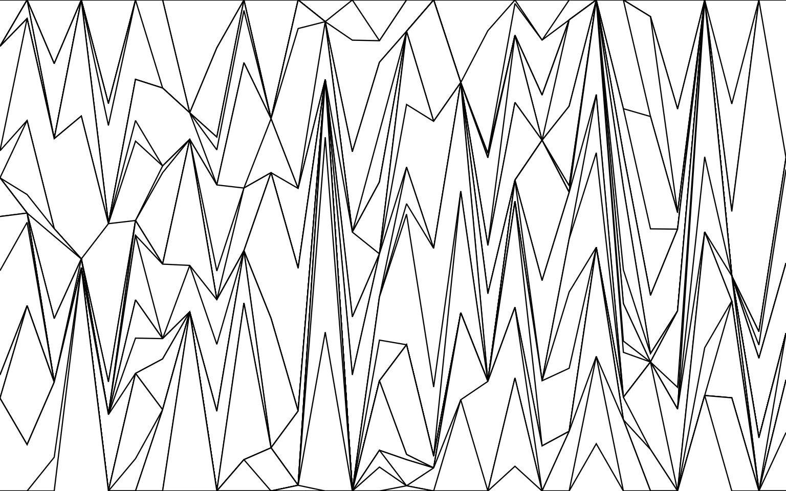
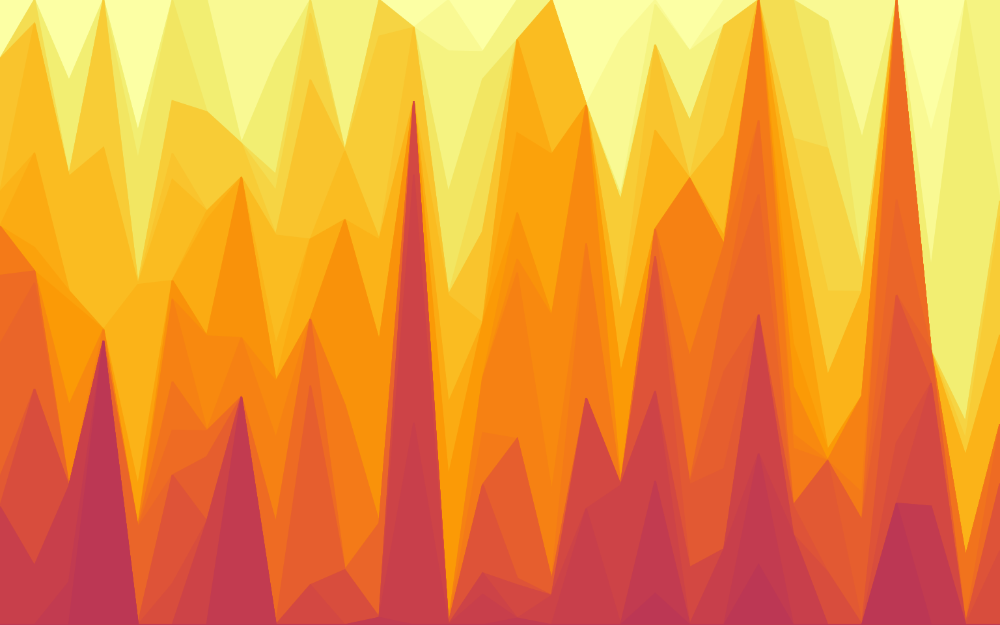
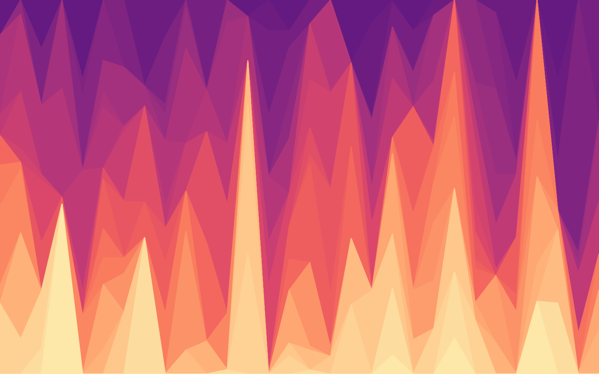
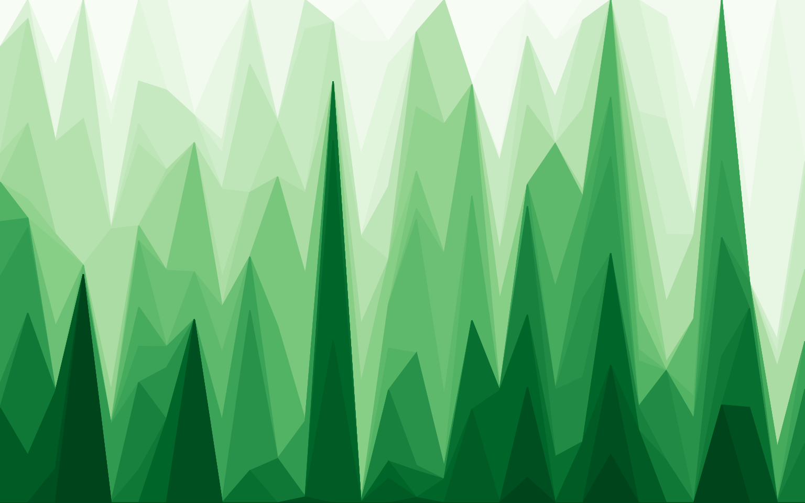
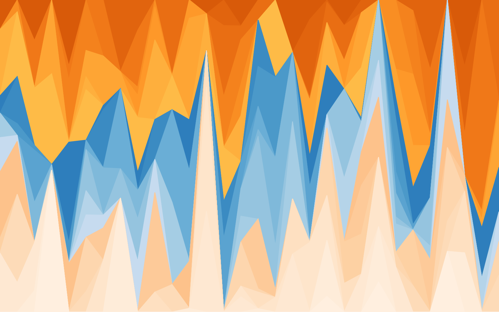

The 2024 Plotnine Contest will close in 5 days on 26th July 2024, this is after a two week extension.

We have [many](https://github.com/has2k1/plotnine/discussions/categories/2024-plotnine-contest?discussions_q=category:%222024+Plotnine+Contest%22+sort:date_created) submissions already but we could have move in these two categories.

## 1. Visualisation of Distributions

Most of the time, the main plot of statistical graphics is to get a sense of how the data is distributed. I would love to see more submissions of this type. This [resource](https://homepage.divms.uiowa.edu/~luke/classes/STAT4580/dists.html) from the University of Iowa is a good introduction to the kinds of ways you can visualise distributions. I think there is plenty of room for otherwise simple visualisations of data distributions made more compelling by the choice of dataset, colors, annotations and overall polish.

## 2. Visualisation Art

Plotnine implements *The Grammar of Graphics*, which moulds Drawing and Painting Art into a system suitable for statistical graphics. Constrained within, the Art says "I want to break free" and a contest is the party at which to break free. We got all week.

A contest can trigger you into action on tasks you've long procrastinated or avoided due to concerns about developing an unhealthy addiction. This one may have got me. Inspired by a [Yan Holtz](https://r-graph-gallery.com/137-spring-shapes-data-art.html) piece, [Michael Chow](https://mchow.com/posts/plotnine-art) has deeped into generative art for this contest. In turn, I have given it a go.

From Yan and through Michael, I get an abstract form and first I unpaint it to reveal its spiky nature.

### The Spiky World

<details class="code-fold">
<summary>Code</summary>

``` python
from plotnine import (
    aes,
    coord_cartesian,
    element_rect,
    geom_area,
    ggplot,
    scale_color_manual,
    theme_void,
    theme,
)
import pandas as pd
import numpy as np


num_groups = 30

def get_colors(cmap_name, start=0, stop=1, n=10):
    """Return colors from a colormap"""
    from mizani.palettes import get_colormap
    x = np.linspace(start, stop, n)
    return get_colormap(cmap_name).continuous_palette(x)

def combine(colors: list[str]):
    from mizani.palettes import gradient_n_pal
    x = np.linspace(0, 1, num_groups)
    return gradient_n_pal(colors)(x)

def make_data(seed=123):
    names = [f"G{i}" for i in range(num_groups)]
    population = [0] * 100 + list(range(1, num_groups+1))
    rs = np.random.RandomState(seed)
    frames = []
    for i in range(30):
        arr = rs.choice(population, num_groups)
        _data = pd.DataFrame({
            "x": i,
            "y": arr / np.sum(arr),
            "g": rs.choice(names, num_groups, replace=False),
        })
        frames.append(_data)
    return pd.concat(frames).sort_values(["x", "g"])

def blink(colors: list[str] | list[list[str]], seed=123):
    data = make_data(seed)
    p = (
        ggplot(data, aes(x="x", y="y", fill="g", color="g"))
        + geom_area(show_legend=False)
        + coord_cartesian(expand=False)
        + scale_color_manual(values=combine(colors), aesthetics=["fill", "color"])
        + theme_void()
    )
    return p

(
    ggplot(make_data(), aes(x="x", y="y", group="g"))
    + geom_area(fill="white", color="black", show_legend=False)
    + coord_cartesian(expand=False)
    + theme_void()
    + theme(plot_background=element_rect(fill="white"))
)
```

</details>



Then with each blink of the eye, *The Spiky World* reveals one of her infinite faces.

Blink.

### Spiky Desert Dunes

<details class="code-fold">
<summary>Code</summary>

``` python
blink(get_colors("inferno", .5, 1)[::-1])
```

</details>



Blink.

### A Spiky Volcano

<details class="code-fold">
<summary>Code</summary>

``` python
blink(get_colors("magma", .3, .95))
```

</details>



Blink.

### A Morning in a Spiky Forest

<details class="code-fold">
<summary>Code</summary>

``` python
blink(get_colors("Greens"))
```

</details>



Blink.

### A Spiky Sunset at the Beach

<details class="code-fold">
<summary>Code</summary>

``` python
blink([
    *reversed(get_colors("YlOrBr", 0.4, 0.7)),
    *reversed(get_colors("Blues", 0.25, 0.7)),
    *reversed(get_colors("Oranges", 0.05, 0.3)),
])
```

</details>



This is generative art, the art that never ends. I did not know. I started blinking. I must continue blinking forever.

Create your world, blink and [share](https://github.com/has2k1/plotnine/discussions/788) what you see.
