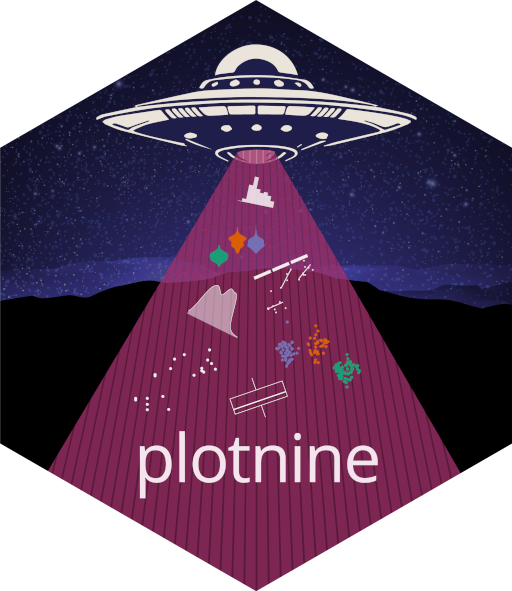
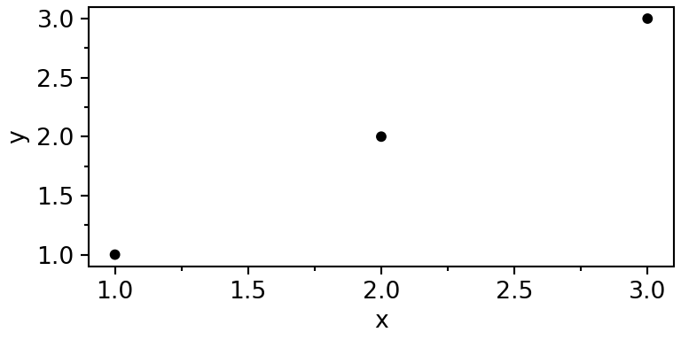
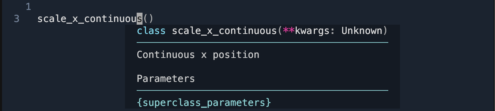
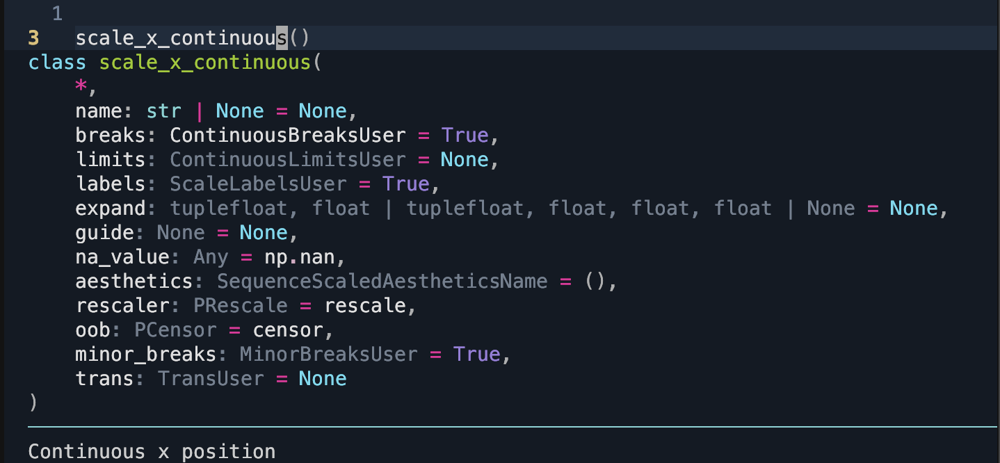
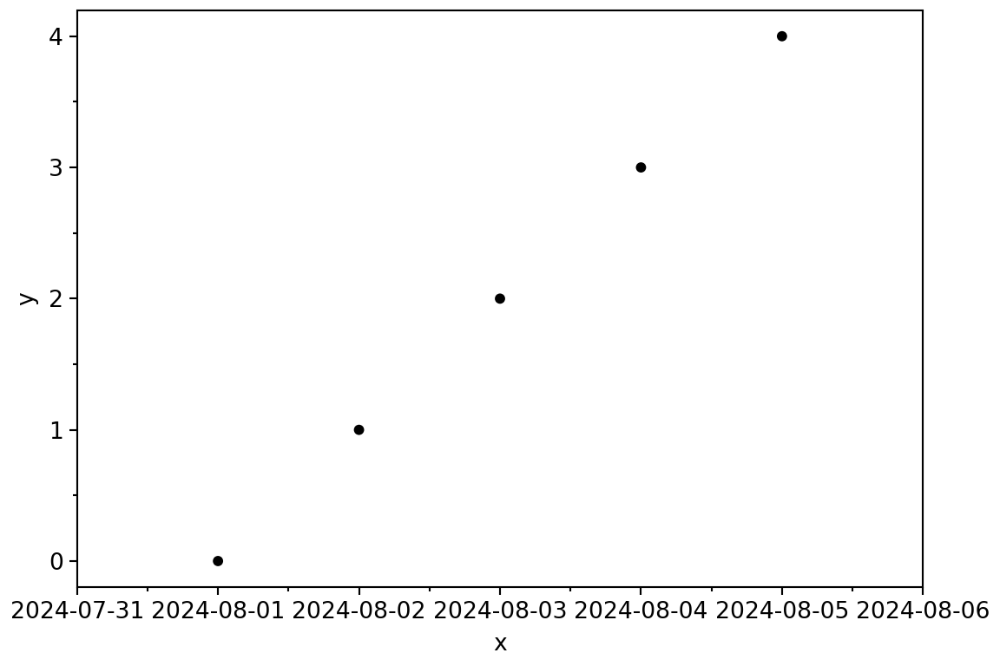
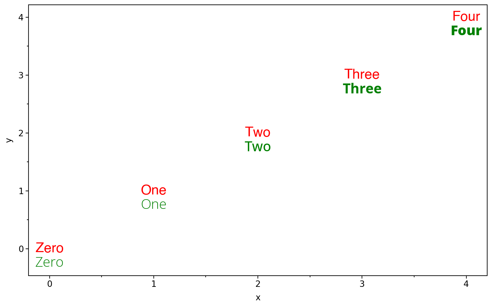

<details class="code-fold">
<summary>Code - Imports</summary>

``` python
import pandas as pd
from plotnine import (
   aes,
   ggplot,
   geom_point,
   geom_text,
   scale_x_datetime,
   theme,
   theme_set,
   theme_matplotlib,
)
theme_set(theme_matplotlib());
```

</details>



We are happy to announce the release of plotnine v0.14! This version requires *python 3.10 or later*, a change aligned with [NumPy's deprecation policy](https://numpy.org/neps/nep-0029-deprecation_policy.html#support-table).

This release also introduces our new hex logo!

## No More `print` for Plots

One of the most significant updates in v0.14 is the removal of `print` as a way to render plot objects. Starting with v0.13, we began deprecating this approach, encouraging users to transition to `ggplot.show()` for displaying plots.

Now, `print` on a plot object will simply return the display size (in pixels) rather than rendering the plot.

``` python
data = pd.DataFrame({"x": [1, 2, 3], "y": [1, 2, 3 ]})
p = (
   ggplot(data, aes("x", "y"))
   + geom_point()
   + theme(figure_size=(4, 2))
)

print(p)
print("There is no figure above this output sentence.")
```

    <ggplot: (384 x 192)>
    There is no figure above this output sentence.

In environments with `retina` output, the exact pixel-size dimensions of the image will be double the display size.

``` python
p.show()
print("There is a figure above this output sentence.")
```



    There is a figure above this output sentence.

## Enhancements

If you have worked with scales and passed in parameters, you might have encountered an inconvenience: your IDE could not provide meaningful suggestions. Previously, scales used `**kwargs` to capture common parameters, making it challenging for IDEs to offer specific guidance. With around [100 scales](https://plotnine.org/reference/#scales), each with subtle differences, we handled these parameters dynamically to avoid extensive duplication while also generating docstrings automatically.

With Python \>= 3.10, we have converted scales to `dataclasses` and leveraged finer controls over [keyword-only parameters](https://docs.python.org/3.10/library/dataclasses.html#dataclasses.KW_ONLY). This allows us to provide explicit signatures and enables the documentation system to automatically include inherited docstrings for parameters. For example, where an IDE previously displayed something like this:



it will now display:



## Datetimes and Timedeltas

Working with datetimes can be challenging (sometimes even [hellish](https://ondata.blog/articles/nine-circles-of-hell-time-in-python/)), but we aim to simplify this experience for you. In Python, there are three main types of datetime objects you are likely to encounter:

1.  [`datetime.datetime`](https://docs.python.org/3/library/datetime.html#datetime-objects) from the standard library
2.  [`pandas.Timestamp`](https://pandas.pydata.org/docs/reference/api/pandas.Timestamp.html) from pandas
3.  [`numpy.datetime64`](https://numpy.org/devdocs/reference/arrays.datetime.html#basic-datetimes) from numpy

Each of these types covers different ranges and resolutions. The standard library's `datetime` has the smallest range, with a constant millisecond (ms) resolution; pandas offers a middle ground with a larger range and nanosecond (ns) resolution; and numpy provides varying resolutions (from years to attoseconds) with different ranges for each resolution. These differences mean that these types are not always directly interchangeable, though we work to make them feel that way. Since our data is stored in a dataframe, any datetime values are converted to the pandas type, which then stores values as numpy types!

Arithmetic operations on each datetime type yield corresponding timedelta types also with their unique resolutions. Certain ranges can exceed valid limits---for example, the range of `pandas.Timestamp` cannot be represented as a timedelta. This means there are edge cases. But you should not be too worried unless your desired time resolution is dictacted by the [vagaries](https://en.wikipedia.org/wiki/2011_OPERA_faster-than-light_neutrino_anomaly) of sub-atomic particles.

In this release, you can now expand the limits of datetime and timedelta scales with additional constants.

``` python
import datetime

data = pd.DataFrame({
    "x": [datetime.datetime(2024, 8, i) for i in range(1, 6)],
    "y": range(5)
})

(
    ggplot(data, aes("x", "y"))
    + geom_point()
    + scale_x_datetime(
        expand=(0, datetime.timedelta(days=1))
    )
    + theme(figure_size=(6, 4))
)
```



You can also set the limits through the coordinate system.

``` python
coord_cartesian(xlim=(datetime(1999, 1, 1), datetime(2006, 1, 1)))
```

Beyond datetime and timezone scales, this robustness now applies to any scale created for data types that are not strictly numeric.

## Integration with Quarto

plotnine now recognizes [figure options](https://quarto.org/docs/computations/execution-options.html#figure-options) specified in the meta section of a Quarto document. These options control the size and format of output images, including `fig-dpi`, `fig-width`, `fig-height`, and `fig-format`.

While these Quarto options are set as defaults, you can still override them for any specific plot. For example:

```` markdown
---
title: "Plotnine Playing well with Quarto"
fig-dpi: 100
fig-width: 6
fig-height: 4
fig-format: retina
---

```{python}
#| label: using-quarto-figure-options
from pandas import pd
from plotnine import aes, geom_point, ggplot, theme

data = pd.DataFrame({"x": range(5), "y": range(5)})

(
  ggplot(data, aes("x", "y"))
  + geom_point()
)
```

```{python}
#| label: overriding-quarto-figure-options
(
  ggplot(data, aes("x", "y"))
  + geom_point()
  + theme(figure_size=(4, 3))
)
```
````

Note that, at the moment using these options at the chunk level has no effect.

## Font Aesthetics

In theory, aesthetics represent any properties we can perceive; in practice, only those we can see and vary predictably can be useful aesthetics. Previously, text attributes like `family`, `fontweight`, `fontstyle`, and `fontvariant` were parameters but not aesthetics, meaning you could not map variables to them. Not anymore, these attributes of a text are now aesthetics!

`fontweight` controls the boldness of text. It accepts any number in the range `[0, 1000]`, with common levels being *normal* (400) and *bold* (700). Some fonts provide multiple levels of boldness, with up to nine variations, typically at intervals like `[100, 200, 300, 400, 500, 600, 700, 800, 900]`. A given numeric weight will be mapped to the nearest available level.

For instance, here is an example comparing two fonts: `Helvetica`, which doesn't have multiple weight levels (the one on your system may differ), and `Open Sans` (again, the one on your system may differ), which does.

``` python
from mizani.bounds import rescale

data = pd.DataFrame({
    "x": range(5),
    "y": range(5),
    "w": rescale(range(5), to=(0, 1000)),
    "label": "Zero One Two Three Four".split()
})

(
    ggplot(data, aes("x", label="label", fontweight="w"))
    + geom_text(aes(y="y"), family="Helvetica", colour="red", size=16)
    + geom_text(aes(y="y-.25"), family="Open Sans", colour="green", size=16)
)
```



Note that, there is no scale for `fontweight` so we had to explicitly scale the value to the expected range. Currently you should expect at most 9 levels of bold variations, but pending better support, completely [variable fonts](https://fonts.google.com/knowledge/introducing_type/introducing_variable_fonts) are now a thing and will allow continuous variation on the range `[0, 1000]`.

Note that there is no scale for `fontweight`, so values must be explicitly scaled to the expected range. And, you can expect a maximum of 9 levels of bold variations. However, with the growing support for [variable fonts](https://fonts.google.com/knowledge/introducing_type/introducing_variable_fonts), continuous variation across the full `[0, 1000]` range may be possible.
