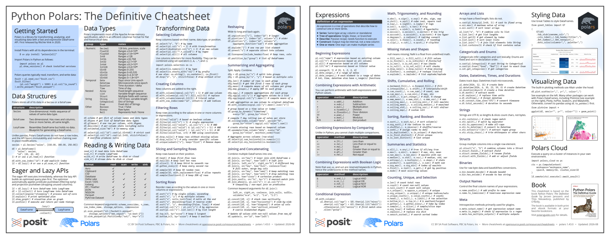

Our book, *[Python Polars: The Definitive Guide](https://polarsguide.com)*, is nearly 500 pages. Over the past few weeks we spent many hours compressing it down to two.

*Python Polars: The Definitive Cheatsheet* is out now, and it's free. Download it, print it, laminate it, put it on your desk.

[Get the cheatsheet](/resources/cheatsheets/polars)

## What's on it

Page one covers the fundamentals: how to get started, data types, data structures, the eager and lazy APIs, reading and writing data, and transforming data with select, filter, sort, reshape, aggregate, and join.

Page two is mostly expressions, which is where Polars really shines. It also includes the most common methods for working with strings, datetimes, lists, structs, and categoricals, plus styling data with Great Tables and visualizing data with Altair and Plotnine.

Keep in mind that this is a lossy compression. Two pages can hold method names and call shapes, but not the reasoning behind them. The cheatsheet is for remembering, not for learning Polars from scratch, and it doesn't replace the [official documentation](https://docs.pola.rs/) or our book.

## There's an HTML version too

A laminated PDF is a good desk reference, but it isn't much use to a screen reader, and you can't copy anything out of it. So the cheatsheet also comes as HTML, with real headings, real tables, and selectable code. It works with a screen reader, the text reflows on a phone, and you can copy a snippet straight into your editor instead of retyping it.

## Made together with Polars, Inc.

A cheatsheet is really a long series of arguments about what matters most. Every line that makes it displaces something else. Having [Polars, Inc.](https://pola.rs) in those conversations meant the people who build the library had a say in what a two-page reference should cover, and the sheet is considerably better for it.

Posit and Polars, Inc. are different companies, but the stacks overlap. Great Tables and Plotnine are Posit projects, and both work directly with Polars DataFrames. That's why they're on the sheet, and it's part of why this collaboration made sense in the first place.

We hope you find it useful. If there's a method you think we wasted space on, or one we should have included, we'd like to hear about it.

[Get the cheatsheet](/resources/cheatsheets/polars)
