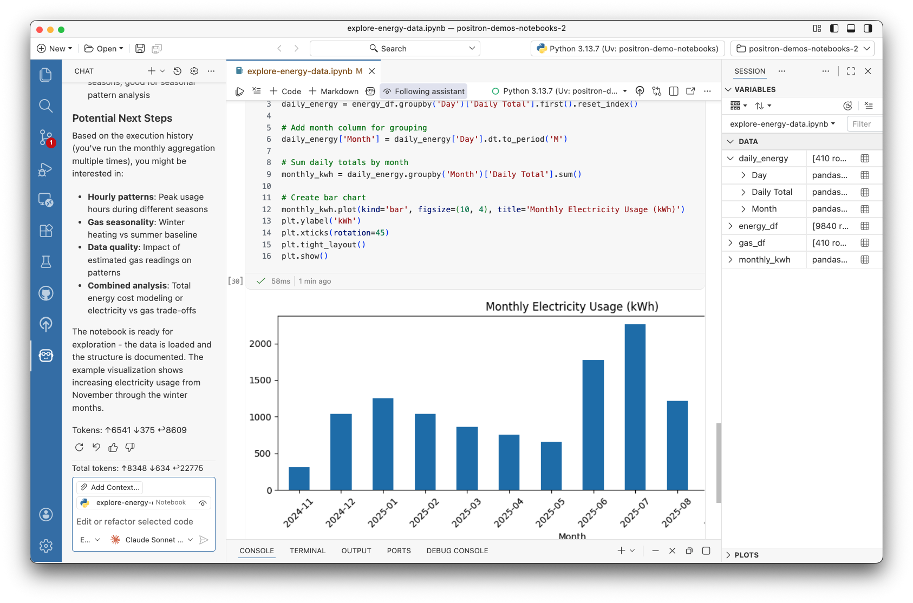

Positron now ships with a native [Jupyter Notebook Editor](https://positron.posit.co/positron-notebook-editor.html), a new unified experience we built from the ground up for working with Jupyter notebooks within Positron.

## Why we built our own notebook editor

We built the Positron Notebook Editor to treat your .ipynb files as first-class citizens in an IDE tailored specifically for data science workflows.

Up to this point, Positron used the [legacy Code OSS notebook editor](https://positron.posit.co/legacy-notebook-editor.html) that powers VS Code. While functional, this editor was designed for general-purpose development and not specifically for data science workflows. The tradeoffs show up in small ways that compound over time: limited context for AI assistance, no deep integration with your variables or data, and a user experience that treats `.ipynb` files as just another file type.

We wanted notebooks to feel like a first-class part of a data science IDE, so we built our own native notebook editor.

If you missed the [original February announcement](https://posit.co/blog/announcing-the-positron-notebook-editor-for-jupyter-notebooks/), that post covers our initial reasoning in more detail.

## What's included out of the box

The Positron Notebook Editor brings the core capabilities of Positron directly into your notebook workflow:

**[Variables Pane](https://positron.posit.co/variables-pane.html)**: Variables update in real time as you run cells. No need to print or inspect manually.

**[Data Explorer](https://positron.posit.co/data-explorer.html)**: When a cell returns a Pandas or Polars DataFrame, you get an inline data viewer. Open the full Data Explorer to sort, filter, and profile your data. Any filtering or cleaning you do can be converted into code, so your analysis stays reproducible without writing repetitive `df.head()` or `df.describe()` calls.



**[AI Assistant](https://positron.posit.co/assistant.html)**: The Assistant has access to your notebook's full context, including cell states, execution history, and outputs like images and tables. It can suggest edits, reorder cells, and run code with your permission. You can inspect exactly what context it's using and follow along as it works.



**[Help Pane](https://positron.posit.co/help-pane.html)**: Python and R documentation is available inline, with hyperlinks, without switching to a browser.



**[Publisher](https://positron.posit.co/publish-to-connect.html)**: Deploy your `.ipynb` notebooks directly to Connect or Connect Cloud, where you can manage access, schedule runs, and view telemetry.



## A sample notebook workflow

Now that you have all these capabilities in one place, your workflow might look something like this:

1. Import your data using Pandas or Polars.
2. Run your notebook cells and watch variables update in the pane as cells run.
3. Explore your DataFrame in the inline Data Explorer. Sort and filter without writing any code.
4. Use Assistant to generate a visualization based on your filtered data or AI quick actions to recommend next steps.
5. When the analysis is ready to share, use an AI action to add markdown headers and notes.
6. Publish the notebook to Connect or Connect Cloud to share with your colleagues.

## What's coming next

The roadmap includes SQL support, improved version control, R improvements, and more. You can view and vote on items in the [GitHub roadmap](https://github.com/posit-dev/positron/issues?q=is%3Aissue%20state%3Aopen%20label%3A%22area%3A%20notebooks-jupyter%22).

## Get started with the alpha

1. [Download Positron](https://positron.posit.co/download.html) and install a release from February 2026 or later.
2. Enable the alpha by setting [`positron.notebook.enabled`](positron://settings/positron.notebook.enabled) to `true` in your settings.
3. Try the [tutorial repository](https://github.com/posit-dev/positron-demos-notebooks) for examples that use the new features.
4. Share feedback in [GitHub Discussions](https://github.com/posit-dev/positron/discussions) or [book time to talk with us directly](https://scheduler.zoom.us/cindy-tong/improving-the-positron-notebook-experience).

We're excited to hear how you use the Positron Notebook Editor as we continuously improve the experience.