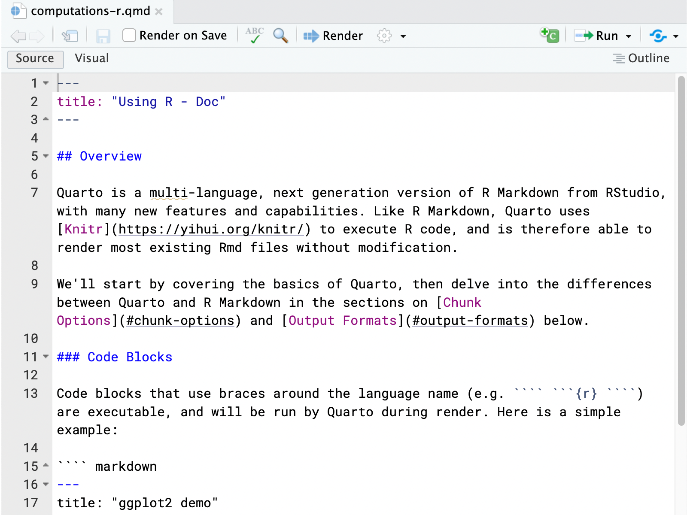
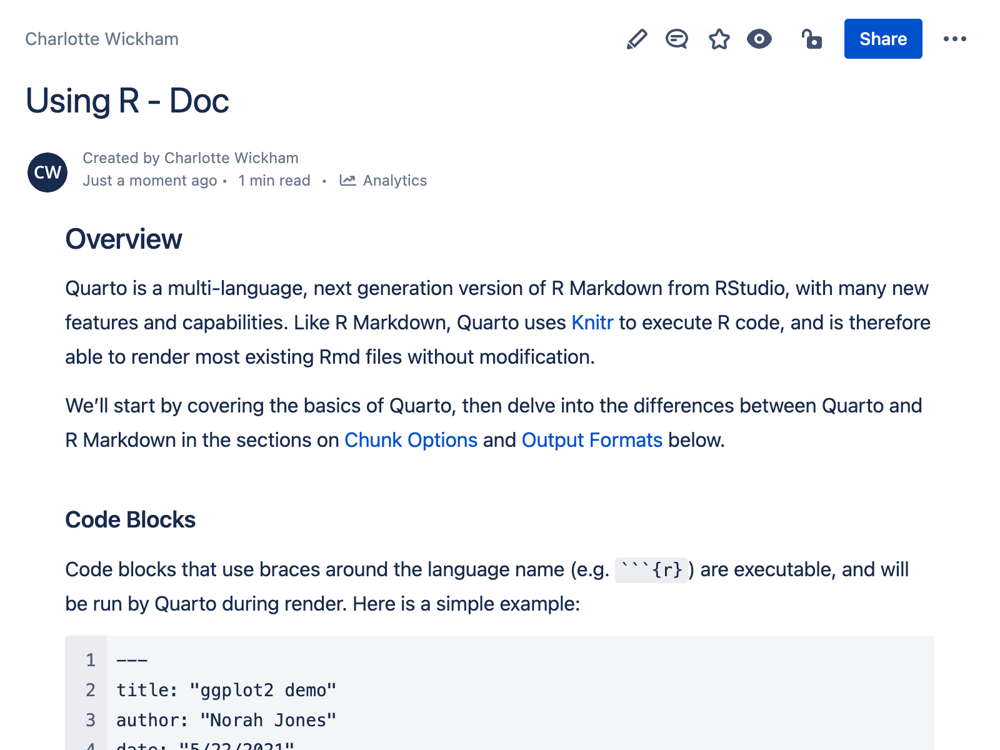
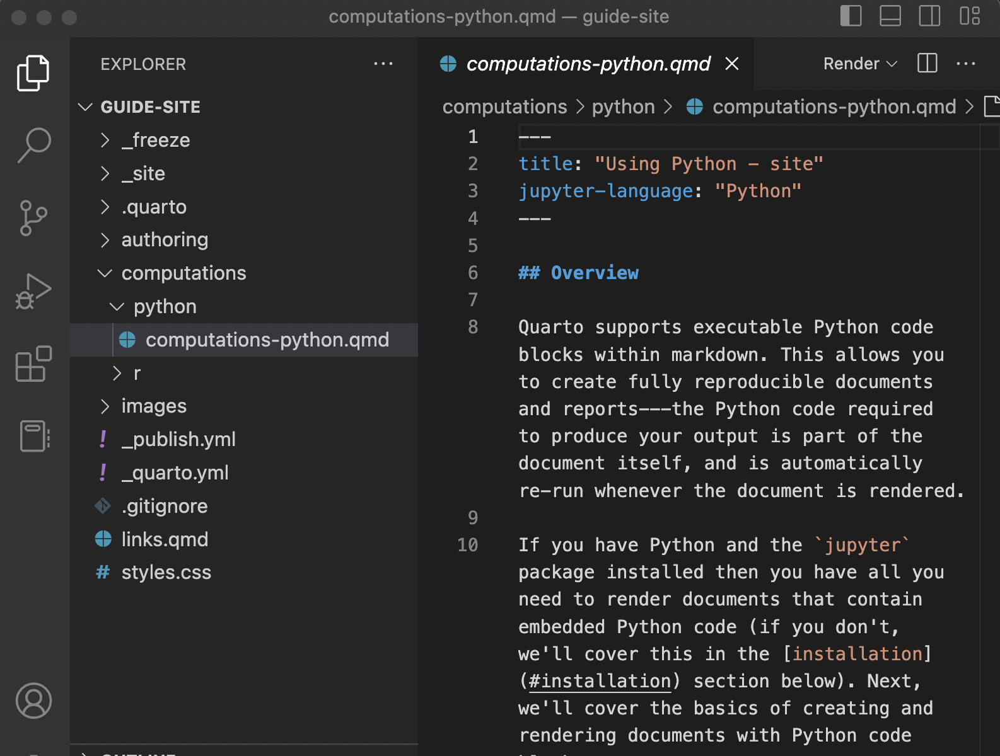
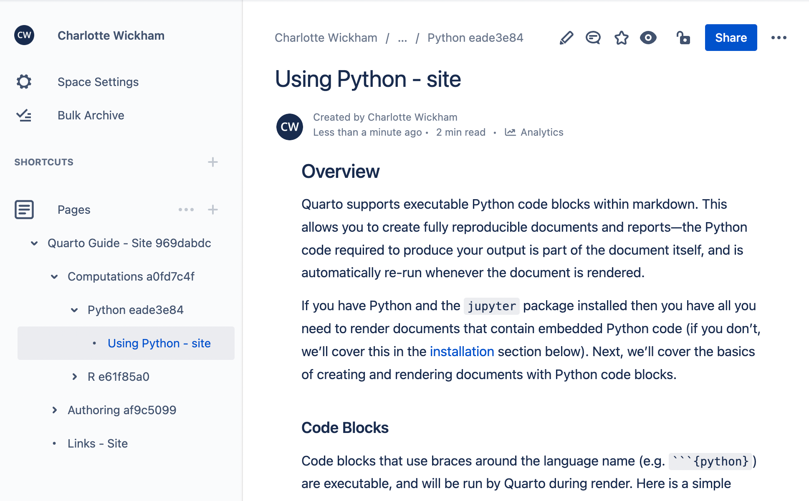

Quarto 1.3 Feature

This post is part of a series highlighting new features in the 1.3 release of Quarto. Get the latest release the [download page](https://quarto.org/docs/download/)

[Atlassian Confluence](https://www.atlassian.com/software/confluence) is a publishing platform for supporting team collaboration. Confluence has a variety of hosting options which include both free and paid subscription plans.

Quarto 1.3 adds support for publishing individual documents, as well as projects composed of multiple documents into [Confluence Spaces](https://support.atlassian.com/confluence-cloud/docs/use-spaces-to-organize-your-work/).

<figure>

<figcaption aria-hidden="true">A Quarto Document</figcaption>
</figure>

<figure>

<figcaption aria-hidden="true">Published to Confluence</figcaption>
</figure>

<figure>

<figcaption aria-hidden="true">A Quarto Project</figcaption>
</figure>

<figure>

<figcaption aria-hidden="true">Published to Confluence</figcaption>
</figure>

Managing Confluence content with Quarto allows you to author content in Markdown, manage that content with your usual version control tools like Git and GitHub, and leverage Quarto's tools for including computational output.

<!-- Quick overview of key features: new format and project type, local preview, `quarto publish confluence`. -->

If you're curious about using Confluence Publishing for your own project, head to the [Confluence Publishing page](https://quarto.org/docs/publishing/confluence.html) of the pre-release highlights to learn more.
