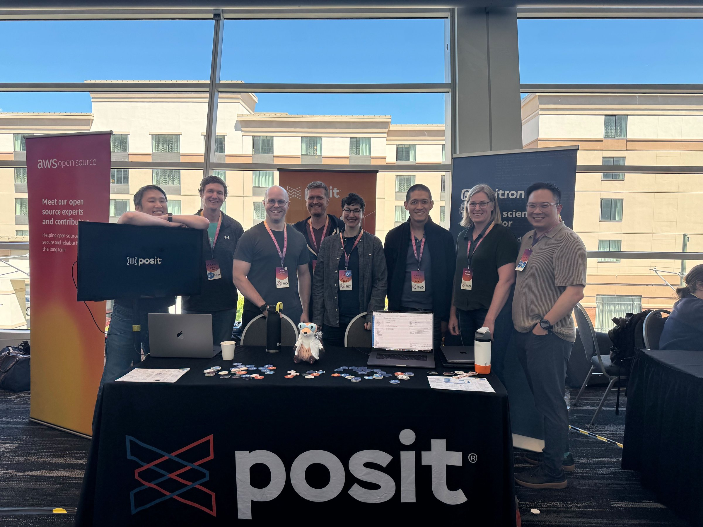

**The Shiny Team was at SciPy 2025!**
If you missed us at [SciPy 2025](https://www.scipy2025.scipy.org/) here's what we were up to.

<figure>

<figcaption aria-hidden="true">posit shiny team at our scipy booth</figcaption>
</figure>

We just got back from a week at [SciPy 2025](https://www.scipy2025.scipy.org/) and had a great time meeting and talking with folks at the conference.
If you didn't get a chance to say hi to us,
you can also find us online on [<i></i> GitHub](https://github.com/posit-dev/py-shiny) or
[<i></i> Discord](https://discord.com/invite/yMGCamUMnS).
You can also learn more about Posit at [<i></i> posit.co](https://posit.co).

If you missed a tutorial or talk we have all the information below.
You'll have to wait a bit for the SciPy folks to get all the tutorials and talks uploaded to [<i></i> Youtube](https://www.youtube.com/@SciPy-Conf/videos).

## Talks by Posit Folks

### Shiny for Python: Building Production-Ready Dashboards in Python

**Speaker:** Daniel Chen

[SciPy talk page](https://cfp.scipy.org/scipy2025/talk/HEHW8W/) · [Slides](https://github.com/chendaniely/scipy-2025-shiny)

Shiny is a framework for building web applications and data dashboards
in Python. In this workshop, you will see how the basic building blocks of shiny
can be extended to create your own scalable production-ready python applications.

At the end of this course you will be able to:

- Build a Shiny app in Python,
- How to integrate LLMs that can transparently work on your data
- Write unit tests and end-to-end tests for your shiny application,
- Deploy and share your application (for free!).

### Keeping LLMs in Their Lane: Focused AI for Data Science and Research

**Speaker:** Joe Cheng

[SciPy talk page](https://cfp.scipy.org/scipy2025/talk/WM9UFJ/) · [Slides](https://github.com/jcheng5/SciPy-2025)

LLMs are powerful, flexible, easy-to-use... and often wrong. This is a
dangerous combination, especially for data analysis and scientific research,
where correctness and reproducibility are core requirements.

Fortunately, it turns out that by carefully applying LLMs to narrower use
cases, we can turn them into surprisingly reliable assistants that
accelerate and enhance, rather than undermine, scientific work.

This is not just theory---I'll showcase working examples of seamlessly
integrating LLMs into analytic workflows, helping data scientists build
interactive, intelligent applications without needing to be web developers.
You'll see firsthand how keeping LLMs focused lets us leverage their
"intelligence" in a way that's practical, rigorous, and reproducible.

This talk is for Python data scientists, researchers, and developers looking
to integrate AI into their work in a practical, responsible way---or skeptical
that it's even possible.

### User guides: engaging new users, delighting old ones

**Speaker:** Michael Chow

[SciPy talk page](https://cfp.scipy.org/scipy2025/talk/NRMNDX/) · [Slides](https://docs.google.com/presentation/d/149UwdljTilauGPm0AXkROm9ArTcMfBfOVxgxaEnjSbQ/)

User guides are the piece you often hit right after clicking the "Learn" or
"Get Started" button in a package's documentation. They're responsible for
onboarding new users, and providing a learning path through a package.
Surprisingly, while pieces of documentation like the API Reference tend to
be the same, the design of user guides tend to differ across packages.

In this talk, I'll discuss how to design an effective user guide for open
source software. I'll explain how the guides for Polars, DuckDB, and FastAPI
balance working end-to-end like a course, with being browsable like a
reference.

### From One Notebook to Many Reports: Automating with Quarto

**Speaker:** Charlotte Wickham

[SciPy talk page](https://cfp.scipy.org/scipy2025/talk/LNWCSE/) · [Slides](https://cwickham.github.io/one-notebook-many-reports/)

Would you rather read a "Climate summary" or a "Climate summary for *exactly
where you live*"? Producing documents that tailor your scientific results to
an individual or their situation increases understanding, engagement, and
connection. But, producing many reports can be onerous.

If you are looking for a way to automate producing many reports, or you
produce reports like this but find yourself in copy-and-paste hell, come
along to learn how Quarto solves this problem with parameterized reports -
you create a single Python notebook, but you generate many beautiful
customized PDFs.
