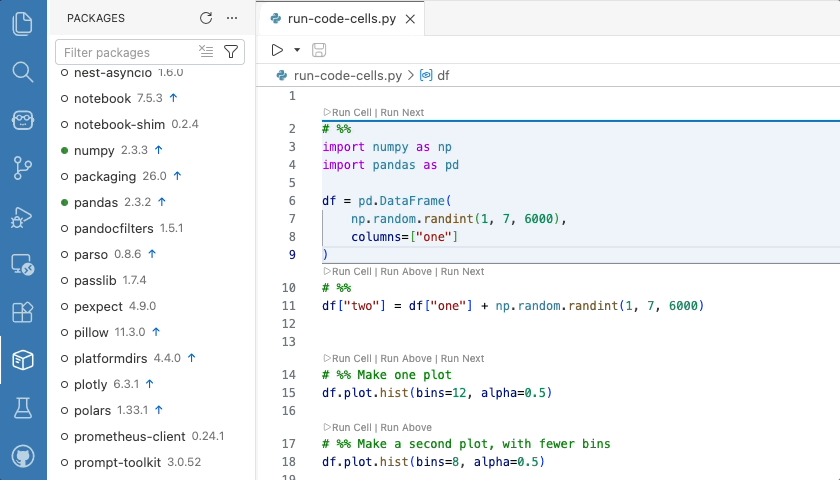
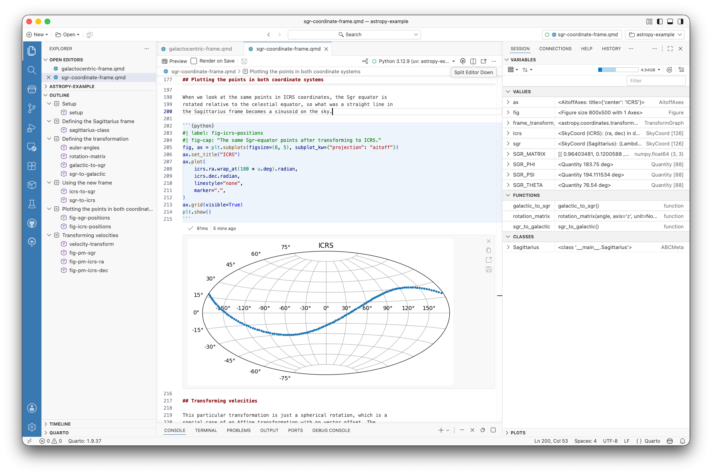
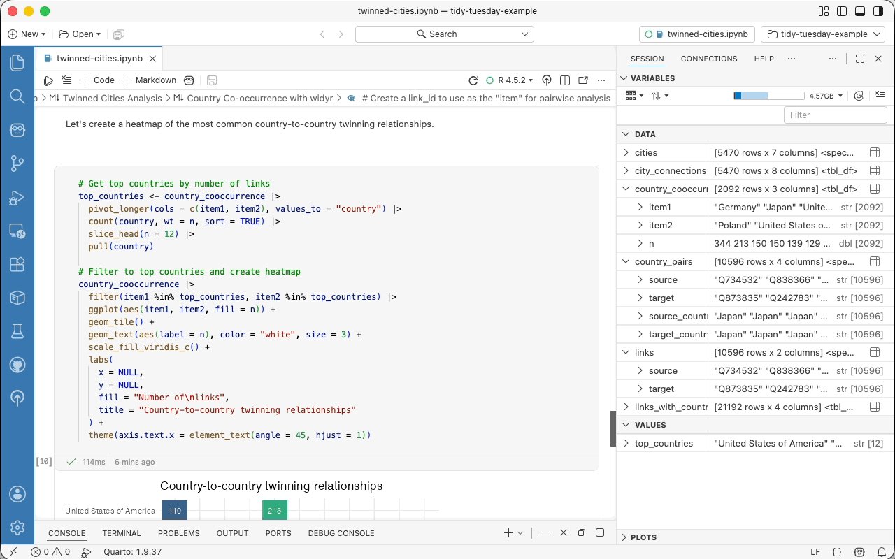

<!--
TODO:
- [ ] Add image (1920×1080 PNG or JPG) and image-alt
- [ ] Trim topics, software, and languages to only what applies
- [ ] Open a PR against main for a Netlify preview
-->

Welcome back to another edition of our monthly Positron updates! Each month we share highlights from our latest release and useful resources.

## Product updates

### Announcing the Packages pane

Our Packages pane is available in this release as a preview feature. The new Packages pane brings streamlined package management directly into the IDE so you can see at a glance what's installed, what's attached, and what's out of date.

{fig-alt="The Positron Packages pane in the Primary Sidebar, showing installed packages with attach status and a search field; the user attaches a package and the row updates to show it as attached."}

Find it in the Primary Sidebar by clicking the package icon. Positron automatically detects and integrates with your current interpreter; today we have support for pip, venv, uv, and conda for Python, plus base R, pak, and renv for R. You can search, sort, install, update, remove, filter by category (including "Outdated Packages"), and even see which packages are attached in your current session. To hide the pane, disable [`positron.packages.enable`](positron://settings/positron.packages.enable). [Let us know](https://github.com/posit-dev/positron/discussions) how it fits into your workflow.

### Inline output for Quarto

Inline output for `.qmd` documents was one of Positron's most-requested features ever, with many users telling us it was the one thing keeping them tied to RStudio or Jupyter notebooks. We are happy to share that Quarto inline output is available this release as a preview feature.

{fig-alt="A Quarto document open in Positron showing inline output beneath an executed code cell, with an execution status line indicating runtime."}

Quarto kernels start automatically when you open a document with inline output, so you don't wait for a kernel on first execution. Each inline output cell shows a status line with execution status and elapsed time, and outputs are now collapsible when they get long. We've also added a tool to switch the interpreter used for inline output, support for _Show Notebook Console_ for Quarto documents, and fixed a handful of papercuts around execution indicators, autocompletion, and the kernel selector. Enable inline output via the [`positron.quarto.inlineOutput.enabled`](positron://settings/positron.quarto.inlineOutput.enabled) setting.

### Extensions available from Posit Public Package Manager

Positron's extension gallery now uses [Posit Public Package Manager](https://p3m.dev) (P3M) by default, replacing Open VSX as the source for browsing and installing extensions. The catalog is the same set of extensions you already use, served from Posit infrastructure for reliable distribution. If you prefer to stay on Open VSX, the new [`positron.extensions.gallerySource`](positron://settings/positron.extensions.gallerySource) setting lets you switch back at any time. For organizations on Posit Workbench, [Posit Package Manager also added support for mirroring and serving VS Code extensions](https://posit.co/blog/manage-vs-code-extensions-like-packages-with-posit-package-manager-2026-04-0/) from your own instance, bringing the same governance, security, and air-gapped distribution to extensions that you already have for R and Python packages.

### Positron Notebook Editor is now in beta

The Positron Notebook Editor for `.ipynb` files is officially moving from alpha to beta.

{fig-alt="Working with an R Jupyter notebook in the Positron Notebook Editor."}

This release brings a wave of polish and reliability we hope makes it ready for your daily workflow:

- **Cleaner git diffs by default:** New [`notebook.save.outputs`](positron://settings/notebook.save.outputs) and [`notebook.save.executionCounts`](positron://settings/notebook.save.executionCounts) settings let you exclude outputs and execution counts from saved notebook files so reviewers see only the relevant code changes.

- **Stronger R support:** R notebooks can now be debugged with breakpoints and the "Debug Cell" action, and R dataframe outputs in notebook cells now render in the inline Data Explorer for the same interactive exploration you get in the Console.

- **Help on F1:** Pressing <kbd>F1</kbd> on a function in a notebook cell now opens the Help pane, just like in `.py` and `.R` files. Works for both Python and R Jupyter notebooks.

- **UX polish:** Long cell outputs default to scrolling instead of overwhelming the page, the cell action bar stays visible as you scroll through tall cells, markdown cells render footnotes, and your scroll position is preserved when switching between notebook tabs.

### AI chat and code assistance

This release introduces two new AI options: Posit Assistant and Posit AI.

- You may have tried some of our previous experiments for AI code assistance available in Positron, Positron Assistant and/or Databot. We are now migrating to a more data-science-specific, holistic, unified approach to AI chat, built on the same Posit Assistant interface that [we recently brought to RStudio](https://posit.co/blog/introducing-ai-in-rstudio/). We acknowledge that the number of different tools we've made available and how their names have evolved have been pretty confusing, but this space is changing fast and our initial experiments have helped us understand the best ways to integrate AI into your data science workflow. With Posit Assistant, instead of switching between tools, you get code generation, next edit suggestions, chat, and agentic tools all in one place. [Learn how to get started](https://posit-dev.github.io/assistant/docs/downloads/positron/).

- [Posit AI](https://posit.co/products/ai) is a new, optional model provider service available to use with Posit Assistant. Posit AI is a subscription priced at $20/month for individual users; both Positron and Posit Assistant remain free to use. [Learn how to sign up for an account](https://posit.co/products/ai).

This release also provides additional improvements to the broader Assistant experience. Each Assistant response now shows which model generated it, so you always know whether you're getting output from Claude, GPT-5, or another provider. We also improved the documentation and error handling for Microsoft Foundry and prompt caching for AWS Bedrock.

## What's coming next

- [Last release](https://opensource.posit.co/blog/2026-04-07_april-newsletter/), we announced [Positron Server](https://opensource.posit.co/blog/2026-04-06_positron-server-jupyterhub/) for academic use in JupyterHub, making it free to host Positron for teaching. We are now expanding support for Positron Server on Open OnDemand. If you are interested in using Positron for teaching, [follow the instructions](https://opensource.posit.co/blog/2026-04-06_positron-server-jupyterhub/) to get a teaching license and [book time with our team](https://scheduler.zoom.us/cindy-tong/positron-education) to discuss your use case.
- We're prototyping first-class SQL editing and execution in Positron, including support for visualizations with [ggsql](https://opensource.posit.co/blog/2026-04-20_ggsql_alpha_release/). We'll share more as this takes shape, and in the meantime, [let us know](https://github.com/posit-dev/positron/issues/7233 ) your thoughts and current pain points.
- Join [our next webinar](https://posit.co/webinar/compliance-without-friction-mastering-the-persistent-analysis-lifecycle) on May 12 to learn how Positron, Workbench, Connect, and Package Manager work together in the reproducible analysis lifecycle.

::: {.callout-tip}
[Download Positron](https://positron.posit.co/download) to try out the new features and improvements in this release!
:::