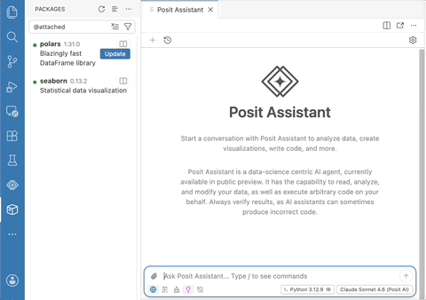
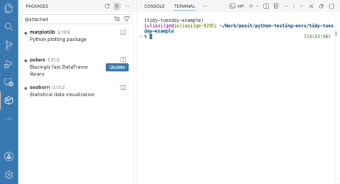
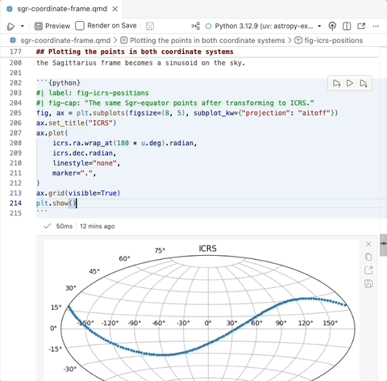

Note

[Positron](https://positron.posit.co) is Posit's new, next-generation IDE for data science. Positron is designed to be an extensible, polyglot tool for exploring data and reproducible authoring in Python, R, and more.

Welcome back to another edition of our monthly Positron updates! Each month we share highlights from our [latest release](https://positron.posit.co/release-notes) and useful resources.

## Posit Assistant

[Last release](https://opensource.posit.co/blog/2026-05-11_positron-2026-05-release/) we introduced [Posit Assistant](https://pos.it/assistant), our unified, data-science-focused approach to AI assistance. This release continues that work, and we want to give you advance notice that the older Positron Assistant will be deprecated in the next release. If you are still using Positron Assistant, we encourage you to migrate to Posit Assistant now.

Important

During this migration period, you will likely want to keep both the old [`positron.assistant.enable`](positron://settings/positron.assistant.enable) setting and the new [`assistant.enabled`](positron://settings/assistant.enabled) set to true for best functionality, but do be aware that the older setting is in the process of being deprecated.

Posit Assistant supports the same broad set of providers as Positron Assistant, along with the Posit AI model provider and new experimental support for Google Vertex. Learn more about the differences between the new Posit Assistant and the older Positron Assistant:



You may also be interested in [comparing Posit Assistant and Claude Code](https://youtu.be/7GI6-4J0AXA).

New in Posit Assistant this release, you can use the Posit AI model provider for Next Edit Suggestions, which propose your likely next change as you edit. You can also access the **Configure Language Model Providers** item in the accounts menu. You can [ask a question, report a bug, or request a new feature](https://github.com/posit-dev/assistant-feedback) for Posit Assistant separately from Positron now, but don't worry too much about where to send your feedback; we will help route it to the right place!

## Packages pane improvements

We introduced the [Packages](https://positron.posit.co/packages-pane) pane last release, and this release makes it more informative and flexible. A **Show Help** button and context menu entry on every package take you straight to its documentation in the [Help pane](https://positron.posit.co/help-pane). You can now combine category filters as an intersection, so you can narrow the list to, for example, packages that are both attached and outdated. A new **Item Size** toggle lets you switch between a compact row view and a richer card view that surfaces package descriptions and other metadata.

For R users, the new [`packages.r.installer`](positron://settings/packages.r.installer) setting controls whether installs, updates, and removals use pak, base R, or an automatic choice. The setting that controls the pane has been renamed to [`packages.enabled`](positron://settings/packages.enabled); the previous `positron.packages.enable` setting is deprecated but still honored.

## Inline output for Quarto

[Inline output for `.qmd` documents](https://positron.posit.co/quarto-inline-output) was one of Positron's most-requested features ever, and it is now out of preview. A new toolbar button in Quarto documents gives you one-click access to running cells, managing inline output, and showing the console.

Inserting code into a Quarto document from the History pane now automatically wraps it in cell markup when you drop it into a prose region. You can opt into inline output with the [`positron.quarto.inlineOutput.enabled`](positron://settings/positron.quarto.inlineOutput.enabled) setting.

## Faster startup

We continue to invest in performance improvements, and Positron starts up even faster in this release. Positron now caches previously discovered system interpreters, dramatically speeding up startup in new folders and projects; you can control this with the new [`interpreters.discoveryCache.enabled`](positron://settings/interpreters.discoveryCache.enabled) setting. On Windows, we fixed multi-minute startup delays by skipping slow `PATH` discovery by default, governed by the new [`positron.r.interpreters.pathDiscoveryMode`](positron://settings/positron.r.interpreters.pathDiscoveryMode) setting. We also fixed an occasional hang at "Preparing" when starting Positron after updating to a new version.

## A more customizable interface

This release gives you finer control over Positron's chrome so you can tailor the interface to your workflow. Several layout settings that previously weren't always honored now work as expected:
- [`workbench.topActionBar.visible`](positron://settings/workbench.topActionBar.visible) reliably hides and shows the top action bar at runtime
- [`workbench.secondarySideBar.defaultVisibility`](positron://settings/workbench.secondarySideBar.defaultVisibility) is respected when you set it explicitly
- [`workbench.secondarySideBar.showLabel`](positron://settings/workbench.secondarySideBar.showLabel) lets Secondary Side Bar items render as compact icons

You can also enable [`window.commandCenter`](positron://settings/window.commandCenter) to bring the command center into the title bar. Learn more about some of our own team members' favorite customizations:



## R language intelligence

Positron's R language support now understands symbols within a file. You can rename a local symbol and have every use of it updated at once, and Go to Definition and Find References now work for local symbols, so you can jump to where a variable is defined (such as via `<-` or a function parameter) or see everywhere it is used within a function. Renaming symbols across files is not yet supported, but it is coming soon.

## What's coming next

- We have some exciting milestones planned for our July release! The [new notebook editor for `.ipynb` files](https://positron.posit.co/positron-notebook-editor.html), the [Packages pane](https://positron.posit.co/packages-pane.html), and [Posit Assistant](https://pos.it/assistant) will all come out of preview to general availability. We are thrilled for these features to be ready for your production workflows, and we hope you will give them a try and [share your feedback](https://github.com/posit-dev/positron/discussions).
- We're still prototyping first-class SQL editing and execution in Positron, including support for visualizations with [ggsql](https://opensource.posit.co/blog/2026-04-20_ggsql_alpha_release/). We'll share more as this takes shape, and in the meantime, [let us know](https://github.com/posit-dev/positron/issues/7233) your thoughts and current pain points!
- If you will be at the Databricks Data + AI Summit next week, [join us](https://posit.co/events/databricks-data-ai-summit-2026) to learn about using Positron and Workbench within the Databricks platform.
- We are looking forward to posit::conf(2026) in September, where our team will have several sessions on Positron. The [conference program](https://posit.co/blog/posit-conf-2026-agenda-breakdown) was released last week and we are pretty excited about everything happening! [Register now](https://conf.posit.co/2026/) to join us in person in Houston or virtually from anywhere in the world.

Tip

[Download Positron](https://positron.posit.co/download) to try out the new features and improvements in this release!

