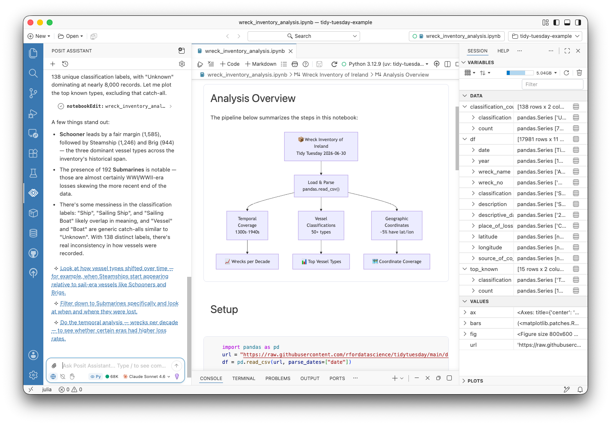
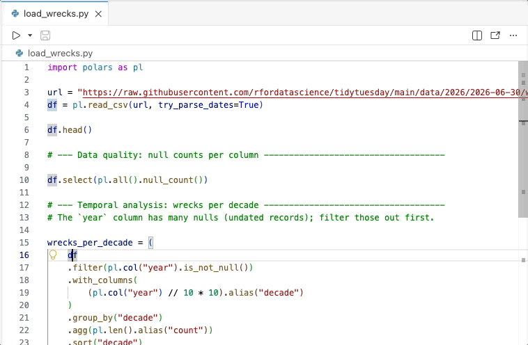

::: {.callout-note}
[Positron](https://positron.posit.co) is Posit's new, next-generation IDE for data science. Positron is designed to be an extensible, polyglot tool for exploring data and reproducible authoring in Python, R, and more.
:::

Welcome back to another edition of our monthly Positron updates! Each month we share highlights from our [latest release](https://positron.posit.co/release-notes) and useful resources. [Last release](https://opensource.posit.co/blog/2026-06-08_positron-2026-06-release/) we told you that several major features were on track to leave preview in July, and the time is now here! The new Notebook editor, the Packages pane, and Posit Assistant are all now generally available.

## Positron Notebook Editor

Positron's [new Notebook editor](https://positron.posit.co/positron-notebook-editor) is now the default experience for Jupyter (`.ipynb`) files. This release brings a long list of additions, including split-pane editing, cell tag management, and executing a line or selection within a cell with <kbd>Cmd/Ctrl+Shift+Enter</kbd>. You can export notebooks to Quarto, Python, or R, and inline PDF rendering makes it easier to work with generated output. If you are coming from JupyterLab, you will find familiar keyboard shortcuts, and we have improved output fidelity for Mermaid diagrams, htmlwidgets, and ipywidgets.

{fig-align="center" fig-alt="The Notebook editor in Positron, showing a Jupyter notebook with a Mermaid diagram."}

Posit has built on and for the Jupyter ecosystem for years now, and we are excited to have recently [joined the Jupyter Foundation](https://opensource.posit.co/blog/2026-06-25_posit-joins-jupyter-foundation/).

## Packages pane

The [Packages pane](https://positron.posit.co/packages-pane) has also come out of preview. It gives you a live view of the R and Python packages installed in your active session, so you can search, install, update, and remove packages, and jump to their documentation, without leaving Positron.

{fig-align="center" fig-alt="The Packages pane in Positron, showing installed Python packages with a detail editor."}

This release also makes the pane more capable. Clicking a package opens a detail editor with its overview, metadata, and actions, similar to the Extensions pane. Installing a package searches results as you type, and each row has a button that opens the package's website. Update indicators appear immediately on a new session from a cached snapshot, and **Update All Packages** reports exactly what changed. Package operations keep your environment consistent too, resolving against a workspace `requirements.txt` for Python and updating the `renv.lock` snapshot for R.

## Posit Assistant

[Posit Assistant](https://pos.it/assistant), our unified, data-science-focused approach to AI assistance, is now out of preview and generally available; Posit Assistant fully replaces the legacy Positron Assistant. We know the names are similar, and Joe Cheng [recently walked through a bit of the story behind how our AI agent tools have evolved](https://opensource.posit.co/blog/2026-06-11_history-of-posit-data-science-agents/).

This release also gives you finer control over AI in Positron. The new [`ai.enabled`](positron://settings/ai.enabled) setting turns off every Positron AI feature at once, and administrators can enforce it; [`notebook.ai.enabled`](positron://settings/notebook.ai.enabled) does the same for notebooks specifically. The set of language model providers keeps growing, with DeepSeek joining as an experimental provider and Microsoft Foundry reaching general availability. The configuration modal now shows every provider by default with preview and experimental badges.

## Data Explorer

The [Data Explorer](https://positron.posit.co/data-explorer) can now open Excel workbooks directly, with no code required, without first needing to load it via Python or R. Sort, filter, and profile columns, switch between worksheets, and toggle whether the first row holds column names. An **Open in Excel** button opens the workbook in your native spreadsheet application.

This release broadens what you can open in the Data Explorer overall. Backed by a native DuckDB engine, it now also previews compressed CSV, TSV, and Parquet files. Also, a new **Open in Data Explorer** code action, from the editor lightbulb or <kbd>Cmd+.</kbd>, opens the data frame under your cursor in R, Python, and Quarto files, so you can jump straight from your code to exploring your data.

{fig-align="center" fig-alt="The Open in Data Explorer code action in Positron, showing a lightbulb menu in a Python file with the option to open a data frame in the Data Explorer."}

## R language intelligence

Last release we introduced within-file symbol resolution for R; this release expands it across files. Go to Definition, Find References, and Rename Symbol now work across the packages and scripts in your workspace, and diagnostics and workspace symbols react to external file changes so your language intelligence stays in sync as your project evolves.

## What's coming next

- New in preview this release, Data Connections lets you browse the schemas, tables, views, and indexes of a database, open tables in the Data Explorer, and generate connection code. It currently supports DuckDB, PostgreSQL, and SQLite. Learn how to try it out and tell us what you think in the [Data Connections discussion post](https://github.com/posit-dev/positron/discussions/14571): which databases and warehouses you need, whether the connection setup is clear, and anything confusing, missing, or broken.
- We are looking forward to posit::conf(2026) in September, where our team will have several sessions on Positron. [Register now](https://conf.posit.co/2026/) to join us in person in Houston or virtually from anywhere in the world.

::: {.callout-tip}
[Download Positron](https://positron.posit.co/download) to try out the new features and improvements in this release!
:::
