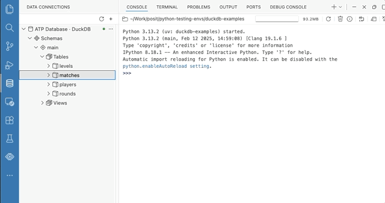
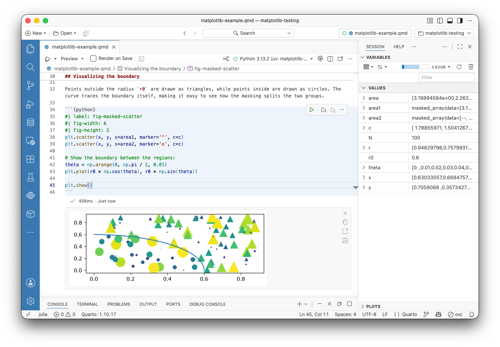
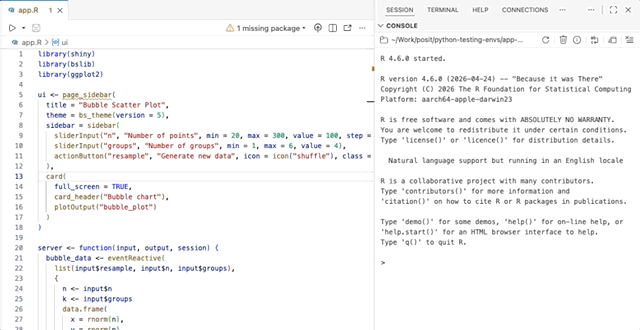

Note

[Positron](https://positron.posit.co) is Posit's new, next-generation IDE for data science. Positron is designed to be an extensible, polyglot tool for exploring data and reproducible authoring in Python, R, and more.

Welcome back to another edition of our monthly Positron updates! Each month we share highlights from our [latest release](https://positron.posit.co/release-notes) and useful resources. [Last release](../../blog/2026-07-13_positron-2026-07-release/) we told you about several major features that came out of preview to general availability, including the [new notebook editor](../../blog/2026-07-29_positron-jupyter-notebook-editor-ga/). This milestone we are excited to share new functionality for SQL support, reproducible authoring, helping you know when packages are missing, and more.

## Data Connections

Data Connections is our new way to work with SQL and database-like resources in Positron, from local files and database servers to cloud data warehouses. It is currently available as a preview feature, and you can enable it with the [`dataConnections.enabled`](positron://settings/dataConnections.enabled) setting. This release more than doubles the number of data sources you can reach. Amazon Redshift, Snowflake, Databricks, and Posit Connect pins join the existing DuckDB, PostgreSQL, and SQLite support.

The panel itself is more capable as well. **Refresh** and **Refresh All** reload the tree while preserving what you have expanded, briefly highlighting the rows that were reloaded. Open connections now show an indicator. Collapsing a connection in the UI keeps you connected to your data source, while anything you've previewed with the Data Explorer stays still open. When you remove a connection, Positron asks for confirmation and reports how many Data Explorers will close with it.

Data Connections is still an experimental preview, and your feedback continues to shape it. Tell us which databases and warehouses you need, and anything confusing, missing, or broken, in the [Data Connections discussion](https://github.com/posit-dev/positron/discussions/14571).

## Inline output for Quarto

[Inline output for `.qmd` documents](https://positron.posit.co/quarto-inline-output) came out of preview last release, and this release brings you a substantial round of polish for this way of working. Be aware that the Quarto settings have moved into a dedicated `quarto.*` namespace with its own group in the Settings editor. The previous `positron.quarto.*` keys still work but are deprecated, and Positron will prompt you to update your settings.

Before a kernel starts, the kernel status names the interpreter it will start and offers an explicit **Start Kernel** action. When a cell fails, **Fix** and **Explain** buttons send the error to [Posit Assistant](https://assistant.posit.co/), matching the Positron notebook experience. The editor also scrolls to reveal output as it is produced, which you can turn off with the new [`quarto.inlineOutput.autoScroll`](positron://settings/quarto.inlineOutput.autoScroll) setting.

Output renders more faithfully as well. The editor gutter now shows which statement is currently executing and per-statement progress. Positron draws images at your display's pixel ratio, so plots are sharp on retina screens, and Python figures now respect the `fig-width` and `fig-height` cell options.

HTML widgets no longer stick in the editor corner when you scroll past them, or trap scrolling instead of letting the document scroll. HTML widgets no longer render as raw HTML after a reload, and collapsed output no longer springs back open when its cell re-runs. Running code in a Quarto document also pins the editor tab now, so Positron does not silently close the document and its session when you open another file.

## AI model providers

Positron now reads AI model provider configuration from a single `providers.json` file rather than a scattered set of settings. The new release will migrate your existing configuration automatically when you start it, and deprecates the `authentication.*` and `positron.assistant.provider.*.enable` settings in favor of it. Two new commands give you direct access: *Open AI Provider Settings (JSON)* opens `providers.json` from the Command Palette, and *Migrate Provider Settings to providers.json* runs the migration on demand.

## Install missing packages

Positron now notices when your code refers to a package you do not have installed and offers to install it for you. The prompt appears for packages referenced by your scripts and notebooks in both R and Python.

A `library()` or `import` call for something missing becomes a single click instead of an error you have to go resolve by hand.

## Performance and memory

We continue to invest in the memory footprint, performance, and reliability of Positron. Several components now load only when they are actually needed, and turning off [`ai.enabled`](positron://settings/ai.enabled) now means Positron never loads some heavy AI-related components at all. We fixed a cluster of long-standing reliability problems around session restarts and lifecycles.

Startup and editing are faster as well. R and Python kernels start much faster on Windows systems with aggressive antivirus software. The interpreter session picker appears immediately instead of waiting for interpreter discovery to finish. We also fixed slow typing, formatting, and saving in long R and Python files.

## What's coming next

- Join [our upcoming webinar](https://posit.co/workflow-demo/ai-governance-workbench) on August 26 to learn about AI governance in Posit Workbench.
- We are looking forward to posit::conf(2026) next month, where our team will have several sessions on Positron. [Register now](https://conf.posit.co/2026/) to join us in person in Houston or virtually from anywhere in the world.

Tip

[Download Positron](https://positron.posit.co/download) to try out the new features and improvements in this release!

