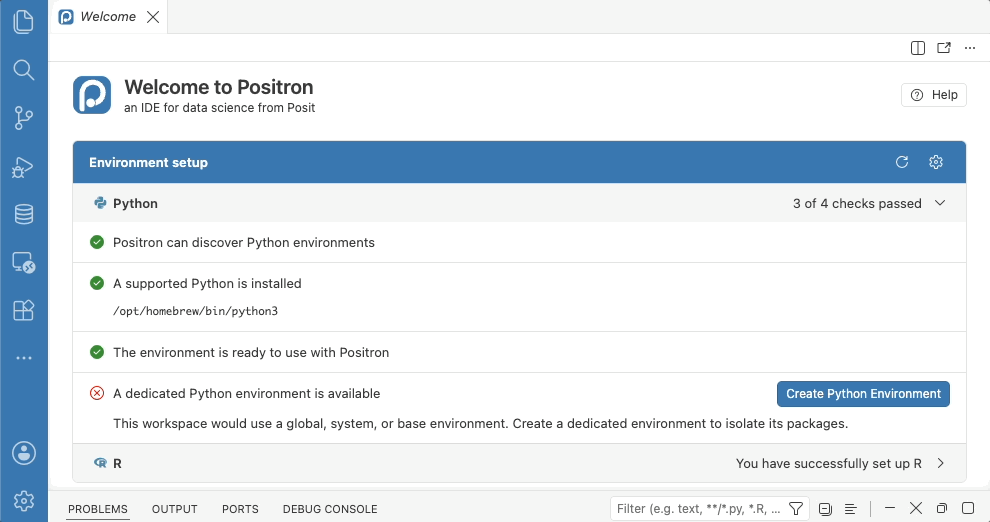
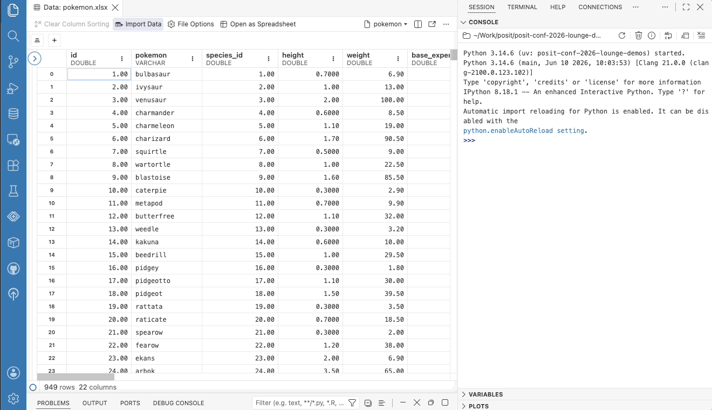
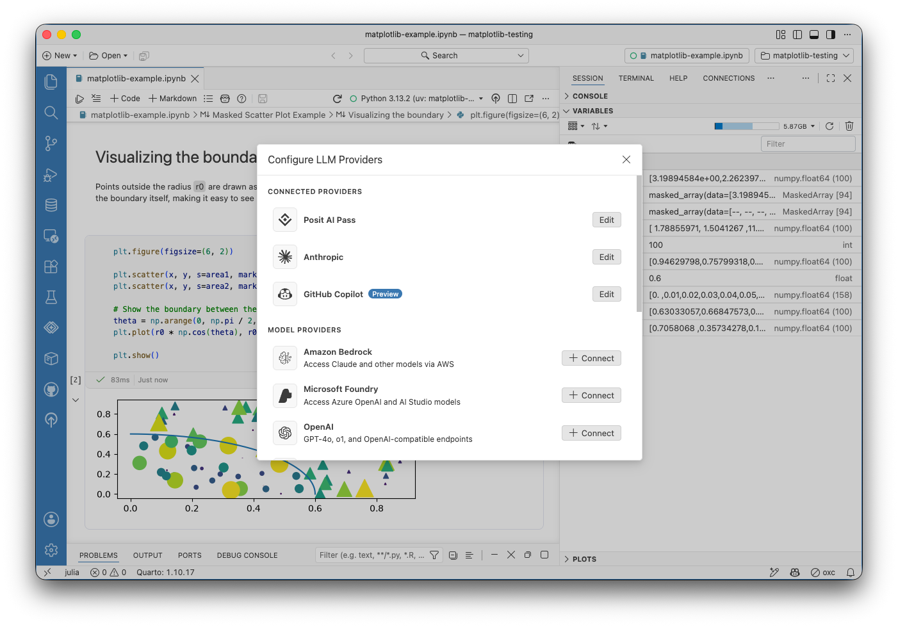
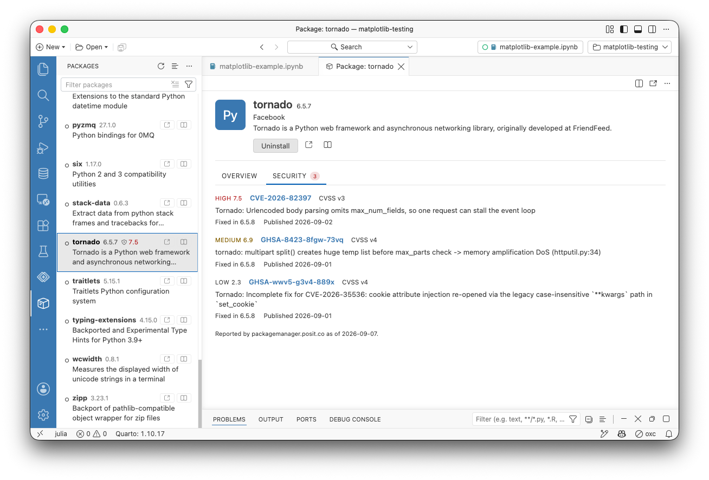

Note

[Positron](https://positron.posit.co) is Posit's new, next-generation IDE for data science. Positron is designed to be an extensible, polyglot tool for exploring data and reproducible authoring in Python, R, and more.

Welcome back to another edition of our monthly Positron updates! Each month we share highlights from our [latest release](https://positron.posit.co/release-notes) and useful resources. [Last release](../../blog/2026-08-13_positron-2026-08-release/) we told you about new Data Connections sources, a round of polish for inline output in Quarto documents, and help installing missing packages. This milestone brings a redesigned welcome page, a first version of Import Data, new Posit Assistant features, expanded Data Connections, package vulnerability scanning, and a more responsive Console.

## Welcome page refresh and interpreter setup

We redesigned the Positron welcome page. It now leads with an environment setup card that checks whether Python and R are ready to use, with actions to help resolve any problem it finds. The Positron badge and name now come with a **Help** button that opens the Help pane, and a banner links to the walkthroughs, including a new "Get Started with Positron" walkthrough that covers the Positron panes, keyboard shortcuts, built-in extensions, and Git.

The environment setup theme continues into interpreter selection itself. When you select a Python managed by your operating system or a package manager, Positron now offers to create a virtual environment for your workspace instead of installing packages into that shared interpreter. With no folder open, the environment Positron creates now lives at `~/.virtualenvs/positron` rather than `~/.venv`, so it stays in the interpreter picker after a restart, and Positron asks before creating an environment in your home directory. We also removed the confusing startup notification that reported no interpreters were found while linking to documentation saying no setup was needed, and interpreters installed under `/opt/python` are now labeled `Global` instead of `Unknown` in the interpreter picker.

## Import Data

Before we started work this month, importing data via the Positron UI was our most upvoted feature request and this release now delivers a first version. When you view a CSV or TSV file in the Data Explorer, a new **Import Data** button in the action bar opens a dialog. The dialog shows the code to load that file into a data frame. You can copy the code, or click **Import** to run it in the console, starting a session if one is not already running.

Import Data supports CSV and TSV files in Python with pandas and in R with the readr package, as well as Excel workbooks and Parquet files (with readxl and nanoparquet in R). The generated code can reproduce the filters and sorts you have applied in the Data Explorer, and it names the file by a workspace-relative path when the file is inside your workspace, so the code is easier to share and rerun. You can open the dialog from the Data Explorer, the File menu, the Variables pane, or the File Explorer context menu.

## Posit Assistant

This release brings a new **Agent Layout** that opens [Posit Assistant](https://pos.it/assistant) in the editor area with a compact Session pane, giving you more visibility into the agent's actions as it works alongside your code. Configuring language model providers also gets a redesign. Our new Configure LLM Providers modal groups providers by connection state, so you can see at a glance which providers are ready to use. If you have trouble with the new dialog and need to switch back, set [`assistant.newProviderModal`](positron://settings/assistant.newProviderModal) to `false`.

You can now configure multiple custom providers, each with its own name, type, endpoint, credential, and model list; the previous single "Custom Provider" option is now called "OpenAI Compatible" to better match what it actually does. Amazon Bedrock users get a smoother experience as well. An expired AWS SSO session can be renewed right from the provider modal instead of requiring `aws sso login` in a terminal, and the AWS profile and region can now be set in the configuration dialog rather than only through environment variables or a hand-edited `providers.json`. Speaking of which, `providers.json` now accepts comments, and your comments survive edits that Positron makes to the file.

## Data Connections

The Data Connections preview keeps growing. A new ODBC data connection driver lets you browse any database with an installed ODBC driver in the Connections pane and open it in the Data Explorer. Data sources already configured on your machine appear automatically. Databricks gains OAuth sign-in on desktop and reads `DATABRICKS_TOKEN`, `DATABRICKS_HOST`, and `DATABRICKS_CONFIG_FILE` credentials managed by Posit Workbench automatically. A **Disconnect** option in the context menu closes a connection and any Data Explorers opened from it, and each data connection driver now gets its own log output channel.

Smaller improvements round out the preview. You can now set [`dataConnections.enabled`](positron://settings/dataConnections.enabled) per workspace, so a repository can turn on the Connections pane for anyone who opens it. The tree is shallower so table and column names get more of the panel's width, and a new [`dataConnections.tree.indent`](positron://settings/dataConnections.tree.indent) setting controls the indentation. DuckDB connections now default to read-only, so the Connections pane and a Python or R session can have the same database open at once; when a lock conflict does happen, the error now explains that another session has locked the database.

## Package security vulnerabilities

The Packages pane now shows known security vulnerabilities (Common Vulnerabilities and Exposures scoring) for installed Python and R packages, so you can see at a glance whether something in your environment has a known CVE. The data comes from your environment's own Posit Package Manager repository when it has one, and from the public Posit instance otherwise, so what you see reflects the same package source your organization already governs.

## A more responsive Console

Console code submission is now faster, always shows visual feedback, and can be canceled while a completeness check is in flight; the Console no longer waits indefinitely with no feedback when a kernel is slow or unreachable. The Console breaks multi-statement input into complete expressions and executes them statement by statement for languages that support it. A new [`console.promptWhenIncomplete`](positron://settings/console.promptWhenIncomplete) setting runs submitted code immediately without a completeness check.

A few more Console fixes are worth knowing about. The Console no longer takes focus at runtime startup when you are working in another view or editor, **Interrupt** stays visible after switching between busy consoles, and session names now ellipsize to fit as the console tab list narrows.

## What's coming next

- posit::conf(2026) is next week! Our team will have several sessions on Positron, and there is still time to [register](https://conf.posit.co/2026/) to join us virtually from anywhere in the world.
- Meet Posit at [CDAO Government](https://posit.co/events/cdao-government-2026) on September 22-23 in Washington, D.C. Stop by our booth to talk data modernization and where agentic AI fits in government.

Tip

[Download Positron](https://positron.posit.co/download) to try out the new features and improvements in this release!

