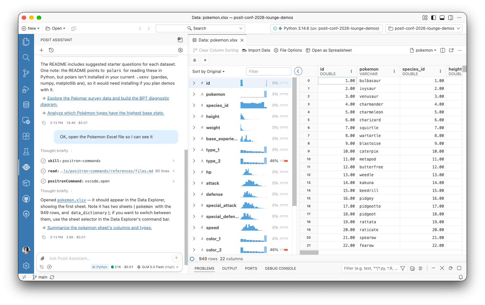
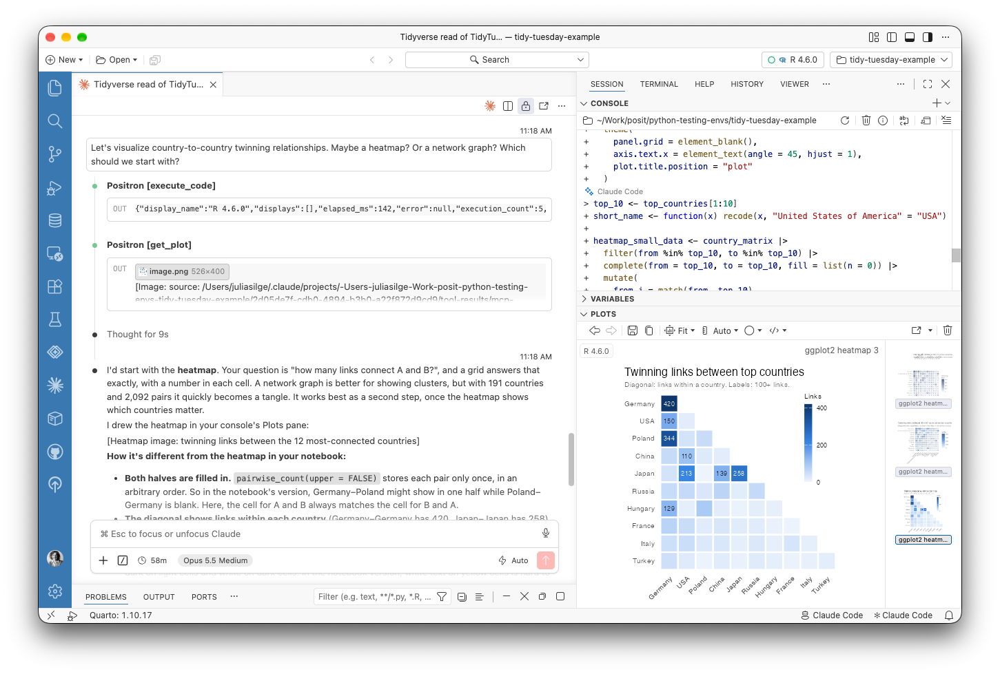
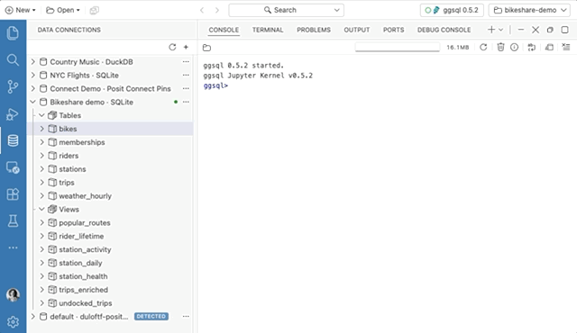
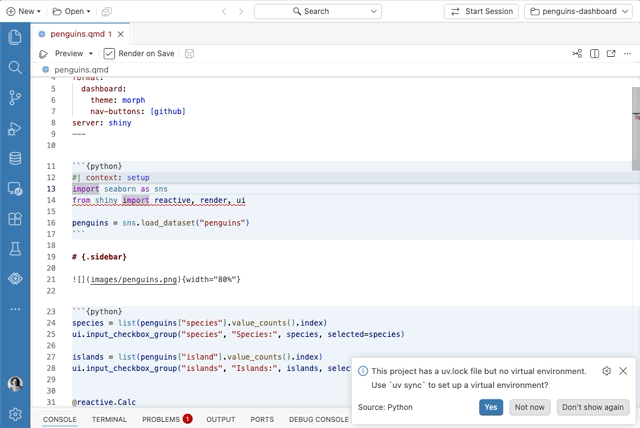

::: {.callout-note}
[Positron](https://positron.posit.co) is Posit's new, next-generation IDE for data science. Positron is designed to be an extensible, polyglot tool for exploring data and reproducible authoring in Python, R, and more.
:::

Welcome back to another edition of our monthly Positron updates! Each month we share highlights from our [latest release](https://positron.posit.co/release-notes) and useful resources. [Last release](/blog/2026-09-09_positron-2026-09-release/) we told you about a redesigned welcome page, a first version of Import Data, new Posit Assistant features, expanded Data Connections, package vulnerability scanning, and a more responsive Console. This milestone brings a new ability for Posit Assistant to drive Positron itself, a built-in MCP server so you can bring your own coding agent, Data Connections on by default, faster language features for Quarto, and smoother interpreter and project setup.

## Posit Assistant can drive Positron

[Posit Assistant](https://pos.it/assistant) can now operate Positron itself, not just the R or Python session inside it. You can ask it to run a Shiny app, open a Parquet file in the Data Explorer, set up a Python environment, browse your data connections, or deploy to Posit Connect. Posit Assistant uses the same source of truth as the Positron UI, so it works with your real interpreters, packages, and connections rather than guessing at them.

{fig-align="center" fig-alt="Positron with the Posit Assistant chat beside the Data Explorer, which shows pokemon.xlsx that Posit Assistant opened."}

In practice, this means Posit Assistant can run and preview Dash, FastAPI, Flask, Gradio, marimo, Streamlit, and Shiny apps with the same app commands you use, see which apps are running along with their status and URL, and stop them. It can show HTML files and URLs in the Viewer pane, and it can read, take screenshots of, and interact with data apps and other content there, which makes it much more useful for checking its own work on an app. It can read your configured and detected Data Connections, browse a connection's schema, and give you the code to open it. It can also tell which interpreter a project uses, explain why an installed interpreter isn't showing up, and make that interpreter available, and it knows the commands for deploying to Connect through Posit Publisher.

To try this preview feature, enable the [`assistant.previewFeatures`](positron://settings/assistant.previewFeatures) setting, and tell us what you think in the [GitHub discussion](https://github.com/posit-dev/positron/discussions/16280).

## Bring your own coding agent

If you already have a favorite coding agent other than Posit Assistant, this release lets it work alongside you in Positron. A new built-in Model Context Protocol (MCP) server lets coding agents such as Claude Code, Codex, and Gemini CLI work in your live Python and R sessions. Our goal is to give these agents a set of tools comparable to what Posit Assistant has: agents can list your sessions, run code in the Console, inspect objects without cluttering your history, read recent session history, interrupt a long-running computation, look at the current plot, and search for and run Positron commands. These other agents may not have the data science expertise that Posit Assistant has, but they can still help you write code and explore data.

You stay in the loop on what an agent does. Code that an agent runs shows up in the Console with the agent's name next to it, so you can always tell agent code from your own. Console tabs also now show a dot when code runs in a console you aren't looking at, whether that code came from Posit Assistant or an external agent.

{fig-align="center" fig-alt="Claude Code in Positron's editor area, asked whether to visualize country-to-country twinning relationships as a heatmap or a network graph. It calls the Positron execute_code and get_plot tools, then recommends the heatmap and explains it. In the Console, the R code it ran is labeled Claude Code, and the Plots pane shows the resulting heatmap of twinning links between the top countries."}

To try this experimental feature, enable the [`ai.mcp.enabled`](positron://settings/ai.mcp.enabled) setting. Positron configures Claude Code for you automatically, and the _Positron MCP: Add to Coding Agent_ command sets up the Codex and Gemini CLIs. For any other MCP client, _Copy Connection Details_ gives you a URL and token to connect with.

## Data Connections on by default

[Data Connections](https://positron.posit.co/data-connections) is now the default way to work with databases and data warehouses in Positron. Data Connections connects to databases directly, without needing a Python or R session, and it replaces both the older Connections pane and the Catalog Explorer. If you need the older Connections pane, set [`dataConnections.enabled`](positron://settings/dataConnections.enabled) to `false` and reload the window.

This release also extends what you can connect to and how you sign in. Amazon Redshift connections can sign in with AWS Identity and Access Management (IAM), for both Redshift Serverless and provisioned clusters, using credentials from the standard AWS credential provider chain. On Posit Workbench, Snowflake and Databricks connections can use the session's managed credentials with no credential input at all. Snowflake users get the most new features this month; the Data Connections pane shows Snowflake semantic views with their dimensions, facts, metrics, and relationships, you can browse Snowflake stages as folders and files, and connections in `connections.toml` show up automatically as detected connections.

Smaller improvements round out the experience. When you open a DuckDB or SQLite file from the Explorer, Positron offers to create a data connection for it. **Connect With** can now generate ggsql code for SQLite, DuckDB, ODBC, PostgreSQL, and Redshift connections.

{fig-align="center" fig-alt="The Data Connections pane in Positron showing a Bikeshare demo SQLite connection. Choosing ggsql under Connect With opens a dialog with the generated connection code. After clicking Connect, the code runs in a ggsql console, followed by a SQL query that counts bikes by bike type and returns a results table."}

The **Add Data Connection** dialog lists each driver with a short description, and Positron now tells you when a connection fails to open or expand. For slow tables and views, the Data Explorer now shows a progress indicator and placeholders while data arrives, and it loads column summaries in two passes so that missing-value counts appear quickly and sparklines follow later.

## Faster language features for Quarto

Positron now provides completions, hover, diagnostics, outline, formatting, and other language features natively for R and Python cells in Quarto and R Markdown documents. Before, the Quarto extension wrote temporary virtual documents to disk to power these features. Positron now uses a virtual notebook in memory instead, which is faster (especially in remote sessions) and solves a whole category of bugs, such as Python imports that did not resolve correctly. It also means Go to Definition, Find References, and Rename work across R cells, finding names that earlier cells define.

The document outline for Quarto and R Markdown documents with many code chunks now updates quickly, and it no longer shows duplicate groups or symbols. Inline output, including HTML tables and the inline Data Explorer, now scales with your editor font size. If you run into problems with the new language features and need to go back to the old behavior, set [`quarto.embeddedLanguageFeatures.native`](positron://settings/quarto.embeddedLanguageFeatures.native) to `false`.

## Interpreter project setup

Positron is better at setting up the right Python environment for your project. When a workspace has a `uv.lock` or `pixi.lock` file but no environment yet, Positron offers to create it with `uv sync` or `pixi install`, which is especially handy right after you clone a project. If uv is missing, the New Folder flow can install it for you, and package installs and the Packages pane work with uv right away. When Positron finds a new Python environment in a workspace, it now offers to start a console session in it, and system Python installations now show last in the interpreter picker, below uv, venv, conda, and pyenv environments.

{fig-align="center" fig-alt="A Shiny dashboard Quarto document open in Positron. A notification says the project has a uv.lock file but no virtual environment and offers to run uv sync. After clicking Yes, Positron creates the environment and then offers to start a console session with it."}

For more control over interpreters in _both_ Python and R, interpreter path settings now support `${workspaceFolder}`, so a project can point to an interpreter that lives inside it. The new [`interpreters.definitions`](positron://settings/interpreters.definitions) setting lets you define additional R and Python interpreters, each with its own label, environment variables, and startup script. This is useful for workflows like loading environment modules or configuring rJava before a session starts. Set [`interpreters.discovery`](positron://settings/interpreters.discovery) to `definitionsOnly` to show only the interpreters you have defined for a language.

## What's coming next

- Meet Posit at [Snowflake World Tour NYC](https://posit.co/events/snowflake-world-tour-2026-nyc) on October 15. Stop by our booth, schedule time with a Posit expert, or catch our theater session on AI-powered data science where your data lives, inside Snowflake.
- Join us at [Data Outpost](https://opensource.posit.co/events/data-outpost-2026/) on November 4-5 in San Francisco. I'll be speaking on "The SQL Agent Harness We Didn't Mean to Build," about how the SQL tools we built in Positron for people turned out to already be a harness for AI assistants.

::: {.callout-tip}
[Download Positron](https://positron.posit.co/download) to try out the new features and improvements in this release!
:::
