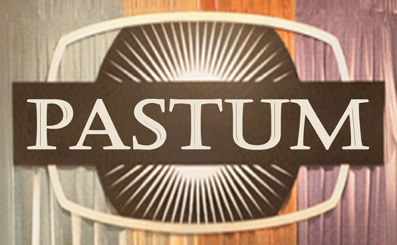
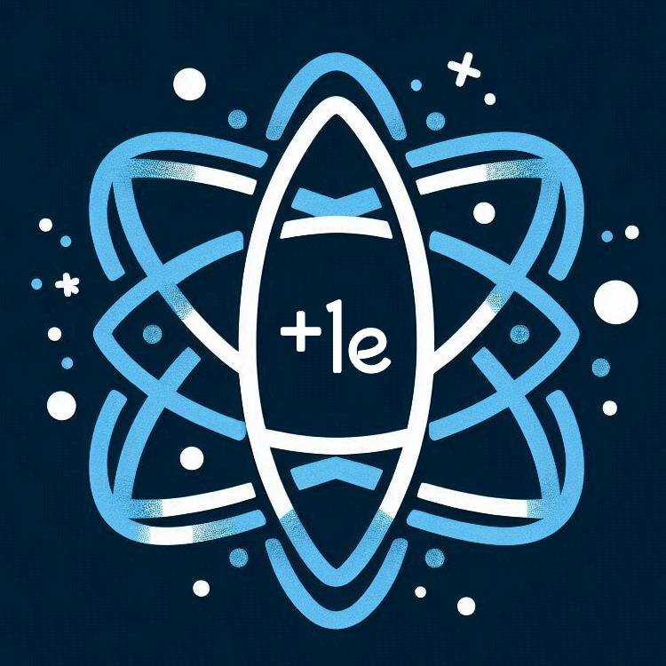
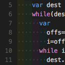
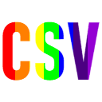
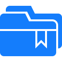

We’ve been having a blast at the Data Science Lab. It’s a new, experimental, and super informal weekly community call (which you can register for here: [pos.it/dslab](https://pos.it/dslab)\!). In the spirit of being bold and trying things out, Isabel Zimmerman and Davis Vaughan from the Positron dev team joined us for the very first Lab “pilot” back in November, sharing some of their favorite Positron settings and extensions.



The Lab with Isabel and Davis was so much fun that we officially started the series in December, and then, in January, we jumped at the chance to have [Andrew Heiss](https://bsky.app/profile/andrew.heiss.phd) from Georgia State University join us to share his favorite tips and tricks for his Positron data science workflow (and beyond). He even wrote a [helpful roundup on his blog\!](https://www.andrewheiss.com/blog/2026/01/13/dsl-positron-workflow/) Andrew’s workflow might give you data superpowers.



Following Andrew’s Data Science Lab, Emil Hvitfeldt felt inspired to write up his [list of extensions and settings on his blog](https://emilhvitfeldt.com/post/positron-settings-extensions/)\! We love community-event-driven development 😉

Speaking of community: Libby posted on Bluesky about wanting Positron’s main title bar to function like RStudio’s, showing the project and git branch name, and Emil shared a setting he’d learned from Davis that does exactly that\! Want to customize your own Positron title bar? [Check out the post about the setting here](https://bsky.app/profile/libbyheeren.bsky.social/post/3m4zaeuomgs2w) and try it for yourself. It’s in the comments\!

<blockquote class="bluesky-embed" data-bluesky-uri="at://did:plc:777eanw7giyjd76dwatpch3d/app.bsky.feed.post/3m4zaeuomgs2w" data-bluesky-cid="bafyreiat23fkrdjgdd76pzy62plnjc7ro6qh5jtkyjqlxaxptdfg253sva" data-bluesky-embed-color-mode="system">
You know how in #RStudio, it puts your branch name at the top? Like &quot;project_name - branch - RStudio&quot; (shown here)

I want that in #Positron 🤔 and I haven&#x27;t found a popular extension for it. (I think there is one that works in VSCode, but not in Positron!)

Any ideas, #rstats #databs crew?  <a href="https://bsky.app/profile/did:plc:777eanw7giyjd76dwatpch3d/post/3m4zaeuomgs2w?ref_src=embed">[image or embed]</a>
&mdash; Libby Heeren (<a href="https://bsky.app/profile/did:plc:777eanw7giyjd76dwatpch3d?ref_src=embed">@libbyheeren.bsky.social</a>) <a href="https://bsky.app/profile/did:plc:777eanw7giyjd76dwatpch3d/post/3m4zaeuomgs2w?ref_src=embed">November 6, 2025 at 10:26 PM</a></blockquote>

We highly recommend watching the Lab videos if you love hearing IDE thoughts and other off-the-cuff ideas, but if you are just itching to find the settings and extensions mentioned, there’s a list of resources below. Do you have your own Positron setting and extension list? Let us know all about it 💙

### Keyboard shortcuts

* [Emil's keyboard shortcut blog post](https://emilhvitfeldt.com/post/positron-key-bindings/)
* [Positron docs on keyboard shortcuts](https://positron.posit.co/keyboard-shortcuts.html)
* [Nathan Jeffery’s keybinding for reading RDS files into Positron](https://nathan-jeffery.netlify.app/blog/2025-08-26-read-rds-positron/)

### Settings

* [Native Tabs](https://lucasprag.com/posts/underrated-vscode-feature-native-tabs/)

### Extensions

<table>
<colgroup>
<col style="width: 40%;">
<col style="width: 60%;">
</colgroup>
<thead>
<tr>
<th>Extension</th>
<th>Description</th>
</tr>
</thead>
<tbody>
<tr>
<td><a href="https://open-vsx.org/extension/atsyplenkov/pastum">Pastum</a> </td>
<td>Like <a href="https://milesmcbain.github.io/datapasta/">datapasta</a>, but for Positron</td>
</tr>
<tr>
<td><a href="https://open-vsx.org/extension/grrrck/positron-plus-1-e">positron-plus-1-e</a> </td>
<td>Garrick Aden-Buie’s data science extension bundle package</td>
</tr>
<tr>
<td><a href="https://open-vsx.org/extension/oderwat/indent-rainbow">indent-rainbow</a> </td>
<td>Change the color of the indents in front of your text</td>
</tr>
<tr>
<td><a href="https://open-vsx.org/extension/mechatroner/rainbow-csv">Rainbow CSV extension</a> </td>
<td>Highlight columns in distinct colors</td>
</tr>
<tr>
<td><a href="https://open-vsx.org/extension/xiangda/enter-folder">Enter Folder</a> </td>
<td>Make your folder look like the root folder, making your Positron file explorer work more similarly to RStudio’s File Pane</td>
</tr>
<tr>
<td><a href="https://catppuccin.com/">Catppuccin themes</a> </td>
<td>A cozy set of pastel themes used by many in the DS Lab community</td>
</tr>
<tr>
<td><a href="https://open-vsx.org/extension/aaron-bond/better-comments">Better Comments</a> </td>
<td>Categorize your to-dos</td>
</tr>
<tr>
<td><a href="https://open-vsx.org/extension/brunnerh/file-properties-viewer">File Properties Viewer</a> </td>
<td>Display a menu for file system properties</td>
</tr>
<tr>
<td><a href="https://open-vsx.org/extension/johnpapa/vscode-peacock">Peacock</a> </td>
<td>Change your workspace colors, making the differences between projects more striking and noticeable</td>
</tr>
<tr>
<td><a href="https://open-vsx.org/extension/alefragnani/project-manager">Project Manager</a> </td>
<td>Switch between projects</td>
</tr>
<tr>
<td><a href="https://open-vsx.org/extension/ban/spellright">Spell Right</a> </td>
<td>Spell check your documents</td>
</tr>
</tbody>
</table>
