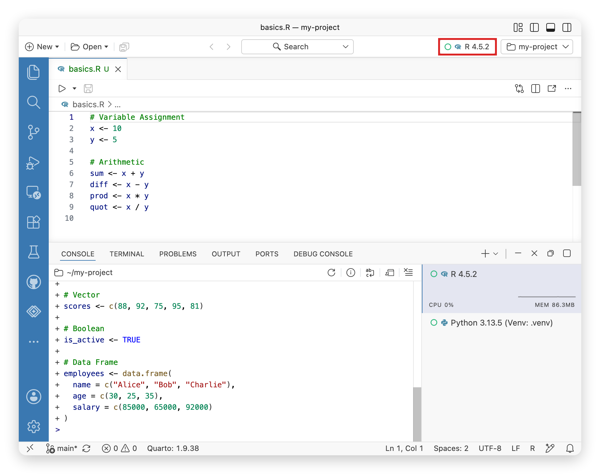
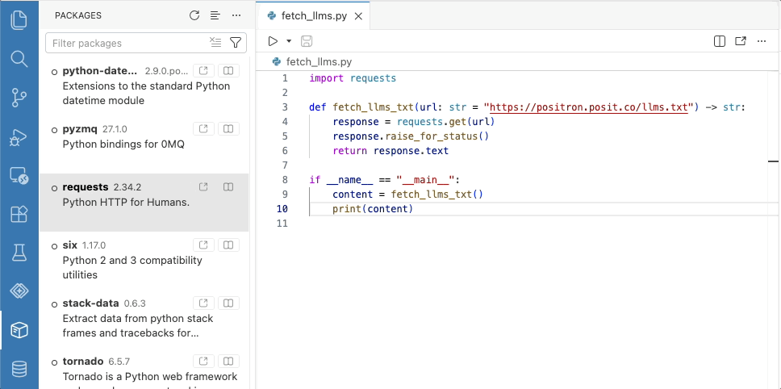
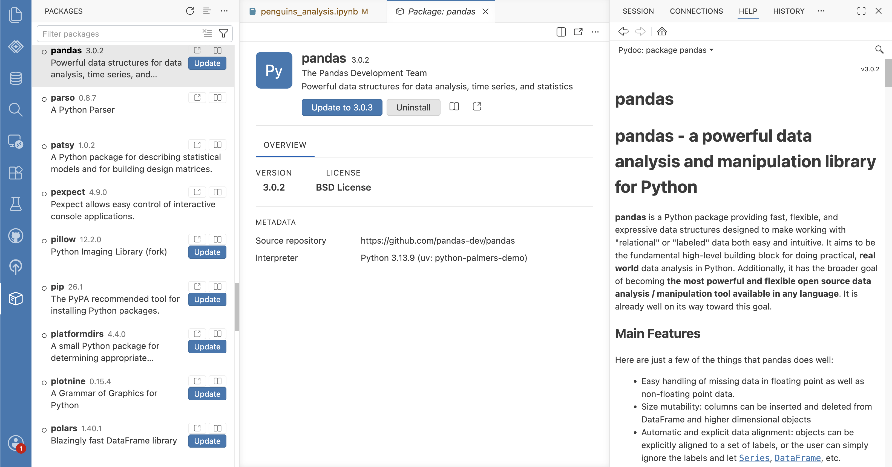
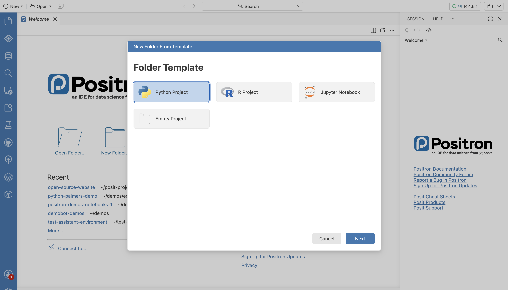
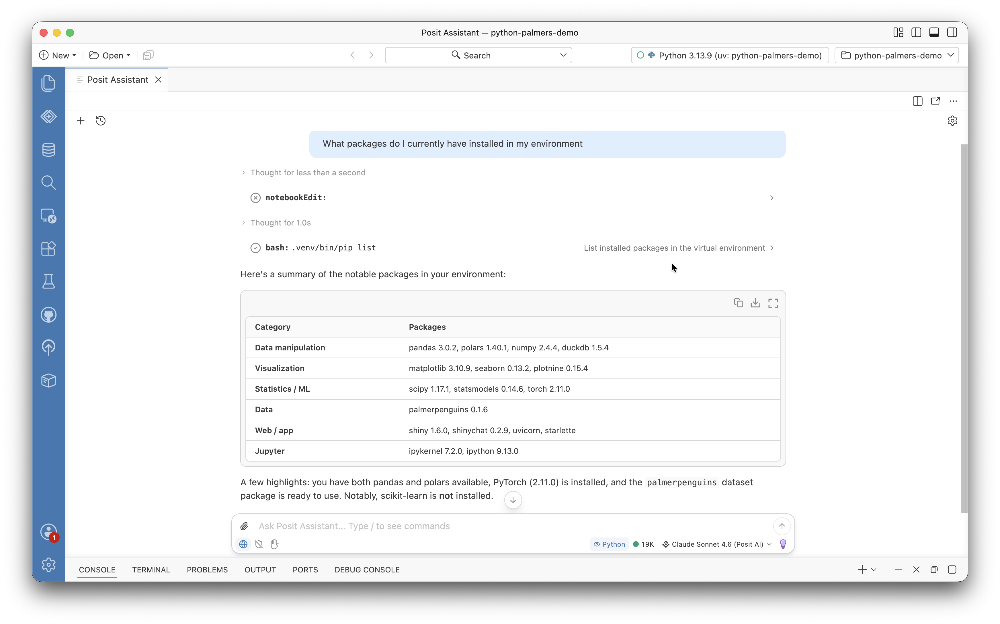

Note

[Positron](https://positron.posit.co) is the Posit next-generation IDE for data science. Positron is an extensible, polyglot tool for exploring data and reproducible authoring in Python, R, and more.

If you work across Python and R or juggle multiple projects with different dependency needs, environment management is probably one of the most challenging parts of your workflow. [Positron](https://positron.posit.co/) comes with several out-of-the-box ways to help simplify environment management. Here are a few tips to streamline your workflow.

## 1: Understand how Positron discovers your environment

Positron does not just look at your system PATH. For Python, it actively discovers venv, uv, pyenv, and conda environments. If Positron is not seeing your project's virtual environment, you can add custom search locations via the [`python.interpreters.include`](positron://settings/python.interpreters.include) setting, or trigger a manual rescan with *Interpreter: Discover All Interpreters*. Learn more about [Python discovery in the Positron documentation](https://positron.posit.co/python-installations.html#python-installation-discovery).

For R, discovery works differently. Positron consults various sources to build the list of R interpreters. These include your PATH, R root folders based on specific operating systems, well-known executable locations, and on Windows the registry. You can customize your R discovery through a few settings including [`positron.r.customRootFolders`](positron://settings/positron.r.customRootFolders) and [`positron.r.customBinaries`](positron://settings/positron.r.customBinaries). Learn more about [R discovery in the Positron documentation](https://positron.posit.co/r-installations.html#customizing-r-discovery).

## 2. Use the Interpreter Selector

To begin your first session, click "Start Session" in the top right corner and select your preferred R or Python interpreter. Positron can run multiple R and Python interpreter sessions at once, but only one is ever the active session at a given moment. The Interpreter Selector always shows you the active session and its status (idle, busy, or shut down) and you can use it to switch between or start additional sessions.

## 3. Install Python with uv

If Positron does not find a usable Python on your machine, it will offer to install Python via uv to help streamline your setup. If you prefer to manage the installation yourself, you can disable uv with the [`python.allowUvPythonInstall`](positron://settings/python.allowUvPythonInstall) setting. Check out our [blog post exploring on-demand Python installation in Positron](https://opensource.posit.co/blog/2026-07-08_positron-uv/) or explore configurations in our [Python installation documentation](https://positron.posit.co/python-installations.html#troubleshooting).

## 4. Manage packages with the Packages Pane

The Packages Pane in Positron lets you manage the packages installed in your active session. Whether you use pip, uv, conda, pak, base R, or renv, you can browse installed packages and search package repositories. You can also track outdated packages and install, update, or uninstall packages without leaving Positron or writing any code.

## 5. View package documentation

If you need to learn more about a specific package, the Packages Pane has buttons to navigate to the source documentation or link to the package's website. You can also pull up the [Help Pane](https://positron.posit.co/help-pane.html) for any reference in the Console using the `?` operator, including both packages and functions.

## 6. Start projects with New Folder from Template

The New Folder from Template flow helps you start new projects faster. Instead of running multiple setup commands you can make a few selections and Positron helps you set up an environment directory, version control, directory structure, and an interpreter instance. Learn more about the [Python and R templates](https://positron.posit.co/folder-templates.html) available in the documentation.

## 7. Make use of the Command Palette

We recommend taking advantage of the following commands when managing your environments:

- *Interpreter: Discover All Interpreters*: Find new interpreters
- *Interpreter: Select Session*: Select a running interpreter session
- *Python: Create Environment*: Create a new virtual environment

## 8. Let Posit Assistant help manage your environment

[Posit Assistant](https://assistant.posit.co/docs/features/context-management/) has knowledge of your R and Python session including the language, version, names, and types of variables in your environment. You can prompt Posit Assistant to set up environments and troubleshoot issues you run into.

Have an idea for how we can improve environment management in Positron? We would love to hear from you in a [discussion on GitHub](https://github.com/posit-dev/positron/discussions).
