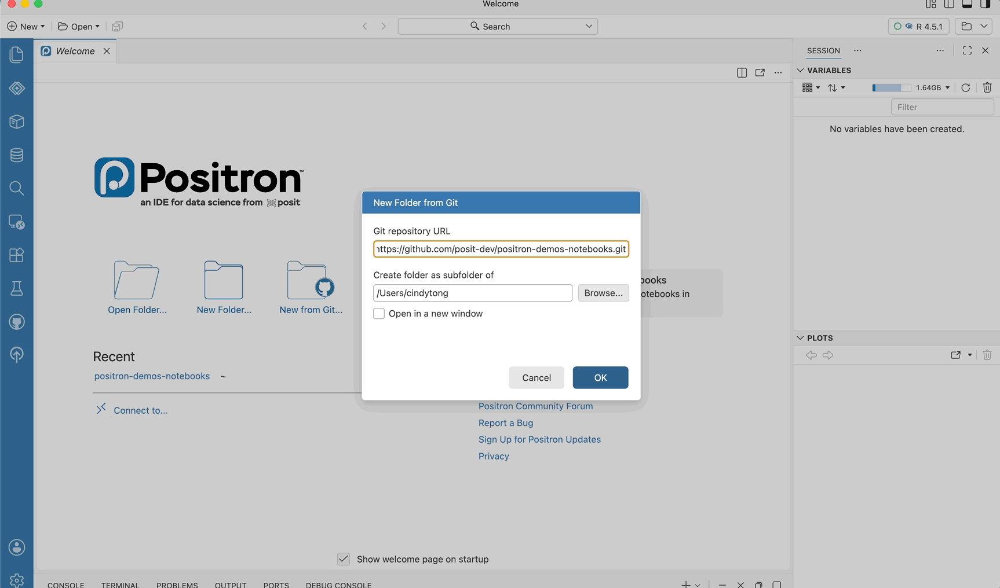
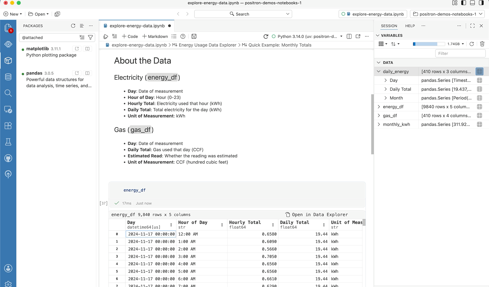
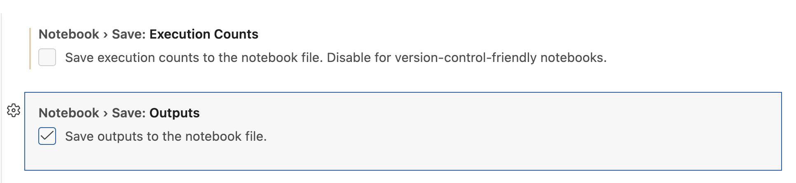
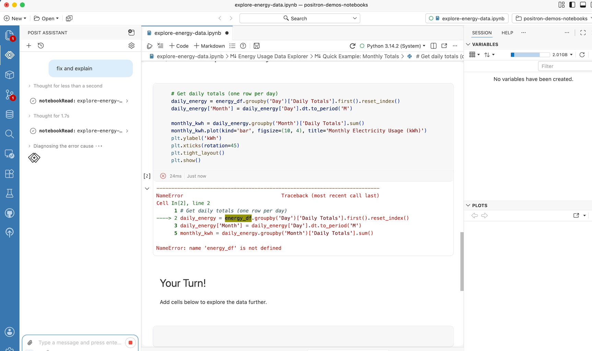

::: {.callout-note}
[Positron](https://positron.posit.co) is Posit's new, next-generation IDE for data science. Positron is designed to be an extensible, polyglot tool for exploring data and reproducible authoring in Python, R, and more.
:::

Data scientists often face a tradeoff: the instant, friction-free start of the classic Jupyter experience or the advanced capabilities of a general-purpose IDE that only pay off after significant customization. With the [2026.07 release](https://opensource.posit.co/blog/2026-07-13_positron-2026-07-release/), Positron closes that gap, delivering a first-class notebook editor that works out of the box with your Jupyter notebooks, backed by the full power of an IDE built for data science.

If you are new to Positron, here is what the Notebook Editor is like in daily work.

## Environment management

You clone your colleague's repo and try to rerun their notebook. Which Python version do you use? What dependencies do you install and which versions? Maybe you already set up an environment previously that you can reuse, all before you've run a single line of code.

Positron has several [built-in workflows](https://opensource.posit.co/blog/2026-07-08_positron-uv/) to help you streamline installation and environment management. When you open a repo, Positron discovers your installed environments, suggests the right one for the repo, and prompts you to set up a new environment if needed. The active environment is displayed front and center; click to restart or switch environments. Positron uses the same environment across your Jupyter and Quarto notebooks, scripts, and consoles. You can see inside your environments, which packages are installed, their versions, whether newer versions are available, and you can upgrade them. Environments are first-class citizens of Positron. [Explore Positron's environment management](https://positron.posit.co/positron-notebook-editor.html#setting-up-your-environment).

{fig-align="center" fig-alt="Positron helps you resolve environment and package dependencies as you pull down a colleague's notebook"}

## Interactive data exploration

When you run a cell in your notebook, your variables appear in the [Variables Pane](https://positron.posit.co/variables-pane.html). Filter, sort, and search your data in the [Data Explorer](https://positron.posit.co/data-explorer.html), and try out plot variations in the Visualize wizard. You can easily convert your point-and-click interactions into code by using the copy-code feature to bring them back into your notebook. If you get stuck, look up library documentation in the [Help Pane](https://positron.posit.co/help-pane.html). All of this works out of the box.

{fig-align="center" fig-alt="Run a notebook and see your variables update live, inspect them in the data explorer and convert filters back to code."}

## Streamlined version control

Notebooks store outputs and execution metadata alongside code, which is great for sharing but does not work well with version control. Positron includes settings to exclude outputs and execution metadata from the saved file, so the diff is just your code change. [Explore the custom settings](https://positron.posit.co/positron-notebook-editor.html#version-control) to clean up your git diffs.

Your notebooks stay ordinary `.ipynb` files and the editing experience stays classic Jupyter. When a plain-text workflow suits you better, conversion to and from `.ipynb` and other formats is built in.

{fig-align="center" fig-alt="Customize what is saved in your notebooks for better version control."}

## AI assistance

Posit Assistant sees your notebook as more than just text. It works with the live session behind the notebook: your variables, your data, your plots. Ask it to fix a chart and it can inspect the dataframe, look at the plot itself, edit the cell, and run it again. It does the same things you would do, using the same panes you use. [Explore notebook-aware AI assistance in Positron](https://positron.posit.co/positron-notebook-editor.html#ai-integration).

{fig-align="center" fig-alt="Assistant can fix, explain, run your notebook and suggest next steps."}

## Get started

[Download Positron](https://positron.posit.co/download) and open a project with a Jupyter notebook. The Notebook Editor is now on by default. If you're coming from another IDE, your existing `.ipynb` files will open as-is without any conversion needed.

For the full feature reference, check out our [documentation](https://positron.posit.co).

If you run into any issues or have ideas on how we can improve Positron, reach out on [GitHub](https://github.com/posit-dev/positron).

Already using Positron? Everything in this release is in the [release notes](https://positron.posit.co/release-notes).

Thank you so much for helping us build Positron's Jupyter notebook support from the ground up by chatting with us live, sharing your pain points, and giving us feedback on GitHub!

::: {.callout-tip}
[Download Positron](https://positron.posit.co/download) to try out the Notebook Editor and other new features!
:::
