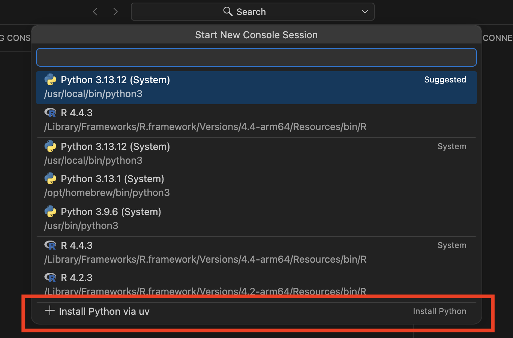
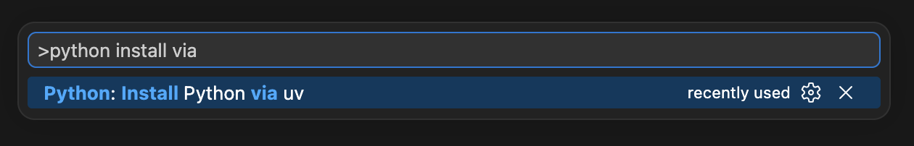
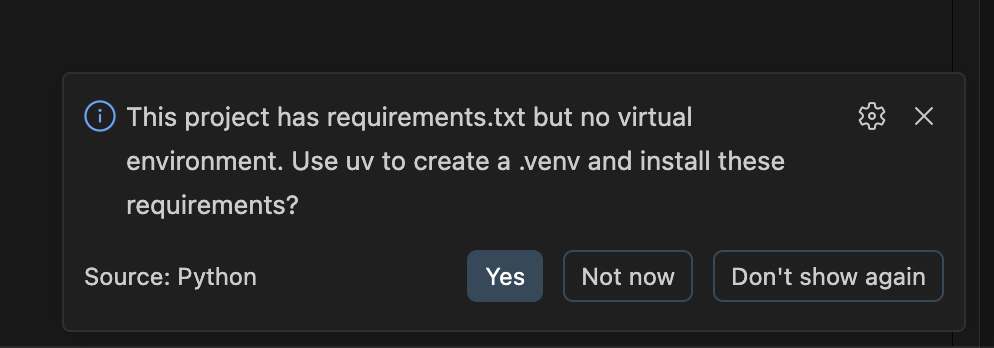

The Python community has a long-standing joke about how hard it can be to get Python running on your machine.
The options can feel overwhelming, and the post-install result often looks like this:

If you're new to Python, Positron has a few built-in workflows to help you skip that installation pain entirely.
Most of it is powered by [uv, created by Astral](https://docs.astral.sh/uv/).
We chose uv because it's fast and has quickly become widely adopted across the Python community.
Behind the scenes, uv handles the heavy lifting, downloading Python versions and building environments.
Positron wraps that power in a friendly interface, so you never have to remember a command.

## From zero to Python in one click

If you don't have a suitable Python available, Positron will offer to install it for you.
When you go to start a Python runtime through the **Start Session** button, you'll see an option for **+ Install Python via uv**.

When you choose it, Positron will ask to install uv for you if you don't already have it.
Then it shows you the supported Python versions (currently 3.9 through 3.14) and installs whichever one you pick.
If you have a folder open, it will also offer to create a virtual environment for the project and start a Python console session using that environment.
Once you have a Python available, this option disappears from the session picker.

If you'd rather not see the prompt to install Python, you can turn it off with the [`python.allowUvPythonInstall`](positron://settings/python.allowUvPythonInstall) setting (enabled by default).

Why do I see this when I already have Python on my machine?

If you only have system Pythons available, you'll still see the **+ Install Python via uv** option.
[Using system Python tends to cause problems down the road](https://pydevtools.com/handbook/explanation/why-should-i-avoid-system-python/), so Positron nudges you toward a managed Python and virtual environment instead.

## On-demand Python installation

You don't have to wait for Positron to ask, either.
Open the command palette (<kbd>Cmd/Ctrl+Shift+P</kbd>) and run _Python: Install Python via uv_ any time you'd like another version.
This command will download uv if needed, show you the available Python versions, and optionally offer to create a virtual environment.

Since it runs on demand, it's a good way to add another interpreter to a project you've already set up.
And because it follows the same flow every time, it works well for teaching, since everyone ends up in the same place, the same way.

## Automatic project setup support

Setting up a virtual environment isn't limited to that first run.
If Positron finds a `pyproject.toml` or `requirements.txt` in a project that doesn't have a virtual environment yet, it'll offer to create one with uv and install your dependencies.
This comes in handy when you've cloned a colleague's project and want to get up and running without extra setup.

If there's a single requirements source, like a lone `requirements.txt` or `pyproject.toml`, Positron will prompt you to create a `.venv` and install everything right away.
And if there are several sources, you can choose which files to include in your installation.

Positron also knows when to stay out of your way.
If you already have a local virtual environment, or if you use non-uv files like `environment.yml`, `Pipfile`, or `poetry.lock`, you won't get a prompt at all.

## Try it yourself

Setting up Python doesn't have to feel like a chore, whether you're starting on a brand new machine, picking up a colleague's project, or getting a room full of students ready to code.

Give it a try in [Positron's July 2026 release](https://positron.posit.co/download) and let us know what you think.
