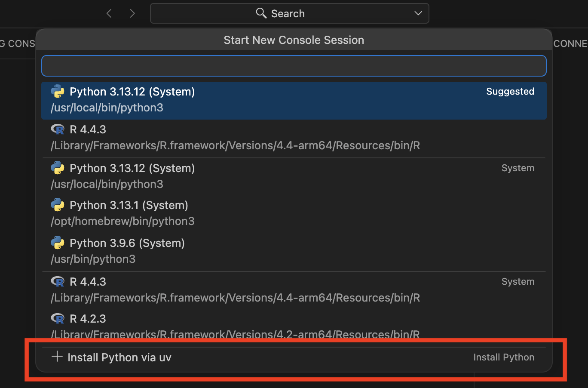
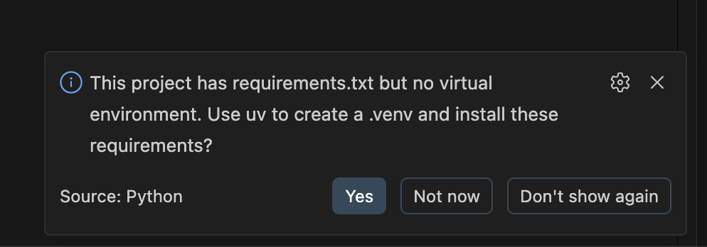
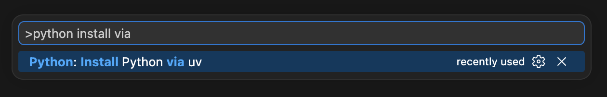

There's been a long standing joke in the Python community about how _difficult_ it is to get Python on your machine.
Many tools have been created to fix it, and the result often looks like this:

We've put together a few workflows to make installing and managing Python as easy as clicking a button, much of it leveraging the incredible open source tool [uv](https://docs.astral.sh/uv/) by Astral.s

## From zero to Python in one click

If you open Positron and you only have system Python, or you have no Python at all, Positron offers to set one up for you.
You'll see this option when you start Positron, and any time you open the interpreter picker by running `Select Interpreter`.

When you choose it, Positron installs uv for you if you don't already have it.
Then it shows you the supported Python versions, 3.9 through 3.14, and installs whichever one you pick.
If you have a folder open, it offers to create a `.venv` for the project and selects it for you in the Console.
Once you have a real Python available, this option steps out of your way and disappears from the picker.

If you're not interested in seeing this prompt, you can use the `⚠️TODO: setting ID` setting to disable it.

::: tip
Positron's ideology is to show you all available options, but help lead you to a pit of success by nudging you in the right direction.
That's why it points you toward a managed Python and a virtual environment instead of your system Python, which [tends to cause problems down the road](https://pydevtools.com/handbook/explanation/why-should-i-avoid-system-python/).
:::

## Virtual environment support

Creating a `.venv` isn't only part of that first-run flow.
Any time Positron sees a `pyproject.toml` or `requirements.txt` in your project but no virtual environment, it offers to create one with uv and install your dependencies.
This is especially helpful when you've just cloned a project from a colleague and want to get running without thinking about it.

If there's a single source, like a lone `requirements.txt` or `pyproject.toml`, it will prompt you to create a `.venv` and installs everything right away.
If your `pyproject.toml` is an installable package, it installs it in editable mode with `pip install -e .`.
And if there are several sources, say a `requirements.txt` alongside a nested `requirements/dev.txt` and `requirements/prod.txt`, you can choose what files to install.

It also knows when to stay quiet.
You won't get a prompt if you already have a `.venv` or `.conda`, or if another environment manager is clearly in charge, like an `environment.yml`, `Pipfile`, or `poetry.lock`.

## More Python versions at your fingertips

You don't have to wait for Positron to ask.
You can use `cmd+shift+P` on MacOS or `ctrl+shift+P` on Windows and Linux to run `Python: Install Python via uv` and kick off the same flow whenever you want.
It installs uv if you need it, shows you the available Python versions, installs the one you pick, optionally creates a virtual environment, and starts your new runtime in the Console.

Because it runs on demand, it's also a clean way to add another Python version to a project you've already set up.
If a `.venv` is already there, Positron asks whether you want to reuse it or delete it and start fresh, since uv won't overwrite a `.venv` on its own.
This gives you one predictable way to get Python set up, which is especially helpful for teaching.

## The importance of uv

None of this would be possible without [uv](https://docs.astral.sh/uv/).
We chose it because it's fast, reliable, and has been embraced across the Python community.
uv does the heavy lifting, like resolving versions, downloading interpreters, and building environments.
Positron wraps that power in lightweight UI, so you never have to remember the right command.

## Installing Python isn't hard anymore

Whether you're starting on a brand new machine, picking up a colleague's project, or setting up a room full of students, the path to a working Python is the same short one.
Give it a try in the latest version of Positron, and let us know what you think.
