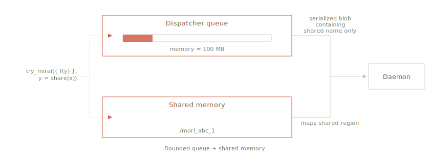

Async R has always come with tradeoffs. Parallel batch compute meant duplicated data and an unbounded queue that could push your session out of memory, while Shiny gave you an event loop but background-worker submissions had no way to tell you when to slow down.

Shared memory across processes is standard in other programming languages. In R it's been either platform-specific (`fork` on Unix-alikes, unsafe from GUIs like Positron or with multi-threaded code) or file-format-specific (memory-mapped Parquet).

Two CRAN releases address those constraints directly:

- **[mirai 2.7.0](https://mirai.r-lib.org/)** — `daemons(memory = ...)` puts a hard byte-level cap on the dispatcher queue. `try_mirai()` returns `NULL` immediately when that cap is hit, instead of blocking your session. The dispatcher itself runs as an in-process thread now; and through [nanonext 1.9.0](https://nanonext.r-lib.org/) underneath, peak memory during serialized sends has halved.
- **[mori 0.2.0](https://shikokuchuo.net/mori/)** — graduates from experimental status, with a stable wire format underneath. Sub-lists and extracted elements now expose stable path-form names (`/mori_abc[2,3]`) that any process can attach to via `map_shared()` directly, without going through the parent.

## Building out the foundations

mirai already shipped a lot of what production async needs: microsecond round-trip latency, FIFO scheduling, task cancellation, OpenTelemetry tracing, reproducible parallel RNG, custom serialization for torch / Arrow / polars, an event-driven promises method for Shiny ExtendedTask, and deployment across SSH / Slurm / Posit Workbench.

What these releases add is more foundational. R hasn't really had a built-in memory model for asynchronous work — no way to size a task queue in bytes, and no portable way to share data across processes without paying for a full copy. mirai 2.7.0 introduces the first: a bounded queue built into the dispatcher, with `try_mirai()` exposing non-blocking submission under this constraint. mori 0.2.0 brings the second to a stable footing: a self-describing shared-memory format, addressable down to individual list elements by name, that any process on the machine can attach to.

Together they extend what R can credibly be used for — streaming pipelines, multi-stage data flows, and event-loop applications that previously had to reach outside the language.

## mirai 2.7.0 — bounded queues and `try_mirai()`

### `daemons(memory = ...)`

The dispatcher is the single point in your session where every `mirai()` call lands before being routed to a daemon. Each call carries its serialized arguments — the queued payload — and that payload sits in memory until a daemon is ready for it. By default the queue is unbounded, which is fine until it isn't.

`daemons()` now takes a `memory` argument that caps the approximate total payload of queued tasks at the dispatcher, in MB:

```r
library(mirai)
daemons(4, memory = 100)  # 100 MB queue capacity
```

When the queued bytes are below the cap, `mirai()` calls submit normally. When the cap is reached, `mirai()` blocks the calling R thread until daemons drain the queue enough for the new payload to fit. Existing code keeps working — the only visible difference is that your session can no longer be pushed out of memory by a runaway producer.

`status()` surfaces current and peak usage:

```r
status()$memory
#     used     peak capacity 
#     12.4     87.3    100.0 
```

`peak` is the high-watermark queued payload over the lifetime of the dispatcher, which gives you an empirical way to size the cap. The recommended workflow is to run a representative workload with `memory = NULL` first (where `capacity` reports `NA`), observe `peak`, then set `memory` at or above that watermark.

If profiling isn't practical, the local machine has to fit your session, the dispatcher queue, and `n` daemon processes (each a full R session holding an in-flight payload while executing). Half of currently available RAM (`ps::ps_system_memory()[["avail"]] / 2e6`, in MB) is a reasonable starting `memory` cap, revised down for large `n` or payloads. Remote daemons don't draw on the local budget, so when most workers are remote, the cap can be more generous.

For `n` itself, one less than your number of CPU cores is the right starting point for CPU-bound work (one core left for your session), while I/O-bound work (API calls, database queries, file reads) can comfortably exceed core count since idle daemons cost little.

The capacity is measured in *bytes*, not *task count*. A queue capped at 100 tasks can hold either 100 small tasks or 100 huge ones, and only the second runs out of memory. A queue capped at 100 MB never runs your session out of memory regardless of the mix.

### `try_mirai()`

A blocking submit is fine in a batch script, but not an event loop: a Shiny session that calls `mirai()` from inside an ExtendedTask can't afford to block while the queue drains, because that same session is also driving the UI for all users.

`try_mirai()` returns immediately when the queue is full, instead of blocking. The semantics are simple:

- If the queue is below capacity, behaves identically to `mirai()` and returns a mirai.
- If the queue is at capacity, returns `NULL` immediately without blocking, and leaves the caller to decide what to do next.

```r
m <- try_mirai({ slow_thing() }) %||% stop("queue full")
```

The three response strategies are: drop the task (best when the work is idempotent and frequent), retry later (queue the request behind a `later::later()` call), or propagate backpressure upstream — as in the example above, by raising a condition. Which is right is application-specific — `try_mirai()` hands you the flexibility.

If `memory` isn't set, or the daemon configuration has no dispatcher, `try_mirai()` always returns a mirai and is identical to `mirai()` — so the function is safe to use unconditionally; it only does anything different in the bounded-queue case.

The two halves — `daemons(memory = ...)` and `try_mirai()` — are the right combination for any event-loop integration. Set the cap to reflect what your session can actually afford to hold, submit through `try_mirai()`, and the application gracefully adapts to load instead of locking up or crashing.

### Under the hood

A few transport-layer changes ship alongside 2.7.0 — invisible most of the time, important when payloads are large or throughput is high:

- **Dispatcher as a thread.** The dispatcher is no longer a separate R process; it runs as an in-process thread, courtesy of a C-level reimplementation in nanonext. mirai round-trip latency is now in the tens of microseconds.
- **Halved peak memory on sends.** [nanonext 1.9.0](https://nanonext.r-lib.org/), the transport underneath mirai, now writes serialized sends directly instead of going through an intermediate buffer. A 500 MB argument going to a daemon used to need ~1 GB of momentary headroom in your session; now it needs ~500 MB. The dispatcher's actual resident memory tracks the `daemons(memory = ...)` cap more accurately as a result.
- **>2 GB payloads on macOS and Windows.** Transfers above 2 GB previously failed silently near the `INT_MAX`-byte boundary on those platforms. They now go through cleanly. Linux was already fine.

## mori 0.2.0 — out of experimental status

mori is a younger package — its [first CRAN release](/blog/mori-0-1-0/) was just last month — and its job is the other half of memory pressure: the data itself, rather than the queue. R processes don't share memory, and data crosses between them through message-passing. When eight workers each need the same 200 MB data frame, that's 1.6 GB of serialize / transfer / deserialize, plus eight separate copies of the data resident in RAM.

`mori::share()` writes the object once into OS-level shared memory and returns an ALTREP (alternative representation) wrapper. Multiple processes on the same machine map the same physical pages — zero-copy, lazy, and managed by R's garbage collector. Pass the wrapper to a daemon and only the shared memory identifier (hundreds of bytes) crosses the wire; the daemon attaches and reads the pages directly.

We implemented this in mori 0.1.0, but 0.2.0 takes mori out of experimental status, landing a stable wire format. A key consequence of this is that every sub-list and extracted element of a shared region now has a stable identifier of its own. `shared_name()` emits path-form names (`/mori_abc_1[2]` for the second element of region `/mori_abc_1`, `/mori_abc_1[2,3]` for nested addressing), and `map_shared()` accepts the path form directly.

```r
library(mori)
library(mirai)

lst <- share(
  list(weights = rnorm(1e6), targets = rnorm(1e6), inputs = rnorm(1e6))
)

# Sub-elements have their own path-form names

shared_name(lst)
#> [1] "/mori_abc_1"
shared_name(lst[[1]])
#> [1] "/mori_abc_1[1]"
```

Pass the shared object directly to a daemon — the ALTREP wrapper serializes as just the name, and the daemon attaches on deserialize:

```r
mirai(length(weights), weights = lst[[1]])[]
#> [1] 1000000
```

A consumer in a separate session that only has the name as a string — from a config file, message queue, or HTTP response — attaches with `map_shared()`:

```r
# In a separate R session

weights <- mori::map_shared("/mori_abc_1[1]")
length(weights)
#> [1] 1000000
```

A path-form name is a small thing on the wire – just a string – but it enables a lot:

- **Attach by name.** Path-form identifiers are plain strings, so they fit anywhere a string can go: a queue payload, a config entry, an HTTP response, a database row. A consumer reads the name, calls `map_shared()`, and gets exactly that slice — the parent region never has to enter their session.
- **Decoupled pipelines.** Stage A shares a 100-column frame and tells stage B the names of the three columns to process. Stage B passes the name of its output to stage C, and so on. No stage holds more in memory than it actually uses, and no stage needs to know how its inputs were produced — only the names.
- **Code symmetry.** `map_shared(shared_name(x))` returns an equivalent of `x` whether `x` is a root region or a single leaf element, so consumer code doesn't need a special branch for sub-objects.
- **Lifetime through one chain.** Holding a reference to a leaf keeps the whole parent region alive automatically — the garbage collector walks the chain of dependencies — so a consumer never has to manually pin the root to stay safe.

### Composing with `daemons(memory = ...)`



The two memory tools compose. `mori::share()` shrinks each task's *queued payload* from megabytes to hundreds of bytes, which means the dispatcher's `memory` cap rarely fills up at all when workers are reading shared data. The pieces are complementary:

- `mori::share()` removes the per-worker copy of large data.
- `daemons(memory = ...)` caps the dispatcher backlog when something *is* being sent.
- `try_mirai()` makes hitting that cap a non-event in an event loop.

## Putting R on the concurrency map

The design of `daemons(memory = ...)`, `try_mirai()`, and `mori::share()` draws on how async runtimes in other languages handle the same problems. Here's the comparison:

**Byte-budgeted backpressure.** Async frameworks elsewhere — Python's `asyncio.Queue`, Ray's `max_pending_tasks`, Tokio's bounded `mpsc` channels — measure queue capacity by task count. `daemons(memory = ...)` caps by *bytes* instead, which tracks what actually drives memory pressure.

**Non-blocking submission on a full queue.** Tokio's `try_send` is the closest direct analogue: it returns immediately when the channel is full instead of blocking. `try_mirai()` provides the same semantics for R submission, with the additional advantage that the cap itself is byte-aware.

**Integrated cross-process zero-copy.** Ray's Plasma object store offers cross-process zero-copy, but it's a heavyweight component — you run a Ray cluster to use it, not a function. `mori::share()` is just a function call, producing an ALTREP wrapper that consumer processes attach to via lazy reads, down to individual columns by name.

Combined with mirai's microsecond round-trip latency and event-driven C-level transport, these three pieces give R a concurrency story that stands on its own: byte-aware backpressure, non-blocking submission, and integrated zero-copy sharing.

## Try it

Install from CRAN:

```r
install.packages(c("mirai", "mori"))
```

Pointers from here:

- [mirai reference vignette](https://mirai.r-lib.org/articles/v01-reference.html) — the memory-management section walks through `daemons(memory = ...)`, `status()$memory`, `try_mirai()`, and shared-memory composition.
- [mirai promises vignette](https://mirai.r-lib.org/articles/v02-promises.html) — Shiny ExtendedTask and event-driven async.
- [mori package site](https://shikokuchuo.net/mori/) — `share()`, `shared_name()` and `map_shared()`.
- [nanonext package site](https://nanonext.r-lib.org/) — the transport layer and concurrency primitives.
- The `r-lib` agent skill in the [`posit-dev-skills`](https://github.com/posit-dev/skills) plugin includes an LLM-optimised mirai guide for AI coding assistants.

Issues, feedback, and questions are very welcome on GitHub: [r-lib/mirai](https://github.com/r-lib/mirai/issues), [r-lib/nanonext](https://github.com/r-lib/nanonext/issues), [shikokuchuo/mori](https://github.com/shikokuchuo/mori/issues).

## Acknowledgments

A big thanks to everyone who contributed to mirai 2.7.0, mori 0.2.0, and nanonext 1.9.0 through their issues, pull requests, and discussions: [@HenrikBengtsson](https://github.com/HenrikBengtsson), [@kentqin-cve](https://github.com/kentqin-cve), [@king-of-poppk](https://github.com/king-of-poppk), [@manforkr](https://github.com/manforkr), [@mcol](https://github.com/mcol), [@michaelmayer2](https://github.com/michaelmayer2), [@pmac0451](https://github.com/pmac0451), [@t-kalinowski](https://github.com/t-kalinowski), and [@wlandau](https://github.com/wlandau).
