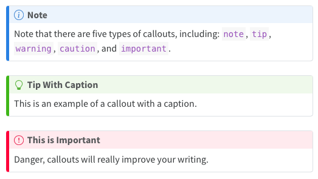

Callouts are an excellent way to draw extra attention to certain concepts, or to more clearly indicate that certain content is supplemental or applicable to only some scenarios.



## Callout Basics

There are five different types of callouts available.

- note
- tip
- important
- caution
- warning

The color and icon will be different depending upon the type that you select.

## Syntax

Create callouts in markdown using the following syntax (note that the first markdown heading used within the callout is used as the callout heading):

``` markdown
:::{.callout-note}
Note that there are five types of callouts, including:
`note`, `tip`, `warning`, `caution`, and `important`.
:::

:::{.callout-tip}
## Tip With Caption

This is an example of a callout with a caption.
:::
```

See our documentation on [Callouts](https://quarto.org/docs/authoring/callouts.html), to learn more, including more about how to customize the appearance and behavior of callouts.
